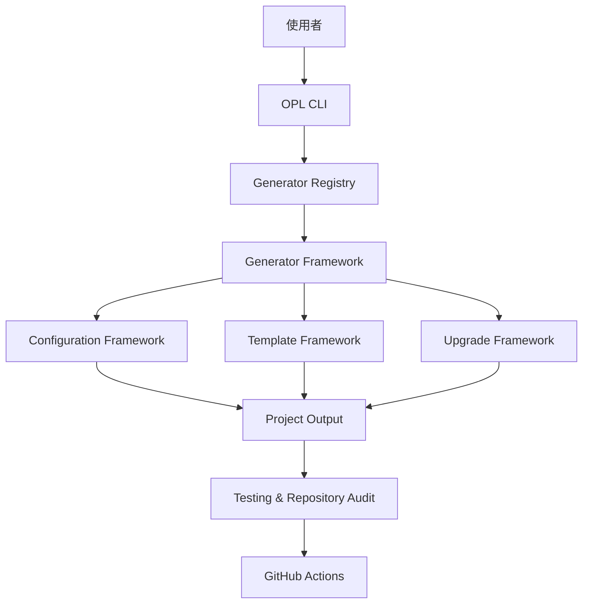

<div align="center">

# OpenProjectLab

### 建構專案，而不只是產生程式碼

**Design First · Documentation First · Automation First · Testing First**

一套協助開發者建立、維護、測試與持續演進高品質專案的
**Project Engineering Platform**。

[快速開始](#-快速開始) ·
[核心能力](#-核心能力) ·
[系統架構](#-系統架構) ·
[文件導覽](#-文件導覽) ·
[參與貢獻](#-參與貢獻)

**繁體中文** ｜ English（規劃中）

</div>

---

## OpenProjectLab 是什麼？

**OpenProjectLab（OPL）** 是一套以軟體工程方法為核心的開源專案平台。

它不只負責產生初始程式碼，也將架構設計、文件、測試、自動化品質檢查與專案升級機制整合在同一套框架中，協助專案從建立的第一天起，就具備良好的工程基礎。

OPL 的目標不是產生更多程式碼，而是協助建立：

* 容易理解的架構
* 持續更新的文件
* 可自動驗證的品質流程
* 可安全演進的專案生命週期
* 適合團隊與社群共同維護的 Repository

> **Build projects, not just code.**

---

## 為什麼需要 OpenProjectLab？

許多專案在初期都能快速開發，但隨著功能增加，常逐漸出現下列問題：

* 專案結構依賴個人習慣，缺乏一致性。
* 文件未與程式碼同步更新。
* 測試不足，使每次修改都具有回歸風險。
* 格式化、靜態分析與品質檢查依賴人工執行。
* 新成員需要花費大量時間理解架構。
* 既有專案缺乏安全且可追蹤的升級機制。

這些問題通常不是單一程式錯誤，而是缺乏完整工程流程所造成的長期成本。

OpenProjectLab 將工程最佳實務內建於框架之中，讓每一個新專案從一開始就具備：

* 明確的責任邊界
* 一致的設定與目錄結構
* 文件與程式同步演進的流程
* 自動化測試與品質檢查
* 可預覽、備份與回復的升級能力

因此，OPL 的定位不是一般的 **Project Generator**，而是一套：

> **Project Engineering Platform**

---

## ✨ 核心能力

| 能力 | 說明 |
| --------------------------- | --------------------------------------------------- |
| **Generator Framework** | 以一致的生命週期建立不同類型的專案與內容 |
| **Configuration Framework** | 集中管理 YAML 設定、路徑與 Generator 行為 |
| **Template Framework** | 將程式邏輯、文件內容與專案範本分離 |
| **Upgrade Framework** | 提供預覽、雜湊驗證、備份、回復與升級報告 |
| **Testing Framework** | 透過單元、整合、CLI 與 Template 測試保護系統行為 |
| **Automation** | 整合 Ruff、pre-commit、pytest、Coverage 與 GitHub Actions |
| **Documentation** | 以 README、Architecture、ADR、History 與 Roadmap 管理專案知識 |
| **Repository Governance** | 建立授權、貢獻、安全性與社群治理流程 |

目前內建的 Generator 包括：

* `bootstrap`
* `course`
* `week`

下一階段將聚焦於 **Plugin Framework**，讓功能能以外掛方式擴充，而不需要修改核心架構。

---

## 🏗 系統架構

OpenProjectLab 採用模組化與分層設計，將 CLI、Generator、設定、範本、升級與品質工程分離，降低元件之間的耦合。



### 架構角色

* **CLI**：解析命令與參數，並將工作委派給對應元件。
* **Generator Registry**：註冊、查詢與管理可用的 Generator。
* **Generator Framework**：提供一致的執行生命週期。
* **Configuration Framework**：統一載入與驗證設定。
* **Template Framework**：負責專案、文件與教材內容的產生。
* **Upgrade Framework**：管理既有專案的安全演進。
* **Testing and CI**：自動驗證功能、結構與品質規則。

更完整的設計說明請參閱：

* [Architecture](docs/architecture.md)
* [Configuration](docs/configuration.md)
* [Template System](docs/template-system.md)
* [Upgrade System](docs/upgrade-system.md)
* [Upgrade Manifest Schema](docs/upgrade-manifest-schema.md)

## 🚀 快速開始

以下流程適用於本機開發與貢獻者環境。

### 1. 取得原始碼

```bash
git clone https://github.com/YOUR_GITHUB_USERNAME/OpenProjectLab.git
cd OpenProjectLab
```

請將 `YOUR_GITHUB_USERNAME` 替換為正式 Repository 所屬帳號。

### 2. 建立虛擬環境

Windows PowerShell：

```powershell
python -m venv .venv
.venv\Scripts\Activate.ps1
```

Linux 或 macOS：

```bash
python3 -m venv .venv
source .venv/bin/activate
```

### 3. 安裝專案

```bash
python -m pip install --upgrade pip
python -m pip install -e .
```

### 4. 確認 CLI

```bash
opl list
```

預期可看到目前已註冊的 Generator：

```text
bootstrap
course
week
```

### 5. 執行品質檢查

```bash
pre-commit run --all-files
python -m pytest
```

若希望查看測試覆蓋率：

```bash
python -m pytest --cov=generator --cov-report=term-missing
```

---

## 💻 CLI 概覽

所有 OpenProjectLab 命令皆以 `opl` 為入口。

```bash
opl --help
```

### 查看 Generator

```bash
opl list
```

### 執行 Generator

```bash
opl bootstrap
opl course
opl week
```

目前 CLI 採用子命令設計：

```text
opl list
```

而不是：

```text
opl --list
```

如需使用其他設定檔，可透過全域設定選項指定：

```bash
opl --config path/to/config.yaml list
```

> CLI 參數與 Generator 行為仍可能隨 v0.x 階段演進。正式使用前，請以 `opl --help` 與目前版本文件為準。

---

## 📂 Repository Structure

```text
OpenProjectLab/
│
├── generator/              # OPL 核心 Python 套件
│   ├── cli/                # CLI 入口與參數解析
│   ├── core/               # 設定、Registry 與核心服務
│   ├── generators/         # Bootstrap、Course、Week Generator
│   ├── sdk/                # Generator 與擴充功能開發介面
│   └── templates/          # 核心 Template 與渲染資源
│
├── config/                 # 預設設定檔
├── templates/              # 專案與教材範本
├── plugins/                # Plugin 與擴充模組
├── tests/                  # 單元、整合、CLI 與 Template 測試
├── docs/                   # 架構、開發與參考文件
├── examples/               # 使用範例
├── scripts/                # 開發與維護腳本
├── courses/                # 課程與教材專案
├── ai/                     # AI 相關功能與實驗
├── website/                # 專案網站資源
├── .github/                # GitHub Actions 與 Repository 設定
│
├── pyproject.toml          # Python、測試與工具設定
├── README.md               # GitHub 專案首頁
├── CHANGELOG.md            # 版本變更紀錄
├── CONTRIBUTING.md         # 貢獻指南
├── CODE_OF_CONDUCT.md      # 社群行為準則
├── SECURITY.md             # 安全性政策
└── LICENSE                 # 授權條款
```

Repository 結構遵循以下原則：

* 核心框架、範本、測試、文件與擴充功能彼此分離。
* 每個目錄具有明確且可測試的責任。
* 新功能應優先透過既有 Framework、SDK 或 Plugin 機制擴充。
* 目錄結構必須與 Architecture、測試及文件同步演進。

> `.venv/`、`.pytest_cache/`、`.ruff_cache/`、`htmlcov/` 與 `__pycache__/` 等本機環境或測試產物，不屬於正式 Repository 架構，應由 `.gitignore` 排除。

---

## 📚 文件導覽

README 提供專案概覽；完整設計、規格與維護資訊集中於 `docs/`。

### 核心文件

| 文件 | 內容 |
| ---------------------------------------------------------- | ---------------------- |
| [Architecture](docs/architecture.md) | 系統架構、核心元件與責任邊界 |
| [Configuration](docs/configuration.md) | YAML 設定、路徑與載入規則 |
| [Template System](docs/template-system.md) | 範本結構、渲染與輸出行為 |
| [Upgrade System](docs/upgrade-system.md) | 升級規劃、預覽、備份與回復 |
| [Upgrade Manifest Schema](docs/upgrade-manifest-schema.md) | Upgrade Manifest 欄位與格式 |
| [History](docs/HISTORY.md) | 專案演進歷史 |
| [Roadmap](docs/ROADMAP.md) | 未來版本與里程碑 |

### 開發文件

| 文件 | 內容 |
| ------------------------------------------------------------------ | ------------------------------- |
| [Contributing](CONTRIBUTING.md) | 開發流程、提交與貢獻方式 |
| [Code Review Checklist](docs/development/code-review-checklist.md) | Pull Request 與 Code Review 檢查項目 |
| [Changelog](CHANGELOG.md) | 已發布與尚未發布的變更 |
| [Security](SECURITY.md) | 安全性問題回報與處理原則 |
| [Code of Conduct](CODE_OF_CONDUCT.md) | 社群互動與協作規範 |

### Architecture Decision Records

重大設計決策應記錄於：

```text
docs/adr/
```

每份 ADR 應說明：

* 問題背景
* 可行方案
* 最終決策
* 決策理由
* 影響與後續工作

OpenProjectLab 將文件視為專案資產，而不是程式碼完成後才補上的附件。

> **程式碼說明系統如何運作；文件說明系統為什麼這樣設計。**
