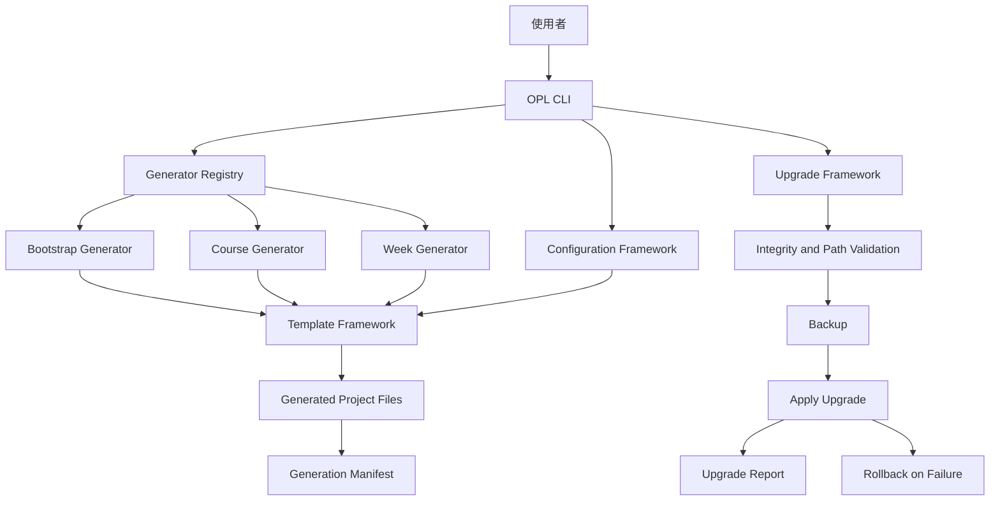

#<div align="center">

# OpenProjectLab

### Build projects, not just code.

**Design First · Documentation First · Automation First · Testing First**

[](https://github.com/khwang1964/OpenProjectLab/actions/workflows/ci.yml)
[](https://github.com/khwang1964/OpenProjectLab/actions/workflows/template-tests.yml)
[](https://github.com/khwang1964/OpenProjectLab/releases)
[](LICENSE)
[](https://www.python.org/)

</div>

---

## 關於 OpenProjectLab

**OpenProjectLab（OPL）** 是一套以 Project Engineering 為核心理念打造的開源框架，協助開發者建立、維護、驗證與持續演進高品質專案。

OPL 不只是 Project Generator。它將架構設計、文件治理、自動化流程、測試策略與專案生命週期管理整合為一套可擴充的 **Project Engineering Platform**。

OPL 的核心理念是：

* **Design First**：先完成設計與責任邊界，再進入實作。
* **Documentation First**：文件是產品的一部分，而不是事後補充。
* **Automation First**：可重複的工作應由工具執行。
* **Testing First**：測試用來保護功能、架構與相容性。

---

## 為什麼需要 OpenProjectLab？

許多專案在初期可以快速完成，但隨著規模成長，通常會逐漸出現：

* 架構與模組責任不清
* 文件不足或與程式碼脫節
* 缺少一致的測試策略
* 建置與品質檢查依賴人工
* 專案升級可能覆蓋使用者修改
* 團隊缺乏一致的開發與審查流程

OpenProjectLab 的目標，是把這些工程最佳實務內建於專案建立與維護流程中，讓專案從第一天起就具備可維護、可測試、可升級與可治理的基礎。

---

## 目前狀態

目前 OPL 位於 **v0.2.x Foundation** 階段。

已建立的主要能力包括：

* Generator Framework
* Configuration Framework
* Template Framework
* Generation Manifest
* Upgrade Framework
* Command-Line Interface
* Automated Testing
* Repository Governance
* Continuous Integration

下一個主要發展階段是 **v0.3 Plugin & Ecosystem**。

> OPL 仍處於早期開發階段。公開 API、設定格式與命令介面在 v1.0 前仍可能調整。

---

## 核心功能

### Generator Framework

OPL 使用一致的 Generator Lifecycle 建立不同類型的內容與專案結構。

目前內建：

* **Bootstrap Generator**：建立完整專案骨架。
* **Course Generator**：建立課程層級文件。
* **Week Generator**：建立每週教材結構與內容。

Generator 由 Registry 統一管理，讓核心功能與具體產生器保持清楚的責任邊界。

### Configuration Framework

OPL 使用 YAML 設定檔管理：

* 專案基本資料
* Template Root
* Output Root
* Generator 選項
* Plugin 預留設定

相對路徑會依設定檔與專案根目錄進行解析，避免依賴目前工作目錄。

### Template Framework

Template Framework 提供：

* Jinja2 Template Rendering
* Strict Undefined Validation
* Unicode 與 UTF-8 支援
* Template Path Validation
* Safe File Output
* Dry-Run 支援

模板內容與 Generator 邏輯分離，使專案結構更容易維護與擴充。

### Generation Manifest

Generation Manifest 記錄 OPL 產生的檔案與相關中繼資料，作為後續驗證、追蹤與升級的基礎。

### Upgrade Framework

Upgrade Framework 讓既有專案能安全地套用升級套件。

目前提供：

* Preview-Only Default Mode
* Add、Modify 與 Delete Operations
* SHA-256 Payload Validation
* Optional Source Conflict Protection
* Safe Relative Path Validation
* Automatic Backup
* Automatic Rollback
* Upgrade Report

預設只顯示升級計畫；只有明確指定 `--apply` 時才會修改專案。

### Quality Engineering

專案已整合：

* Ruff
* Ruff Formatter
* pre-commit
* pytest
* pytest-cov
* GitHub Actions
* Template Tests
* Repository Audit

品質檢查不依賴人工記憶，而是由本機 Hooks 與 CI 持續執行。

---

## 架構概觀



更完整的設計說明請參閱：

* [Architecture](docs/architecture.md)
* [Configuration](docs/configuration.md)
* [Architecture Decision Records](docs/adr/)

---

## 系統需求

建議環境：

* Python 3.12 或更新版本
* Git
* Windows、Linux 或 macOS
* PowerShell、Command Prompt 或相容 Shell

目前主要開發與測試環境包含 Python 3.14；部分 CI 工作也會驗證其他受支援的 Python 版本。

---

## 快速開始

### 1. 複製 Repository

```bash
git clone https://github.com/YOUR_GITHUB_USERNAME/OpenProjectLab.git
cd OpenProjectLab
```

### 2. 建立虛擬環境

Windows PowerShell：

```powershell
python -m venv .venv
.\.venv\Scripts\Activate.ps1
```

Linux 或 macOS：

```bash
python -m venv .venv
source .venv/bin/activate
```

### 3. 安裝 OPL

```bash
python -m pip install --upgrade pip
python -m pip install -e .
```

### 4. 查看 CLI 說明

```bash
opl --help
```

### 5. 查看可用 Generator

```bash
opl list
```

---

## CLI 使用範例

### 建立課程專案骨架

```powershell
opl bootstrap modern-java `
    --name "Modern Java in Action"
```

Linux 或 macOS：

```bash
opl bootstrap modern-java \
    --name "Modern Java in Action"
```

### 只預覽，不寫入檔案

```powershell
opl bootstrap modern-java `
    --name "Modern Java in Action" `
    --dry-run
```

### 建立課程 README

```powershell
opl course modern-java `
    --name "Modern Java in Action" `
    --weeks 16
```

### 建立每週教材

```powershell
opl week modern-java `
    --week 1 `
    --title "課程介紹與現代 Java 概覽" `
    --course-name "Modern Java in Action"
```

### 預覽 Upgrade Package

```powershell
opl upgrade .\path\to\upgrade-package.zip
```

### 套用 Upgrade Package

```powershell
opl upgrade .\path\to\upgrade-package.zip --apply
```

執行升級前，請先檢查 Preview 顯示的變更與衝突。

---

## Repository 結構

```text
OpenProjectLab/
├── .github/              # GitHub Actions 與 Repository 設定
├── config/               # 預設設定檔
├── docs/                 # 架構、開發與參考文件
├── generator/            # OPL 核心程式與 Generator
│   ├── cli/              # Command-Line Interface
│   ├── core/             # Configuration、Registry、Template、Upgrade
│   └── generators/       # 內建 Generator
├── scripts/              # Repository Automation Scripts
├── templates/            # Jinja2 Templates
├── tests/                # Unit、Integration、CLI 與 Template Tests
├── CHANGELOG.md
├── CONTRIBUTING.md
├── LICENSE
├── pyproject.toml
└── README.md
```

---

## 文件

### 使用與架構

* [Architecture](docs/architecture.md)
* [Configuration Guide](docs/configuration.md)
* [Template System](docs/template-system.md)
* [Upgrade System](docs/upgrade-system.md)
* [Upgrade Manifest Schema](docs/upgrade-manifest-schema.md)

### 專案治理

* [Contributing Guide](CONTRIBUTING.md)
* [Code of Conduct](CODE_OF_CONDUCT.md)
* [Security Policy](SECURITY.md)
* [Changelog](CHANGELOG.md)

### 專案方向

* [Project History](docs/HISTORY.md)
* [Roadmap](docs/ROADMAP.md)
* [Architecture Decision Records](docs/adr/)

> 部分文件路徑可能隨 Milestone 2 的 Documentation Reconstruction 調整。

---

## 開發環境

安裝專案與開發工具：

```powershell
python -m pip install -e .
python -m pip install pre-commit pytest pytest-cov ruff
python -m pre_commit install
```

執行靜態檢查與格式化：

```powershell
python -m ruff check .
python -m ruff format --check .
```

執行完整 pre-commit：

```powershell
python -m pre_commit run --all-files
```

執行測試：

```powershell
python -m pytest
```

執行 Coverage：

```powershell
python -m pytest --cov=generator --cov-report=term-missing
```

---

## 貢獻

歡迎透過下列方式參與 OPL：

* 回報 Bug
* 提出 Feature Request
* 改善文件
* 新增測試
* 改善 Template
* 提交 Pull Request

開始前請閱讀：

1. [CONTRIBUTING.md](CONTRIBUTING.md)
2. [CODE_OF_CONDUCT.md](CODE_OF_CONDUCT.md)
3. [SECURITY.md](SECURITY.md)
4. [Code Review Checklist](docs/development/code-review-checklist.md)

所有新增功能原則上都應同步提供：

* Architecture 或設計說明
* Automated Tests
* User 或 Developer Documentation
* Code Review Checklist 驗證

---

## Roadmap

目前規劃中的主要發展方向包括：

### v0.3 — Plugin Framework

* Plugin API
* Plugin Registry
* Plugin Discovery
* Plugin Metadata
* Plugin Version Compatibility

### v0.4 — Package and Template Ecosystem

* Package Management
* Template Distribution
* Upgrade Enhancements
* Marketplace Foundation

### v0.5 — AI and Open Courseware

* AI-Assisted Documentation
* AI-Assisted Project Generation
* Open Courseware Framework
* Course Material Automation

### v1.0 — Stable Project Engineering Platform

* Stable Public API
* Stable Plugin Contract
* Complete Documentation
* Release and Governance Process
* Long-Term Maintenance Policy

詳細規劃請參閱 [docs/ROADMAP.md](docs/ROADMAP.md)。

---

## Release 與變更紀錄

目前第一個已確認的正式版本為：

```text
v0.2.0
```

版本變更請參閱 [CHANGELOG.md](CHANGELOG.md)。

專案設計與演進背景請參閱 [docs/HISTORY.md](docs/HISTORY.md)。

---

## 安全性

請不要透過公開 Issue 揭露尚未修復的安全漏洞。

安全性回報方式與支援範圍請參閱 [SECURITY.md](SECURITY.md)。

---

## 授權

OpenProjectLab 採用 [MIT License](LICENSE)。

---

## 專案哲學

> **Build projects, not just code.**

OpenProjectLab 的目標不是產生最多的檔案，而是協助建立能夠被理解、測試、維護與持續演進的專案。
