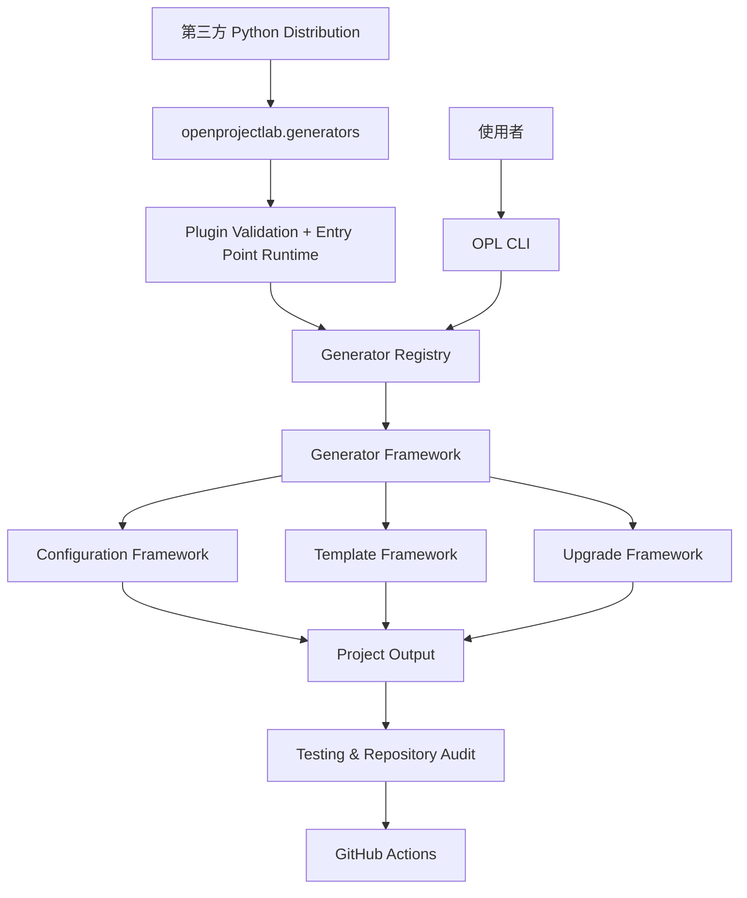

<div align="center">

# OpenProjectLab

### 建構專案，而不只是產生程式碼

**Design First · Documentation First · Automation First · Testing First**

一套協助開發者建立、維護、測試與持續演進高品質專案的
**Project Engineering Platform**。

[快速開始](#-快速開始) ·
[核心能力](#-核心能力) ·
[Plugin SDK](#-plugin-sdk) ·
[系統架構](#-系統架構) ·
[文件導覽](#-文件導覽) ·
[參與貢獻](#-參與貢獻)

**繁體中文** ｜ English（規劃中）

</div>

---

## OpenProjectLab 是什麼？

**OpenProjectLab（OPL）** 是一套以軟體工程方法為核心的開源專案平台。

它不只負責產生初始程式碼，也將架構設計、文件、測試、自動化品質檢查與專案升級機制整合在同一套框架中，協助專案從建立的第一天起，就具備良好的工程基礎。

OPL 的目標不是產生更多程式碼，而是協助建立：

* 容易理解的架構
* 持續更新的文件
* 可自動驗證的品質流程
* 可安全演進的專案生命週期
* 適合團隊與社群共同維護的 Repository

> **Build projects, not just code.**

---

## ✨ 核心能力

| 能力 | 說明 |
| --- | --- |
| **Generator Framework** | 以 canonical lifecycle 建立不同類型的專案與內容 |
| **Plugin SDK** | 讓第三方 Generator 只依賴 `generator.sdk` 擴充 OPL |
| **Python Entry Point Plugins** | 透過 `openprojectlab.generators` 發現與載入第三方 Plugin |
| **Configuration Framework** | 集中管理 YAML 設定、路徑與 Generator 行為 |
| **Template Framework** | 將程式邏輯、文件內容與專案範本分離 |
| **Upgrade Framework** | 提供預覽、雜湊驗證、備份、回復與升級報告 |
| **Testing Framework** | 透過單元、整合、CLI、SDK 與 Plugin contract tests 保護系統行為 |
| **Automation** | 整合 Ruff、pre-commit、pytest、Coverage 與 GitHub Actions |
| **Documentation** | 以 README、Architecture、ADR、History 與 Roadmap 管理專案知識 |
| **Repository Governance** | 建立授權、貢獻、安全性與社群治理流程 |

目前內建 Generator：

* `bootstrap`
* `course`
* `week`

Milestone 4 已建立 Public Plugin SDK、Plugin validation、Python Entry Point contract、transactional registration 與 legacy PluginManager removal。下一階段聚焦於 Plugin authoring documentation、example Plugin、metadata/version compatibility 與更完整的 ecosystem 能力。

---

## 🧩 Plugin SDK

第三方 Plugin 的正式依賴邊界是：

```text
generator.sdk
```

正式 installed-plugin flow：

```text
Third-Party Distribution
        ↓
openprojectlab.generators
        ↓
EntryPoint.load()
        ↓
Plugin validation
        ↓
metadata/runtime identity check
        ↓
transactional preflight
        ↓
GeneratorRegistry
```

Plugin author 不應直接依賴：

```text
generator.core.*
generator.generators.*
generator.plugins.*
```

最小 package metadata：

```toml
[project.entry-points."openprojectlab.generators"]
example-plugin = "opl_example:ExampleGenerator"
```

Entry Point name 必須等於 Generator 的 public name，且 Generator 必須是 concrete `BaseGenerator` subclass、符合 Plugin naming contract，並支援 zero-argument construction。

完整說明請參閱 [Plugin Authoring Guide](docs/plugin-authoring.md)。

---

## 🏗 系統架構

OpenProjectLab 採用模組化與分層設計，將 CLI、Generator、Plugin SDK、設定、範本、升級與品質工程分離。



---

## 🚀 快速開始

```bash
git clone https://github.com/YOUR_GITHUB_USERNAME/OpenProjectLab.git
cd OpenProjectLab
python -m venv .venv
python -m pip install --upgrade pip
python -m pip install -e .
```

Windows PowerShell 啟用：

```powershell
.venv\Scripts\Activate.ps1
```

確認 CLI：

```bash
opl list
```

品質檢查：

```bash
pre-commit run --all-files
python -m pytest
```

---

## 💻 CLI 概覽

```bash
opl --help
opl list
opl bootstrap
opl course
opl week
```

如需其他設定檔：

```bash
opl --config path/to/config.yaml list
```

---

## 📂 Repository Structure

```text
OpenProjectLab/
│
├── generator/
│   ├── cli/
│   ├── core/
│   ├── generators/
│   ├── plugins/             # Canonical host-side Plugin runtime
│   ├── sdk/                 # Stable third-party Plugin dependency boundary
│   └── templates/
├── config/
├── templates/
├── tests/
│   ├── plugins/
│   └── sdk/
├── docs/
│   ├── architecture/
│   ├── adr/
│   └── plugin-authoring.md
├── .github/
├── pyproject.toml
├── README.md
├── CHANGELOG.md
├── CONTRIBUTING.md
├── CODE_OF_CONDUCT.md
├── SECURITY.md
└── LICENSE
```

---

## 📚 文件導覽

### 核心文件

| 文件 | 內容 |
| --- | --- |
| [Architecture Overview](docs/architecture/overview.md) | 系統架構、核心元件與責任邊界 |
| [Generator Architecture](docs/architecture/generator.md) | Generator lifecycle 與核心契約 |
| [SDK Architecture](docs/architecture/sdk.md) | Public SDK 與 Plugin runtime boundary |
| [Plugin Authoring Guide](docs/plugin-authoring.md) | 第三方 Plugin 開發、封裝與測試 |
| [Plugin SDK Contract Inventory](docs/architecture/plugin-sdk-contract-inventory.md) | Milestone 4 contract baseline 與後續狀態 |
| [History](docs/HISTORY.md) | 專案演進歷史 |
| [Roadmap](docs/roadmap.md) | 未來版本與里程碑 |
| [Changelog](CHANGELOG.md) | 已發布與尚未發布的變更 |

### Architecture Decision Records

Plugin SDK 主要決策：

* ADR 0010 — Plugin SDK Public Contract
* ADR 0011 — Plugin Validation Contract
* ADR 0012 — Plugin Entry Point Contract

---

## 🤝 參與貢獻

開始前請閱讀：

1. [CONTRIBUTING.md](CONTRIBUTING.md)
2. [CODE_OF_CONDUCT.md](CODE_OF_CONDUCT.md)
3. [SECURITY.md](SECURITY.md)
4. [Code Review Checklist](docs/development/code-review-checklist.md)

所有新增功能原則上都應同步提供：

* Architecture 或設計說明
* Automated Tests
* User 或 Developer Documentation
* Code Review Checklist 驗證

---

## 專案哲學

> **Build projects, not just code.**

OpenProjectLab 的目標不是產生最多的檔案，而是協助建立能夠被理解、測試、維護與持續演進的專案。
