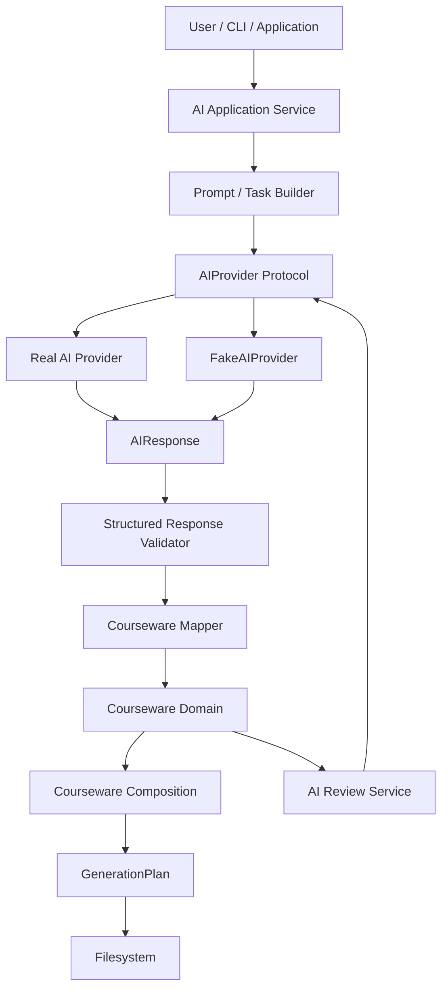

# OpenProjectLab AI Integration Architecture

> **Status:** Active
> **Milestone:** 6 — AI Integration
> **Scope:** AI provider abstraction, AI application services, structured generation, validation, courseware integration, testing, security, observability, and future AI-assisted workflows
> **Audience:** Maintainers, contributors, AI integration developers, Generator developers, Plugin developers

OpenProjectLab（OPL）的 AI Integration Architecture 定義 AI 能力如何安全、可測試且可替換地整合至既有的 Open Courseware Platform。

Milestone 5 已建立 Courseware Domain、Generator Contracts、Courseware Composition、Generation Plan 與代表性 E2E 驗證。Milestone 6 建立在這些既有契約之上，而不是建立一條繞過它們的 AI 特殊路徑。

AI 在 OPL 中是一個受控的 Application Capability。

AI 可以：

- 協助產生教材內容
- 建立結構化 Courseware 資料
- Review 既有內容
- 協助完成 Template Context
- 建立 Course Draft
- 協助文件產生
- 提供 Refactoring Proposal

AI 不可以：

- 直接修改正式 Filesystem
- 繞過 Courseware Domain Validation
- 直接建立未驗證的 `GenerationPlan`
- 將 Provider-specific API 滲透至 Domain Layer
- 將 API Key 或其他 Credential 放入 Domain Model
- 讓 Contract Tests 或 CI 依賴真實 AI API

本架構的核心原則是：

```text
AI proposes.
Domain validates.
Generator plans.
Filesystem commits.
Tests verify.
```

---

## 1. Goals

AI Integration Architecture 的主要目標包括：

- 建立穩定的 AI Provider abstraction。
- 避免 OPL 綁定單一 AI Provider 或 Model。
- 讓 AI 能力建立在既有 Courseware Domain Contract 上。
- 將 AI 產生的非可信輸出轉換成可驗證的結構化資料。
- 確保 AI 不直接控制 Filesystem。
- 支援 AI-assisted Content Generation。
- 支援 AI Review。
- 支援 AI Documentation。
- 支援 AI Template Completion。
- 支援 AI Course Builder。
- 支援未來 AI Refactoring Assistant。
- 讓 Unit Test 與 Contract Test 不需要網路。
- 讓 CI 不需要真實 API Key。
- 將 Provider Failure 與 Domain Validation Failure 明確區分。
- 保留 OPL 既有的 deterministic engineering workflow。
- 讓 AI 功能可以逐步加入，而不破壞非 AI workflow。

---

## 2. Non-Goals

Milestone 6 第一階段不以以下能力為目標：

- 建立通用聊天機器人。
- 建立 AI IDE。
- 讓 AI 自動 Commit。
- 讓 AI 自動 Push。
- 讓 AI 自動 Merge Pull Request。
- 讓 AI 任意修改 Repository。
- 讓 AI 直接寫入 Courseware Output。
- 建立 Model Training Platform。
- 建立 Fine-tuning Infrastructure。
- 建立 Vector Database。
- 建立完整 RAG Platform。
- 建立 Agent Marketplace。
- 建立自主 Software Engineering Agent。
- 將 Provider SDK 直接暴露為 OPL Public SDK。

這些能力未來若有需求，必須重新經過 Design First 與 ADR 決策。

---

## 3. Architectural Principles

AI Integration 遵循 OPL 既有工程原則：

```text
Design First
Documentation First
Automation First
Testing First
```

並增加以下 AI-specific 原則：

```text
Provider Independence
Structured Output First
Validation Before Integration
Deterministic Tests
Explicit Side Effects
Credential Isolation
Failure Transparency
Human Review Where Appropriate
```

AI 不應成為破壞既有架構規則的例外。

---

## 4. High-Level Architecture



核心邊界：

```text
AI Provider
    ↓
AI Application Layer
    ↓
Validation / Mapping Boundary
    ↓
Courseware Domain
    ↓
Existing OPL Generation Pipeline
```

AI Integration 不建立第二套 Generation Pipeline。

---

## 5. Dependency Direction

建議依賴方向：

```text
CLI / Application
        ↓
AI Application Service
        ↓
AIProvider Protocol
        ↓
Provider Adapter
```

以及：

```text
AI Application Service
        ↓
Structured Validation
        ↓
Courseware Domain
        ↓
Composition
        ↓
GenerationPlan
        ↓
Filesystem
```

禁止：

```text
Courseware Domain
        ↓
Provider SDK
```

禁止：

```text
Generator
        ↓
Provider SDK
```

禁止：

```text
AI Provider
        ↓
Filesystem
```

禁止：

```text
AI Response
        ↓
Filesystem
```

---

## 6. AI Integration Boundary

AI Integration Layer 位於 Application Capability 與外部 AI Provider 之間。

它負責：

- 建立 AI Request。
- 選擇 AI Provider。
- 呼叫 Provider abstraction。
- 接收 AI Response。
- 驗證 Response Contract。
- 將合法資料轉換為 OPL Domain Input。
- 將 Provider Error 轉換成 OPL AI Error。
- 提供可測試的 Fake Provider。
- 管理 Provider-independent AI workflow。

它不負責：

- Courseware Domain invariant。
- Generator planning。
- Filesystem writing。
- CLI argument parsing。
- Plugin discovery。
- Git operations。
- Provider credential persistence。

---

## 7. Proposed Module Structure

目前 production module 已演進為：

```text
generator/
├── ai/
│   ├── __init__.py
│   ├── models.py
│   ├── protocols.py
│   ├── errors.py
│   ├── validation.py
│   ├── testing.py
│   ├── courseware.py
│   ├── service.py
│   ├── review.py
│   ├── review_service.py
│   ├── documentation.py
│   ├── documentation_service.py
│   ├── template_completion.py
│   ├── template_completion_service.py
│   └── course_builder.py
│
├── courseware/
├── generators/
├── plugins/
└── core/
```

目前 `tests/ai/` 已涵蓋：

- AI request / response / provider contracts
- deterministic `FakeAIProvider`
- structured response validation
- AI-to-Courseware mapping
- course generation service
- AI review contract / service
- AI documentation contract / service
- AI template completion contract / service
- AI course builder contract / completeness validation

Provider Adapter、provider configuration 與 live-provider tests 尚未加入 core implementation。

---

## 8. AIProvider Protocol

AI Provider abstraction 是 Milestone 6 最重要的邊界之一。

概念：

```python
from typing import Protocol


class AIProvider(Protocol):
    def generate(
        self,
        request: AIRequest,
    ) -> AIResponse:
        ...
```

Application Layer 依賴：

```text
AIProvider
```

而不是：

```text
SpecificVendorClient
SpecificModelSDK
SpecificHTTPAPI
```

Provider adapter 負責將 OPL Contract 轉換成特定 Provider API。

---

## 9. Provider Independence

OPL Core 不應知道：

- Provider-specific request class
- Provider-specific response class
- Provider-specific authentication object
- Provider-specific exception hierarchy
- Provider-specific tool schema
- Provider-specific streaming event
- Provider-specific model naming convention

這些內容應限制於 Provider Adapter。

例如：

```text
OPL AIRequest
      ↓
Provider Adapter
      ↓
Provider-specific Request
```

回傳：

```text
Provider-specific Response
      ↓
Provider Adapter
      ↓
OPL AIResponse
```

---

## 10. AIRequest

建議使用不可變的 request model。

概念：

```python
from dataclasses import dataclass
from typing import Mapping


@dataclass(frozen=True, slots=True)
class AIRequest:
    task: str
    instructions: str
    context: Mapping[str, object]
    response_contract: str | None = None
```

實際欄位將由 Contract Test 決定。

`AIRequest` 應描述 OPL 的需求，而不是某一 Provider 的 API payload。

---

## 11. AIRequest Responsibilities

`AIRequest` 可以包含：

- Task identity
- Instructions
- Structured context
- Expected response contract
- Optional generation policy
- Optional metadata

不應直接包含：

- API Key
- HTTP Header
- Provider SDK object
- Socket
- Session
- Provider-specific client
- Filesystem handle

Request 必須可以：

- 測試
- 比較
- 建立 Fake
- 記錄安全 metadata
- 在不同 Provider Adapter 間轉換

---

## 12. AIResponse

概念：

```python
@dataclass(frozen=True, slots=True)
class AIResponse:
    content: object
    metadata: Mapping[str, object]
```

實際 Contract 應避免讓核心 Application 必須解析 Provider-specific response object。

AIResponse 可以保存必要的 Provider-independent metadata，例如：

- Provider identifier
- Model identifier
- Finish status
- Usage information
- Request correlation identifier

但 metadata 不應成為 Domain Contract。

---

## 13. AI Output Is Untrusted Input

所有 AI Output 必須視為：

```text
Untrusted External Input
```

即使 Provider 回傳：

```json
{
  "title": "Week 01",
  "labs": [],
  "quizzes": []
}
```

也不能直接假設它符合 OPL Contract。

流程必須是：

```text
AIResponse
    ↓
Parse
    ↓
Structural Validation
    ↓
Semantic Validation
    ↓
Domain Construction
```

只有成功建立 Domain Object 後，資料才進入既有 OPL pipeline。

---

## 14. Structured Output First

Milestone 6 應優先使用結構化 AI Output，而不是依賴自由文字解析。

例如 Course Draft 可以概念上要求：

```json
{
  "title": "...",
  "description": "...",
  "weeks": []
}
```

而不是要求 AI 回傳：

```text
Here is your course...

Week One is...
```

然後再以不穩定的字串規則解析。

Structured Output 可以改善：

- Validation
- Testing
- Provider replacement
- Error reporting
- Schema evolution
- Domain mapping

---

## 15. Validation Layers

AI Response Validation 建議分成三層。

### Layer 1 — Transport Validation

確認：

- Provider 呼叫成功。
- Response 存在。
- Response 可以被 Adapter 解讀。

### Layer 2 — Structural Validation

確認：

- 必要欄位存在。
- 型別正確。
- Collection 結構正確。
- Schema 符合預期。

### Layer 3 — Domain Validation

確認：

- Courseware invariant 成立。
- Week number 合法。
- Quiz question 合法。
- Assignment structure 合法。
- Domain relationship 合法。

AI Layer 不應重新實作 Courseware Domain invariant。

Domain 本身仍然是最終 authority。

---

## 16. Mapping Boundary

AI Response 不應直接等同於 Domain Object。

建議：

```text
AIResponse
    ↓
Validated AI DTO
    ↓
Courseware Mapper
    ↓
Courseware Domain Object
```

這可以避免 AI-specific metadata 污染 Domain。

例如：

```text
provider
model
token_usage
finish_reason
```

不應出現在：

```text
Course
Week
Lab
Quiz
Assignment
```

等核心 Domain Model 中。

---

## 17. Courseware Integration

Milestone 5 已建立的 Courseware Domain 是 AI Integration 的主要穩定邊界。

概念：

```text
AI Course Draft
       ↓
Validation
       ↓
Course
 ├── Week
 │    ├── Lab
 │    ├── Quiz
 │    └── Assignment
 └── ...
       ↓
Courseware Composition
       ↓
GenerationPlan
```

AI 不需要知道最後：

- 哪些 Template 被使用。
- Output path 如何決定。
- Filesystem policy。
- Atomic write。
- Existing file handling。

這些仍由既有 OPL subsystem 負責。

---

## 18. Generator Boundary

Generator 不應直接呼叫：

```python
provider.generate(...)
```

原因：

- Generator 會與 AI lifecycle 耦合。
- Provider failure 會污染 Generation Contract。
- Generator 測試需要網路或大量 mocking。
- 非 AI workflow 變得依賴 AI。
- Provider replacement 更困難。

正確方向：

```text
AI Workflow
    ↓
Validated Domain Input
    ↓
Generator
```

Generator 只處理已符合契約的輸入。

---

## 19. Filesystem Boundary

AI Integration 的最重要安全規則之一：

> AI-generated content MUST NOT be written directly to the production filesystem by an AI provider or raw AI response handler.

禁止：

```python
response = provider.generate(request)

Path("README.md").write_text(
    response.content,
)
```

應經過：

```text
AIResponse
    ↓
Validation
    ↓
Domain
    ↓
Composition
    ↓
GenerationPlan
    ↓
Filesystem
```

Filesystem side effect 仍受 OPL 現有 contract 控制。

---

## 20. Prompt Ownership

Prompt 不應散落在：

- CLI
- Generator
- Provider Adapter
- Tests
- Template
- Filesystem Layer

建議由 AI Application Layer 擁有 Prompt / Task Builder。

例如：

```text
generator/ai/prompts.py
```

或未來：

```text
generator/ai/prompts/
```

Prompt Builder 負責將：

```text
Task
+
Domain Context
+
Response Contract
```

轉換為 AI Request。

---

## 21. Prompt Is Not a Domain Contract

Prompt 是與模型溝通的 mechanism。

它不是 OPL Domain Contract。

例如 Prompt 說：

```text
Always generate exactly 16 weeks.
```

不能取代正式 validation：

```python
if len(course.weeks) != 16:
    ...
```

AI 是否遵守 Prompt 不可作為 correctness guarantee。

---

## 22. Prompt Versioning

未來若 Prompt 成為重要 production asset，應考慮版本化。

例如：

```text
course-builder-v1
quiz-review-v1
assignment-generator-v2
```

用途：

- Regression testing
- Reproducibility
- Provider comparison
- Evaluation
- Rollback
- Change review

Prompt 重大修改應視為可測試的行為變更。

---

## 23. Provider Configuration

Provider configuration 可能包括：

```text
provider
model
timeout
retry policy
generation options
```

這些設定屬於 AI Infrastructure / Application Configuration。

它們不應進入 Courseware Domain。

例如不應：

```python
Course(
    title="...",
    ai_model="...",
)
```

除非未來有明確 provenance requirement，且經 ADR 決定。

---

## 24. Credential Isolation

API Credential 不應：

- Hard-code 在 source code。
- Commit 到 Repository。
- 放入 Courseware Domain。
- 放入 Template Context。
- 出現在 GenerationPlan。
- 寫入產出教材。
- 出現在一般 log。
- 出現在 exception message。

Credential 應由 runtime environment 或適當 secret mechanism 提供。

例如：

```text
Environment
    ↓
Provider Configuration
    ↓
Provider Adapter
```

Credential 不應向下流入 Domain。

---

## 25. Provider Adapter

Provider Adapter 負責：

- 建立 Provider-specific request。
- 呼叫 Provider SDK/API。
- 解析 Provider response。
- 將 response 轉換成 `AIResponse`。
- 將 Provider exception 轉換成 OPL AI exception。
- 隔離 Provider-specific metadata。

Adapter 不負責：

- Courseware validation。
- Filesystem。
- GenerationPlan。
- CLI formatting。
- Domain policy。

---

## 26. Provider Selection

Provider selection 應由 Composition Root 或 Application Configuration 決定。

概念：

```python
provider = build_ai_provider(config.ai)

service = AIService(
    provider=provider,
)
```

不建議：

```python
class CourseGenerator:
    provider = SomeVendorClient(...)
```

也不建議：

```python
if provider_name == "vendor-a":
    ...
elif provider_name == "vendor-b":
    ...
```

散落於多個功能。

---

## 27. AIService

AI Application Service 負責協調完整 AI interaction。

概念：

```python
class AIService:
    def __init__(
        self,
        provider: AIProvider,
    ) -> None:
        self._provider = provider

    def generate(
        self,
        request: AIRequest,
    ) -> AIResponse:
        return self._provider.generate(request)
```

隨著架構成熟，可以加入：

- Validation
- Retry orchestration
- Metrics
- Correlation
- Policy
- Cancellation

但 Service 不應逐漸變成包含所有 AI feature 的巨大類別。

---

## 28. Feature-Specific Services

未來可以建立：

```text
AIContentGenerationService
AIReviewService
AITemplateCompletionService
AICourseBuilder
AIRefactoringService
```

它們依賴共同：

```text
AIProvider
```

或較低階：

```text
AIService
```

而不是各自建立 Provider Client。

---

## 29. AI-assisted Content Generation

此能力負責根據已知 Domain Context 提出內容。

例如：

```text
Week
  ↓
AI Content Generator
  ↓
Lecture Draft
```

或：

```text
Lab Specification
  ↓
AI
  ↓
Lab Content Draft
```

結果仍須經：

- Structural validation
- Domain validation
- Human review（適用時）
- Existing generation pipeline

---

## 30. AI Review

AI Review 與 AI Generation 應視為不同 use case。

Review input 可以是：

- Course
- Week
- Lab
- Quiz
- Assignment
- Generated documentation

Review output 應優先是結構化 finding：

```text
AIReviewResult
├── findings
├── severity
├── category
└── recommendation
```

而不是只有一段自由文字。

AI Review 是 advisory capability。

除非未來經正式 ADR 決定，Review 不應直接修改 Domain 或 Filesystem。

---

## 31. AI Documentation

AI Documentation 可以協助：

- Draft architecture explanation
- Draft reference content
- Summarize Domain Contract
- Generate user-facing descriptions
- Suggest documentation updates

但正式 Repository Documentation 仍必須經：

```text
Review
    ↓
Tests / Validation
    ↓
Git workflow
```

AI 不應直接修改 `main`。

---

## 32. AI Template Completion

Template Completion 可以使用：

```text
Template Requirement
+
Domain Context
+
Expected Output Contract
```

產生候選內容。

但 Template Renderer 與 AI Template Completion 是不同 subsystem。

AI 產生：

```text
candidate content
```

Template Renderer 執行：

```text
deterministic rendering
```

不應讓 deterministic Template Layer 隱含依賴 AI。

---

## 33. AI Course Builder

AI Course Builder 是 Milestone 6 的代表性高階能力之一。

概念：

```text
Course Specification
        ↓
AI Course Builder
        ↓
Structured Course Draft
        ↓
Validation
        ↓
Courseware Domain
        ↓
Composition
        ↓
GenerationPlan
```

輸入可能包含：

- Course title
- Audience
- Objectives
- Duration
- Number of weeks
- Difficulty
- Required topics
- Constraints

輸出不是直接檔案，而是 Domain-compatible structured data。

---

## 34. AI Refactoring Assistant

AI Refactoring Assistant 可以分析既有 Courseware，提出：

- Content restructuring
- Naming improvement
- Duplication reduction
- Learning objective alignment
- Lab improvement
- Quiz improvement
- Assignment improvement

初期應只產生：

```text
Refactoring Proposal
```

而不是自動修改正式 Courseware。

未來若支援 apply，仍必須走正式 validation 與 generation pipeline。

---

## 35. FakeAIProvider

`FakeAIProvider` 是正式架構的一部分，而不只是臨時測試工具。

概念：

```python
class FakeAIProvider:
    def __init__(
        self,
        responses: tuple[AIResponse, ...],
    ) -> None:
        self._responses = list(responses)
        self.requests: list[AIRequest] = []

    def generate(
        self,
        request: AIRequest,
    ) -> AIResponse:
        self.requests.append(request)
        return self._responses.pop(0)
```

實際 API 將由 Contract Test 決定。

---

## 36. Why FakeAIProvider Matters

Fake Provider 讓測試可以驗證：

- Request 是否正確建立。
- Context 是否正確。
- Response 是否正確處理。
- Validation failure。
- Provider failure。
- Retry behavior。
- Multiple calls。
- Review workflow。
- Course Builder workflow。

而不需要：

- Internet
- API Key
- Paid invocation
- External availability
- Model determinism

---

## 37. Tests Must Not Require Real AI

以下測試：

```text
Unit Tests
Contract Tests
Integration Tests
Representative E2E
CI
pre-commit
```

原則上都不應要求真實 AI Provider。

否則會產生：

- Flaky tests
- Cost
- Rate limit
- Network dependency
- Credential management problem
- Non-deterministic output
- Provider outage dependency

真實 Provider Test 應與核心 CI 分離。

---

## 38. Provider Contract Tests

所有 Provider implementation 應滿足共同 Contract。

例如：

```text
generate() accepts AIRequest
generate() returns AIResponse
provider errors become OPL AI errors
credentials are not exposed
malformed responses fail explicitly
```

可使用共享 Contract Test Suite 驗證不同 Adapter。

---

## 39. Real Provider Tests

未來若建立 Real Provider integration tests，應：

- 明確標記。
- 預設不執行。
- 不進入一般 pre-commit。
- 不要求 contributor 擁有 credential。
- 可由專用 CI workflow 執行。
- 有成本控制。
- 有 timeout。
- 有 rate limit strategy。
- 不依賴 exact natural-language output。

例如未來可能使用：

```text
pytest marker: ai_live
```

正式命名由測試架構決定。

---

## 40. Deterministic Testing

AI production behavior 可以是非決定性的。

OPL automated tests 不可以因此變成非決定性。

測試應透過：

```text
FakeAIProvider
Fixtures
Contract Responses
Schema Validation
Explicit Failure Simulation
```

建立 deterministic behavior。

不要測試：

```text
AI should produce exactly this paragraph.
```

應測試：

```text
Valid structured response is accepted.
Invalid structured response is rejected.
Provider failure propagates correctly.
Domain invariant remains enforced.
```

---

## 41. AI Exceptions

建議建立：

```text
OpenProjectLabError
└── AIError
    ├── AIConfigurationError
    ├── AIProviderError
    ├── AIAuthenticationError
    ├── AIRateLimitError
    ├── AITimeoutError
    ├── AIResponseError
    ├── AIResponseValidationError
    └── AIUnavailableError
```

實際 hierarchy 應由 ADR 與 Contract Tests 決定。

---

## 42. Provider Error Conversion

Provider-specific exception 不應穿透 Application Boundary。

概念：

```python
try:
    response = client.generate(...)
except ProviderTimeoutError as exc:
    raise AITimeoutError(
        "AI provider request timed out."
    ) from exc
```

保留 Exception Chaining：

```python
raise ... from exc
```

以支援 Debug 與 diagnostics。

---

## 43. Expected vs Unexpected Errors

預期 AI error：

```text
Authentication failure
Rate limit
Timeout
Provider unavailable
Malformed response
Schema mismatch
```

應轉換成具語意的 OPL AI Exception。

未預期錯誤：

```text
TypeError
AttributeError
AssertionError
unexpected RuntimeError
```

不應全部捕捉並偽裝成：

```text
AIProviderError
```

否則會隱藏程式 Bug。

---

## 44. Retry Policy

不是所有 AI Error 都可以 Retry。

通常不可 Retry：

```text
Invalid configuration
Invalid credential
Invalid request
Domain validation failure
Unsupported feature
```

可能可以 Retry：

```text
Temporary provider unavailable
Timeout
Transient network failure
Rate limit
```

Retry Policy 必須定義：

- Eligible errors
- Maximum attempts
- Backoff
- Cancellation
- Idempotency
- Logging
- Cost implications

第一階段不應預設加入複雜 retry。

---

## 45. Timeout

所有真實 Provider invocation 應具有有限 Timeout。

禁止：

```text
wait forever
```

Timeout policy 應由 Infrastructure / Application Configuration 決定。

Provider Adapter 將 Provider-specific timeout 轉換成：

```text
AITimeoutError
```

---

## 46. Cancellation

未來長時間 AI Operation 應考慮 cancellation。

例如：

```text
User
 ↓
Ctrl+C
 ↓
Application cancellation
 ↓
Provider request cancellation
```

Cancellation 不應留下：

- Partial Domain mutation
- Partial GenerationPlan
- Partial Filesystem output

AI workflow 在完成 validation 前原則上不應具有正式 filesystem side effect。

---

## 47. Streaming

部分 Provider 支援 streaming。

但 OPL Core Contract 不應因 Provider 支援 streaming 就強迫所有功能使用 streaming。

第一階段可以使用完整 response：

```text
AIRequest → AIResponse
```

未來若需要：

```text
AIStreamEvent
```

應建立獨立 Contract。

不要過早讓 streaming complexity 進入 Domain。

---

## 48. Tool Calling

部分 AI Provider 支援 Tool Calling。

Milestone 6 初期不應讓 Provider 任意執行 OPL Tool。

尤其禁止直接提供：

```text
write_file
delete_file
git_commit
git_push
shell_execute
```

給模型自行執行。

若未來導入 AI Tool Calling，必須建立：

```text
Tool Registry
Permission Policy
Input Validation
Execution Boundary
Audit Trail
Tests
```

並建立獨立 ADR。

---

## 49. Side Effects

AI Layer 本身應盡量保持 side-effect-light。

允許：

```text
External AI provider request
Metrics / logging
```

不應直接：

```text
Write production file
Delete file
Commit Git
Push Git
Modify registry
Install plugin
```

Side effect 應由既有 OPL subsystem 負責。

---

## 50. Security Boundary

AI Provider 是外部系統。

送出的 Context 必須經過評估。

不應預設將以下內容送給 Provider：

- API keys
- Passwords
- SSH keys
- `.env`
- Authentication headers
- User secrets
- Entire repository
- Git credential
- Private configuration
- Unrelated files

Application Layer 應明確決定 AI Request Context。

---

## 51. Minimal Context Principle

AI Request 應遵循：

> Send only the context required to complete the task.

例如產生 Quiz 時，可能需要：

```text
Course objectives
Week objectives
Topic
Difficulty
Question contract
```

不需要：

```text
Entire repository
Git history
CI configuration
SSH configuration
```

這同時改善：

- Security
- Cost
- Latency
- Prompt clarity
- Testability

---

## 52. Logging

AI logging 可以包含：

### DEBUG

- Task type
- Provider identifier
- Model identifier
- Request identifier
- Validation stage
- Retry attempt

### INFO

- AI operation started
- AI operation completed
- Review completed

### WARNING

- Retry
- Partial optional metadata
- Recoverable provider issue

### ERROR

- Provider failure
- Response validation failure

不應預設記錄完整 Prompt 或 Response。

---

## 53. Sensitive Logging

Log 不應包含：

- API Key
- Authorization Header
- Secret
- Password
- Credential object
- Private repository content
- 不必要的完整 user prompt
- 未經評估的 AI response

若 Debug 模式允許記錄更多內容，也必須有明確 redaction policy。

---

## 54. Observability

未來可收集：

```text
operation
provider
model
duration
success/failure
retry count
token usage
validation outcome
```

但 observability metadata 不應污染 Courseware Domain。

它應屬於 Application / Infrastructure telemetry。

---

## 55. Cost Awareness

真實 AI invocation 可能產生成本。

因此 Architecture 應允許未來提供：

- Usage metadata
- Request count
- Token usage
- Cost estimation
- Budget limit
- Per-operation limit

但 Milestone 6 初期不需要建立完整 Billing subsystem。

核心 Contract 只需避免阻礙未來擴充。

---

## 56. Provenance

未來可能需要記錄：

```text
Generated by AI
Reviewed by AI
Provider
Model
Prompt version
Generation timestamp
```

但 provenance 是否成為 Courseware metadata 必須另行設計。

不應在第一階段直接加入所有 Domain Model。

可能的替代方式：

```text
AI operation metadata
```

保存在 Application Result，而不是 Courseware Domain。

---

## 57. Human Review

AI output 不應因為通過 schema validation 就自動等同於高品質教材。

Structural correctness：

```text
≠
```

Educational correctness。

因此對以下內容應考慮 Human Review：

- Lecture content
- Assessment answer
- Grading criteria
- Security-sensitive lab
- Technical instruction
- External factual claims

Milestone 6 的 AI Review 可以提供第二層檢查，但 AI Review 本身也不是絕對 correctness guarantee。

---

## 58. AI Evaluation

未來可以建立獨立 Evaluation Suite。

例如評估：

- Structural validity
- Domain validity
- Topic coverage
- Duplication
- Learning objective alignment
- Difficulty consistency

Evaluation 不應依賴：

```text
exact wording
```

而應優先使用可重複驗證的結構與規則。

---

## 59. AI Content Lifecycle

建議 lifecycle：

```text
Request
  ↓
Prompt / Task Construction
  ↓
Provider Invocation
  ↓
Raw Provider Response
  ↓
AIResponse
  ↓
Structural Validation
  ↓
Domain Mapping
  ↓
Domain Validation
  ↓
Optional AI Review
  ↓
Optional Human Review
  ↓
Composition
  ↓
GenerationPlan
  ↓
Filesystem
```

每個 stage 應有清楚責任。

---

## 60. Failure Before Domain Construction

如果 AI output 無法通過 structural validation：

```text
AIResponseValidationError
```

此時：

- 不建立部分 Domain Object。
- 不執行 Composition。
- 不建立正式 GenerationPlan。
- 不修改 Filesystem。

這是重要的 fail-before-side-effect 原則。

---

## 61. Failure During Domain Validation

若結構正確但違反 Courseware Contract：

```text
Validated AI DTO
      ↓
Domain Construction
      ↓
Domain Validation Failure
```

應保留 Domain Error。

不要將所有 Domain Error 改寫成 generic AI error。

原因是問題已經進入 Domain semantic boundary。

---

## 62. Partial AI Responses

若 Provider 回傳 incomplete structured data：

```text
Course
├── Week 1
├── Week 2
└── Week 3
```

但 Request 要求 16 weeks，不能因為 JSON 可解析就接受。

Response Contract 必須驗證 completeness。

是否允許 partial result 必須由 use case 明確決定。

預設應：

```text
Fail explicitly
```

而不是靜默接受。

---

## 63. Repairing Invalid AI Output

未來可能加入：

```text
Response Repair
```

例如：

```text
Invalid Response
      ↓
Validation Findings
      ↓
Repair Request
      ↓
Provider
```

但 automatic repair 會增加：

- Cost
- Complexity
- Retry ambiguity
- Non-determinism

因此第一階段建議：

```text
Validate → Fail
```

而不是自動無限修復。

---

## 64. Reproducibility

AI generation 不保證完全 reproducible。

因此 OPL 不應宣稱：

```text
same request == identical natural-language output
```

可重現的部分應是：

- Request contract
- Prompt version
- Domain validation
- Mapping
- Generation pipeline
- Filesystem behavior
- Fake-provider tests

這是 AI 系統與 deterministic OPL Core 的重要分界。

---

## 65. Caching

第一階段不建議建立 AI Response Cache。

未來若加入，必須考慮：

- Credential separation
- Sensitive content
- Cache key
- Prompt version
- Provider/model version
- Expiration
- Encryption
- Invalid response
- User privacy

Caching 必須是明確設計的 Infrastructure feature。

---

## 66. Plugin Integration

OPL 已具有 Plugin SDK / Plugin Ecosystem。

未來 AI Provider Adapter 可能成為 Plugin Extension Point。

概念：

```text
Plugin
  ↓
AI Provider Adapter
  ↓
AIProvider Protocol
```

這可以讓第三方提供新的 Provider。

但 Milestone 6 第一階段不應直接假設 Provider 必須透過 Plugin 安裝。

應先穩定 `AIProvider` Contract，再評估 Plugin integration。

---

## 67. Public SDK

AI API 是否成為 OPL Public SDK，需要獨立穩定化流程。

初期：

```text
generator.ai
```

可以視為 internal/experimental capability。

在加入 public export 前應確認：

- Contract stability
- Exception hierarchy
- Versioning
- Provider extension mechanism
- Documentation
- Compatibility policy

不能因為建立 Module 就自動視為 Public API。

---

## 68. Configuration Architecture

未來設定可能概念上包含：

```yaml
ai:
  provider: example
  model: example-model
  timeout_seconds: 60
```

但：

```yaml
api_key: ...
```

不應被鼓勵 Commit 至 Repository。

Credential 應透過安全 runtime mechanism 提供。

正式 configuration schema 需另行設計。

---

## 69. CLI Integration

未來 CLI 可能提供：

```text
opl ai ...
```

或將 AI capability 整合進既有 command。

但 CLI 應只：

- Parse arguments
- Resolve configuration
- Invoke application service
- Format result
- Map error to exit code

CLI 不應：

- 建立 Provider-specific payload。
- Parse Provider response。
- 實作 Courseware validation。
- 直接寫入 AI output。

---

## 70. Dry Run

若 AI workflow 最終會產生 Courseware，Dry Run 語意需要明確區分。

可能有：

### AI Invocation Dry Run

完全不呼叫 Provider，只顯示預計 task。

### Generation Dry Run

允許 AI invocation 與 Domain construction，但不修改 Filesystem。

這兩種語意不同。

正式 CLI 若加入 AI Dry Run，必須明確定義。

---

## 71. Representative E2E

Milestone 6 最終應建立至少一條 representative AI E2E。

建議：

```text
Course Specification
        ↓
AICourseBuilder
        ↓
FakeAIProvider
        ↓
Structured AIResponse
        ↓
Validation
        ↓
Courseware Domain
        ↓
Composition
        ↓
GenerationPlan
        ↓
Filesystem
        ↓
Expected Courseware
```

此 E2E 必須：

- 不使用網路。
- 不需要 API Key。
- 不產生成本。
- 完全 deterministic。
- 驗證 AI boundary。
- 驗證 Domain boundary。
- 驗證既有 Generation Pipeline。

---

## 72. AI Review E2E

另一條代表性流程可以是：

```text
Existing Courseware Domain
        ↓
AIReviewService
        ↓
FakeAIProvider
        ↓
Structured Findings
        ↓
AIReviewResult
```

確認 Review：

- 不修改原 Domain。
- 不修改 Filesystem。
- findings 結構合法。
- provider failure 正確傳遞。

---

## 73. Contract Testing Strategy

Milestone 6 建議遵循：

```text
Architecture
    ↓
ADR
    ↓
Contract Tests
    ↓
Minimal Implementation
    ↓
Integration Tests
    ↓
Feature Implementation
    ↓
Representative E2E
    ↓
Acceptance
```

這延續 Milestone 5 已建立的 OPL 開發節奏。

---

## 74. Initial Contract Tests

第一批 Contract Tests 建議驗證：

### AIRequest

- immutable
- required task
- required instructions
- context contract
- no provider SDK dependency

### AIResponse

- immutable
- content available
- metadata isolated
- no Domain coupling

### AIProvider

- protocol-compatible
- accepts `AIRequest`
- returns `AIResponse`

### FakeAIProvider

- deterministic
- records request
- returns configured response
- can simulate failure

---

## 75. Validation Tests

應測試：

- Valid structured response accepted.
- Missing required field rejected.
- Wrong field type rejected.
- Unknown/unsupported structure handled.
- Domain-invalid structure rejected.
- Partial response rejected when completeness required.
- Provider metadata does not enter Domain.
- Invalid response causes no filesystem side effect.

---

## 76. Failure Tests

至少測試：

- Provider unavailable
- Authentication failure
- Timeout
- Rate limit
- Malformed response
- Empty response
- Invalid structured response
- Domain validation failure
- Unexpected implementation error

並確認：

- Exception type
- Exception chaining
- No credential leakage
- No filesystem side effect

---

## 77. Security Tests

應驗證：

- API key 不出現在 `repr()`。
- API key 不出現在 exception message。
- API key 不進入 `AIRequest.context`。
- Credential 不進入 Domain。
- Provider error sanitization。
- Fake Provider 不要求 secret。
- CI 不要求 secret。

---

## 78. Automation

AI Core Contract Tests 應進入既有：

```text
pytest
pre-commit
CI
```

例如：

```powershell
python -m pytest tests\ai -v --no-cov
```

以及完整：

```powershell
pre-commit run --all-files
python -m pytest
```

Live Provider Tests 應與核心 Automation 分離。

---

## 79. CI Requirements

一般 CI 必須可以在：

```text
No network
No AI API key
No paid account
```

的條件下驗證 AI Integration Core。

如果 PR 加入 Provider Adapter，但使一般 CI 必須擁有外部 Credential，應視為 Architecture Regression。

---

## 80. Documentation Requirements

任何 AI feature 必須同步更新適當文件：

- `docs/architecture/ai-integration.md`
- AI ADR
- Courseware architecture
- CLI reference（若加入 command）
- Configuration reference（若加入 config）
- SDK documentation（若公開 API）
- Error reference
- Roadmap
- History（重大 milestone）
- Changelog

重大架構決策應建立 ADR。

---

## 81. Milestone 6 Implementation Phases

Milestone 6 目前已完成 provider-independent core 與主要 application contracts：

### Phase 1 — Architecture and Contract ✅

- AI Integration Architecture
- ADR 0021
- Provider / Domain / Generator / Filesystem boundaries
- deterministic testing strategy

### Phase 2 — Core Contracts ✅

- `AIRequest`
- `AIResponse`
- runtime-checkable `AIProvider`
- deterministic `FakeAIProvider`

### Phase 3 — Structured Validation and Mapping ✅

- `AIResponseValidationError`
- mapping-shaped structural validation
- AI-to-Courseware `Course` / `Week` mapping
- Domain validation ownership preserved

### Phase 4 — Application Services ✅

- AI Course Generation Service
- AI Review
- AI Documentation
- AI Template Completion
- AI Course Builder

### Phase 5 — Provider Adapter ⏳

下一個 infrastructure stage：

- first real Provider Adapter contract
- Provider-independent exception conversion
- runtime configuration / credential isolation
- timeout policy
- live-test separation from core CI

### Phase 6 — Representative AI E2E ⏳

使用 `FakeAIProvider` 驗證：

```text
Course Specification
        ↓
AICourseBuilder
        ↓
AIProvider
        ↓
AIResponse
        ↓
Validation / Mapping
        ↓
Courseware Domain
        ↓
Composition
        ↓
GenerationPlan
        ↓
Filesystem
```

### Phase 7 — Documentation Alignment and Milestone Acceptance ⏳

完成 architecture/reference/roadmap/history/changelog alignment、representative E2E、full regression、CI 與 Milestone 6 acceptance record。

---

## 82. Current Limitations

截至 2026-08-15，以下 provider-independent capabilities 已由 production code 與 tests 支援：

- AI Provider abstraction
- AI Request / Response contracts
- deterministic Fake AI Provider
- structured AI response validation
- AI-to-Courseware mapping
- AI Course Generation Service
- AI Review
- AI Documentation
- AI Template Completion
- AI Course Builder

目前仍屬未完成或後續範圍：

- 完整 AI exception hierarchy（目前僅有已落地的 validation / use-case errors）
- Real / Live Provider Adapter
- Provider runtime configuration
- credential-backed provider integration
- live-provider test workflow
- representative AI → Composition → GenerationPlan → Filesystem E2E
- AI Refactoring Assistant
- AI CLI
- AI evaluation
- AI provenance
- AI usage accounting
- AI caching
- AI streaming
- AI tool calling

因此目前 Milestone 6 的主要缺口已從「core capability」轉為「real-provider infrastructure、representative E2E 與 milestone acceptance」。

---

## 83. Architectural Invariants

Milestone 6 應保護以下 invariant：

### AI Boundary

- AI output 一律視為外部不可信輸入。
- Provider-specific types 不得進入 Courseware Domain。
- Provider-specific SDK 不得成為 Generator dependency。
- AI Provider 不得直接操作 Filesystem。

### Domain Boundary

- Courseware Domain 仍然擁有 Domain invariant。
- Prompt 不取代 Domain validation。
- AI validation 不取代 Domain validation。
- AI metadata 不污染 Domain Model。

### Generation Boundary

- AI 不直接建立 filesystem side effect。
- 正式輸出仍經 Composition / GenerationPlan。
- Filesystem policy 不由 AI 決定。

### Testing Boundary

- 核心測試不依賴真實 Provider。
- CI 不依賴 API Key。
- Fake Provider 必須 deterministic。
- 非決定性模型輸出不能成為 exact regression oracle。

---

## 84. AI Integration Code Review Checklist

### Architecture

- [ ] AI feature 位於正確 Layer。
- [ ] 沒有繞過 Courseware Domain。
- [ ] 沒有建立第二套 Generation Pipeline。
- [ ] AI Provider 不直接操作 Filesystem。
- [ ] Generator 不直接依賴 Provider SDK。
- [ ] Courseware Domain 不依賴 AI module。
- [ ] Provider-specific code 被限制於 Adapter。
- [ ] Dependency direction 符合 architecture。

### Contracts

- [ ] `AIRequest` 語意明確。
- [ ] `AIResponse` 語意明確。
- [ ] Provider contract 不綁特定廠商。
- [ ] Public / internal API 邊界清楚。
- [ ] Structured output contract 有版本演進考量。
- [ ] AI metadata 與 Domain data 分離。
- [ ] Invalid response behavior 已定義。

### Validation

- [ ] AI output 被視為 untrusted input。
- [ ] Structural validation 已執行。
- [ ] Domain validation 未被重複實作。
- [ ] Invalid output 在 side effect 前失敗。
- [ ] Partial response policy 明確。
- [ ] Prompt 沒有被當作 validation mechanism。

### Provider

- [ ] Provider Adapter 實作共同 Protocol。
- [ ] Provider-specific request 沒有外洩。
- [ ] Provider-specific response 沒有外洩。
- [ ] Provider exception 已適當轉換。
- [ ] Exception chaining 被保留。
- [ ] Timeout 已定義。
- [ ] Retry policy 已明確。
- [ ] Provider replacement 不影響 Domain。

### Security

- [ ] Credential 未 hard-code。
- [ ] Credential 未 Commit。
- [ ] Credential 未進入 Domain。
- [ ] Credential 未進入 Template Context。
- [ ] Credential 未進入 GenerationPlan。
- [ ] Log 不暴露 Credential。
- [ ] Exception 不暴露 Credential。
- [ ] 只傳送必要 Context 給 Provider。
- [ ] 敏感內容傳輸已評估。

### Side Effects

- [ ] AI Provider 不寫檔。
- [ ] AI Service 不直接寫正式 output。
- [ ] AI Review 不直接修改 Domain。
- [ ] AI Review 不直接修改 Filesystem。
- [ ] Git 操作不由 AI Layer 執行。
- [ ] Failure 不留下 partial filesystem state。

### Testing

- [ ] Unit Test 不需要網路。
- [ ] Contract Test 不需要網路。
- [ ] CI 不需要 API Key。
- [ ] FakeAIProvider deterministic。
- [ ] Provider failure 有測試。
- [ ] Invalid response 有測試。
- [ ] Domain validation failure 有測試。
- [ ] Credential leakage 有測試。
- [ ] No-side-effect failure 有測試。
- [ ] Representative E2E 使用 Fake Provider。
- [ ] Live Provider Test 與核心 CI 分離。

### Documentation

- [ ] AI Architecture 已更新。
- [ ] ADR 已新增或更新。
- [ ] Courseware Architecture 已同步。
- [ ] CLI Reference 已同步（如適用）。
- [ ] Configuration Reference 已同步（如適用）。
- [ ] Error Reference 已同步。
- [ ] SDK Documentation 已同步（如適用）。
- [ ] Roadmap 已更新。
- [ ] Changelog 已更新。

### Automation

- [ ] `git diff --check` 通過。
- [ ] Ruff 通過。
- [ ] Ruff Format 通過。
- [ ] AI Contract Tests 通過。
- [ ] Integration Tests 通過。
- [ ] `pre-commit run --all-files` 通過。
- [ ] `python -m pytest` 通過。
- [ ] Coverage 不低於 Repository policy。
- [ ] CI 不依賴外部 AI availability。

---

## 85. Related Documents

- [Architecture Overview](overview.md)
- [Open Courseware Platform](open-courseware-platform.md)
- [Generator Architecture](generator.md)
- [Plugin Ecosystem](plugin-ecosystem.md)
- [Roadmap](../roadmap.md)
- [ADR Index](../adr/README.md)

Milestone 6 的 AI Integration ADR 接受後，應加入此處。

---

## 86. Summary

Milestone 6 不把 AI 視為 OPL 的捷徑，而是將 AI 納入既有工程架構與治理。

完整責任鏈應維持：

```text
User Intent
    ↓
AI Application Service
    ↓
AIProvider
    ↓
AIResponse
    ↓
Structured Validation
    ↓
Courseware Domain
    ↓
Composition
    ↓
GenerationPlan
    ↓
Filesystem
    ↓
Generated Courseware
```

這條 pipeline 保證：

- AI 可以協助創造內容。
- AI Provider 可以替換。
- AI output 必須驗證。
- Domain Contract 仍是 authority。
- Generator Contract 不被破壞。
- Filesystem side effect 仍受控制。
- Tests 可以完全 deterministic。
- CI 不需要真實 AI。
- Credential 與 Domain 隔離。
- OPL 可以逐步增加 AI 能力，而不犧牲既有工程品質。

> **AI proposes. Domain validates. Generator plans. Filesystem commits. Tests verify.**
