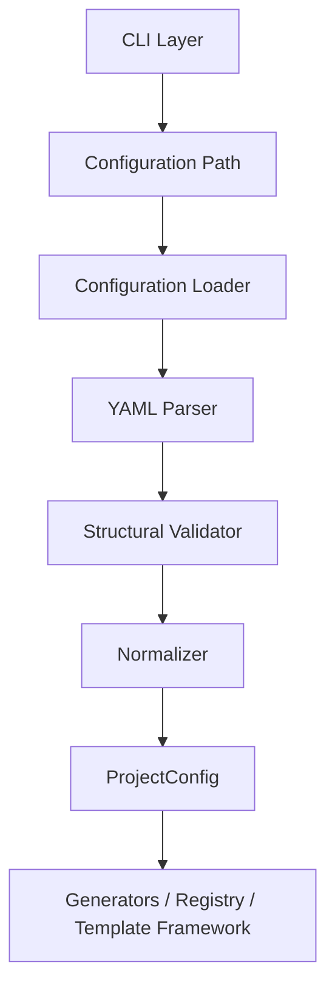
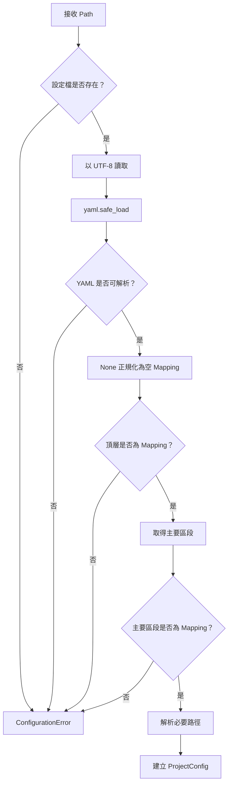

# OpenProjectLab Configuration Framework

> Status: Active
> Scope: Configuration loading, validation, normalization, and path resolution
> Audience: Maintainers, contributors, framework developers

OpenProjectLab（OPL）的 Configuration Framework 負責將 YAML 設定檔轉換成可被 CLI、Generator、Template Framework 與其他核心元件使用的結構化設定物件。

Configuration Framework 的核心目標是：

* 集中管理設定載入
* 提早發現格式錯誤
* 建立一致的路徑解析規則
* 避免各元件自行解讀 YAML
* 提供可測試且可演進的設定契約

本文件說明 Configuration Framework 的架構責任、資料流程、驗證層級、錯誤模型與未來擴充方向。

---

## 1. Framework Responsibilities

Configuration Framework 負責：

* 接收設定檔路徑
* 確認設定檔存在
* 使用 UTF-8 讀取內容
* 使用安全 YAML Loader
* 驗證頂層資料型別
* 驗證主要設定區段
* 套用缺省 Mapping
* 建立 `ProjectConfig`
* 正規化必要路徑
* 將設定提供給其他 Framework

Configuration Framework 不應負責：

* 執行 Generator
* 解析 CLI 子命令
* 渲染 Template
* 建立輸出檔案
* 驗證所有 Generator 專屬欄位
* 決定業務流程
* 自動修正使用者設定

---

## 2. Current Configuration Model

目前設定物件概念上由以下四個主要區段組成：

```python
@dataclass(slots=True)
class ProjectConfig:
    project: dict[str, Any]
    paths: dict[str, Any]
    generator: dict[str, Any]
    plugins: dict[str, Any]
```

對應 YAML：

```yaml
project: {}
paths: {}
generator: {}
plugins: {}
```

這種結構提供較高彈性，但也代表：

* 欄位名稱不一定會被集中驗證
* Value 型別可能由使用元件自行驗證
* 未知欄位可能被保留
* Schema 仍屬於寬鬆模式

現階段 Configuration Framework 的主要責任，是確保設定檔具備合法且可預期的基本結構。

---

## 3. High-Level Architecture



---

## 4. Configuration Loading Flow

設定載入流程如下：



---

## 5. Loading Boundary

設定只能由明確的 Framework 邊界載入。

建議入口：

```python
config = ProjectConfig.load(config_path)
```

其他元件應接收已建立的設定物件：

```python
generator.run(config)
```

不建議：

```python
class SomeGenerator:
    def run(self):
        config = ProjectConfig.load(Path("config/default.yaml"))
```

原因包括：

* Generator 難以獨立測試
* 設定來源變得隱藏
* 不同 Generator 可能載入不同設定
* 重複執行檔案 I/O
* CLI 指定的 `--config` 可能失效

---

## 6. Dependency Direction

建議依賴方向：

```text
CLI
  ↓
Configuration Framework
  ↓
ProjectConfig
  ↓
Generator / Registry / Template Framework
```

規則：

* Configuration Framework 不依賴 CLI。
* `ProjectConfig` 不應知道目前使用哪個子命令。
* Generator 接收設定，不自行尋找設定。
* Template Framework 不應直接解析 YAML。
* 測試可直接建立 `ProjectConfig`，避免依賴實體檔案。
* CLI 可以選擇設定來源，但不能改變設定語意。

---

## 7. Validation Layers

設定驗證應分層進行。

## 7.1 Syntax Validation

由 YAML Parser 負責。

檢查：

* YAML 語法是否有效
* 縮排是否正確
* 引號是否成對
* Mapping 與 List 是否可解析

錯誤來源：

```text
yaml.YAMLError
```

應轉換為：

```text
ConfigurationError
```

---

## 7.2 Structural Validation

由 Configuration Framework 負責。

檢查：

* 頂層是否為 Mapping
* `project` 是否為 Mapping
* `paths` 是否為 Mapping
* `generator` 是否為 Mapping
* `plugins` 是否為 Mapping

例如：

```yaml
project: OpenProjectLab
```

應被拒絕，因為 `project` 應為 Mapping。

---

## 7.3 Semantic Validation

由最接近使用情境的元件負責。

例如：

* Course Generator 驗證課程名稱
* Week Generator 驗證週次
* Template Framework 驗證 Template Root
* Plugin Loader 驗證 Plugin 設定
* CLI 驗證必要命令參數

Configuration Framework 不應提早驗證所有可能未被使用的欄位。

---

## 7.4 Runtime Validation

由實際執行元件負責。

例如：

* 輸出目錄是否可寫入
* Template 是否存在
* 目標檔案是否已存在
* 是否允許覆寫
* Plugin 是否可載入

這些條件可能在設定載入後才發生變化，因此不能完全由 Loader 保證。

---

## 8. Validation Ownership

建議責任分配如下：

| 驗證內容           | 負責元件                             |
| -------------- | -------------------------------- |
| YAML 語法        | Configuration Loader             |
| 頂層 Mapping     | Configuration Framework          |
| 主要區段 Mapping   | Configuration Framework          |
| CLI 參數         | CLI Layer                        |
| Generator 必要欄位 | 對應 Generator                     |
| Template 路徑存在  | Template Framework               |
| 輸出目錄可寫入        | Generator 或 File System Service  |
| Plugin 相容性     | Plugin Framework                 |
| 設定版本           | 未來 Configuration Migration Layer |

---

## 9. Missing Sections

缺少主要區段時，應使用空 Mapping：

```yaml
project:
  name: Demo
```

概念上應正規化為：

```python
ProjectConfig(
    project={"name": "Demo"},
    paths={},
    generator={},
    plugins={},
)
```

這種行為允許：

* 最小設定檔
* Generator 各自使用必要欄位
* 平順加入新區段
* 保留向後相容性

但缺少區段不等於設定一定完整。

---

## 10. Empty Configuration

空 YAML 檔案通常解析為：

```python
None
```

Loader 可正規化為：

```python
{}
```

例如：

```python
data = yaml.safe_load(text) or {}
```

空設定檔應可建立空的 `ProjectConfig`，但具體命令是否可執行，仍取決於 Generator 的必要條件。

---

## 11. Path Resolution

路徑解析是 Configuration Framework 最重要的責任之一。

必須明確定義：

* 相對路徑的基準
* 絕對路徑的保留方式
* 路徑正規化時機
* 路徑是否需要存在
* Windows 與 POSIX 行為

---

## 12. Recommended Path Resolution Policy

建議採用以下規則：

### Absolute Path

如果設定值已是絕對路徑：

```yaml
paths:
  template_root: F:/OpenProjectLab/templates
```

保留其絕對語意，不再與其他路徑拼接。

### Relative Path

如果設定值是相對路徑：

```yaml
paths:
  template_root: ../templates
```

應以設定檔所在目錄為基準。

例如：

```text
F:\OpenProjectLab\config\default.yaml
```

相對路徑：

```text
../templates
```

解析結果：

```text
F:\OpenProjectLab\templates
```

這種策略的優點：

* 設定檔可以被移動或獨立使用
* 行為不依賴目前工作目錄
* CLI 從不同目錄執行時結果一致
* 測試容易建立隔離 Fixture

正式採用前，必須與目前測試及程式碼一致。

---

## 13. Current Working Directory Risk

不建議直接使用：

```python
Path(value).resolve()
```

如果沒有指定基準，它可能依賴目前工作目錄。

例如，使用者分別從：

```text
F:\OpenProjectLab
```

與：

```text
F:\OpenProjectLab\docs
```

執行相同命令，可能得到不同結果。

建議：

```python
base_dir = config_path.parent
resolved = (base_dir / value).resolve()
```

前提是相對路徑規則確定以設定檔所在目錄為基準。

---

## 14. Path Normalization Timing

路徑可以在不同階段正規化。

### Load-time Normalization

在 `ProjectConfig.load()` 時轉成絕對路徑。

優點：

* 所有下游元件取得一致路徑
* 測試與除錯簡單
* 不會重複解析

缺點：

* 原始設定值可能丟失
* 序列化時不容易保留原始格式
* 不同元件可能需要不同基準

### Use-time Normalization

保留原始字串，由使用元件解析。

優點：

* 保留原始設定
* 彈性較高

缺點：

* 不同元件可能採用不同規則
* 容易重複實作
* 測試複雜

建議由 Configuration Framework 統一解析核心路徑，避免由各 Generator 自行決定。

---

## 15. Raw and Resolved Values

未來可考慮同時保留：

```python
config.paths["template_root"]
```

以及：

```python
config.resolved_template_root
```

或使用專門的 Path Configuration：

```python
@dataclass(slots=True)
class PathConfig:
    template_root: Path
    output_root: Path
```

這可避免：

* Dictionary 中混合 String 與 Path
* 重複解析
* 使用者不清楚資料型別
* 路徑行為分散

此設計屬於未來演進方向。

---

## 16. Error Model

Configuration Framework 應使用專用例外：

```text
ConfigurationError
```

建議錯誤分類：

* 找不到設定檔
* 無法讀取檔案
* YAML 格式錯誤
* 頂層型別錯誤
* 區段型別錯誤
* 路徑格式錯誤
* 設定版本不支援
* 必要欄位缺失

目前若只使用單一 `ConfigurationError`，錯誤訊息必須包含足夠上下文。

---

## 17. Error Message Requirements

錯誤訊息應包含：

* 發生問題的設定檔
* 區段或欄位名稱
* 預期格式
* 實際錯誤
* 可採取的修正方向

例如：

```text
設定區段 `paths` 必須是 Mapping：config/default.yaml
```

較不理想：

```text
Invalid config
```

---

## 18. Exception Chaining

底層錯誤應透過 Exception Chaining 保留。

例如：

```python
try:
    data = yaml.safe_load(text)
except yaml.YAMLError as exc:
    raise ConfigurationError(
        f"YAML 格式錯誤：{path}"
    ) from exc
```

這可以同時提供：

* 使用者可理解的高階錯誤
* 開發者可追蹤的原始原因

---

## 19. Unknown Fields

目前以 Dictionary 儲存設定時，未知欄位通常會被保留：

```yaml
project:
  unknown_field: value
```

這是一種寬鬆 Schema。

優點：

* 易於擴充
* Generator 可加入自己的欄位
* 向前相容性較高

缺點：

* 拼字錯誤不易被發現
* 文件與實作可能分離
* Schema 不夠清楚

短期內可維持寬鬆模式，但正式公開欄位應由 Reference 文件定義。

---

## 20. Strict Schema Evolution

未來若引入嚴格 Schema，可選擇：

* Dataclass
* TypedDict
* Pydantic
* JSON Schema
* 自訂 Validator

嚴格 Schema 應提供：

* 欄位型別
* 必填與選填規則
* 預設值
* 未知欄位策略
* 錯誤位置
* 設定版本
* Migration 支援

任何 Schema 技術選擇都應先評估：

* Python 版本相容性
* 第三方依賴成本
* 錯誤訊息品質
* Plugin 擴充需求
* 效能
* 維護成本

重大選擇應以 ADR 記錄。

---

## 21. Configuration Versioning

未來建議加入：

```yaml
config_version: 1
```

載入流程可演進為：

```text
Load YAML
  ↓
Read config_version
  ↓
Validate supported version
  ↓
Apply migration if needed
  ↓
Create current ProjectConfig
```

這可支援：

* Schema 演進
* 向後相容
* 清楚的錯誤訊息
* Upgrade Framework
* 自動 Migration

目前若尚未實作，不得在正式行為中假設其存在。

---

## 22. Configuration Merge

未來可能需要：

* `default.yaml`
* `development.yaml`
* `test.yaml`
* 使用者本機設定
* 環境變數覆寫
* CLI 參數覆寫

可能的優先順序：

```text
Built-in defaults
  ↓
Default config
  ↓
Environment-specific config
  ↓
Environment variables
  ↓
CLI arguments
```

但設定合併會引入複雜問題：

* Nested Mapping 如何合併
* List 是覆寫還是追加
* `null` 代表刪除還是空值
* 路徑以哪一份設定檔為基準
* Sensitive values 如何處理

在正式加入 Configuration Merge 前，必須完成 Architecture Design 與 ADR。

---

## 23. Environment Variables

未來可能支援：

```text
OPL_CONFIG
OPL_TEMPLATE_ROOT
OPL_OUTPUT_ROOT
```

環境變數適合：

* CI
* Container
* Secret
* 環境專用路徑

但不應讓環境變數默默覆寫設定，而沒有清楚規則。

建議：

* 明確列出支援的環境變數
* 記錄優先順序
* 提供除錯輸出
* 避免在日誌顯示敏感值

---

## 24. Immutability

目前 `ProjectConfig` 內部使用可變 Dictionary。

這代表下游元件可能修改設定：

```python
config.paths["template_root"] = "other"
```

風險：

* 不同元件看到不同狀態
* 測試難以追蹤
* 執行流程可能產生隱藏副作用

未來可考慮：

* Frozen Dataclass
* MappingProxyType
* Typed immutable settings
* Copy-on-write

現階段應約定：

> 下游元件只讀取設定，不應修改共用 `ProjectConfig`。

---

## 25. Serialization

若未來需要輸出有效設定，可提供：

```text
opl config show
opl config validate
opl config resolve
```

可能用途：

* 顯示實際使用設定
* 顯示解析後路徑
* 驗證設定但不執行 Generator
* 支援除錯
* 支援 CI

輸出時應區分：

* 原始設定
* 套用預設值後設定
* 完整解析後設定
* 敏感值遮罩後設定

這些命令目前屬於未來規劃。

---

## 26. Testing Strategy

Configuration Framework 的測試應集中於純粹且可決定的行為。

### Unit Tests

至少測試：

* 有效設定
* 找不到檔案
* 無效 YAML
* 空設定檔
* 頂層非 Mapping
* 主要區段非 Mapping
* 缺少區段
* 相對路徑
* 絕對路徑
* UTF-8

### Integration Tests

至少測試：

* CLI 使用預設設定
* CLI 使用指定設定
* Generator 接收設定
* 錯誤轉換為 CLI Exit Code
* Repository 根目錄之外執行時的路徑行為

---

## 27. Test Isolation

設定測試應使用：

```python
tmp_path
```

例如：

```python
def test_relative_template_root(tmp_path):
    config_file = tmp_path / "config.yaml"
    config_file.write_text(
        """
paths:
  template_root: templates
""",
        encoding="utf-8",
    )

    config = ProjectConfig.load(config_file)

    assert config.paths["template_root"] == (
        tmp_path / "templates"
    ).resolve()
```

實際 Assertion 應依目前正式路徑策略調整。

測試不應依賴：

```text
F:\OpenProjectLab
```

或目前 Shell 工作目錄。

---

## 28. Compatibility Strategy

Configuration Schema 應遵循：

* 新增選填欄位通常為相容變更
* 新增必填欄位可能為破壞性變更
* 更名欄位為破壞性變更
* 修改型別為破壞性變更
* 修改路徑基準為高風險變更
* 修改預設值需要文件與 Changelog
* 移除欄位需要 Migration 說明

v0.x 階段仍可調整，但所有行為變更都應明確記錄。

---

## 29. Security Considerations

Configuration Framework 必須：

* 使用 `yaml.safe_load`
* 使用 UTF-8
* 不執行設定檔中的程式碼
* 不允許任意 Python 物件反序列化
* 不在錯誤中輸出 Secret
* 驗證路徑是否超出允許範圍
* 避免路徑遍歷
* 避免動態載入不受信任模組
* 不自動執行設定中指定的 Shell Command

若未來 Plugin 設定允許動態 Import，必須建立更明確的信任邊界。

---

## 30. Observability

未來可加入可選的除錯資訊：

```text
Configuration file:
Resolved template root:
Resolved output root:
Applied defaults:
Ignored fields:
Config version:
```

這些資訊應：

* 僅在 verbose 或 debug 模式顯示
* 不洩漏敏感資訊
* 保持輸出格式穩定
* 可供 CI 與問題診斷使用

---

## 31. Proposed Public Interface

未來 Configuration Framework 可演進為：

```python
config = ProjectConfig.load(path)

config.project.name
config.paths.template_root
config.paths.output_root
config.generator.overwrite
```

相較於：

```python
config.project.get("name")
config.paths.get("template_root")
```

Typed Interface 的優點：

* IDE 補全
* 靜態型別檢查
* 清楚 Schema
* 集中預設值
* 更好的錯誤訊息

缺點：

* Plugin 動態欄位較難處理
* Migration 成本增加
* 公開 API 更難變更

應先完成 Schema Design 再採用。

---

## 32. Framework Extension Rules

新增設定能力時，必須確認：

* 它是否為全域設定？
* 是否只屬於單一 Generator？
* 是否需要放入 `project`、`paths`、`generator` 或 `plugins`？
* 是否需要新增獨立區段？
* 預設值是什麼？
* 型別是什麼？
* 未提供時行為為何？
* 是否影響相容性？
* 是否需要 Migration？
* 是否需要 ADR？

應避免將所有功能都塞入單一 `generator` Mapping。

---

## 33. Configuration Change Workflow

設定變更應遵循：

```text
Requirement
  ↓
Schema Design
  ↓
Architecture Update
  ↓
Reference Update
  ↓
Loader / Validator Implementation
  ↓
Unit Tests
  ↓
CLI / Generator Integration Tests
  ↓
Migration Review
  ↓
Code Review
```

必須同步更新：

* `docs/architecture/configuration-framework.md`
* `docs/reference/configuration.md`
* `config/default.yaml`
* `generator/core/config.py`
* `tests/core/test_config.py`
* `CHANGELOG.md`（如適用）

---

## 34. Current Limitations

目前 Configuration Framework 的已知限制可能包括：

* 主要區段仍是無型別 Dictionary
* 未知欄位可能不會被拒絕
* Generator 專屬 Schema 尚未標準化
* 設定版本尚未實作
* 設定合併尚未實作
* 環境變數覆寫規則尚未定義
* 敏感設定管理尚未整合
* Path 型別可能仍以 String 表示
* Config Validation CLI 尚未實作

這些限制應透過 Roadmap、Issue 與 ADR 追蹤。

---

## 35. Architecture Review Checklist

修改 Configuration Framework 時，請確認：

* [ ] Loader 的責任保持集中。
* [ ] Generator 沒有自行載入設定檔。
* [ ] YAML 使用 `safe_load`。
* [ ] 頂層資料型別有驗證。
* [ ] 主要區段型別有驗證。
* [ ] 路徑解析基準明確。
* [ ] 相對與絕對路徑行為一致。
* [ ] 錯誤使用 `ConfigurationError`。
* [ ] 原始例外透過 Chaining 保留。
* [ ] Semantic Validation 位於正確元件。
* [ ] 新欄位的型別與預設值有文件。
* [ ] 相容性影響已評估。
* [ ] 必要時已新增 ADR。
* [ ] Reference 文件已同步。
* [ ] 單元與整合測試已更新。
* [ ] `pre-commit run --all-files` 通過。
* [ ] `python -m pytest` 通過。

---

## 36. Related Documents

* [Architecture Overview](overview.md)
* [Generator Framework](generator-framework.md)
* [Template Framework](template-framework.md)
* [Generator Registry](registry.md)
* [Configuration Reference](../reference/configuration.md)
* [CLI Reference](../reference/cli.md)
* [Development Workflow](../development/development-workflow.md)
* [Code Review Checklist](../development/code-review-checklist.md)

---

> **Configuration Framework 的核心價值，不是讓 YAML 可以被讀取，而是讓設定行為具備一致、透明、可測試且可演進的契約。**
