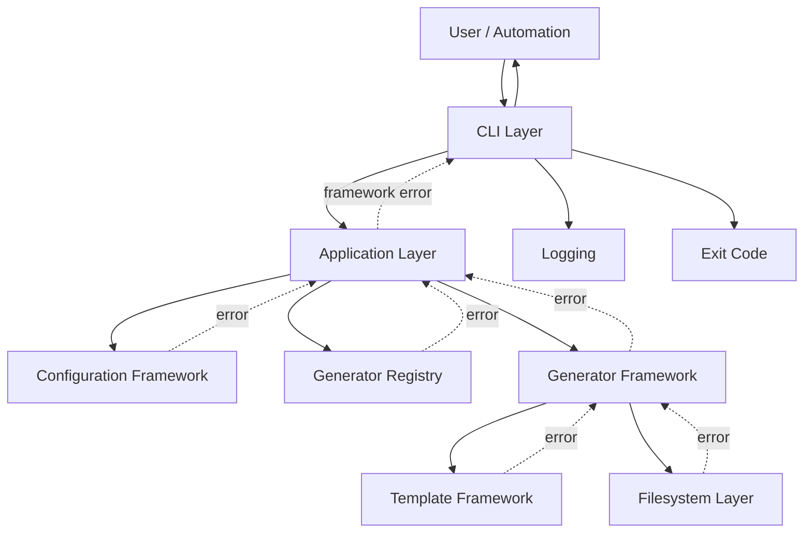

# OpenProjectLab Error Handling Architecture

> Status: Active
> Scope: Exception hierarchy, error ownership, propagation, CLI mapping, diagnostics, testing, and recovery
> Audience: Maintainers, contributors, Generator developers, CLI developers

OpenProjectLab（OPL）的 Error Handling Architecture 定義錯誤如何被：

* 偵測
* 分類
* 包裝
* 傳遞
* 記錄
* 顯示
* 測試
* 轉換成 CLI Exit Code

錯誤處理不是單純使用 `try/except`。

它必須建立清楚的責任邊界，讓每個 Layer 都知道：

* 哪些錯誤由自己產生
* 哪些錯誤應向上傳遞
* 哪些底層例外應轉換
* 哪些訊息可以顯示給使用者
* 哪些技術細節只能放入 Log 或 Traceback
* 執行失敗後是否需要清理或復原

本文件定義 OPL 的錯誤分類、例外階層、錯誤傳播、CLI 顯示規則、Exit Code、Logging、安全性與測試策略。

---

## 1. Goals

Error Handling Architecture 的核心目標包括：

* 提供一致的 Framework Exception
* 避免底層例外直接洩漏到 CLI
* 讓錯誤訊息具體且可操作
* 保留原始例外與 Traceback
* 明確定義每個 Layer 的錯誤責任
* 為 CLI、SDK、GUI 與 Automation 提供一致語意
* 區分使用者錯誤與系統錯誤
* 支援穩定 Exit Code
* 避免失敗後留下不可理解的部分輸出
* 讓錯誤流程可以自動測試

---

## 2. Non-Goals

本架構不應：

* 將所有錯誤轉成同一個模糊訊息
* 捕捉所有 `Exception` 後靜默忽略
* 將完整 Traceback 預設顯示給一般使用者
* 使用錯誤訊息文字作為程式控制流程
* 直接將 `KeyError`、`OSError` 或 Template Engine 例外視為公開契約
* 讓每個模組自行發明不一致的 Exit Code
* 在底層元件中直接呼叫 `sys.exit()`
* 將 Secret、Token 或敏感路徑寫入錯誤訊息
* 讓失敗狀態與成功結果混淆

---

## 3. High-Level Architecture



---

## 4. Error Flow

建議錯誤傳播流程：

```text
Low-level operation fails
  ↓
Closest framework layer identifies context
  ↓
Convert to framework-specific exception
  ↓
Preserve original exception with chaining
  ↓
Application layer propagates or coordinates recovery
  ↓
CLI maps exception to message and exit code
  ↓
Technical details go to debug log or traceback
```

核心原則：

> 錯誤應由最接近問題來源、且擁有足夠語意的 Layer 進行分類。

---

## 5. Error Categories

OPL 錯誤可分成以下類別。

### 5.1 User Input Errors

使用者輸入無效，例如：

* CLI 參數缺失
* 週次小於 1
* Generator 名稱不存在
* 設定值格式不正確
* 目標路徑不合法
* 不允許的覆寫要求

此類錯誤通常：

* 可由使用者修正
* 不需要顯示完整 Traceback
* 應提供具體修正建議
* 使用穩定的非零 Exit Code

---

### 5.2 Configuration Errors

設定檔相關錯誤，例如：

* 找不到設定檔
* YAML 格式錯誤
* Section 型別錯誤
* 必要欄位缺失
* 路徑無效
* 不支援的設定版本

此類錯誤應指出：

* 設定檔位置
* 欄位名稱
* 問題內容
* 修正方式

---

### 5.3 Registry Errors

Registry 相關錯誤，例如：

* Generator 名稱重複
* Generator 名稱不合法
* 找不到 Generator
* 註冊物件不符合契約

---

### 5.4 Generator Errors

Generator 執行錯誤，例如：

* Request 驗證失敗
* 無法建立 Generation Plan
* 輸出衝突
* 必要資源缺失
* 產出驗證失敗
* 執行只完成一部分

---

### 5.5 Template Errors

Template 相關錯誤，例如：

* Template Root 不存在
* Template 找不到
* Template 路徑逃逸
* Context 缺少變數
* Template 語法錯誤
* 渲染失敗

---

### 5.6 Filesystem Errors

檔案系統相關錯誤，例如：

* 無法建立目錄
* 權限不足
* 檔案已存在
* 無法讀取或寫入
* 路徑過長
* 磁碟空間不足
* Symlink Escape
* 非法檔名

---

### 5.7 Internal Errors

程式缺陷或未預期狀態，例如：

* 不可能的狀態
* 未處理的型別
* `AssertionError`
* 程式不變量被破壞
* 未預期的第三方 Library 錯誤

此類錯誤：

* 不應被包裝成使用者輸入錯誤
* 應保留完整 Traceback
* CLI 可顯示一般錯誤訊息
* Debug 模式應顯示技術資訊

---

## 6. Proposed Exception Hierarchy

建議例外階層：

```text
OpenProjectLabError
├── ConfigurationError
│   ├── ConfigurationFileNotFoundError
│   ├── ConfigurationSyntaxError
│   ├── ConfigurationStructureError
│   ├── ConfigurationValueError
│   └── ConfigurationVersionError
├── RegistryError
│   ├── InvalidGeneratorNameError
│   ├── DuplicateGeneratorError
│   └── GeneratorNotFoundError
├── GeneratorError
│   ├── GeneratorValidationError
│   ├── GenerationPlanError
│   ├── OutputConflictError
│   ├── GenerationAbortedError
│   └── OutputValidationError
├── TemplateError
│   ├── TemplateRootError
│   ├── TemplateNotFoundError
│   ├── TemplatePathError
│   ├── TemplateContextError
│   ├── TemplateSyntaxError
│   └── TemplateRenderError
└── FilesystemError
    ├── DirectoryCreationError
    ├── FileReadError
    ├── FileWriteError
    ├── PathContainmentError
    └── AtomicWriteError
```

目前實作可能尚未包含完整階層。

第一階段可先維持較少類別，但必須保留清楚的上層分類。

---

## 7. Root Exception

所有預期中的 OPL Framework 錯誤應繼承：

```python
class OpenProjectLabError(Exception):
    """Base exception for expected OpenProjectLab failures."""
```

CLI 可以使用：

```python
except OpenProjectLabError as exc:
    ...
```

捕捉所有預期 Framework 錯誤。

不應讓所有 Python 例外都繼承或轉換成這個類別。

未預期錯誤仍應保持可被識別。

---

## 8. Expected vs Unexpected Errors

### Expected Errors

系統已知且可以合理描述的失敗。

例如：

```python
raise GeneratorNotFoundError("找不到 Generator：lesson")
```

特性：

* 使用 Framework Exception
* CLI 顯示簡潔訊息
* 通常不顯示 Traceback
* 有穩定 Exit Code
* 有錯誤流程測試

### Unexpected Errors

程式缺陷或未預期環境錯誤。

例如：

```python
TypeError
AssertionError
RuntimeError
```

特性：

* 不應隨意轉換成使用者錯誤
* 應保留完整 Traceback
* CLI 顯示一般內部錯誤
* Debug 模式顯示細節
* 應建立 Regression Test

---

## 9. Exception Ownership

錯誤應由擁有該語意的 Layer 產生。

| 問題                  | 負責 Layer                      |
| ------------------- | ----------------------------- |
| CLI Option 格式錯誤     | CLI                           |
| 設定檔不存在              | Configuration Framework       |
| YAML 無法解析           | Configuration Framework       |
| Generator 不存在       | Registry                      |
| Request 無效          | Generator                     |
| Template 不存在        | Template Framework            |
| Template Context 缺失 | Template Framework            |
| 目標檔案衝突              | Generator 或 Filesystem Policy |
| 寫入失敗                | Filesystem Layer              |
| Exit Code 與使用者輸出    | CLI                           |
| Rollback 決策         | Generator 或 Application Layer |

---

## 10. Layer Boundaries

### CLI Layer

負責：

* 解析命令
* 捕捉 Framework Exception
* 顯示使用者訊息
* 選擇 Exit Code
* 控制是否顯示 Traceback

不負責：

* 自行修正設定
* 將所有錯誤轉成 `0`
* 重新實作底層驗證
* 捕捉後忽略錯誤

---

### Configuration Layer

負責：

* 將檔案與 YAML 錯誤轉成 `ConfigurationError`
* 指出設定路徑與欄位
* 保留原始 Parser 例外

不負責：

* 呼叫 `sys.exit()`
* `print()` 錯誤
* 決定 CLI Exit Code

---

### Registry Layer

負責：

* 名稱驗證
* 重複註冊
* 查詢失敗
* 將內部 `KeyError` 轉成 `GeneratorNotFoundError`

---

### Generator Layer

負責：

* Request 驗證
* Generation Plan 錯誤
* 產出衝突
* 執行失敗語意
* 部分成功與清理決策

---

### Template Layer

負責：

* Resolver 錯誤
* Context 錯誤
* Template 語法與渲染錯誤
* 包裝 Template Engine 原生例外

---

### Filesystem Layer

負責：

* 將 `OSError` 轉成具體檔案操作錯誤
* 保留檔案路徑與操作名稱
* 處理 Atomic Write 與清理

---

## 11. Exception Chaining

底層例外應透過 `raise ... from exc` 保留。

例如：

```python
try:
    data = yaml.safe_load(
        path.read_text(encoding="utf-8")
    )
except yaml.YAMLError as exc:
    raise ConfigurationSyntaxError(
        f"YAML 格式錯誤：{path}"
    ) from exc
```

檔案寫入：

```python
try:
    target.write_text(
        content,
        encoding="utf-8",
    )
except OSError as exc:
    raise FileWriteError(
        f"無法寫入檔案：{target}"
    ) from exc
```

Template：

```python
try:
    return template.render(**context)
except TemplateEngineError as exc:
    raise TemplateRenderError(
        f"無法渲染 Template：{template_name}"
    ) from exc
```

---

## 12. Why Exception Chaining Matters

Exception Chaining 可以同時滿足：

### 對使用者

顯示：

```text
無法載入設定檔：config/default.yaml
```

### 對開發者

保留：

```text
yaml.scanner.ScannerError
```

或：

```text
PermissionError
```

### 對測試

可以驗證：

```python
assert isinstance(exc.value.__cause__, yaml.YAMLError)
```

---

## 13. Avoid Broad Exception Catching

不建議：

```python
try:
    ...
except Exception:
    raise GeneratorError("產生失敗")
```

問題：

* 程式 Bug 被偽裝成預期錯誤
* 原始錯誤語意消失
* 測試無法發現真正問題
* `KeyboardInterrupt` 相關處理可能受影響
* 錯誤分類失去價值

建議只捕捉可以合理處理的例外：

```python
except OSError as exc:
    ...
```

```python
except yaml.YAMLError as exc:
    ...
```

```python
except TemplateEngineError as exc:
    ...
```

---

## 14. Top-Level Safety Net

CLI 最外層可以有最後一道未預期錯誤保護：

```python
def main(argv: list[str] | None = None) -> int:
    try:
        return run(argv)
    except OpenProjectLabError as exc:
        print_error(exc)
        return exit_code_for(exc)
    except Exception as exc:
        print_internal_error(exc)
        return 1
```

但最後一個 `except Exception`：

* 不應靜默
* 應保留 Debug Traceback
* 應記錄 Log
* 不應將錯誤偽裝成已知輸入問題

---

## 15. KeyboardInterrupt

使用者按下：

```text
Ctrl+C
```

通常產生：

```python
KeyboardInterrupt
```

CLI 應明確處理：

```python
except KeyboardInterrupt:
    print("操作已取消。", file=sys.stderr)
    return 130
```

不應顯示完整 Traceback 給一般使用者。

如果執行中可能留下部分輸出，Generator 應處理清理或回報已建立項目。

---

## 16. SystemExit

`argparse` 可能拋出：

```python
SystemExit
```

應避免在底層 Unit Test 中難以控制。

可考慮：

* CLI Parser 保持標準 `argparse` 行為
* `main()` 以整數回傳為主要契約
* 測試使用 `pytest.raises(SystemExit)` 或封裝 Parser
* 底層 Framework 不呼叫 `sys.exit()`

只有 CLI Entry Point 可以最終轉換成 Process Exit。

---

## 17. Error Message Design

好的錯誤訊息應回答：

1. 發生什麼事？
2. 發生在哪裡？
3. 為什麼？
4. 使用者可以怎麼修正？

範例：

```text
無法載入設定檔：
F:\OpenProjectLab\config\default.yaml

原因：
`paths` 必須是 Mapping，但目前是 String。

請將 `paths` 改成 YAML Mapping。
```

---

## 18. Error Message Structure

建議格式：

```text
<主要問題>

位置：
<path / field / generator / template>

原因：
<具體原因>

建議：
<可採取的修正方式>
```

簡單錯誤不必強迫使用多段格式，但訊息應保持具體。

---

## 19. Good and Bad Messages

較差：

```text
Invalid configuration.
```

較佳：

```text
設定欄位 `paths.template_root` 無效：
預期為路徑字串，但目前值為 List。
```

較差：

```text
Generation failed.
```

較佳：

```text
Week Generator 無法建立輸出：
目標檔案已存在：courses/java/week-01/README.md
```

較差：

```text
KeyError: course
```

較佳：

```text
找不到 Generator：course-new

可用 Generator：
- bootstrap
- course
- week
```

---

## 20. Message Stability

程式不應依賴完整錯誤文字做控制流程。

不建議：

```python
if str(exc) == "Template not found":
    ...
```

應依賴型別：

```python
except TemplateNotFoundError:
    ...
```

錯誤訊息可為了可讀性調整，而例外類別與 Error Code 才是穩定契約。

---

## 21. Error Codes

未來 SDK 或 JSON Output 可為錯誤提供穩定 Code。

例如：

```text
OPL-CONFIG-001
OPL-REGISTRY-001
OPL-GENERATOR-002
OPL-TEMPLATE-003
OPL-FS-001
```

概念：

```python
class OpenProjectLabError(Exception):
    code = "OPL-UNKNOWN"
```

```python
class GeneratorNotFoundError(RegistryError):
    code = "OPL-REGISTRY-001"
```

用途：

* Automation
* 文件查詢
* 多語系訊息
* 支援系統
* JSON Error Response

目前若尚未有 API 或外部 Automation 需求，可以先不導入完整 Code Catalog。

---

## 22. CLI Exit Codes

建議 Exit Code：

| Exit Code | 意義                      |
| --------: | ----------------------- |
|       `0` | 成功                      |
|       `1` | 未分類或內部錯誤                |
|       `2` | CLI 使用方式錯誤              |
|       `3` | 設定錯誤                    |
|       `4` | Generator 或 Registry 錯誤 |
|       `5` | Template 錯誤             |
|       `6` | Filesystem 或輸出錯誤        |
|     `130` | 使用者中斷                   |

這只是建議契約。

正式採用前應確認目前 CLI 行為與自動化需求。

---

## 23. Exit Code Mapping

概念：

```python
def exit_code_for(
    exc: OpenProjectLabError,
) -> int:
    if isinstance(exc, ConfigurationError):
        return 3

    if isinstance(exc, RegistryError):
        return 4

    if isinstance(exc, GeneratorError):
        return 4

    if isinstance(exc, TemplateError):
        return 5

    if isinstance(exc, FilesystemError):
        return 6

    return 1
```

不應在各個底層 Module 中自行決定 Exit Code。

---

## 24. Error Output Stream

錯誤應寫入：

```python
sys.stderr
```

正常輸出寫入：

```python
sys.stdout
```

例如：

```python
print(
    f"錯誤：{exc}",
    file=sys.stderr,
)
```

這讓 Automation 可以分別處理：

* 正常結果
* 錯誤訊息

測試也可以使用：

```python
captured = capsys.readouterr()
assert captured.err
```

---

## 25. Debug Mode

一般模式：

```text
錯誤：找不到 Template：week/README.md.j2
```

Debug 模式：

* 顯示 Exception Type
* 顯示 Exception Chain
* 顯示 Traceback
* 顯示實際解析路徑
* 顯示相關設定
* 不顯示 Secret

可能的 CLI：

```text
opl --debug week ...
```

目前若尚未實作，不應在 CLI Reference 中宣稱可用。

---

## 26. Logging Strategy

OPL Library Code 應使用：

```python
import logging

logger = logging.getLogger(__name__)
```

不應：

```python
logging.basicConfig(...)
```

在 Library Import 時設定全域 Logging。

Host Application 或 CLI 應決定：

* Log Level
* Handler
* Format
* File Destination
* Console Destination

---

## 27. Logging Levels

建議：

### DEBUG

* 解析後路徑
* Generator 選擇
* Template 名稱
* Generation Plan 項目
* Exception Chain
* Skip 原因

### INFO

* Generation 開始
* Generation 完成
* 建立檔案數量
* 載入設定檔

### WARNING

* 跳過既有檔案
* 使用已棄用設定
* 非致命相容性問題

### ERROR

* 可預期但無法完成的操作
* Framework Exception

### CRITICAL

* 無法維持 Application 基本狀態
* 嚴重內部錯誤

---

## 28. Avoid Duplicate Logging

不應每一層都記錄同一個錯誤。

例如：

```text
Filesystem logs error
Generator logs same error
Application logs same error
CLI logs same error
```

這會產生四次重複訊息。

建議：

* 底層建立具語意例外
* 中間層只在增加重要 Context 時包裝
* 最外層負責最終錯誤 Log
* Debug 模式保留 Exception Chain

---

## 29. Sensitive Information

錯誤訊息與 Log 不應包含：

* API Token
* Password
* SSH Private Key
* Environment Secret
* 完整認證 Header
* Cookie
* 個人資料
* 未經必要的使用者 Home 路徑
* Template Context 中的敏感欄位

例如不應輸出：

```text
Authentication failed with token ghp_xxxxx
```

應輸出：

```text
GitHub authentication failed.
```

---

## 30. Path Privacy

本機 CLI 通常可以顯示相關路徑。

但若錯誤會送到：

* CI Artifact
* Remote Log
* Telemetry
* Web API
* Issue Report

應評估是否遮蔽：

```text
C:\Users\KHWang\
```

可能改成：

```text
<user-home>\
```

目前本機工具可保留必要路徑，但不應顯示無關目錄。

---

## 31. Partial Failure

Generator 可能已建立部分檔案後才失敗。

必須明確定義：

* 是否回滾
* 是否保留成功輸出
* 是否回報已建立檔案
* 是否可安全重試
* 是否需要 Manual Cleanup

不應只顯示：

```text
Generation failed.
```

而不說明已建立哪些內容。

---

## 32. Transactional Generation

理想流程：

```text
Validate
  ↓
Build complete plan
  ↓
Render in memory or temporary location
  ↓
Validate outputs
  ↓
Commit outputs
```

失敗時：

```text
Rollback temporary outputs
```

若目前尚未支援完整 Transaction，至少應：

* 儘量在寫入前完成驗證
* 追蹤已建立檔案
* 錯誤時說明部分結果
* 避免留下暫存檔
* 支援安全重試

---

## 33. Recovery Guidance

錯誤訊息應在適當情況下提供建議。

例如：

### File Exists

```text
目標檔案已存在。
請改用新的輸出目錄，或啟用明確的覆寫選項。
```

### Missing Template

```text
請確認 `paths.template_root` 指向正確目錄，
並確認 Template `week/README.md.j2` 存在。
```

### Invalid YAML

```text
請檢查錯誤行附近的縮排、冒號與引號。
```

Recovery Guidance 不應猜測錯誤原因。

---

## 34. Retry Policy

本機 Generator 大多數錯誤不應自動重試。

不適合重試：

* 無效設定
* Template 缺失
* 輸出衝突
* 無效 Request
* 路徑逃逸

可能適合未來重試：

* 暫時性網路錯誤
* 遠端服務限流
* 暫時檔案鎖定
* 遠端儲存短暫失敗

若導入 Retry，必須定義：

* 最大次數
* Backoff
* Idempotency
* 可重試例外
* Log
* Cancellation

---

## 35. Assertions

`assert` 適合檢查程式內部不變量。

例如：

```python
assert plan.files
```

但不應用於使用者輸入驗證：

```python
assert request.week_number > 0
```

因為：

* `assert` 可被最佳化模式移除
* 錯誤類型不適合使用者
* 訊息不夠具體

應使用：

```python
if request.week_number < 1:
    raise GeneratorValidationError(
        "week_number 必須大於或等於 1"
    )
```

---

## 36. Validation Errors

驗證錯誤應盡可能一次提供高價值資訊。

單一錯誤模式：

```text
`week_number` 必須大於或等於 1。
```

多欄位設定驗證未來可考慮收集：

```text
設定檔包含 3 個錯誤：
- `project.name` 不可為空
- `paths.template_root` 不存在
- `plugins` 必須是 Mapping
```

但聚合錯誤需保持：

* 順序穩定
* 資料結構明確
* 不重複
* 容易測試

---

## 37. Multi-Error Model

未來可建立：

```python
@dataclass(frozen=True, slots=True)
class ValidationIssue:
    field: str
    message: str
```

```python
class ConfigurationValidationError(
    ConfigurationError
):
    def __init__(
        self,
        issues: tuple[ValidationIssue, ...],
    ) -> None:
        self.issues = issues
        super().__init__(
            self._format_message()
        )
```

這適合：

* Configuration Validation
* Plugin Manifest Validation
* Generation Plan Validation

現階段若驗證規則不多，可以先保持簡單。

---

## 38. Third-Party Exceptions

第三方 Library 例外不應直接成為 Public OPL Contract。

例如：

```python
jinja2.TemplateError
yaml.YAMLError
OSError
```

應在適當邊界轉換。

但不要過度包裝。

如果第三方錯誤已無法增加 OPL 語意，應保留原例外或只在最外層處理。

---

## 39. Plugin Errors

未來 Plugin Framework 可能需要：

```text
PluginError
├── PluginManifestError
├── PluginCompatibilityError
├── PluginLoadError
├── PluginRegistrationError
└── PluginExecutionError
```

Plugin 錯誤應區分：

* Plugin 本身無效
* 與 OPL 版本不相容
* Import 失敗
* 註冊衝突
* Generator 執行失敗

Registry 不應承擔 Plugin Loader 的所有錯誤責任。

---

## 40. SDK Error Contract

SDK 使用者應可捕捉穩定的上層例外：

```python
try:
    result = application.generate(request)
except ConfigurationError:
    ...
except GeneratorError:
    ...
except OpenProjectLabError:
    ...
```

不應要求 SDK 使用者理解：

* CLI Exit Code
* `argparse`
* Jinja2 原生例外
* Internal Registry Dictionary
* Filesystem Helper 細節

---

## 41. JSON Error Representation

未來 API 或 Automation 可使用：

```json
{
  "error": {
    "code": "OPL-TEMPLATE-001",
    "type": "TemplateNotFoundError",
    "message": "找不到 Template：week/README.md.j2",
    "details": {
      "template": "week/README.md.j2"
    }
  }
}
```

不應預設包含：

```json
{
  "traceback": "..."
}
```

Traceback 只能在安全的 Debug 環境提供。

---

## 42. Error Object Metadata

未來 Framework Exception 可保存結構化資訊：

```python
class TemplateNotFoundError(TemplateError):
    def __init__(
        self,
        template_name: str,
        template_root: Path,
    ) -> None:
        self.template_name = template_name
        self.template_root = template_root

        super().__init__(
            f"找不到 Template：{template_name}"
        )
```

這比從文字重新解析資料可靠。

---

## 43. Localization

目前 OPL 文件與 CLI 主要使用繁體中文。

若未來支援多語系：

* Exception 保存結構化 Code 與 Metadata
* CLI 負責翻譯訊息
* 不依賴完整英文或中文文字做判斷
* Log 可以保留技術語言
* 文件應標示語系

過早將每個 Exception 直接綁定多語系 Framework 會增加複雜度。

可先保持單一語系與穩定 Error Code。

---

## 44. Testing Strategy

Error Handling 測試應包含：

* Exception Hierarchy Tests
* Exception Chaining Tests
* Message Tests
* CLI Exit Code Tests
* `stderr` Tests
* Unexpected Error Tests
* Cleanup Tests
* Security Redaction Tests
* Integration Tests

---

## 45. Exception Hierarchy Test

```python
def test_configuration_error_is_framework_error():
    assert issubclass(
        ConfigurationError,
        OpenProjectLabError,
    )
```

```python
def test_template_not_found_is_template_error():
    assert issubclass(
        TemplateNotFoundError,
        TemplateError,
    )
```

---

## 46. Exception Chaining Test

```python
def test_invalid_yaml_preserves_original_error(
    tmp_path,
):
    path = tmp_path / "config.yaml"
    path.write_text(
        "project: [",
        encoding="utf-8",
    )

    with pytest.raises(
        ConfigurationSyntaxError
    ) as exc_info:
        ProjectConfig.load(path)

    assert exc_info.value.__cause__ is not None
```

---

## 47. Error Message Test

不要驗證整段可能調整的文字，除非它是正式契約。

建議驗證重要內容：

```python
assert "config.yaml" in str(exc_info.value)
assert "YAML" in str(exc_info.value)
```

正式 Error Code 存在後，優先驗證：

```python
assert exc_info.value.code == "OPL-CONFIG-002"
```

---

## 48. CLI Error Test

```python
def test_cli_returns_nonzero_for_missing_config(
    capsys,
):
    exit_code = main([
        "--config",
        "missing.yaml",
        "list",
    ])

    captured = capsys.readouterr()

    assert exit_code != 0
    assert captured.out == ""
    assert "找不到設定檔" in captured.err
```

---

## 49. Exit Code Test

```python
@pytest.mark.parametrize(
    ("error", "expected"),
    [
        (ConfigurationError("x"), 3),
        (RegistryError("x"), 4),
        (TemplateError("x"), 5),
        (FilesystemError("x"), 6),
    ],
)
def test_exit_code_mapping(
    error,
    expected,
):
    assert exit_code_for(error) == expected
```

---

## 50. Unexpected Error Test

CLI 應對未預期錯誤回傳一般失敗：

```python
def test_cli_handles_unexpected_error(
    monkeypatch,
    capsys,
):
    def fail(*args, **kwargs):
        raise RuntimeError("boom")

    monkeypatch.setattr(
        target_module,
        "run_application",
        fail,
    )

    exit_code = main(["list"])

    captured = capsys.readouterr()

    assert exit_code == 1
    assert "內部錯誤" in captured.err
```

Debug 模式則應有額外測試。

---

## 51. No Silent Failure Test

不應出現：

```python
try:
    ...
except OSError:
    pass
```

可以透過 Code Review、Lint 或針對特定流程測試避免。

關鍵操作失敗後：

* 必須拋出例外
* 或回傳明確 Result
* 或記錄可驗證 Warning

不能直接忽略。

---

## 52. Cleanup Test

```python
def test_failed_generation_removes_temporary_files(
    tmp_path,
):
    ...
```

驗證：

* 暫存檔被移除
* 正式輸出未被部分覆寫
* Result 或 Exception 指出失敗
* 重試後可成功

---

## 53. Sensitive Data Test

```python
def test_error_does_not_expose_secret():
    secret = "super-secret-token"

    error = build_authentication_error(secret)

    assert secret not in str(error)
```

未來 Log Formatter 與 JSON Error 也應測試。

---

## 54. Integration Test Matrix

| 情境            | 預期例外                             |  CLI Exit |
| ------------- | -------------------------------- | --------: |
| 設定檔不存在        | `ConfigurationFileNotFoundError` |       `3` |
| YAML 無效       | `ConfigurationSyntaxError`       |       `3` |
| Generator 不存在 | `GeneratorNotFoundError`         |       `4` |
| Template 不存在  | `TemplateNotFoundError`          |       `5` |
| 輸出衝突          | `OutputConflictError`            | `4` 或 `6` |
| 寫入權限不足        | `FileWriteError`                 |       `6` |
| 使用者中斷         | `KeyboardInterrupt`              |     `130` |
| 未預期 Bug       | 原始 Exception                     |       `1` |

正式 Exit Code 應由測試固定。

---

## 55. Error Documentation

每個公開錯誤應記錄：

* 類別名稱
* 所屬父類別
* 發生條件
* 可用 Metadata
* CLI Exit Code
* 修正方式
* 是否可重試
* 是否可能產生部分輸出

未來可建立：

```text
docs/reference/errors.md
```

---

## 56. Adding a New Exception

新增例外前回答：

* 是否已有適合的父類別？
* 呼叫者真的需要區分嗎？
* 是否會成為 Public SDK Contract？
* 會對應不同 Exit Code 嗎？
* 是否需要結構化 Metadata？
* 是否有 Recovery Guidance？
* 是否需要文件與測試？

不要為每一個錯誤字串建立新 Class。

例外類別應代表可被程式區分的語意。

---

## 57. Changing an Exception

變更前確認：

* 是否更改父類別？
* 是否影響 `except` 行為？
* 是否更改 Error Code？
* 是否改變 CLI Exit Code？
* 是否移除 Metadata？
* 是否影響 SDK 相容性？
* 是否需要 Deprecation？
* 是否需要 Migration Guide？

將例外移到不同階層可能是破壞性變更。

---

## 58. Error Handling Implementation Plan

建議分階段實作。

### Phase 1：Base Hierarchy

建立：

```text
OpenProjectLabError
ConfigurationError
RegistryError
GeneratorError
TemplateError
FilesystemError
```

### Phase 2：CLI Mapping

集中建立：

* Error Formatter
* Exit Code Mapping
* `stderr` Output
* KeyboardInterrupt Handling

### Phase 3：Boundary Conversion

在：

* Configuration
* Registry
* Template
* Filesystem

將底層例外轉換為 Framework Exception。

### Phase 4：Structured Metadata

為重要例外加入：

* Path
* Field
* Generator Name
* Template Name
* Error Code

### Phase 5：Recovery and Atomicity

建立：

* Generation Plan
* Temporary Write
* Cleanup
* Partial Failure Reporting

### Phase 6：SDK and JSON Contract

提供：

* Stable Error Codes
* Serialization
* Public Error Reference
* Compatibility Tests

---

## 59. Proposed Directory Structure

```text
generator/
├── core/
│   ├── exceptions.py
│   ├── error_codes.py
│   └── error_formatting.py
├── cli/
│   ├── main.py
│   └── errors.py
├── template/
├── generators/
└── filesystem/
```

實際目錄可以不同，但責任應分離：

* Exception Definition
* CLI Formatting
* Exit Code Mapping
* Framework Logic

---

## 60. Error Handling Review Checklist

### Architecture

* [ ] 錯誤由正確 Layer 擁有。
* [ ] 底層元件不呼叫 `sys.exit()`。
* [ ] CLI 不重新實作底層驗證。
* [ ] Framework Exception 階層清楚。
* [ ] 預期與未預期錯誤已區分。
* [ ] Public SDK 只暴露穩定例外。
* [ ] 錯誤處理沒有造成反向依賴。

### Exception Design

* [ ] 新例外具有明確語意。
* [ ] 父類別正確。
* [ ] 沒有使用錯誤文字作控制流程。
* [ ] 原始例外透過 Chaining 保留。
* [ ] 不必要的底層例外沒有洩漏。
* [ ] Metadata 使用結構化欄位。
* [ ] 例外不包含敏感資料。

### Messages

* [ ] 訊息指出發生什麼事。
* [ ] 訊息指出相關位置。
* [ ] 訊息包含具體原因。
* [ ] 適當時提供修正建議。
* [ ] 沒有模糊的「Operation failed」。
* [ ] 沒有暴露 Secret。
* [ ] 一般模式不顯示完整 Traceback。

### CLI

* [ ] 錯誤輸出到 `stderr`。
* [ ] 正常輸出保留在 `stdout`。
* [ ] Exit Code 穩定。
* [ ] `KeyboardInterrupt` 回傳適當狀態。
* [ ] 未預期錯誤回傳非零。
* [ ] Debug 模式與一般模式有明確差異。
* [ ] 沒有捕捉後回傳成功。

### Logging

* [ ] 使用標準 `logging`。
* [ ] Library 沒有呼叫 `basicConfig()`。
* [ ] 沒有重複記錄同一錯誤。
* [ ] Log Level 使用正確。
* [ ] Traceback 僅在適當層記錄。
* [ ] Log 不包含敏感資料。
* [ ] 本機路徑揭露已評估。

### Recovery

* [ ] 部分失敗行為已定義。
* [ ] 暫存檔會被清理。
* [ ] 不會留下難以判斷的輸出狀態。
* [ ] 重試安全性已評估。
* [ ] 覆寫與 Rollback 行為有文件。
* [ ] 錯誤指出已完成或未完成項目。

### Tests

* [ ] Exception Hierarchy 有測試。
* [ ] Exception Chaining 有測試。
* [ ] Error Message 關鍵資訊有測試。
* [ ] CLI Exit Code 有測試。
* [ ] `stderr` 有測試。
* [ ] 未預期錯誤有測試。
* [ ] Cleanup 有測試。
* [ ] Sensitive Data Redaction 有測試。
* [ ] Integration Error Matrix 有測試。
* [ ] Regression Error 有測試。

### Documentation and Automation

* [ ] Error Handling Architecture 已更新。
* [ ] CLI Reference 已更新。
* [ ] SDK Architecture 已同步。
* [ ] Errors Reference 已更新（如適用）。
* [ ] Changelog 已更新。
* [ ] 必要時已新增 ADR。
* [ ] `git diff --check` 通過。
* [ ] `pre-commit run --all-files` 通過。
* [ ] `python -m pytest` 通過。

---

## 61. Current Limitations

目前 Error Handling 可能仍有以下限制：

* Exception Hierarchy 尚未完整
* 部分模組可能仍使用一般 `Exception`
* CLI Exit Code 可能尚未分類
* 錯誤 Formatter 尚未集中
* Debug 模式尚未實作
* Error Code 尚未建立
* Structured Metadata 尚未普遍使用
* Filesystem 例外尚未統一轉換
* Template Engine 例外可能仍直接洩漏
* Partial Failure 契約尚未完成
* Transactional Generation 尚未實作
* Error Reference 尚未建立
* SDK Error Compatibility 尚未固定

未完成項目必須標示為限制或規劃，不得描述為現有能力。

---

## 62. Related Documents

* [Architecture Overview](overview.md)
* [Configuration Framework](configuration-framework.md)
* [Generator Framework](generator-framework.md)
* [Template Framework](template-framework.md)
* [Generator Registry](registry.md)
* [SDK Architecture](sdk.md)
* [CLI Reference](../reference/cli.md)
* [Configuration Reference](../reference/configuration.md)
* [Template Reference](../reference/template.md)
* [Development Workflow](../development/development-workflow.md)
* [Code Review Checklist](../development/code-review-checklist.md)

---

> **好的錯誤處理，不是把錯誤藏起來，而是保留真正原因、建立清楚責任，並讓使用者知道下一步該怎麼做。**
