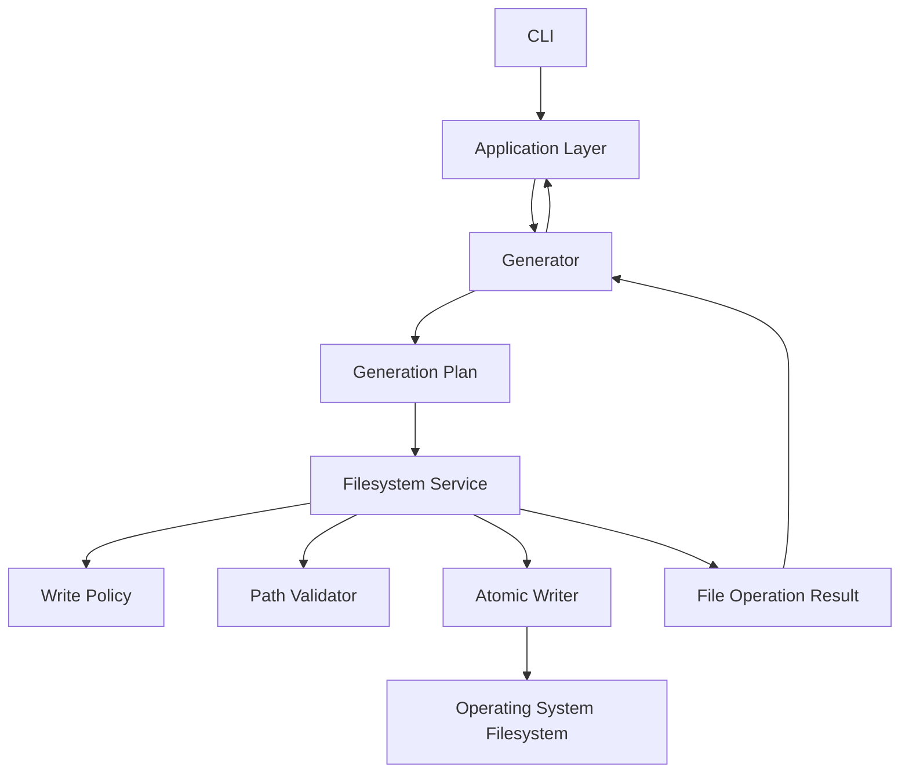

# OpenProjectLab Filesystem Architecture

> Status: Proposed
> Scope: Path resolution, output boundaries, file planning, writing, overwrite policies, atomicity, cleanup, determinism, and filesystem testing
> Audience: Maintainers, contributors, Generator developers, Template developers

OpenProjectLab（OPL）的 Filesystem Architecture 定義系統如何安全且一致地：

* 解析路徑
* 驗證路徑
* 建立目錄
* 讀取檔案
* 寫入檔案
* 處理既有檔案
* 限制輸出範圍
* 執行 Atomic Write
* 清理暫存檔
* 回報建立、更新與跳過結果

Filesystem Layer 是 Generator Framework 與實際作業系統檔案之間的邊界。

它不只是 `Path.write_text()` 的包裝。

它必須提供：

* 安全邊界
* 一致的 Encoding
* 一致的 Newline
* 明確的 Overwrite Policy
* 可測試的檔案操作
* 可預期的錯誤
* 失敗後的復原策略
* Windows、Linux 與 CI 間的可移植性

任何尚未在程式碼與測試中完成的能力，都應視為提案，而不是現有功能。

---

## 1. Goals

Filesystem Architecture 的核心目標包括：

* 所有文字檔案使用 UTF-8。
* 所有輸出路徑受到 Output Root 限制。
* 避免 Path Traversal。
* 避免未授權覆寫。
* 提供一致的 Create、Update、Skip 與 Conflict 行為。
* 支援 Dry Run。
* 支援決定性的輸出順序。
* 降低部分失敗造成的不完整輸出。
* 將底層 `OSError` 轉換為 OPL Framework Exception。
* 讓 Generator 不需要直接處理作業系統細節。
* 讓檔案操作可使用 `tmp_path` 獨立測試。
* 提供未來 Atomic Generation 與 Transactional Generation 的基礎。

---

## 2. Non-Goals

Filesystem Layer 不應：

* 決定課程內容。
* 決定使用哪個 Template。
* 解析 CLI 參數。
* 載入完整 Project Configuration。
* 管理 Generator Registry。
* 自動執行 Git Command。
* 自動 Commit 或 Push。
* 自動同步雲端儲存。
* 自動解決使用者內容衝突。
* 在未明確授權時覆寫檔案。
* 將所有作業系統例外靜默忽略。

---

## 3. High-Level Architecture



---

## 4. Dependency Direction

建議依賴方向：

```text
CLI
  ↓
Application Layer
  ↓
Generator Framework
  ↓
Filesystem Protocol
  ↓
Filesystem Implementation
  ↓
Operating System
```

規則：

* CLI 不直接寫入產出檔案。
* Generator 依賴 Filesystem Protocol，而不是具體 OS Helper。
* Filesystem Layer 不依賴 CLI。
* Filesystem Layer 不依賴 Concrete Generator。
* Template Renderer 回傳文字，不直接寫檔。
* File Writer 不決定 Template。
* Path Policy 與 Write Policy 應可獨立測試。

---

## 5. Filesystem Responsibilities

Filesystem Layer 負責：

* 驗證 Source 與 Destination Path。
* 確認 Destination 位於 Output Root。
* 建立必要目錄。
* 讀取文字與二進位檔案。
* 以一致 Encoding 寫入文字。
* 套用 Overwrite Policy。
* 執行 Atomic Write。
* 建立與清理 Temporary File。
* 回傳結構化操作結果。
* 將 `OSError` 轉換為 Filesystem Exception。
* 保持輸出順序具決定性。

Filesystem Layer 不負責：

* 決定哪些檔案要產生。
* 建立 Template Context。
* 決定課程週次。
* 決定 CLI Exit Code。
* 顯示最終使用者訊息。
* 執行 Template Rendering。
* 處理 Plugin Discovery。

---

## 6. Proposed Components

建議拆分為：

```text
FilesystemService
PathResolver
PathValidator
FileReader
FileWriter
AtomicFileWriter
WritePolicy
FileOperationResult
```

概念目錄：

```text
generator/
└── filesystem/
    ├── __init__.py
    ├── protocols.py
    ├── models.py
    ├── policies.py
    ├── paths.py
    ├── reader.py
    ├── writer.py
    └── atomic.py
```

若目前專案規模仍小，可以先將部分功能集中於少數 Module。

但責任仍應保持清楚。

---

## 7. Path Types

Filesystem Architecture 應區分以下路徑。

### Project Root

OPL Repository 或專案根目錄。

例如：

```text
F:\OpenProjectLab
```

### Configuration Path

設定檔位置。

例如：

```text
F:\OpenProjectLab\config\default.yaml
```

### Template Root

Template 搜尋根目錄。

例如：

```text
F:\OpenProjectLab\templates
```

### Output Root

允許產出檔案的根目錄。

例如：

```text
F:\OpenProjectLab\courses
```

### Destination Path

單一輸出檔案的完整位置。

例如：

```text
F:\OpenProjectLab\courses\modern-java\week-01\README.md
```

不同路徑具有不同安全規則，不應混為同一個無語意的 String。

---

## 8. Use pathlib.Path

所有 Python Filesystem API 應優先使用：

```python
from pathlib import Path
```

建議：

```python
target = Path("courses") / "java" / "week-01"
```

不建議：

```python
target = "courses\\java\\week-01"
```

使用 `Path` 的優點：

* 支援 Windows 與 POSIX。
* 可使用 `/` 組合路徑。
* 型別語意清楚。
* 容易測試。
* 可使用 `resolve()`、`exists()`、`is_file()`。
* 避免手動拼接路徑分隔符號。

---

## 9. Avoid String Concatenation

不建議：

```python
path = root + "\\" + course + "\\" + filename
```

問題：

* 平台相依。
* 容易重複或漏掉分隔符號。
* 路徑逃逸難以驗證。
* 型別不清楚。
* 測試困難。

建議：

```python
path = root / course / filename
```

---

## 10. Path Resolution

相對路徑必須依明確基準解析。

例如：

```yaml
paths:
  template_root: ../templates
```

必須定義此路徑是相對於：

* 設定檔所在目錄
* Project Root
* 目前工作目錄
* Package Root

OPL 不應依賴目前工作目錄作為隱含基準。

建議：

* Configuration Path 先轉為絕對路徑。
* 相對設定路徑以設定檔所在目錄為基準。
* Generator Destination 以 Output Root 為基準。
* Template Name 以 Template Root 為基準。

---

## 11. Current Working Directory

不應假設使用者一定從：

```text
F:\OpenProjectLab
```

執行：

```powershell
opl list
```

使用者可能從：

```text
C:\Users\KHWang
```

執行相同命令。

因此：

* 預設設定檔應由 Package 或 Project Root 推導。
* Template Root 應由已解析設定提供。
* Output Root 應明確傳入。
* 測試應從不同 Working Directory 執行。

---

## 12. Canonical Paths

安全驗證前應將路徑轉成 Canonical Form。

概念：

```python
resolved_root = root.resolve()
resolved_target = target.resolve()
```

但需注意：

* `resolve()` 對不存在路徑的行為依 Python 版本與參數而異。
* Symlink 可能改變實際位置。
* Windows Drive 與 UNC Path 需特別測試。
* 大小寫正規化在 Windows 上具有平台差異。

Canonicalization 與 Containment Check 必須在相同策略下完成。

---

## 13. Output Root Boundary

所有 Generator 輸出必須位於允許的 Output Root。

例如：

```text
Output Root:
F:\OpenProjectLab\courses
```

允許：

```text
F:\OpenProjectLab\courses\java\week-01\README.md
```

拒絕：

```text
F:\OpenProjectLab\README.md
```

拒絕：

```text
F:\private.txt
```

拒絕：

```text
C:\Users\KHWang\.ssh\id_ed25519
```

---

## 14. Path Containment

概念驗證：

```python
resolved_target.relative_to(resolved_root)
```

如果 Target 不在 Root 內，會產生：

```python
ValueError
```

Filesystem Layer 應將其轉換為：

```text
PathContainmentError
```

概念：

```python
def ensure_within_root(
    target: Path,
    root: Path,
) -> Path:
    resolved_root = root.resolve()
    resolved_target = target.resolve()

    try:
        resolved_target.relative_to(resolved_root)
    except ValueError as exc:
        raise PathContainmentError(
            f"路徑超出允許範圍：{resolved_target}"
        ) from exc

    return resolved_target
```

---

## 15. Path Traversal

應拒絕：

```text
../../private.txt
```

例如：

```python
destination = output_root / "../../private.txt"
```

字串看似以 Output Root 開始，但解析後可能逃出根目錄。

因此不能只檢查：

```python
str(destination).startswith(str(output_root))
```

此方式不安全。

必須使用經解析的 Path Containment。

---

## 16. Prefix Comparison Is Unsafe

不建議：

```python
if str(target).startswith(str(root)):
    ...
```

例如：

```text
Root:
F:\OpenProjectLab\course
```

Target：

```text
F:\OpenProjectLab\courses-secret
```

字串前綴可能誤判。

應使用：

```python
target.relative_to(root)
```

或等效的 Path-aware 驗證。

---

## 17. Absolute Paths

Generator Request 是否允許 Absolute Destination，必須明確定義。

建議策略：

* Output Root 可為 Absolute Path。
* Generator 提供相對 Destination。
* Filesystem Service 將兩者組合。
* 最終 Destination 必須通過 Containment Validation。

不建議 Generator 任意傳入完整絕對路徑。

這會削弱 Output Root 安全邊界。

---

## 18. Drive Boundaries on Windows

Windows 可能出現不同 Drive：

```text
F:\OpenProjectLab\courses
```

與：

```text
C:\temp\output
```

若兩者位於不同 Drive，`relative_to()` 應失敗。

這應被視為 Path Containment Error，而不是嘗試使用字串比較。

測試應涵蓋：

* 相同 Drive
* 不同 Drive
* Drive Letter 大小寫
* Relative Path
* UNC Path

---

## 19. UNC Paths

Windows UNC Path：

```text
\\server\share\folder
```

是否允許作為 Output Root，應由設定與安全政策決定。

可能風險：

* 網路不穩定
* 權限差異
* Atomic Rename 行為不同
* 效能
* File Lock
* Credential Exposure

現階段若沒有明確需求，可以不保證 UNC Output。

但應產生清楚錯誤，而不是未定義行為。

---

## 20. Symlinks

Symlink 可能造成 Path Escape。

例如：

```text
Output Root:
courses/
```

其中：

```text
courses/external
```

是指向：

```text
F:\private
```

的 Symlink。

若 Destination 是：

```text
courses/external/secret.txt
```

字面上位於 Output Root，但實際位置可能在外部。

因此安全檢查必須評估：

* Root 是否包含 Symlink。
* Parent Directory 是否包含 Symlink。
* 是否允許 Symbolic Link。
* 實際解析後的位置。
* Windows Junction 與 Reparse Point。

現階段最安全策略是拒絕會逃出 Root 的解析結果。

---

## 21. Case Sensitivity

Windows 通常大小寫不敏感，但 Linux 通常敏感。

例如：

```text
README.md
readme.md
```

在不同平台可能代表：

* 同一個檔案
* 兩個不同檔案

OPL 應避免只靠大小寫區分重要檔案。

Template 與 Output Naming 建議使用固定大小寫規則。

測試與 pre-commit 可搭配：

```text
check-case-conflict
```

---

## 22. Reserved Windows Names

Windows 不允許部分檔名，例如：

```text
CON
PRN
AUX
NUL
COM1
LPT1
```

即使加上副檔名也可能有問題。

例如：

```text
CON.md
```

Generator 產生使用者輸入檔名時，應驗證：

* Reserved Name
* 結尾空白
* 結尾句點
* 非法字元
* 路徑分隔符號

不應直接將課程名稱當成目錄名稱。

---

## 23. Invalid Filename Characters

Windows 檔名通常不允許：

```text
< > : " / \ | ? *
```

例如課程名稱：

```text
C++: Modern Programming
```

不能直接作為目錄名稱。

應由 Generator 或 Slug Service 轉換成安全名稱：

```text
cpp-modern-programming
```

Filesystem Layer 應驗證最終路徑合法。

內容語意轉換應由更高層負責。

---

## 24. Path Length

Windows Path Length 可能受到環境與設定限制。

過長路徑可能導致：

* 建立目錄失敗
* 寫入失敗
* Git Tool 問題
* Editor 問題
* Archive 問題

OPL 應避免過深目錄與過長檔名。

建議：

* Generator Name 簡短。
* Course Slug 有長度限制。
* Week Path 使用固定格式。
* File Name 保持清楚但簡潔。

未來可加入 Path Length Validation。

---

## 25. File Operation Models

建議建立結構化結果：

```python
from dataclasses import dataclass
from enum import Enum
from pathlib import Path

class FileOperation(str, Enum):
    CREATED = "created"
    UPDATED = "updated"
    SKIPPED = "skipped"
    UNCHANGED = "unchanged"

@dataclass(frozen=True, slots=True)
class FileOperationResult:
    path: Path
    operation: FileOperation
```

Generator 可以聚合成：

* Created Files
* Updated Files
* Skipped Files
* Unchanged Files

---

## 26. Planned File

Generation Plan 可以使用：

```python
@dataclass(frozen=True, slots=True)
class PlannedFile:
    destination: Path
    content: str
```

或：

```python
@dataclass(frozen=True, slots=True)
class PlannedFile:
    source_template: str
    destination: Path
    context: Mapping[str, object]
```

較佳的分層是：

1. Generator 建立 Template Plan。
2. Template Layer 完成 Render。
3. Filesystem Layer 接收最終 Content。
4. Filesystem Layer 寫入 Destination。

這讓 File Writer 不需要了解 Template Engine。

---

## 27. Write Policies

Filesystem Architecture 應明確定義 Write Policy。

建議包括：

```text
ERROR_IF_EXISTS
SKIP_IF_EXISTS
OVERWRITE
UPDATE_IF_CHANGED
```

### ERROR_IF_EXISTS

若檔案存在，產生衝突錯誤。

### SKIP_IF_EXISTS

若檔案存在，不修改並回傳 Skipped。

### OVERWRITE

無條件替換既有內容。

### UPDATE_IF_CHANGED

只有內容不同時才更新。

正式命名可調整，但行為必須有測試。

---

## 28. Default Policy

建議預設：

```text
ERROR_IF_EXISTS
```

原因：

* 保護使用者內容。
* 避免意外破壞。
* 強迫呼叫者明確選擇覆寫。
* 適合作為 Framework 安全預設。

對可重複產生的 Metadata 或 Framework-owned Files，可使用：

```text
UPDATE_IF_CHANGED
```

但所有權必須清楚。

---

## 29. File Ownership

OPL 應區分：

### Framework-Owned Files

可由 OPL 管理與更新。

例如可能包括：

* Manifest
* Generated Metadata
* Internal State File

### User-Owned Files

產生後由使用者編輯。

例如可能包括：

* README
* Lecture Notes
* Lab
* Assignment

對 User-Owned Files，不應在後續執行時默認覆寫。

File Ownership 應由 Generator Plan 或 Metadata 明確標示。

---

## 30. Overwrite Policy

覆寫必須是明確動作。

不建議：

```python
target.write_text(content)
```

而不檢查檔案是否存在。

建議：

```python
writer.write_text(
    target,
    content,
    policy=WritePolicy.ERROR_IF_EXISTS,
)
```

若 CLI 提供：

```text
--force
```

其語意必須清楚：

* 是否覆寫所有檔案？
* 是否只覆寫 Framework-owned Files？
* 是否建立 Backup？
* 是否在 Dry Run 顯示？
* 是否可恢復？

---

## 31. Skip Existing

`SKIP_IF_EXISTS` 適合：

* 初次 Bootstrap 中保護既有檔案。
* 使用者已修改的文件。
* 選填資源。
* 可安全忽略的內容。

但 Skip 必須回報。

不應讓使用者誤以為所有檔案都已成功更新。

Result 應包含：

```text
skipped_files
```

與必要的 Warning。

---

## 32. Update If Changed

`UPDATE_IF_CHANGED` 流程：

1. 若檔案不存在，建立。
2. 若檔案存在，讀取目前內容。
3. 比較新舊內容。
4. 相同則回傳 Unchanged。
5. 不同則 Atomic Replace。

優點：

* 避免不必要的 Modification Time 變更。
* 減少 Git Diff。
* 提升 Idempotency。
* 降低 Pre-commit 重複工作。

---

## 33. Content Comparison

文字檔案比較前必須決定是否正規化：

* Newline
* EOF Newline
* Encoding
* Trailing Whitespace

建議 Writer 寫入前先套用固定輸出規則。

然後以最終 Byte 或 String 比較。

不應在不同地方使用不同正規化方式。

---

## 34. UTF-8

所有 OPL 文字檔案應使用：

```python
encoding="utf-8"
```

讀取：

```python
content = path.read_text(
    encoding="utf-8",
)
```

寫入：

```python
path.write_text(
    content,
    encoding="utf-8",
)
```

不得依賴：

```python
locale.getpreferredencoding()
```

或作業系統預設編碼。

---

## 35. UTF-8 BOM

OPL 應明確決定是否使用 UTF-8 BOM。

建議文字檔案使用：

```text
UTF-8 without BOM
```

原因：

* 跨平台一致。
* Python、YAML、JSON、Markdown 通常不需要 BOM。
* 可避免部分 Parser 或 Tooling 問題。

若特定格式需要 BOM，應由專屬 Writer 明確處理。

---

## 36. Newline Policy

Repository 與產出檔案應採用一致 Newline 策略。

建議內部內容統一為：

```text
LF
```

即：

```python
"\n"
```

Windows Git 可透過 `.gitattributes` 管理 Checkout 行為。

避免：

* 同一檔案混合 CRLF 與 LF。
* Template 為 CRLF、輸出為 LF。
* 測試在 Windows 與 CI 結果不同。
* `mixed-line-ending` Hook 持續修改檔案。

---

## 37. EOF Newline

文字檔案原則上應以單一 Newline 結尾。

可建立正規化函式：

```python
def ensure_final_newline(
    content: str,
) -> str:
    return content.rstrip("\n") + "\n"
```

但這會移除多個結尾 Newline。

正式策略應考慮：

* 是否保留有意義的空白行。
* 是否處理 `\r\n`。
* 是否只適用文字檔案。
* 是否與 Template 渲染結果一致。

---

## 38. Trailing Whitespace

Filesystem Writer 可以選擇不自動刪除所有行尾空白。

原因：

* 某些格式可能有語意。
* 自動修改內容可能超出 Writer 責任。
* Template Lint 與 pre-commit 已可處理。

建議：

* Template Source 由 `trailing-whitespace` Hook 管理。
* Generated Content 由 Template Tests 驗證。
* Writer 只處理明確定義的 Newline 與 Encoding。

---

## 39. Binary Files

OPL 未來可能產生：

* 圖片
* PDF
* ZIP
* Font-independent Resources
* Binary Fixtures

Binary File 不應使用：

```python
write_text()
```

應使用：

```python
write_bytes()
```

Filesystem Protocol 可區分：

```python
write_text(...)
write_bytes(...)
```

不要使用單一接受任意內容的模糊 API。

---

## 40. Directory Creation

寫入前通常需要：

```python
target.parent.mkdir(
    parents=True,
    exist_ok=True,
)
```

但目錄建立必須：

* 確認 Parent 位於 Output Root。
* 確認同名物件不是檔案。
* 將 `OSError` 轉成 `DirectoryCreationError`。
* 不建立超出 Plan 的任意目錄。
* 在 Dry Run 中不實際建立。

---

## 41. File Exists as Directory

若預期寫入：

```text
courses/java/README.md
```

但該路徑已是目錄，應產生清楚錯誤：

```text
無法寫入檔案：
courses/java/README.md

原因：
該路徑目前是一個目錄。
```

不能只顯示一般 `IsADirectoryError`。

---

## 42. Directory Exists as File

若需要建立：

```text
courses/java/week-01/
```

但：

```text
courses/java/week-01
```

已是檔案，應產生：

```text
無法建立目錄：
courses/java/week-01

原因：
相同路徑已存在檔案。
```

---

## 43. Atomic Write

Atomic Write 的目標是避免：

* 程式中斷後留下半個檔案。
* 寫入失敗破壞原檔。
* 使用者看到不完整內容。
* Validation 失敗後正式檔案已被修改。

典型流程：

```text
Create temporary file
  ↓
Write full content
  ↓
Flush
  ↓
Validate
  ↓
Replace destination atomically
  ↓
Remove temporary file if needed
```

---

## 44. Proposed Atomic Write

概念：

```python
import os
import tempfile
from pathlib import Path

def atomic_write_text(
    target: Path,
    content: str,
) -> None:
    target.parent.mkdir(
        parents=True,
        exist_ok=True,
    )

    fd, temp_name = tempfile.mkstemp(
        dir=target.parent,
        prefix=f".{target.name}.",
        suffix=".tmp",
        text=True,
    )

    temp_path = Path(temp_name)

    try:
        with os.fdopen(
            fd,
            "w",
            encoding="utf-8",
            newline="\n",
        ) as stream:
            stream.write(content)
            stream.flush()
            os.fsync(stream.fileno())

        os.replace(temp_path, target)
    except OSError as exc:
        temp_path.unlink(
            missing_ok=True,
        )
        raise AtomicWriteError(
            f"無法安全寫入檔案：{target}"
        ) from exc
```

此範例仍需評估 Windows File Lock 與 Permission 行為。

---

## 45. Temporary File Location

Temporary File 應建立於 Destination 同一目錄或同一 Filesystem。

原因：

* `os.replace()` 跨 Filesystem 可能失敗。
* 同一目錄通常具有相同權限。
* Atomic Rename 更有機會成立。
* 清理範圍容易管理。

不建議預設使用系統 Temp Directory，再跨磁碟移動到 Target。

---

## 46. Atomicity Limitations

Atomic Write 不代表整個 Generation Transaction 都是 Atomic。

例如產生三個檔案：

```text
README.md
lab.md
quiz.md
```

每個檔案可獨立 Atomic Write，但第三個失敗時，前兩個可能已完成。

完整 Transactional Generation 需要：

* 先產生到 Temporary Directory。
* 驗證所有檔案。
* 一次 Commit Directory。
* 或建立 Rollback Log。

這比單檔 Atomic Write 複雜。

---

## 47. Transactional Generation

理想流程：

```text
Validate request
  ↓
Build complete plan
  ↓
Render all content
  ↓
Validate all content
  ↓
Write staging directory
  ↓
Commit staging output
  ↓
Return result
```

若任何步驟失敗：

```text
Delete staging directory
```

正式 Output 保持不變。

現階段可以先實作：

* Preflight Validation
* Single-file Atomic Write
* Created File Tracking
* Cleanup

再逐步演進成完整 Transaction。

---

## 48. Preflight Validation

在實際寫入前，應盡可能檢查：

* 所有 Destination 位於 Output Root。
* Destination 沒有重複。
* Parent Path 合法。
* Write Policy 可執行。
* 必要 Template 已渲染。
* Structured Output 已驗證。
* Target Conflict 已發現。
* 所有內容已準備完成。

Preflight 可以降低部分失敗。

---

## 49. Duplicate Destinations

Generation Plan 不應包含：

```text
week-01/README.md
week-01/README.md
```

兩個不同 Planned File 指向相同 Destination。

應在寫入前產生：

```text
GenerationPlanError
```

或：

```text
OutputConflictError
```

不能依賴最後寫入者覆蓋前者。

---

## 50. Stable Ordering

檔案操作應採用穩定順序。

建議依：

```python
sorted(
    planned_files,
    key=lambda item: item.destination.as_posix(),
)
```

或由 Generation Plan 保留明確順序。

穩定順序可改善：

* 測試
* Logging
* CLI 輸出
* Partial Failure 診斷
* Golden File Review
* Determinism

---

## 51. Dry Run

Dry Run 應完成：

* Request Validation
* Path Resolution
* Path Containment
* Template Resolution
* Rendering
* Output Validation
* Conflict Detection
* Operation Planning

但不應：

* 建立目錄
* 寫入檔案
* 修改時間戳
* 刪除檔案
* 取代檔案

Dry Run Result 應清楚表示預計：

* Create
* Update
* Skip
* Conflict

---

## 52. Dry Run Result

概念：

```python
@dataclass(frozen=True, slots=True)
class PlannedOperation:
    path: Path
    operation: FileOperation
    reason: str | None = None
```

CLI 可顯示：

```text
CREATE  courses/java/week-01/README.md
SKIP    courses/java/week-01/lab.md
UPDATE  courses/java/week-01/metadata.yaml
```

Dry Run 不應只回傳：

```text
Dry run successful.
```

而沒有列出實際計畫。

---

## 53. Idempotency

Idempotent Generation 表示相同輸入重複執行不會造成不必要變化。

理想行為：

第一次：

```text
CREATED README.md
CREATED lab.md
```

第二次：

```text
UNCHANGED README.md
UNCHANGED lab.md
```

而不是每次都重新寫入。

Idempotency 依賴：

* 決定性 Template。
* 穩定排序。
* `UPDATE_IF_CHANGED`。
* 不插入目前時間。
* 不插入隨機值。
* 不依賴環境專屬路徑。

---

## 54. File Modification Time

即使內容相同，重新寫入也會修改檔案時間。

這可能造成：

* Git Tool 誤判。
* Build Tool 重建。
* CI Cache 失效。
* 使用者困惑。
* Backup Tool 重複同步。

因此 `UPDATE_IF_CHANGED` 應在內容相同時保留原檔。

---

## 55. Hash Comparison

大量檔案或大檔案可使用 Hash 比較。

例如：

```python
sha256(content)
```

但一般 OPL 文字檔案通常很小。

直接讀取並比較內容已足夠。

不要過早引入 Hash Cache。

---

## 56. Deletion Policy

Filesystem Layer 是否允許刪除檔案，必須謹慎。

建議第一階段不提供一般：

```python
delete(path)
```

給 Generator 任意使用。

若需要清理：

* 只清理本次建立的 Temporary File。
* 只清理明確的 Staging Directory。
* 不刪除 User-owned File。
* 刪除前通過 Root Containment。
* 刪除操作必須有測試。

---

## 57. Removing Generated Files

若 Template 或 Generator 更新後不再產生某檔案，不能自動推論該檔案可刪除。

因為使用者可能已修改。

未來若需要管理 Generated Files，應使用 Manifest：

```yaml
generated_files:
  - path: metadata.yaml
    owner: framework
  - path: README.md
    owner: user
```

只有明確標示為 Framework-owned 的檔案才可考慮自動移除。

---

## 58. Backup Policy

覆寫前是否建立 Backup，是重要設計選擇。

例如：

```text
README.md.bak
```

問題：

* Backup 命名衝突。
* 多次覆寫產生大量檔案。
* 不知道何時刪除。
* Backup 可能被 Commit。
* 敏感內容可能重複保存。

現階段建議：

* 預設不自動覆寫。
* 明確覆寫時使用 Atomic Replace。
* Backup 作為未來選填能力。
* 優先依賴 Git 做版本管理。

---

## 59. File Permissions

新檔案權限通常由 OS 與 Umask 決定。

OPL 不應隨意修改：

* Owner
* ACL
* Executable Bit

除非檔案類型明確需要，例如 Script。

若需要建立可執行 Script：

* 應由專屬功能明確處理。
* Windows 與 POSIX 行為不同。
* 測試應分平台。

---

## 60. Read-only Files

若既有檔案是 Read-only，覆寫應失敗並回報：

```text
無法更新檔案：
README.md

原因：
檔案為唯讀或目前權限不足。
```

不應自動變更檔案權限，除非使用者明確要求。

---

## 61. File Locks

Windows 上檔案可能被其他程式鎖定。

例如：

* Editor
* Antivirus
* Sync Client
* PDF Viewer
* Indexer

`PermissionError` 不一定只代表 ACL 權限不足。

錯誤訊息可以建議：

* 關閉正在使用該檔案的程式。
* 稍後重新執行。
* 檢查同步軟體。
* 檢查防毒隔離。

但不應假設一定是哪個程式造成。

---

## 62. Retry for File Locks

是否針對 File Lock 自動重試，需謹慎。

優點：

* 可處理短暫鎖定。

缺點：

* 隱藏真正權限問題。
* 增加等待。
* 測試複雜。
* 非 Idempotent 操作可能重複。

現階段建議不自動重試。

未來若加入，應只針對明確可重試錯誤，並限制次數。

---

## 63. Filesystem Exceptions

建議例外階層：

```text
OpenProjectLabError
└── FilesystemError
    ├── InvalidPathError
    ├── PathContainmentError
    ├── DirectoryCreationError
    ├── FileReadError
    ├── FileWriteError
    ├── OutputConflictError
    ├── AtomicWriteError
    └── CleanupError
```

`OutputConflictError` 也可能歸屬 Generator Error。

正式位置需由 Error Handling Architecture 統一決定。

---

## 64. Error Conversion

概念：

```python
try:
    target.parent.mkdir(
        parents=True,
        exist_ok=True,
    )
except OSError as exc:
    raise DirectoryCreationError(
        f"無法建立目錄：{target.parent}"
    ) from exc
```

讀取：

```python
try:
    return path.read_text(
        encoding="utf-8",
    )
except OSError as exc:
    raise FileReadError(
        f"無法讀取檔案：{path}"
    ) from exc
```

寫入：

```python
try:
    ...
except OSError as exc:
    raise FileWriteError(
        f"無法寫入檔案：{path}"
    ) from exc
```

---

## 65. Avoid Catching All Exceptions

不建議：

```python
try:
    write_file()
except Exception as exc:
    raise FileWriteError("寫入失敗") from exc
```

因為這會將：

* 程式 Bug
* TypeError
* AssertionError
* 錯誤 API 使用

全部偽裝成 Filesystem Error。

應只捕捉預期的底層錯誤，例如：

```python
except OSError as exc:
```

---

## 66. Logging

Filesystem Layer 可以記錄：

### DEBUG

* Resolved Path
* Selected Write Policy
* Temporary File Path
* Operation Result
* Skip Reason

### INFO

通常不需要每個小檔案都記錄，除非 Debug 或 Verbose Mode。

### WARNING

* Skip Existing
* Deprecated Path
* Non-fatal Cleanup Issue

### ERROR

最終錯誤通常由 Application 或 CLI 記錄，避免重複。

Filesystem Layer 主要應拋出具語意 Exception。

---

## 67. Sensitive Paths

Filesystem Error 可能包含路徑。

本機 CLI 通常可顯示必要路徑。

但不應包含：

* SSH Private Key 內容
* Token
* Secret Context
* 不相關使用者目錄
* Temporary Credential File 內容

Log 到遠端環境時應評估 Path Redaction。

---

## 68. Filesystem Protocol

概念：

```python
from pathlib import Path
from typing import Protocol

class FileWriterProtocol(Protocol):
    def write_text(
        self,
        path: Path,
        content: str,
        *,
        policy: WritePolicy,
    ) -> FileOperationResult:
        ...
```

Reader：

```python
class FileReaderProtocol(Protocol):
    def read_text(
        self,
        path: Path,
    ) -> str:
        ...
```

Generator 可以依賴 Protocol，測試時注入 Fake。

---

## 69. Fake Filesystem

對純 Generator Unit Test，可使用 Fake Writer：

```python
class FakeFileWriter:
    def __init__(self) -> None:
        self.operations = []

    def write_text(
        self,
        path,
        content,
        *,
        policy,
    ):
        self.operations.append(
            (path, content, policy)
        )

        return FileOperationResult(
            path=path,
            operation=FileOperation.CREATED,
        )
```

這可以測試：

* Generator 是否建立正確路徑。
* 是否使用正確 Policy。
* 是否傳入正確內容。
* 是否維持操作順序。

真正檔案系統行為仍需使用 `tmp_path` 測試。

---

## 70. Testing Strategy

Filesystem 測試至少包含：

* Path Resolution
* Root Containment
* Path Traversal
* Directory Creation
* UTF-8 Read/Write
* Newline
* EOF Newline
* Existing File Policy
* Update If Changed
* Dry Run
* Atomic Write
* Temporary Cleanup
* Permission Error
* Directory/File Conflict
* Deterministic Ordering
* Windows-specific Path Cases

---

## 71. Basic Write Test

```python
def test_write_text_creates_file(
    tmp_path,
):
    writer = FileWriter(
        output_root=tmp_path,
    )

    target = tmp_path / "README.md"

    result = writer.write_text(
        target,
        "# Demo\n",
        policy=WritePolicy.ERROR_IF_EXISTS,
    )

    assert target.read_text(
        encoding="utf-8",
    ) == "# Demo\n"

    assert result.operation is FileOperation.CREATED
```

實際 API 應依目前實作調整。

---

## 72. UTF-8 Test

```python
def test_write_text_supports_utf8(
    tmp_path,
):
    target = tmp_path / "README.md"

    writer = FileWriter(
        output_root=tmp_path,
    )

    writer.write_text(
        target,
        "繁體中文測試\n",
        policy=WritePolicy.ERROR_IF_EXISTS,
    )

    assert target.read_text(
        encoding="utf-8",
    ) == "繁體中文測試\n"
```

可加入：

* 日文
* Emoji
* 特殊符號
* 非 ASCII 檔名

---

## 73. Path Containment Test

```python
def test_writer_rejects_path_outside_root(
    tmp_path,
):
    output_root = tmp_path / "output"
    outside = tmp_path / "outside.txt"

    writer = FileWriter(
        output_root=output_root,
    )

    with pytest.raises(
        PathContainmentError
    ):
        writer.write_text(
            outside,
            "secret",
            policy=WritePolicy.ERROR_IF_EXISTS,
        )
```

---

## 74. Path Traversal Test

```python
def test_writer_rejects_parent_traversal(
    tmp_path,
):
    output_root = tmp_path / "output"
    target = output_root / ".." / "outside.txt"

    writer = FileWriter(
        output_root=output_root,
    )

    with pytest.raises(
        PathContainmentError
    ):
        writer.write_text(
            target,
            "x",
            policy=WritePolicy.ERROR_IF_EXISTS,
        )
```

---

## 75. Existing File Error Test

```python
def test_existing_file_raises_conflict(
    tmp_path,
):
    target = tmp_path / "README.md"
    target.write_text(
        "existing\n",
        encoding="utf-8",
    )

    writer = FileWriter(
        output_root=tmp_path,
    )

    with pytest.raises(
        OutputConflictError
    ):
        writer.write_text(
            target,
            "new\n",
            policy=WritePolicy.ERROR_IF_EXISTS,
        )

    assert target.read_text(
        encoding="utf-8",
    ) == "existing\n"
```

---

## 76. Skip Existing Test

```python
def test_skip_existing_preserves_content(
    tmp_path,
):
    target = tmp_path / "README.md"
    target.write_text(
        "existing\n",
        encoding="utf-8",
    )

    writer = FileWriter(
        output_root=tmp_path,
    )

    result = writer.write_text(
        target,
        "new\n",
        policy=WritePolicy.SKIP_IF_EXISTS,
    )

    assert target.read_text(
        encoding="utf-8",
    ) == "existing\n"

    assert result.operation is FileOperation.SKIPPED
```

---

## 77. Update If Changed Test

```python
def test_unchanged_content_is_not_rewritten(
    tmp_path,
):
    target = tmp_path / "README.md"
    target.write_text(
        "same\n",
        encoding="utf-8",
    )

    original_mtime = target.stat().st_mtime_ns

    writer = FileWriter(
        output_root=tmp_path,
    )

    result = writer.write_text(
        target,
        "same\n",
        policy=WritePolicy.UPDATE_IF_CHANGED,
    )

    assert result.operation is FileOperation.UNCHANGED
    assert target.stat().st_mtime_ns == original_mtime
```

在部分 Filesystem 上時間精度不同，測試需保持穩定。

---

## 78. Overwrite Test

```python
def test_overwrite_replaces_content(
    tmp_path,
):
    target = tmp_path / "README.md"
    target.write_text(
        "old\n",
        encoding="utf-8",
    )

    writer = FileWriter(
        output_root=tmp_path,
    )

    result = writer.write_text(
        target,
        "new\n",
        policy=WritePolicy.OVERWRITE,
    )

    assert target.read_text(
        encoding="utf-8",
    ) == "new\n"

    assert result.operation is FileOperation.UPDATED
```

---

## 79. Dry Run Test

```python
def test_dry_run_does_not_create_file(
    tmp_path,
):
    target = tmp_path / "README.md"

    writer = FileWriter(
        output_root=tmp_path,
        dry_run=True,
    )

    result = writer.write_text(
        target,
        "# Demo\n",
        policy=WritePolicy.ERROR_IF_EXISTS,
    )

    assert not target.exists()
    assert result.operation is FileOperation.CREATED
```

Result 表示預計操作，而不是已實際完成。

因此未來可考慮區分：

```text
PlannedOperation
FileOperationResult
```

避免語意混淆。

---

## 80. Atomic Cleanup Test

```python
def test_atomic_write_removes_temp_file_on_failure(
    tmp_path,
    monkeypatch,
):
    ...
```

測試應模擬：

* Replace 失敗。
* Write 失敗。
* Validation 失敗。
* Cleanup 成功。
* Cleanup 失敗。

並確認：

* 正式檔案保持原狀。
* Temporary File 被移除。
* 原始例外透過 Chaining 保留。

---

## 81. Permission Error Test

跨平台直接建立真實 Permission Error 可能不穩定，尤其 Windows。

較佳方式：

```python
monkeypatch.setattr(
    Path,
    "write_text",
    failing_write,
)
```

或將低階操作封裝後注入 Fake。

測試重點：

* `OSError` 被轉成 `FileWriteError`。
* 路徑出現在訊息中。
* `__cause__` 保留。
* 不會回傳成功 Result。

---

## 82. Directory Conflict Test

```python
def test_target_directory_cannot_be_written_as_file(
    tmp_path,
):
    target = tmp_path / "README.md"
    target.mkdir()

    writer = FileWriter(
        output_root=tmp_path,
    )

    with pytest.raises(
        FileWriteError
    ):
        writer.write_text(
            target,
            "x",
            policy=WritePolicy.OVERWRITE,
        )
```

---

## 83. Deterministic Operation Test

```python
def test_operations_are_sorted_by_path(
    filesystem_service,
):
    ...
```

若正式策略是保留 Plan Order，則測試應驗證 Plan Order。

重點是同一輸入得到相同執行順序。

---

## 84. Test Isolation

Filesystem Test 應使用：

```python
tmp_path
```

不得：

* 寫入正式 `courses/`
* 修改正式 `templates/`
* 依賴 `F:\OpenProjectLab`
* 依賴使用者 Home
* 依賴目前工作目錄
* 依賴測試順序
* 使用共享 Temporary Directory
* 留下測試檔案

---

## 85. Windows Test Cases

由於 OPL 目前主要在 Windows 11 開發，應特別測試：

* Drive Letter
* Backslash Input
* Forward Slash Input
* Reserved Filename
* Trailing Dot
* Trailing Space
* Read-only File
* File Lock 模擬
* CRLF Input
* Long Path
* UNC Path（若支援）
* Case Conflict
* Junction 或 Symlink（環境允許時）

這些測試應避免只在特定管理員權限下才能執行。

---

## 86. POSIX Test Cases

若未來支援 Linux 或 macOS，應測試：

* Case-sensitive Filename
* Executable Bit
* Symlink
* Permission Mode
* LF Newline
* Root Path
* Hidden File
* Unicode Filename

CI Matrix 應涵蓋至少：

* Windows
* Linux

若正式宣告支援 macOS，則加入 macOS。

---

## 87. Integration Tests

Filesystem Integration Test 應涵蓋：

```text
Generator
  ↓
Template Renderer
  ↓
Filesystem Writer
  ↓
Actual Output
```

例如 Week Generator：

* 建立正確目錄。
* 產生正確檔名。
* 使用 UTF-8。
* 不覆寫既有 User-owned File。
* 第二次執行具 Idempotency。
* Dry Run 不修改檔案。
* Error Result 清楚。

---

## 88. Golden Output Tests

完整輸出可與 Fixture 比較：

```text
tests/
└── fixtures/
    └── expected/
        └── week-01/
            ├── README.md
            ├── lab.md
            └── quiz.md
```

測試：

```python
assert generated.read_bytes() == expected.read_bytes()
```

Byte Comparison 可以同時驗證：

* Encoding
* Newline
* EOF Newline
* Exact Content

Golden Output 更新必須人工 Review。

---

## 89. Manifest

未來可建立 Generation Manifest：

```yaml
generator: week
version: 1
files:
  - path: README.md
    owner: user
    checksum: ...
  - path: metadata.yaml
    owner: framework
    checksum: ...
```

用途：

* 追蹤 Framework-owned File
* 偵測使用者修改
* 安全更新
* 安全刪除
* Migration
* Drift Detection

Manifest 本身也需要：

* Version
* Atomic Write
* Security
* Path Validation
* Tests

---

## 90. Drift Detection

若 Manifest 記錄 Checksum，可以判斷檔案是否被使用者修改。

例如：

```text
Stored checksum != Current checksum
```

此時 Framework 不應自動覆寫。

可以：

* Skip
* Warn
* Require `--force`
* 建立 Conflict File
* 顯示 Diff

這屬於未來進階能力。

---

## 91. Conflict Files

部分工具會在衝突時建立：

```text
README.md.generated
```

或：

```text
README.md.opl-new
```

優點：

* 不覆寫使用者內容。
* 提供新版內容供比較。

缺點：

* 產生額外檔案。
* 需要清理。
* 命名可能衝突。
* 使用者流程更複雜。

若導入，應建立明確 Policy 與文件。

---

## 92. File Diff

Filesystem Layer 是否提供 Diff，需區分責任。

Writer 可回傳：

* Existing Content
* Proposed Content
* Changed Flag

但實際 Human-readable Diff 可由：

* CLI
* Review Tool
* Dry Run Formatter

產生。

不要讓底層 Writer 綁定 Console Diff 格式。

---

## 93. Performance

OPL 主要產生文字教材與設定檔，Filesystem 效能通常不是瓶頸。

優先事項應是：

* 安全
* 正確
* 可測試
* 可恢復
* 決定性

不需要過早加入：

* Thread Pool
* Async Filesystem
* Write Cache
* Memory Mapping
* Database
* Complex Batch Engine

大量檔案需求成熟後再評估。

---

## 94. Parallel Writes

未來若支援平行產生，必須處理：

* 兩個操作寫入相同路徑。
* Parent Directory Race。
* Manifest 更新競爭。
* Atomic Replace。
* 操作順序。
* Error Aggregation。
* Rollback。

現階段建議使用序列寫入。

穩定、簡單且容易診斷。

---

## 95. File Writer Lifecycle

建議 Writer：

* 由 Application Composition Root 建立。
* 每次 Generation 可建立新實例。
* 保存不可變設定，如 Output Root 與 Dry Run。
* 不保存跨 Generation 的可變操作狀態。
* 不使用全域 Singleton。
* 可安全注入測試。

操作結果應由 Result 回傳，而不是保存在全域 List。

---

## 96. Proposed API

概念：

```python
class FileWriter:
    def __init__(
        self,
        *,
        output_root: Path,
        dry_run: bool = False,
    ) -> None:
        ...

    def write_text(
        self,
        destination: Path,
        content: str,
        *,
        policy: WritePolicy,
    ) -> FileOperationResult:
        ...
```

若 Destination 應為相對路徑，可改為：

```python
def write_text(
    self,
    relative_path: Path,
    content: str,
    *,
    policy: WritePolicy,
) -> FileOperationResult:
    ...
```

後者更能強化 Output Root 邊界。

---

## 97. Relative Destination API

建議優先考慮讓 Writer 只接受相對 Destination：

```python
writer.write_text(
    Path("java/week-01/README.md"),
    content,
    policy=...,
)
```

Writer 內部組合：

```python
target = output_root / relative_path
```

並驗證：

* `relative_path` 不是 Absolute。
* 不包含逃逸後超出 Root。
* 最終 Target 在 Root 內。

這比接受任意 Absolute Path 更安全。

---

## 98. Configuration Integration

Filesystem Layer 需要的設定可能包括：

```yaml
paths:
  output_root: ../courses

generator:
  overwrite: false
```

但不建議直接將完整 `ProjectConfig` 傳給 Writer。

建議 Composition Root 解析後傳入：

```python
FileWriter(
    output_root=config.output_root,
    dry_run=request.dry_run,
)
```

這降低 Filesystem Layer 對 Configuration Structure 的耦合。

---

## 99. Generator Integration

Generator 應建立完整 Plan：

```python
planned_files = (
    PlannedFile(
        destination=Path(
            "modern-java/week-01/README.md"
        ),
        content=readme,
        policy=WritePolicy.ERROR_IF_EXISTS,
    ),
)
```

再交給 Filesystem Service：

```python
results = filesystem.apply(
    planned_files
)
```

Generator 不應在不同位置散落：

```python
mkdir()
write_text()
unlink()
```

---

## 100. Error Handling Integration

Filesystem Exception 應向上傳遞：

```text
Filesystem Layer
  ↓
Generator
  ↓
Application
  ↓
CLI
```

Generator 只有在增加重要語意時才包裝：

```python
try:
    results = filesystem.apply(plan)
except FilesystemError as exc:
    raise GeneratorError(
        "Week Generator 無法寫入輸出。"
    ) from exc
```

若包裝後失去具體 Filesystem 分類，可能影響 Exit Code。

因此是否包裝需謹慎。

很多情況可直接讓 FilesystemError 向上傳遞。

---

## 101. Documentation Requirements

新增或修改 Filesystem 能力時，應同步更新：

* Filesystem Architecture
* Error Handling Architecture
* Errors Reference
* Generator Framework
* Configuration Reference
* CLI Reference
* Development Workflow
* Changelog
* ADR（如涉及重大 Policy）

---

## 102. Adding a Filesystem Feature

新增功能流程：

### Step 1：定義需求

例如：

* Atomic Write
* Skip Existing
* Binary Output
* Manifest
* Backup

### Step 2：定義安全邊界

確認：

* Output Root
* Path Containment
* User-owned Files
* Cleanup
* Error Conditions

### Step 3：定義 Public Contract

建立或更新：

* Protocol
* Model
* Policy
* Exception

### Step 4：先寫測試

至少包含：

* 正常行為
* 路徑逃逸
* 既有檔案
* 失敗與 Cleanup
* Windows 行為
* Dry Run

### Step 5：實作

保持：

* 單一責任
* 明確例外
* 無全域狀態
* 決定性

### Step 6：整合 Generator

確認 Generator 不直接操作 Filesystem。

### Step 7：更新文件

同步所有相關 Reference 與 Architecture。

### Step 8：執行 Automation

```powershell
git diff --check
pre-commit run --all-files
python -m pytest
```

---

## 103. Implementation Phases

### Phase 1：Path Safety

建立：

* Output Root
* Relative Destination
* Path Containment
* Path Exceptions
* Tests

### Phase 2：Write Policy

建立：

* Error If Exists
* Skip If Exists
* Overwrite
* Update If Changed
* Result Model

### Phase 3：Atomic File Write

建立：

* Temporary File
* Flush
* Replace
* Cleanup
* Failure Tests

### Phase 4：Generation Plan Integration

讓 Generator 先建立完整 Plan，再寫入。

### Phase 5：Dry Run

支援完整預計操作結果。

### Phase 6：Manifest and Ownership

支援 Framework-owned 與 User-owned File。

### Phase 7：Transactional Generation

建立 Staging Directory 與完整 Commit。

---

## 104. Current Limitations

目前 OPL Filesystem 能力可能仍有以下限制：

* Generator 可能直接使用 `Path.mkdir()`。
* Generator 可能直接使用 `Path.write_text()`。
* Filesystem Protocol 尚未建立。
* Output Root Containment 可能尚未完整。
* Path Traversal Protection 可能尚未集中。
* Write Policy 尚未標準化。
* Atomic Write 尚未實作。
* Transactional Generation 尚未實作。
* Dry Run 可能尚未支援。
* File Ownership 尚未定義。
* Manifest 尚未實作。
* Result Model 尚未統一。
* Binary File API 尚未建立。
* Cross-platform CI 尚未完整。
* UNC Path 尚未定義。
* Symlink Policy 尚未正式建立。
* Long Path Validation 尚未實作。

以上項目若未出現在程式碼與測試中，應視為提案。

---

## 105. Filesystem Code Review Checklist

### Architecture

* [ ] Filesystem Layer 責任清楚。
* [ ] Generator 未直接散落檔案操作。
* [ ] Template Renderer 不直接寫檔。
* [ ] CLI 不直接管理產出檔案。
* [ ] Filesystem Layer 不依賴 Concrete Generator。
* [ ] 使用 Protocol 或明確 Service Boundary。
* [ ] 沒有可變全域 Writer。
* [ ] Composition Root 負責建立依賴。

### Paths

* [ ] 使用 `pathlib.Path`。
* [ ] 相對路徑基準清楚。
* [ ] 不依賴目前工作目錄。
* [ ] Destination 位於 Output Root。
* [ ] Path Traversal 被拒絕。
* [ ] 不使用 String Prefix 做安全驗證。
* [ ] Absolute Path Policy 清楚。
* [ ] Symlink Escape 已評估。
* [ ] Windows Drive 與 UNC 已評估。
* [ ] Reserved Filename 已評估。

### Writing

* [ ] 使用 UTF-8。
* [ ] BOM Policy 清楚。
* [ ] Newline Policy 清楚。
* [ ] EOF Newline 一致。
* [ ] Existing File Policy 明確。
* [ ] 預設不覆寫使用者內容。
* [ ] Update If Changed 不修改相同內容。
* [ ] Dry Run 不修改檔案。
* [ ] Binary 與 Text API 分離。
* [ ] 目錄建立錯誤有明確處理。

### Atomicity and Recovery

* [ ] 單檔寫入使用安全策略。
* [ ] Temporary File 位於同一 Filesystem。
* [ ] Replace 失敗不破壞正式檔案。
* [ ] Temporary File 會清理。
* [ ] Partial Failure 行為已定義。
* [ ] 已建立檔案可追蹤。
* [ ] 重試安全性已評估。
* [ ] 不自動刪除 User-owned File。
* [ ] Backup Policy 清楚。
* [ ] Transactional 限制有文件。

### Errors

* [ ] `OSError` 被轉換為 Framework Exception。
* [ ] 原始例外透過 Chaining 保留。
* [ ] 沒有 Broad Exception 偽裝程式 Bug。
* [ ] 錯誤訊息包含相關 Path。
* [ ] 錯誤不暴露敏感資料。
* [ ] 底層沒有呼叫 `sys.exit()`。
* [ ] 不會捕捉後回傳成功。
* [ ] Filesystem Error 與 Generator Error 邊界清楚。

### Determinism

* [ ] 操作順序穩定。
* [ ] 同一輸入產生相同路徑。
* [ ] 不依賴目前時間。
* [ ] 不依賴隨機值。
* [ ] 相同內容不重寫。
* [ ] 輸出 Newline 與 Encoding 穩定。
* [ ] Dry Run 與實際 Plan 一致。

### Tests

* [ ] Basic Read/Write 有測試。
* [ ] UTF-8 有測試。
* [ ] Path Containment 有測試。
* [ ] Path Traversal 有測試。
* [ ] Existing File Policy 有測試。
* [ ] Skip 有測試。
* [ ] Overwrite 有測試。
* [ ] Update If Changed 有測試。
* [ ] Dry Run 有測試。
* [ ] Atomic Cleanup 有測試。
* [ ] Directory/File Conflict 有測試。
* [ ] Exception Chaining 有測試。
* [ ] Windows Path Case 有測試。
* [ ] Integration Output 有測試。
* [ ] 測試使用 `tmp_path`。

### Documentation and Automation

* [ ] Filesystem Architecture 已更新。
* [ ] Error Handling Architecture 已同步。
* [ ] Errors Reference 已同步。
* [ ] Generator Framework 已同步。
* [ ] Configuration Reference 已同步。
* [ ] CLI Reference 已同步。
* [ ] Changelog 已更新。
* [ ] 必要時已新增 ADR。
* [ ] `git diff --check` 通過。
* [ ] `pre-commit run --all-files` 通過。
* [ ] `python -m pytest` 通過。

---

## 106. Related Documents

* [Architecture Overview](overview.md)
* [Configuration Framework](configuration-framework.md)
* [Generator Framework](generator-framework.md)
* [Template Framework](template-framework.md)
* [Generator Registry](registry.md)
* [SDK Architecture](sdk.md)
* [Error Handling Architecture](error-handling.md)
* [CLI Reference](../reference/cli.md)
* [Configuration Reference](../reference/configuration.md)
* [Template Reference](../reference/template.md)
* [Errors Reference](../reference/errors.md)
* [Development Workflow](../development/development-workflow.md)
* [Code Review Checklist](../development/code-review-checklist.md)

---

> **安全的 Filesystem Layer，不只是把內容寫入磁碟，而是確保寫到正確位置、使用正確規則，並在失敗時保護既有資料。**
