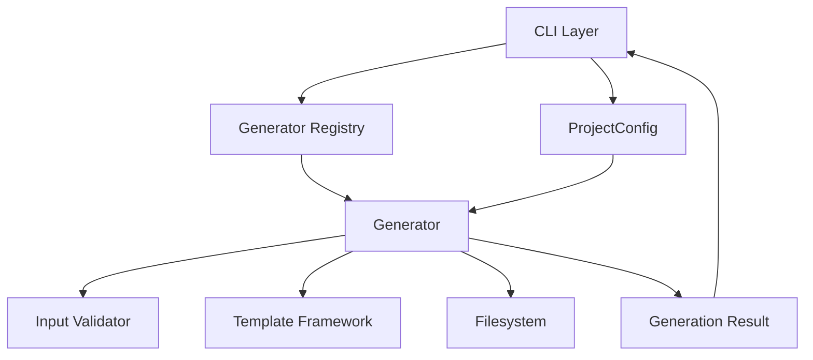
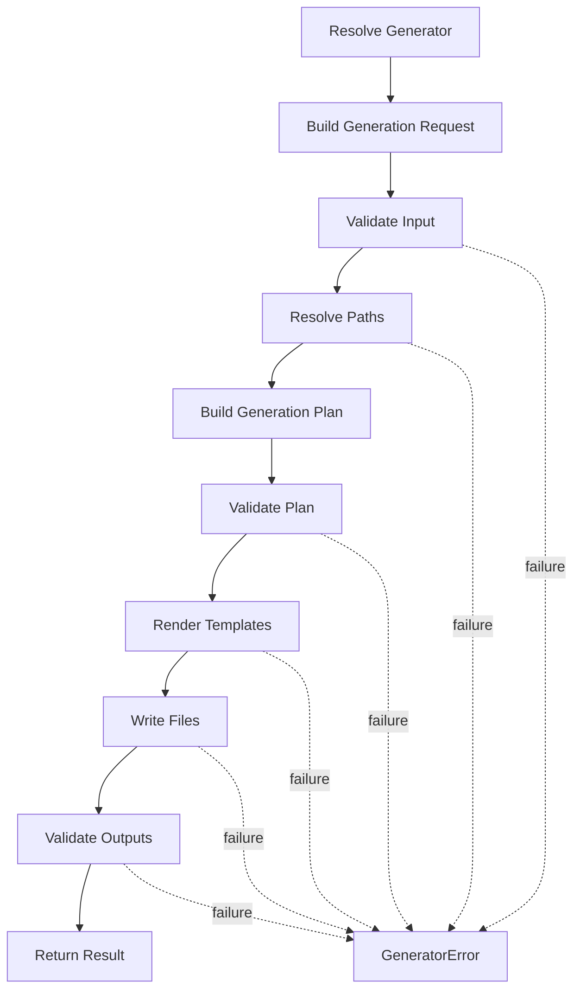

# OpenProjectLab Generator Framework

> Status: Active
> Scope: Generator contracts, lifecycle, execution, outputs, errors, and registry integration
> Audience: Maintainers, contributors, generator developers

OpenProjectLab（OPL）的 Generator Framework 負責將結構化設定、使用者輸入與 Template 轉換成實際的專案、課程或教材檔案。

Generator 是 OPL 的主要功能擴充單位。

目前已確認的 Generator 包括：

```text
bootstrap
course
week
```

本文件定義 Generator 的架構責任、共同契約、生命週期、輸入與輸出模型、錯誤處理、冪等性，以及與 CLI、Registry、Configuration Framework 和 Template Framework 的整合方式。

---

## 1. Framework Goals

Generator Framework 的核心目標包括：

* 提供一致的 Generator 執行方式
* 將業務邏輯與 CLI 分離
* 讓 Generator 可以獨立測試
* 集中處理輸入、輸出與錯誤
* 支援 Template 驅動的檔案產生
* 提供清楚的擴充契約
* 降低新增 Generator 的成本
* 讓自動化流程能穩定呼叫 Generator

---

## 2. Framework Responsibilities

Generator Framework 負責：

* 定義 Generator 的共同介面
* 接收結構化設定與輸入
* 驗證 Generator 專屬需求
* 決定產生流程
* 呼叫 Template Framework
* 建立目錄與檔案
* 處理覆寫策略
* 回報執行結果
* 將執行錯誤轉換為 Framework 例外
* 支援單元與整合測試

Generator Framework 不應負責：

* 解析 CLI 命令列
* 自行尋找設定檔
* 直接管理 Git Repository
* 處理 Pull Request
* 實作 Plugin Discovery
* 將所有 Template 邏輯寫入 Python
* 依賴目前 Shell 的工作目錄
* 儲存全域可變狀態

---

## 3. High-Level Architecture



---

## 4. Dependency Direction

建議依賴方向：

```text
CLI
  ↓
Registry
  ↓
Generator
  ↓
Template Framework
  ↓
Filesystem
```

Configuration Framework 以設定物件形式提供依賴：

```text
Configuration Framework
  ↓
ProjectConfig
  ↓
Generator
```

規則：

* CLI 可以選擇 Generator，但不能實作其業務邏輯。
* Registry 負責定位 Generator，不負責執行業務流程。
* Generator 可以使用 Template Framework。
* Template Framework 不應反向呼叫 Generator。
* Generator 不應直接解析 CLI Argument Namespace。
* Generator 不應重新載入 YAML 設定檔。
* Generator 應接收明確依賴，而不是從全域環境取得。

---

## 5. Generator Concept

Generator 是一個可被 Registry 註冊、可被 CLI 呼叫，並能產生一組明確輸出的元件。

概念介面：

```python
class Generator:
    name: str

    def generate(
        self,
        config: ProjectConfig,
        request: GenerationRequest,
    ) -> GenerationResult:
        ...
```

目前實作未必已使用完全相同的類別與方法名稱。

正式公開介面應以 Repository 中的程式碼與測試為準。

本文件主要定義架構方向與共同契約。

---

## 6. Generator Identity

每個 Generator 必須具有唯一且穩定的名稱。

例如：

```text
bootstrap
course
week
```

名稱應符合以下規則：

* 使用小寫。
* 使用簡短且清楚的英文單字。
* 避免底線與空白。
* 避免與 CLI 全域選項衝突。
* 與 Registry 中使用的名稱一致。
* 與 CLI 子命令名稱一致。
* 一旦公開使用，應避免任意更名。

概念上：

```python
class WeekGenerator:
    name = "week"
```

---

## 7. Generator Categories

目前 Generator 可分為以下層級。

### 7.1 Bootstrap Generator

負責建立 OPL 專案的基礎結構。

可能產生：

* 專案目錄
* 設定檔
* 文件結構
* 測試結構
* Git 與 CI 基礎檔案
* Template 目錄

Bootstrap Generator 應避免覆寫使用者既有內容，除非明確允許。

---

### 7.2 Course Generator

負責建立課程層級結構。

可能產生：

* 課程 Metadata
* 課程 README
* 課程大綱
* 週次目錄
* 教材資源目錄
* 評量結構

Course Generator 不應直接承擔所有 Week 內容產生邏輯。

需要建立週次內容時，應委派給 Week Generator 或共享服務。

---

### 7.3 Week Generator

負責建立單一週次教材結構。

可能產生：

* Lecture Notes
* Slides Source
* Lab
* Demo
* Assignment
* Quiz
* Metadata
* Instructor Notes

實際產出由 Template 與設定決定。

文件不應宣稱所有項目都已完成，除非實作與測試已確認。

---

## 8. Generator Lifecycle

建議 Generator 執行生命週期如下：

```text
Resolve Generator
  ↓
Build Request
  ↓
Validate Input
  ↓
Resolve Paths
  ↓
Build Generation Plan
  ↓
Validate Plan
  ↓
Render Templates
  ↓
Write Outputs
  ↓
Validate Results
  ↓
Return GenerationResult
```

Mermaid 表示：



---

## 9. Request Model

Generator 不應直接接收未結構化的 CLI 參數。

不建議：

```python
def run(args: argparse.Namespace):
    ...
```

建議使用結構化 Request：

```python
@dataclass(slots=True)
class GenerationRequest:
    target: Path
    overwrite: bool = False
    dry_run: bool = False
```

不同 Generator 可以定義專屬 Request：

```python
@dataclass(slots=True)
class WeekGenerationRequest:
    course_id: str
    week_number: int
    title: str
    target: Path
    overwrite: bool = False
```

好處包括：

* 不依賴 CLI Framework
* 型別清楚
* 容易測試
* 容易重複使用
* 未來可由 API、GUI 或 Automation 呼叫

---

## 10. Result Model

Generator 應回傳結構化結果，而不是只輸出文字。

概念設計：

```python
@dataclass(slots=True)
class GenerationResult:
    generator: str
    target: Path
    created_files: list[Path]
    updated_files: list[Path]
    skipped_files: list[Path]
    warnings: list[str]
```

CLI 可以將結果轉成使用者訊息：

```text
Generator: week
Created: 8 files
Skipped: 2 files
Target: courses/java/week-01
```

測試則可以直接驗證結果內容。

---

## 11. Generation Plan

在實際寫入檔案前，建議 Generator 先建立 Generation Plan。

概念模型：

```python
@dataclass(slots=True)
class PlannedFile:
    source_template: Path
    destination: Path
    context: dict[str, object]
    overwrite: bool
```

```python
@dataclass(slots=True)
class GenerationPlan:
    directories: list[Path]
    files: list[PlannedFile]
```

Generation Plan 的優點：

* 寫入前可驗證衝突
* 容易實作 Dry Run
* 容易測試
* 可以預覽輸出
* 可以統一處理覆寫規則
* 減少執行到一半才失敗的風險

---

## 12. Validation Stages

Generator 驗證應分成幾個階段。

### 12.1 Request Validation

驗證輸入內容：

* 名稱是否為空
* 週次是否有效
* 目標路徑是否提供
* 必要 Metadata 是否存在
* 欄位型別是否正確

例如：

```python
if request.week_number < 1:
    raise GeneratorValidationError(
        "week_number 必須大於或等於 1"
    )
```

---

### 12.2 Configuration Validation

驗證 Generator 所需設定：

* Template Root 是否提供
* 輸出根目錄是否有效
* Generator 專屬設定是否合理
* Encoding 是否受支援

只驗證本次執行會使用的設定。

---

### 12.3 Plan Validation

寫入前驗證：

* 目標路徑是否重複
* 是否會覆寫既有檔案
* 是否有路徑衝突
* Template 是否存在
* 目標是否超出允許範圍
* 檔名是否有效

---

### 12.4 Output Validation

寫入後可驗證：

* 預期檔案是否存在
* 檔案是否可讀
* 必要內容是否產生
* 是否遺留暫存檔
* 輸出結構是否符合契約

---

## 13. Path Handling

Generator 必須使用：

```python
pathlib.Path
```

不應使用字串拼接建立路徑。

不建議：

```python
output = root + "\\" + course + "\\week-01"
```

建議：

```python
output = root / course / "week-01"
```

規則：

* Generator 接收解析後的基準路徑。
* 不硬編碼磁碟機。
* 不依賴目前工作目錄。
* 跨平台測試使用 `tmp_path`。
* 所有使用者輸入路徑都需正規化。
* 檢查輸出是否超出允許根目錄。

---

## 14. Filesystem Boundary

Generator 可以負責決定「要產生什麼」，但實際檔案操作可逐步抽離成 Filesystem Service。

概念介面：

```python
class FileWriter:
    def write_text(
        self,
        path: Path,
        content: str,
        *,
        overwrite: bool,
        encoding: str = "utf-8",
    ) -> None:
        ...
```

好處：

* 集中處理 Encoding
* 集中處理換行
* 集中處理覆寫
* 容易模擬與測試
* 未來可支援 Transactional Write
* 減少不同 Generator 行為不一致

目前若尚未建立此服務，可以先維持簡單實作，但應遵守一致規則。

---

## 15. Template Integration

Generator 應提供 Template Context，Template Framework 負責渲染。

建議流程：

```text
Generator
  ↓
Prepare Context
  ↓
Template Framework
  ↓
Rendered Text
  ↓
Filesystem Writer
```

Generator Context 範例：

```python
context = {
    "course_name": request.course_name,
    "week_number": request.week_number,
    "week_title": request.title,
}
```

Generator 不應：

* 在 Template 中放入複雜計算。
* 讓 Template 直接讀取設定檔。
* 讓 Template 自行決定輸出路徑。
* 將所有文件內容用 Python 字串硬編碼。
* 允許未驗證 Context 任意存取系統資源。

---

## 16. Template Selection

Generator 應明確決定使用哪個 Template。

例如：

```text
templates/
└── week/
    ├── README.md.j2
    ├── lecture-notes.md.j2
    ├── lab.md.j2
    └── quiz.md.j2
```

Template Selection 可以來自：

* Generator 固定契約
* Configuration
* Request
* 未來 Plugin

選擇規則必須：

* 可預期
* 有文件
* 可測試
* 缺失時產生清楚錯誤
* 不依賴模糊的搜尋順序

---

## 17. Overwrite Policy

Generator 必須明確定義既有檔案的處理方式。

常見策略：

### Fail

只要目標存在就失敗。

適合：

* 避免意外覆寫
* 初始專案建立
* 關鍵設定檔

### Skip

保留既有檔案並繼續。

適合：

* 重複執行
* 部分增量產生
* 使用者可能已修改的內容

### Overwrite

覆寫目標檔案。

只能在使用者明確允許時採用。

### Merge

合併既有內容。

這通常最複雜，必須有明確格式與測試。

---

## 18. Recommended Default Overwrite Behavior

建議預設：

```text
overwrite = false
```

Generator 遇到既有檔案時：

* 不應默默覆寫。
* 應回報衝突。
* 可選擇 Skip 或 Fail。
* 具體策略必須由文件與測試定義。

啟用覆寫時，CLI 應使用明確選項，例如：

```text
--force
```

或：

```text
--overwrite
```

目前若尚未實作，不應在 CLI Reference 中宣稱可用。

---

## 19. Idempotency

理想上，相同輸入重複執行 Generator，不應產生不可預期結果。

冪等性不一定表示第二次完全不寫入，而是：

* 不重複建立相同內容
* 不破壞使用者修改
* 不持續新增重複區塊
* 結果狀態可預期
* 衝突處理一致

應明確定義每個 Generator 的重複執行行為。

---

## 20. Dry Run

未來建議支援 Dry Run：

```text
opl week --dry-run
```

Dry Run 應：

* 建立完整 Generation Plan
* 執行輸入驗證
* 執行路徑與衝突驗證
* 不建立目錄
* 不寫入檔案
* 顯示預計建立、更新與跳過的項目

概念結果：

```text
Would create:
  courses/java/week-01/README.md
  courses/java/week-01/lab.md

Would skip:
  courses/java/week-01/quiz.md
```

此功能若未實作，應標示為規劃中。

---

## 21. Atomicity

Generator 執行失敗時，不應留下難以判斷的半完成狀態。

理想策略包括：

### Validate Before Write

先完成所有可預先進行的驗證。

### Temporary Directory

先寫入暫存目錄，成功後再移動到目標。

### Temporary File

單一檔案先寫入暫存檔，再以原子方式替換。

### Rollback

記錄已建立的檔案，失敗時移除。

完整 Transactional Generation 較複雜，可分階段導入。

現階段至少應做到：

* 寫入前驗證衝突。
* 錯誤訊息指出已完成的部分。
* 不忽略部分失敗。
* 不留下隱藏暫存檔。

---

## 22. Error Model

建議 Generator 使用專用例外階層：

```text
OpenProjectLabError
  └── GeneratorError
      ├── GeneratorValidationError
      ├── GeneratorNotFoundError
      ├── TemplateNotFoundError
      ├── OutputConflictError
      └── OutputWriteError
```

目前實作未必已具有完整階層。

若只有單一自訂例外，錯誤訊息仍應清楚指出原因與位置。

---

## 23. Error Ownership

不同錯誤應由最接近來源的元件產生。

| 錯誤                   | 負責元件                    |
| -------------------- | ----------------------- |
| 無效 CLI 參數            | CLI                     |
| 無效設定結構               | Configuration Framework |
| 找不到 Generator        | Registry                |
| Generator Request 無效 | Generator               |
| 找不到 Template         | Template Framework      |
| 輸出衝突                 | Generator               |
| 寫入失敗                 | Filesystem Layer        |
| 顯示錯誤訊息與 Exit Code    | CLI                     |

---

## 24. Error Message Requirements

錯誤訊息應包含：

* Generator 名稱
* 發生問題的操作
* 相關檔案或路徑
* 問題原因
* 可採取的修正方式

較佳：

```text
Week Generator 無法建立輸出：
目標檔案已存在：courses/java/week-01/README.md
請使用新的目標目錄，或啟用明確的覆寫選項。
```

較差：

```text
Generation failed.
```

---

## 25. Exception Chaining

底層檔案系統或 Template 錯誤應保留原始原因。

```python
try:
    target.write_text(content, encoding="utf-8")
except OSError as exc:
    raise OutputWriteError(
        f"無法寫入輸出檔案：{target}"
    ) from exc
```

這讓 CLI 可以顯示高階訊息，也讓開發者保留完整除錯資訊。

---

## 26. Registry Integration

Generator 必須透過 Registry 註冊。

概念流程：

```text
Application Startup
  ↓
Create Registry
  ↓
Register Generators
  ↓
CLI Requests Generator Name
  ↓
Registry Resolves Generator
  ↓
Generator Executes
```

概念程式碼：

```python
registry.register(BootstrapGenerator())
registry.register(CourseGenerator())
registry.register(WeekGenerator())
```

或：

```python
registry.register(BootstrapGenerator)
```

Registry 儲存實例或類別的選擇，必須有一致契約。

---

## 27. Instance Registration vs Class Registration

### Instance Registration

```python
registry.register(WeekGenerator())
```

優點：

* 簡單
* 適合無狀態 Generator
* 立即可用

缺點：

* 生命週期由 Registry 隱含管理
* 較難注入執行時依賴
* 可能意外保留狀態

### Class Registration

```python
registry.register(WeekGenerator)
```

優點：

* 可在執行時建立實例
* 容易注入依賴
* 生命週期較清楚

缺點：

* Registry 邏輯較複雜
* 需要統一建構契約

若 Generator 應保持無狀態，兩種方式都可行，但專案應選擇一套一致規則。

重大變更應記錄於 ADR。

---

## 28. Stateless Generators

建議 Generator 儘可能保持無狀態。

不建議：

```python
class WeekGenerator:
    def __init__(self):
        self.generated_files = []
```

如果同一實例被重複使用，可能導致不同執行互相影響。

建議：

```python
def generate(...) -> GenerationResult:
    generated_files: list[Path] = []
```

執行狀態應保存在：

* 區域變數
* Request
* Generation Plan
* Generation Result

而不是 Generator 實例中。

---

## 29. Dependency Injection

Generator 需要外部服務時，應透過明確方式注入。

例如：

```python
class WeekGenerator:
    def __init__(
        self,
        renderer: TemplateRenderer,
        writer: FileWriter,
    ) -> None:
        self._renderer = renderer
        self._writer = writer
```

好處：

* 容易測試
* 可替換實作
* 不依賴隱藏全域物件
* 未來可支援 Plugin
* 責任邊界清楚

現階段可以先使用簡單依賴，但不要讓 Generator 內部到處直接建立服務。

---

## 30. Logging and User Output

Generator 不應直接負責所有使用者輸出。

不建議：

```python
print("Generating...")
print("Done")
```

建議：

* Generator 回傳結果。
* Generator 使用 Logger 記錄技術資訊。
* CLI 決定如何顯示給使用者。

這樣未來可以支援：

* CLI
* GUI
* Web API
* JSON Output
* Automation
* Silent Mode

---

## 31. Progress Reporting

長時間 Generator 未來可能需要進度事件。

概念事件：

```python
GenerationStarted
DirectoryCreated
FileRendered
FileWritten
FileSkipped
GenerationCompleted
GenerationFailed
```

初期不需要建立複雜 Event Bus。

可以先透過：

* Callback
* Logger
* Result Collection

逐步演進。

進度機制不應改變 Generator 的核心結果契約。

---

## 32. Testing Strategy

Generator 測試應包含：

* Unit Tests
* Integration Tests
* Contract Tests
* Regression Tests

---

## 33. Unit Tests

Unit Test 應聚焦於單一 Generator 行為。

例如：

```python
def test_week_generator_creates_expected_files(tmp_path):
    ...
```

應測試：

* 有效 Request
* 無效 Request
* 缺少設定
* Template 缺失
* 既有輸出衝突
* 覆寫行為
* UTF-8 內容
* Result 內容

---

## 34. Integration Tests

Integration Test 應涵蓋：

```text
CLI
  ↓
Configuration
  ↓
Registry
  ↓
Generator
  ↓
Template
  ↓
Filesystem
```

例如：

```powershell
python -m pytest tests\integration\test_cli_integration.py -v
```

實際測試檔案名稱應以 Repository 為準。

整合測試不應依賴網路，也不應修改 Repository 的正式目錄。

---

## 35. Contract Tests

所有 Generator 可以共享一組基本契約測試。

例如：

* Name 不為空
* Name 唯一
* 可以被 Registry 解析
* 成功時回傳結果
* 失敗時使用 Framework 例外
* 不修改傳入設定
* 不依賴目前工作目錄
* 使用 UTF-8
* 不在未允許時覆寫檔案

契約測試有助於未來 Plugin Generator 保持一致行為。

---

## 36. Test Isolation

Generator 測試必須使用：

```python
tmp_path
```

例如：

```python
def test_generator_output_is_isolated(tmp_path):
    target = tmp_path / "output"
    ...
```

不得：

* 寫入 `F:\OpenProjectLab`
* 寫入真實 `courses/`
* 修改 `config/default.yaml`
* 依賴使用者 Home
* 依賴網路
* 依賴測試執行順序

---

## 37. Golden File Tests

對大型生成內容，可以使用 Golden File 測試。

概念：

```text
tests/
└── fixtures/
    └── expected/
        └── week-readme.md
```

測試比較：

* 實際輸出
* 預期 Fixture

注意事項：

* Golden File 必須容易 Review。
* 不應包含環境專屬路徑。
* 日期與隨機值應固定。
* 大量變更時應確認不是盲目更新 Snapshot。
* Template 小變更可能造成大範圍差異。

---

## 38. Determinism

相同輸入應產生相同輸出。

應避免未受控制的：

* 目前日期
* 隨機 ID
* Dictionary 非預期順序
* 作業系統專屬換行
* 絕對路徑
* 執行環境資訊

需要日期或 ID 時，應透過 Request 或可注入服務提供。

例如：

```python
class Clock:
    def today(self) -> date:
        ...
```

---

## 39. Encoding and Newlines

所有文字輸出預設應使用：

```text
UTF-8
```

建議：

```python
path.write_text(content, encoding="utf-8")
```

換行策略應保持一致。

跨平台 Repository 通常可由：

* Git
* `.gitattributes`
* pre-commit
* Formatter

共同管理。

Generator 不應在不同檔案中混用不同換行策略。

---

## 40. Security Considerations

Generator 必須防範：

* 路徑遍歷
* 任意檔案覆寫
* Template Injection
* 不受信任程式碼執行
* Shell Injection
* 惡意檔名
* Symbolic Link Escape
* Plugin 來源不明
* 敏感資料輸出

例如，使用者提供：

```text
../../important-file
```

不能直接當成輸出路徑。

應確認解析後路徑仍位於允許的 Output Root 內。

---

## 41. Output Root Containment

概念檢查：

```python
resolved_target = target.resolve()
resolved_root = output_root.resolve()

if not resolved_target.is_relative_to(resolved_root):
    raise GeneratorValidationError(
        "輸出路徑超出允許範圍"
    )
```

Python 版本相容性與 Symlink 行為必須納入測試。

---

## 42. Performance Considerations

大多數教材與專案生成不需要過早最佳化。

仍應避免：

* 重複讀取相同 Template
* 多次解析相同設定
* 無限制遞迴掃描
* 將大量二進位檔案載入記憶體
* 不必要地渲染未使用 Template
* 對每個檔案重建相同 Context

若需要最佳化，應先量測。

---

## 43. Public SDK Boundary

未來第三方開發者可能透過 SDK 建立 Generator。

公開 SDK 應只暴露穩定契約，例如：

```python
from generator.sdk import (
    BaseGenerator,
    GenerationRequest,
    GenerationResult,
    GeneratorError,
)
```

不應暴露：

* CLI Parser 內部類別
* Registry 私有資料結構
* Template Engine 私有實作
* Repository 專屬路徑常數
* 不穩定的 Helper

SDK 契約形成後，修改成本會顯著增加，因此必須保守設計。

---

## 44. Adding a New Generator

新增 Generator 應遵循以下流程。

### Step 1：定義需求

回答：

* 要解決什麼問題？
* 為什麼不能由既有 Generator 完成？
* 產出內容是什麼？
* 使用者如何呼叫？
* 是否屬於核心功能或 Plugin？

### Step 2：設計契約

定義：

* Generator Name
* Request
* Result
* Required Configuration
* Template
* Output Structure
* Error Behavior
* Overwrite Behavior
* Idempotency

### Step 3：更新文件

至少更新：

* Generator Framework
* CLI Reference
* Configuration Reference
* Template Reference
* README
* Changelog

### Step 4：實作

建立 Generator 類別與必要服務。

### Step 5：註冊

加入 Registry。

### Step 6：CLI 整合

新增或對應子命令。

### Step 7：測試

建立：

* Unit Tests
* Registry Tests
* CLI Tests
* Integration Tests
* Error Tests

### Step 8：Automation

執行：

```powershell
git diff --check
pre-commit run --all-files
python -m pytest
```

### Step 9：Code Review

使用統一 Code Review Checklist。

---

## 45. Proposed Directory Structure

建議結構：

```text
generator/
├── core/
│   ├── config.py
│   ├── exceptions.py
│   ├── registry.py
│   └── result.py
├── generators/
│   ├── bootstrap_generator.py
│   ├── course_generator.py
│   └── week_generator.py
├── templates/
├── sdk/
│   ├── base.py
│   ├── request.py
│   ├── result.py
│   └── exceptions.py
└── cli/
    └── main.py
```

實際 Repository 結構可以不同，但責任分層應保持清楚。

---

## 46. Current Limitations

目前 Generator Framework 可能仍有以下限制：

* 共同 Base Generator 契約尚未固定
* Request Model 可能尚未結構化
* Result Model 可能尚未建立
* Generator 可能直接輸出文字
* 覆寫策略尚未標準化
* Dry Run 尚未實作
* Transactional Write 尚未實作
* Filesystem Service 尚未抽離
* 進度事件尚未建立
* Plugin Generator 契約尚未完成
* SDK 公開介面仍在演進
* Generator 生命週期尚未完全標準化

文件必須區分：

* 目前已實作
* 建議架構
* 未來規劃

不得將設計提案描述為已完成能力。

---

## 47. Generator Review Checklist

新增或修改 Generator 時，請確認：

### Architecture

* [ ] Generator 位於正確模組。
* [ ] CLI 不包含 Generator 業務邏輯。
* [ ] Generator 不自行載入 YAML。
* [ ] Generator 不依賴目前工作目錄。
* [ ] 依賴方向符合 Architecture Overview。
* [ ] 公開介面保持最小。

### Contract

* [ ] Generator 名稱唯一。
* [ ] Request 結構清楚。
* [ ] Result 結構清楚。
* [ ] 必要設定明確。
* [ ] 輸出結構明確。
* [ ] 重複執行行為明確。
* [ ] 覆寫策略明確。

### Filesystem

* [ ] 使用 `pathlib.Path`。
* [ ] 使用 UTF-8。
* [ ] 路徑限制在允許範圍。
* [ ] 不會未經允許覆寫檔案。
* [ ] 錯誤不會留下難以理解的部分輸出。
* [ ] Windows 與 POSIX 行為已考量。

### Templates

* [ ] Template 位於正確位置。
* [ ] Context 欄位清楚。
* [ ] Template 缺失時錯誤明確。
* [ ] Template 不包含複雜業務邏輯。
* [ ] Template Reference 已更新。

### Errors

* [ ] 使用適當的 Framework 例外。
* [ ] 錯誤訊息可操作。
* [ ] 原始例外透過 Chaining 保留。
* [ ] CLI 能轉換成正確 Exit Code。
* [ ] 不會靜默忽略錯誤。

### Tests

* [ ] 正常流程有測試。
* [ ] 錯誤流程有測試。
* [ ] 邊界條件有測試。
* [ ] 重複執行有測試。
* [ ] 覆寫策略有測試。
* [ ] Registry 整合有測試。
* [ ] CLI 整合有測試。
* [ ] 使用 `tmp_path`。
* [ ] 測試不依賴網路或本機路徑。

### Documentation and Automation

* [ ] Architecture 文件已更新。
* [ ] CLI Reference 已更新。
* [ ] Configuration Reference 已更新。
* [ ] Changelog 已更新（如適用）。
* [ ] 必要時已新增 ADR。
* [ ] `git diff --check` 通過。
* [ ] `pre-commit run --all-files` 通過。
* [ ] `python -m pytest` 通過。

---

## 48. Related Documents

* [Architecture Overview](overview.md)
* [Configuration Framework](configuration-framework.md)
* [Template Framework](template-framework.md)
* [Generator Registry](registry.md)
* [SDK Architecture](sdk.md)
* [CLI Reference](../reference/cli.md)
* [Configuration Reference](../reference/configuration.md)
* [Template Reference](../reference/template.md)
* [Development Workflow](../development/development-workflow.md)
* [Code Review Checklist](../development/code-review-checklist.md)

---

> **Generator Framework 的價值，不只是產生檔案，而是建立一套可預期、可測試、可擴充且不破壞使用者內容的生成契約。**
