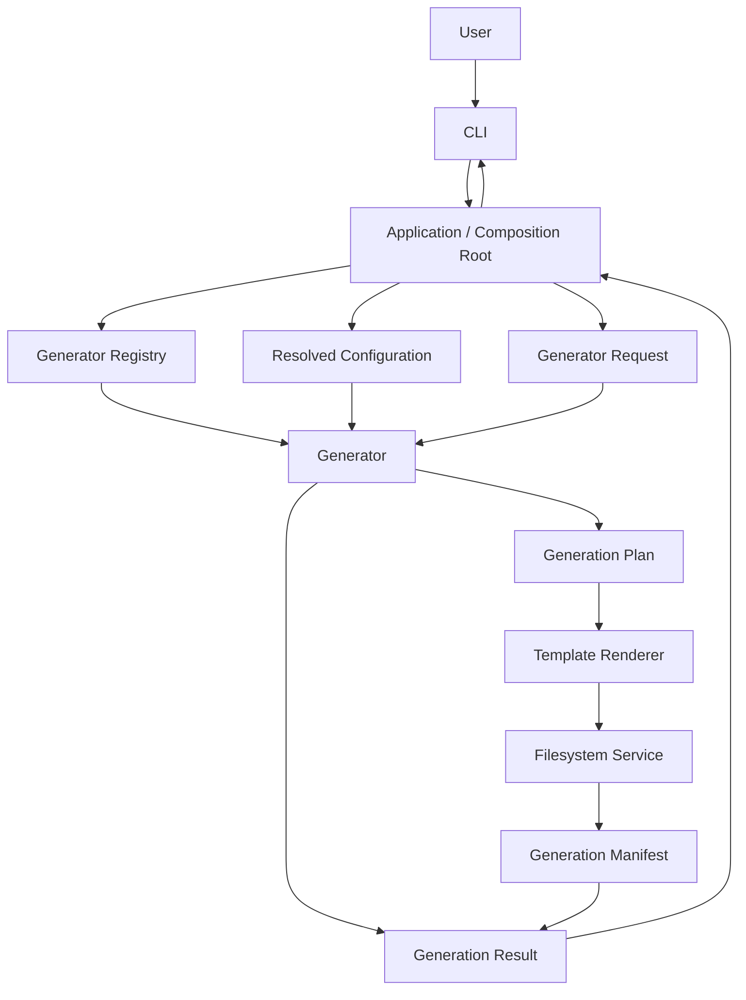

# OpenProjectLab Generator Architecture

> Status: Active and Evolving
> Milestone: 3 — Core Framework
> Last updated: 2026-07-31
> Audience: Maintainers, contributors, Generator developers, Plugin developers
> Scope: Generator responsibilities, contracts, lifecycle, registry integration, dependency boundaries, results, errors, testing, extension, and compatibility

OpenProjectLab（OPL）的 Generator Framework 負責把經過驗證的使用者需求、設定與 Template Context，轉換成可預期、可測試且可追蹤的專案輸出。

Generator 不只是「呼叫 Template 並寫入檔案」。

一個完整 Generator 應負責協調：

* 輸入驗證
* 路徑與設定解析
* Template 選擇
* Template Context 建立
* Generation Plan 建立
* 輸出衝突檢查
* Dry Run
* Filesystem 寫入
* Manifest 記錄
* 結構化結果回傳
* 錯誤語意轉換

本文件同時描述目前已存在的能力與 Milestone 3 預計穩定的核心契約。

凡尚未出現在程式碼與測試中的能力，都應視為提案，而不是已完成的功能。

本文件使用以下標記區分成熟度：

* **Implemented**：已有程式碼與測試支援。
* **In progress**：已在至少一個核心 Generator 導入，但尚未全面一致。
* **Proposed**：Milestone 3 的目標設計，尚未成為穩定公開契約。

---

## 1. Goals

Generator Framework 的核心目標包括：

* 提供一致的 Generator 執行模型。
* 將 CLI 與實際產生邏輯分離。
* 將 Template Rendering 與 Filesystem 操作分離。
* 支援多種 Generator，而不持續修改 CLI 核心流程。
* 提供可測試的輸入、計畫與結果。
* 支援 Dry Run。
* 保護既有使用者檔案。
* 保持輸出具決定性。
* 提供穩定的 Registry 整合方式。
* 為 Plugin Generator 建立可擴充基礎。
* 讓未來 Generator API 可以逐步穩定。
* 讓產出結果可被 Manifest、Upgrade 與 Audit Framework 使用。

---

## 2. Non-Goals

Generator Framework 不應：

* 直接解析原始 CLI Argument。
* 直接呼叫 `sys.exit()`。
* 管理 Console 顯示格式。
* 自行決定 Process Exit Code。
* 自行載入所有全域設定。
* 在多個 Generator 中重複實作 Template Engine。
* 在多個 Generator 中重複實作 Filesystem 安全規則。
* 直接執行 Git Commit 或 Push。
* 自動覆寫使用者內容。
* 將特定 Generator 的邏輯加入 Registry 核心。
* 依賴目前 Working Directory。
* 隱藏未預期的程式錯誤。

---

## 3. Current Generators

目前 OPL 的核心 Generator 包括：

```text
bootstrap
course
week
```

### Bootstrap Generator

負責建立完整的 OPL 專案或課程專案骨架。

目前狀態：**In progress**。Bootstrap Generator 是共用
`GenerationResult` 契約的第一個遷移切片；完成測試與品質檢查後，再將相同模式擴展至
Course Generator 與 Week Generator。

可能產出：

```text
README.md
LICENSE
CONTRIBUTING.md
.gitignore
course.yaml
docs/
assets/
templates/
weeks/
```

### Course Generator

負責建立課程層級內容。

目前主要產出課程 README，未來可擴充：

* 課程 Metadata
* 課程大綱
* 週次索引
* 教學資源目錄
* 評量結構

### Week Generator

負責建立單一週次或教學單元內容。

可能包含：

* README
* Lecture Notes
* Lab
* Demo
* Assignment
* Quiz
* Resources

正式產出仍應以 Generator 實作、Template Manifest 與測試為準。

---

## 4. High-Level Architecture



目前實作可能仍由 Generator 直接呼叫 Template Renderer 與 Filesystem。

Generation Plan 與 Application Layer 的完整分離屬於 Milestone 3 的演進方向。

---

## 5. Dependency Direction

建議依賴方向：

```text
CLI
  ↓
Application / Composition Root
  ↓
Generator Registry
  ↓
Generator Contract
  ↓
Concrete Generator
  ↓
Template and Filesystem Protocols
```

主要規則：

* CLI 依賴 Generator Contract，不依賴 Generator 內部細節。
* Registry 只管理 Generator 的註冊與建立。
* Concrete Generator 可依賴 Template、Filesystem 與 Manifest 介面。
* Template Framework 不依賴 Generator。
* Filesystem Framework 不依賴 Generator。
* Configuration Framework 不依賴 Generator。
* Generator 不依賴 CLI Parser。
* Core Framework 不依賴 Plugin 實作。
* Plugin Generator 依賴公開 Generator API，而不是內部私有模組。

---

## 6. Generator Responsibilities

Generator 應負責：

* 驗證 Generator-specific Request。
* 解析 Generator-specific 預設值。
* 建立必要的 Domain Context。
* 選擇 Template。
* 建立 Template Context。
* 定義輸出檔案與目錄。
* 定義每個檔案的 Write Policy。
* 建立完整 Generation Plan。
* 協調 Template Rendering。
* 協調 Filesystem 執行。
* 記錄 Manifest Metadata。
* 回傳結構化 Generation Result。
* 增加具有 Generator 語意的錯誤資訊。

Generator 不應負責：

* 解析 `argparse.Namespace`。
* 自行尋找預設設定檔。
* 直接顯示成功或失敗訊息。
* 決定錯誤 Exit Code。
* 實作 Path Traversal 防護。
* 實作 Jinja2 Environment 細節。
* 直接處理所有 `OSError`。
* 決定 Git 工作流程。
* 執行 Repository-level CI。

---

## 7. Composition Root

依賴組裝應位於 Application 或 CLI Composition Root。

概念：

```python
config = ProjectConfig.load(config_path)

filesystem = FileSystem(
    output_root=config.output_root,
)

renderer = TemplateRenderer(
    template_root=config.template_root,
)

registry = build_registry()

generator = registry.create(generator_name)

result = generator.generate(
    request,
    renderer=renderer,
    filesystem=filesystem,
)
```

Composition Root 負責：

* 載入設定。
* 套用 CLI Override。
* 建立 Renderer。
* 建立 Filesystem。
* 建立 Registry。
* 建立 Generator Request。
* 執行 Generator。
* 格式化最終結果。
* 將 Exception 映射為 Exit Code。

Generator 不應重新完成上述全域組裝流程。

---

## 8. Generator Contract

Milestone 3 應逐步建立正式 Generator Contract。

概念：

```python
from typing import Protocol

class GeneratorProtocol(Protocol):
    name: str
    description: str

    def generate(
        self,
        request: GeneratorRequest,
    ) -> GenerationResult:
        ...
```

若需要泛型 Request 與 Result：

```python
from typing import Protocol, TypeVar

RequestT = TypeVar("RequestT")
ResultT = TypeVar("ResultT")

class GeneratorProtocol(
    Protocol[RequestT, ResultT],
):
    name: str
    description: str

    def generate(
        self,
        request: RequestT,
    ) -> ResultT:
        ...
```

實際採用泛型前，應評估：

* API 複雜度
* Registry 建立方式
* Plugin 相容性
* Static Type Checking
* CLI Integration
* 測試可讀性

現階段不應只為抽象化而增加不必要複雜度。

---

## 9. Generator Identity

每個 Generator 至少應具有：

```python
class CourseGenerator:
    name = "course"
    description = "Generate a course scaffold"
```

`name` 是 Registry、CLI 與 Plugin Metadata 使用的穩定識別碼。

建議規則：

```text
^[a-z][a-z0-9-]*$
```

合法：

```text
bootstrap
course
week
course-pack
```

不合法：

```text
Course
week generator
../week
--course
course\week
```

Generator Name 不應由 Class Name 自動推導，避免重構 Class 時改變公開識別碼。

---

## 10. Generator Metadata

未來可擴充：

```python
@dataclass(frozen=True, slots=True)
class GeneratorMetadata:
    name: str
    description: str
    version: str
    api_version: str
    provider: str
```

Plugin Generator 可能還需要：

* Plugin ID
* Minimum OPL Version
* Supported Template Version
* Capabilities
* Experimental Flag
* Deprecation Status

Metadata 應為結構化資料，不應依賴解析 Docstring。

---

## 11. Generator Request

不建議 Generator 接收大量鬆散的 `**kwargs` 作為長期公開 API。

較佳方式是建立明確 Request Model。

例如：

```python
from dataclasses import dataclass
from pathlib import Path

@dataclass(frozen=True, slots=True)
class CourseGenerationRequest:
    output_root: Path
    course_id: str
    title: str
    weeks: int
    language: str = "zh-TW"
    overwrite: bool = False
    dry_run: bool = False
```

Week Request：

```python
@dataclass(frozen=True, slots=True)
class WeekGenerationRequest:
    output_root: Path
    course_id: str
    week_number: int
    title: str
    overwrite: bool = False
    dry_run: bool = False
```

Request Model 的優點：

* 輸入契約清楚。
* 型別容易檢查。
* 測試容易建立。
* 不依賴 CLI。
* Plugin 與 SDK 容易使用。
* 未來可進行版本管理。
* 可以集中定義必要與選填欄位。

---

## 12. Request Validation

Generator-specific 驗證應發生在產生任何輸出之前。

例如：

```python
if request.week_number < 1:
    raise GeneratorValidationError(
        "week_number 必須大於或等於 1"
    )
```

常見驗證：

* 必要欄位不可為空。
* Week Number 必須為正整數。
* Course Slug 必須符合格式。
* Output Name 必須為合法相對路徑。
* Template Name 必須存在。
* Weeks 必須在合理範圍。
* Language Code 必須符合支援格式。
* 不支援的模式必須拒絕。
* Dry Run 與 Write Policy 不得產生矛盾。

路徑安全與 Output Root Containment 應由 Filesystem Layer再次驗證。

---

## 13. Configuration Integration

Generator 不應接收完整的未解析 YAML Mapping，然後自行理解所有設定結構。

不建議：

```python
generator.generate(
    request,
    config=raw_yaml_data,
)
```

建議由 Composition Root 先解析：

```python
settings = GeneratorSettings(
    template_root=config.template_root,
    output_root=config.output_root,
    default_overwrite=config.overwrite,
)
```

再注入 Generator 或相關 Service。

這樣可以：

* 降低 Generator 與 YAML Schema 耦合。
* 讓 Configuration Schema 可演進。
* 讓 Generator Unit Test 不必建立完整設定檔。
* 讓 CLI Override 的優先順序集中處理。
* 避免不同 Generator 各自解析相同設定。

---

## 14. Template Context

Generator 負責建立 Template 所需的最小 Context。

例如：

```python
context = {
    "course_name": request.title,
    "course_id": request.course_id,
    "duration_weeks": request.weeks,
    "language": request.language,
}
```

原則：

* 只傳入 Template 需要的資料。
* 不傳入完整 `ProjectConfig`。
* 不傳入 CLI Namespace。
* 不傳入 Filesystem Service。
* 不傳入 Secret。
* Context Key 必須有文件。
* 必要欄位缺失時應失敗。
* Context 結構應具決定性。
* 不應在 Template 中執行業務邏輯。

Template Context 的正式契約應同步記錄於：

* Generator Architecture
* Template Reference
* Generator-specific Reference
* Template Tests

---

## 15. Generation Lifecycle

**Proposed** 的標準生命週期：

```text
Receive Request
  ↓
Validate Request
  ↓
Resolve Generator Settings
  ↓
Build Template Context
  ↓
Build Generation Plan
  ↓
Validate Plan
  ↓
Render All Templates
  ↓
Validate Rendered Content
  ↓
Apply Filesystem Operations
  ↓
Update Manifest
  ↓
Return Generation Result
```

任何寫入應盡量延後到：

* Request 已完成驗證。
* Template 已完成解析。
* Plan 已完成檢查。
* 輸出衝突已被識別。

這可降低部分輸出與中途失敗。

---

## 16. Generation Plan

Milestone 3 建議導入明確的 Generation Plan。此模型目前為
**Proposed**，不得在尚未落地前視為穩定公開 API。

概念：

```python
@dataclass(frozen=True, slots=True)
class PlannedFile:
    template_name: str
    destination: Path
    context: Mapping[str, object]
    overwrite: bool = False
```

或將 Rendering 與 Filesystem 分離：

```python
@dataclass(frozen=True, slots=True)
class PlannedOutput:
    destination: Path
    content: str
    policy: WritePolicy
```

Generation Plan 應包含：

* Planned Directories
* Planned Files
* Template Source
* Destination
* Write Policy
* Ownership
* Validation Rules
* Manifest Metadata

---

## 17. Plan Validation

實際寫入前至少驗證：

* Destination 不重複。
* Destination 為合法相對路徑。
* Destination 位於 Output Root。
* Template Name 合法。
* Template 存在。
* Write Policy 已定義。
* 不存在目錄與檔案名稱衝突。
* 所有必要 Context 已存在。
* Framework-owned 與 User-owned File 已區分。
* Dry Run 可以完整表示所有操作。

Plan Validation 失敗時，不應建立任何正式輸出。

---

## 18. Template Rendering Boundary

Template Renderer 應負責：

* Template Root 驗證
* Template Resolution
* Context Undefined Handling
* Template Syntax Handling
* Rendering
* Encoding 與文字輸出規則

Generator 應負責：

* 選擇 Template
* 建立 Context
* 指定 Destination
* 決定輸出 Policy

不應讓 Template Renderer 決定：

* Course ID
* Week Number
* Output Root
* Generator Name
* CLI Behavior

---

## 19. Filesystem Boundary

Generator 應透過 Filesystem Service 或 Protocol 寫入檔案。

不建議在 Generator 中散落：

```python
target.parent.mkdir(
    parents=True,
    exist_ok=True,
)

target.write_text(
    content,
    encoding="utf-8",
)
```

建議：

```python
result = filesystem.write_text(
    destination,
    content,
    policy=WritePolicy.ERROR_IF_EXISTS,
)
```

Filesystem Layer 應統一負責：

* UTF-8
* Newline
* Path Containment
* Directory Creation
* Existing File Policy
* Atomic Write
* Cleanup
* Filesystem Exception

---

## 20. Write Policy

Generator 應明確指定每個輸出的 Write Policy。

建議 Policy：

```text
ERROR_IF_EXISTS
SKIP_IF_EXISTS
OVERWRITE
UPDATE_IF_CHANGED
```

安全預設應優先考慮：

```text
ERROR_IF_EXISTS
```

不能把：

```python
overwrite=True
```

作為所有 Generator 的長期安全預設。

對使用者可能編輯的檔案，應避免默認覆寫。

---

## 21. File Ownership

建議 Generation Plan 區分：

### User-owned

產生後主要由使用者維護。

例如：

* README
* Lecture Notes
* Lab
* Assignment

### Framework-owned

由 OPL 持續管理。

例如：

* Manifest
* Generated Metadata
* Internal State

概念：

```python
from enum import StrEnum


class FileOwnership(StrEnum):
    USER = "user"
    FRAMEWORK = "framework"
```

不同 Ownership 可使用不同更新策略。

---

## 22. Dry Run

Dry Run 必須執行：

* Request Validation
* Configuration Resolution
* Template Resolution
* Context Validation
* Rendering
* Plan Validation
* Path Containment
* Conflict Detection

Dry Run 不得：

* 建立目錄
* 寫入檔案
* 更新 Manifest
* 刪除檔案
* 修改時間戳
* 建立 Backup

Dry Run 結果應列出預計：

```text
CREATE
UPDATE
SKIP
UNCHANGED
CONFLICT
```

---

## 23. Generation Result

Generator 應回傳結構化 Result，而不是只回傳 `None`。

目前狀態：**In progress**。Bootstrap Generator 正在遷移至共用
`GenerationResult`；Course Generator 與 Week Generator 在完成契約驗證前，仍可能保留
既有回傳方式。

概念：

```python
@dataclass(frozen=True, slots=True)
class GenerationResult:
    generator_name: str
    output_root: Path
    created_files: tuple[Path, ...]
    updated_files: tuple[Path, ...]
    skipped_files: tuple[Path, ...]
    unchanged_files: tuple[Path, ...]
    created_directories: tuple[Path, ...]
    dry_run: bool
```

未來可加入：

* Manifest Path
* Warning
* Duration
* Generator Version
* Template Version
* Planned Operations
* Conflict Information

Result 應描述事實，不應包含預先格式化的 Console 文字。

---

## 24. Result Consistency

所有核心 Generator 應逐步採用一致 Result Model。

目前不同 Generator 可能回傳：

* `Path`
* 自訂 Result Dataclass
* `None`

Milestone 3 應避免繼續擴大差異。

建議演進方式：

1. 以 Bootstrap Generator 驗證共用 `GenerationResult`。
2. 讓 Bootstrap 的單元測試與整合測試覆蓋公開 Result Contract。
3. 保留 Generator-specific Metadata。
4. 更新 CLI 的 Result Formatting。
5. 將相同契約擴展至 Course Generator 與 Week Generator。
6. 增加跨 Generator Contract Tests。
7. 評估相容轉換與 Deprecation Policy。

---

## 25. Manifest Integration

Generation Manifest 應記錄：

* Generator Name
* Generator Version
* Template Name
* Destination
* File Ownership
* Checksum
* Generation Timestamp（若需要）
* Schema Version

Manifest 更新應發生於：

```text
Filesystem Operations Successfully Completed
  ↓
Manifest Updated
```

若 Manifest 寫入失敗，必須定義：

* 產出是否視為成功。
* 是否 Rollback 已產生檔案。
* 是否留下可恢復狀態。
* 是否可以重新建立 Manifest。

理想上 Manifest 應使用 Atomic Write。

---

## 26. Registry Integration

Generator Registry 負責：

* 註冊 Generator。
* 驗證 Generator Name。
* 防止重複名稱。
* 列出 Generator。
* 依名稱建立 Generator。
* 隔離 Concrete Generator 與 CLI。

概念：

```python
registry.register(
    BootstrapGenerator.name,
    BootstrapGenerator,
)

generator = registry.create("bootstrap")
```

Registry 不應：

* 執行 Generator。
* 載入設定檔。
* 建立 Template Context。
* 解析 CLI。
* 寫入 Filesystem。
* 靜默覆寫重複名稱。

---

## 27. Generator Construction

Generator 建構子應保持輕量。

建構時不應：

* 讀取 Template。
* 建立輸出目錄。
* 寫入 Manifest。
* 執行 Generation。
* 依賴目前 Working Directory。
* 產生 Console 輸出。

建構子可接受：

* Template Renderer Protocol
* Filesystem Protocol
* Generator Settings
* Manifest Service
* Logger

但應避免過多依賴。

若建構子參數持續增加，應評估建立 Service Bundle 或 Application Context。

---

## 28. Statelessness

Generator 應盡量保持 Stateless。

一次 `generate()` 執行所產生的可變狀態應保存在區域變數或 Result 中。

不應：

* 使用全域 Generated Files List。
* 跨執行保留前一次 Request。
* 跨執行累積 Warning。
* 將 Output Root 靜默改成前一次值。
* 依賴 Generator 執行順序。

Stateless Design 可提升：

* 測試隔離
* Plugin 安全性
* 未來並行執行能力
* 可重入性
* 錯誤診斷

---

## 29. Determinism

相同輸入、相同 Template 與相同設定，應產生相同結果。

Generator 不應默認加入：

* 隨機 ID
* 目前時間
* 使用者 Home Path
* 絕對開發機路徑
* 非穩定排序的 Mapping
* 平台專屬換行
* 未指定的 Locale

若輸出確實需要時間或隨機值，應透過可注入 Provider 提供，並建立測試。

---

## 30. Idempotency

相同 Request 重複執行時，理想行為：

第一次：

```text
CREATED README.md
CREATED course.yaml
```

第二次：

```text
UNCHANGED README.md
UNCHANGED course.yaml
```

而不是每次重新寫入。

Idempotency 需要：

* 決定性 Rendering
* `UPDATE_IF_CHANGED`
* 一致 Encoding
* 一致 Newline
* 穩定排序
* 明確 Ownership
* 可追蹤 Manifest

對 User-owned File，第二次執行可能應為：

```text
SKIPPED README.md
```

而不是更新。

---

## 31. Error Handling

Generator 相關預期錯誤可包括：

```text
GeneratorError
├── GeneratorValidationError
├── GenerationPlanError
├── OutputConflictError
├── GenerationAbortedError
└── OutputValidationError
```

Generator 應保留底層 Exception Chain：

```python
try:
    filesystem.apply(plan)
except FileSystemError as exc:
    raise GeneratorError(
        "Week Generator 無法完成輸出。"
    ) from exc
```

但不應將所有錯誤都包裝成一般 `GeneratorError`。

具體的：

* ConfigurationError
* TemplateError
* FilesystemError

很多情況可以直接向上傳遞，以保留分類與 Exit Code Mapping。

---

## 32. Unexpected Errors

不應：

```python
try:
    ...
except Exception as exc:
    raise GeneratorError(
        "Generation failed."
    ) from exc
```

此方式會隱藏：

* `TypeError`
* `AttributeError`
* `AssertionError`
* 程式設計錯誤
* 不正確 API 使用

只應捕捉 Generator 能合理處理或增加有用語意的例外。

---

## 33. Partial Failure

Generator 需要定義部分失敗行為。

例如三個輸出：

```text
README.md
lab.md
quiz.md
```

若第三個寫入失敗，必須回答：

* 前兩個是否已建立？
* 是否執行 Cleanup？
* Result 是否可取得？
* Manifest 是否更新？
* 是否可以安全重試？
* 使用者是否需要手動檢查？

Milestone 3 可先採用：

* 完整 Preflight Validation
* Render-before-write
* Single-file Atomic Write
* Created File Tracking
* Failure Cleanup

完整 Transactional Generation 可作為後續能力。

---

## 34. Cancellation

使用者以 `Ctrl+C` 中止時，Generator 不應捕捉後視為成功。

Application Layer 可將：

```python
KeyboardInterrupt
```

轉換為 Exit Code `130`。

若 Generator 支援長時間操作，未來可加入 Cancellation Token。

目前文字檔案產生流程通常不需要過早加入複雜 Cancellation Framework。

---

## 35. Logging

Generator Library Code 應使用：

```python
import logging

logger = logging.getLogger(__name__)
```

適合記錄：

### DEBUG

* Generator Name
* Resolved Settings
* Selected Templates
* Planned Destinations
* Dry Run Operations
* Skip Reasons

### INFO

* Generation Started
* Generation Completed
* Created File Count

### WARNING

* Existing File Skipped
* Deprecated Generator Option
* Compatibility Fallback

最終錯誤顯示應由 Application 或 CLI 負責，避免各層重複 Logging。

---

## 36. Testing Strategy

Generator 測試應分成：

```text
Unit Tests
  +
Contract Tests
  +
Integration Tests
  +
Golden Output Tests
  +
CLI Tests
```

### Unit Tests

驗證單一 Generator 的輸入、Context 與 Plan。

### Contract Tests

所有 Generator 必須通過相同核心行為。

### Integration Tests

驗證 Generator 與 Template、Filesystem、Manifest 的整合。

### Golden Output Tests

比較完整產出與核准 Fixture。

### CLI Tests

驗證 CLI 能正確建立 Request、呼叫 Registry 與呈現 Result。

---

## 37. Request Validation Test

```python
def test_week_number_must_be_positive(
    generator,
    tmp_path,
):
    request = WeekGenerationRequest(
        output_root=tmp_path,
        course_id="modern-java",
        week_number=0,
        title="Introduction",
    )

    with pytest.raises(
        GeneratorValidationError
    ):
        generator.generate(request)
```

---

## 38. Dry Run Test

```python
def test_dry_run_does_not_write_files(
    generator,
    tmp_path,
):
    request = CourseGenerationRequest(
        output_root=tmp_path,
        course_id="modern-java",
        title="Modern Java",
        weeks=16,
        dry_run=True,
    )

    result = generator.generate(request)

    assert result.dry_run is True
    assert not any(tmp_path.iterdir())
```

Dry Run 仍應確認：

* Template 可解析。
* Context 有效。
* Plan 可執行。
* Output Conflict 已辨識。

---

## 39. Deterministic Output Test

```python
def test_same_request_produces_same_plan(
    generator,
    request,
):
    first = generator.plan(request)
    second = generator.plan(request)

    assert first == second
```

若目前沒有公開 `plan()`，可透過 Fake Filesystem 比較操作紀錄。

---

## 40. Filesystem Interaction Test

使用 Fake Filesystem：

```python
class FakeFileSystem:
    def __init__(self) -> None:
        self.writes = []

    def write_text(
        self,
        path,
        content,
        *,
        overwrite,
    ):
        self.writes.append(
            (path, content, overwrite)
        )
```

測試：

```python
def test_course_generator_writes_expected_file(
    fake_filesystem,
):
    generator = CourseGenerator(
        filesystem=fake_filesystem,
    )

    result = generator.generate(...)

    assert fake_filesystem.writes
```

真正 Filesystem 安全行為仍應由 Filesystem Tests 驗證。

---

## 41. Template Context Test

```python
def test_week_generator_builds_context(
    generator,
    fake_renderer,
):
    generator.generate(
        WeekGenerationRequest(
            ...,
        )
    )

    context = fake_renderer.last_context

    assert context["week_number"] == 1
    assert context["week_title"]
```

此測試避免 Template 本身掩蓋 Generator Context 錯誤。

---

## 42. Result Test

```python
def test_generator_returns_structured_result(
    generator,
    request,
):
    result = generator.generate(request)

    assert result.generator_name == "course"
    assert result.output_root == request.output_root
    assert result.created_files
    assert result.dry_run is False
```

不應只驗證檔案存在，而忽略公開 Result Contract。

---

## 43. Existing File Test

```python
def test_generator_does_not_overwrite_by_default(
    generator,
    request,
    existing_output,
):
    with pytest.raises(
        OutputConflictError
    ):
        generator.generate(request)

    assert existing_output.read_text(
        encoding="utf-8",
    ) == "user content\n"
```

這是保護使用者內容的重要架構測試。

---

## 44. Manifest Integration Test

```python
def test_generated_files_are_recorded(
    generator,
    request,
):
    result = generator.generate(request)

    manifest = load_manifest(
        result.output_root,
    )

    assert manifest.generator == "course"
    assert manifest.files
```

實際 Schema 應以 Generation Manifest 實作為準。

---

## 45. Generator Contract Tests

可以建立共用測試：

```python
@pytest.mark.parametrize(
    "generator",
    [
        BootstrapGenerator(...),
        CourseGenerator(...),
        WeekGenerator(...),
    ],
)
def test_generator_has_identity(generator):
    assert generator.name
    assert generator.description
```

進一步驗證：

* Name 合法。
* Result 結構一致。
* Dry Run 無副作用。
* 未授權時不覆寫。
* 相同輸入具決定性。
* Exception 不被靜默忽略。

Plugin Generator 也應通過相同 Contract Test Suite。

---

## 46. Golden Output Tests

Golden Fixture：

```text
tests/
└── fixtures/
    └── generators/
        ├── bootstrap/
        ├── course/
        └── week/
```

比較：

```python
assert generated.read_bytes() == expected.read_bytes()
```

可驗證：

* 檔案名稱
* 目錄結構
* Template Content
* UTF-8
* Newline
* EOF Newline
* Metadata

Golden Fixture 修改必須人工 Review。

---

## 47. Adding a Core Generator

新增 Generator 時應依照以下流程。

### Step 1：Architecture

先定義：

* Generator 名稱
* 使用情境
* Request
* Result
* Output Ownership
* Template Context
* Dependencies
* Error Conditions
* Compatibility Impact

### Step 2：Documentation

新增或更新：

* Generator Architecture
* CLI Reference
* Template Reference
* Configuration Reference
* Generator-specific Reference
* Roadmap 或 Changelog

### Step 3：Contract

建立：

* Generator Class
* Request Model
* Result Model
* Metadata
* Exceptions
* Registry Entry

### Step 4：Tests

至少建立：

* Request Validation
* Context
* Plan
* Dry Run
* Existing File
* Result
* Error
* Integration
* Golden Output

### Step 5：Implementation

實作：

* Input Validation
* Plan
* Rendering
* Filesystem
* Manifest
* Result

### Step 6：CLI Integration

CLI 只負責：

* Argument Parsing
* Request Construction
* Registry Lookup
* Result Formatting

### Step 7：Automation

執行：

```powershell
git diff --check
pre-commit run --all-files
python -m pytest
```

---

## 48. Adding a Plugin Generator

Plugin Generator 應：

* 使用正式 Generator API。
* 提供唯一 Generator Name。
* 提供 Plugin Metadata。
* 宣告 API Version。
* 不匯入 OPL 私有模組。
* 不繞過 Filesystem 安全邊界。
* 不直接修改 Registry Internal State。
* 通過 Generator Contract Tests。
* 提供自己的文件與測試。
* 清楚標示 Experimental 或 Stable。

Plugin Loader 與 Version Compatibility 將由後續 Plugin Architecture 定義。

---

## 49. Backward Compatibility

Generator Public Contract 可能包括：

* Generator Name
* Request Fields
* Result Fields
* Exception Types
* Template Context
* Output Paths
* Generated File Names
* Manifest Metadata
* Registry Behavior

以下變更可能具有破壞性：

* Generator 更名。
* 移除 Request 欄位。
* 新增沒有預設值的必要欄位。
* 更改 Result Type。
* 更改 Output Path。
* 更改 User-owned File 的覆寫行為。
* 移除 Template Context Key。
* 更改 Exception Hierarchy。
* 更改 Manifest Schema。

重大變更應考慮：

* ADR
* Deprecation
* Migration Guide
* Changelog
* Version Bump
* Compatibility Test

---

## 50. Current Implementation Notes

目前 Repository 已具有：

* `BootstrapGenerator`
* `CourseGenerator`
* `WeekGenerator`
* `GeneratorRegistry`
* `TemplateRenderer`
* `FileSystem`
* Dry Run 支援
* Overwrite 或 Force 行為
* 部分 Structured Result
* Generation Manifest
* CLI Integration
* Generator Tests
* Integration Tests

但目前不同時間點的實作可能存在以下差異：

* 部分 Generator 使用 `generate()`。
* 部分舊介面可能使用 `run(context)`。
* 部分 Generator 回傳 `Path`。
* Bootstrap Generator 正在遷移至共用 `GenerationResult`。
* 部分 Generator 可能直接呼叫 `render_to_file()`。
* Filesystem 注入方式可能尚未一致。
* Manifest 整合可能只存在於部分 Generator。
* Request Dataclass 尚未全面建立。
* Generation Plan 尚未成為共用模型。

Milestone 3 應先盤點目前實作，再選擇單一正式方向。

---

## 51. Recommended Milestone 3 Direction

建議採用以下核心契約：

```text
Generator Name
  +
Typed Request
  +
Generation Plan
  +
Template Renderer Protocol
  +
Filesystem Protocol
  +
Generation Result
```

建議演進順序：

### Phase 1：Contract Inventory

盤點三個現有 Generator：

* Constructor
* Public Methods
* Request Inputs
* Return Types
* Exceptions
* Template Usage
* Filesystem Usage
* Manifest Usage

### Phase 2：Shared Result

狀態：**In progress**。

以 Bootstrap Generator 作為第一個垂直切片，建立並驗證共用
`GenerationResult`；通過完整測試與 pre-commit 後，再擴展至其他核心 Generator。

### Phase 3：Typed Requests

為 Bootstrap、Course、Week 建立 Request Dataclass。

### Phase 4：Generation Plan

將實際寫入前的所有輸出整理成 Plan。

### Phase 5：Dependency Injection

統一 Renderer、Filesystem 與 Manifest Service 的注入方式。

### Phase 6：Contract Tests

建立所有 Core 與 Plugin Generator 必須通過的測試。

### Phase 7：Public API

標示公開與內部模組，準備 Plugin Framework。

---

## 52. Documentation Requirements

任何 Generator 變更必須同步更新：

* `docs/architecture/generator.md`
* `docs/architecture/configuration.md`
* `docs/architecture/template.md`
* `docs/architecture/filesystem.md`
* `docs/reference/cli.md`
* `docs/reference/template.md`
* Generator-specific Reference
* `CHANGELOG.md`
* ADR（重大契約變更時）

這是 Documentation First 的必要條件，不是選填工作。

---

## 53. Generator Code Review Checklist

### Architecture

* [ ] Generator 責任單一且清楚。
* [ ] CLI 不包含 Generator 業務邏輯。
* [ ] Registry 不執行 Generation。
* [ ] Template Renderer 不決定輸出業務語意。
* [ ] Filesystem Layer 不依賴 Generator。
* [ ] Generator 不依賴 CLI Parser。
* [ ] Generator 不依賴目前 Working Directory。
* [ ] 公開 API 與內部實作邊界清楚。
* [ ] Plugin 相容性已評估。
* [ ] 重大設計變更已有 ADR。

### Request

* [ ] Request 使用明確型別。
* [ ] 必要欄位已定義。
* [ ] 選填欄位具有預設。
* [ ] 輸入在寫入前完成驗證。
* [ ] 不接收未解析 CLI Namespace。
* [ ] 不接收不必要的完整設定物件。
* [ ] Path 型別使用 `Path`。
* [ ] 不合法輸入產生明確 Exception。
* [ ] Request 不包含 Secret。
* [ ] Request 契約已文件化。

### Planning

* [ ] 所有輸出在寫入前已知。
* [ ] Destination 沒有重複。
* [ ] Template 與 Destination Mapping 清楚。
* [ ] Write Policy 明確。
* [ ] File Ownership 明確。
* [ ] Plan 順序穩定。
* [ ] Path Containment 已驗證。
* [ ] Conflict 在寫入前偵測。
* [ ] Dry Run 使用相同 Plan。
* [ ] Plan 可獨立測試。

### Templates

* [ ] Template Name 合法。
* [ ] Template Context 最小化。
* [ ] 必要 Context 已文件化。
* [ ] Missing Context 會失敗。
* [ ] Template 不包含業務邏輯。
* [ ] Template 不存取 Filesystem。
* [ ] Template 不包含 Secret。
* [ ] Rendering 具決定性。
* [ ] Structured Output 已驗證。
* [ ] Golden Output 已 Review。

### Filesystem

* [ ] Generator 未直接散落 `mkdir()`。
* [ ] Generator 未直接散落 `write_text()`。
* [ ] 所有文字輸出使用 UTF-8。
* [ ] Output Root 安全邊界有效。
* [ ] 未授權時不覆寫。
* [ ] User-owned File 受到保護。
* [ ] Dry Run 無副作用。
* [ ] 寫入失敗有明確處理。
* [ ] Partial Failure 行為已定義。
* [ ] Manifest 與實際輸出一致。

### Result

* [ ] 回傳結構化 Result。
* [ ] Result 包含 Generator Name。
* [ ] Created、Updated、Skipped 與 Unchanged 已區分。
* [ ] Dry Run 狀態清楚。
* [ ] Result 不包含 Console Formatting。
* [ ] Result 不依賴全域狀態。
* [ ] Result 可供 CLI 與 SDK 使用。
* [ ] Result 欄位相容性已評估。
* [ ] Result 順序具決定性。
* [ ] Result 有測試。

### Errors

* [ ] 使用明確 Generator Exception。
* [ ] Validation Error 與 Internal Error 已區分。
* [ ] 原始例外透過 Chaining 保留。
* [ ] 沒有 Broad Exception 隱藏 Bug。
* [ ] Generator 未呼叫 `sys.exit()`。
* [ ] Generator 未直接決定 Exit Code。
* [ ] 錯誤訊息包含必要 Context。
* [ ] 錯誤不暴露 Secret。
* [ ] 部分輸出有回報。
* [ ] Recovery 行為有文件。

### Tests

* [ ] `GenerationResult` 具有獨立的核心模型測試。
* [ ] Bootstrap Generator 已通過共用 Result Contract 測試。
* [ ] Request Validation 有測試。
* [ ] Generator Identity 有測試。
* [ ] Context 有測試。
* [ ] Plan 有測試。
* [ ] Template Rendering 有測試。
* [ ] Filesystem Interaction 有測試。
* [ ] Existing File Policy 有測試。
* [ ] Dry Run 有測試。
* [ ] Result 有測試。
* [ ] Exception Chaining 有測試。
* [ ] Manifest Integration 有測試。
* [ ] Determinism 有測試。
* [ ] Idempotency 有測試。
* [ ] Golden Output 有測試。
* [ ] CLI Integration 有測試。
* [ ] Plugin Contract Test 已評估。

### Documentation and Automation

* [ ] Generator Architecture 已更新。
* [ ] Configuration Architecture 已同步。
* [ ] Template Architecture 已同步。
* [ ] Filesystem Architecture 已同步。
* [ ] CLI Reference 已更新。
* [ ] Template Reference 已更新。
* [ ] Changelog 已更新。
* [ ] 必要時已新增 ADR。
* [ ] `git diff --check` 通過。
* [ ] 精準測試通過：
      `python -m pytest tests/core/test_generation_result.py
      tests/generators/test_bootstrap_generator.py -v --no-cov`。
* [ ] `pre-commit run --all-files` 通過。
* [ ] `python -m pytest` 通過。

---

## 54. Related Documents

* [Architecture Overview](overview.md)
* [Configuration Architecture](configuration.md)
* [Template Architecture](template.md)
* [Filesystem Architecture](filesystem.md)
* [Registry Architecture](registry.md)
* [Error Handling Architecture](error-handling.md)
* [Plugin Architecture](plugin.md)
* [CLI Reference](../reference/cli.md)
* [Configuration Reference](../reference/configuration.md)
* [Template Reference](../reference/template.md)
* [Filesystem Reference](../reference/filesystem.md)
* [Errors Reference](../reference/errors.md)
* [Testing Guide](../development/testing.md)
* [Code Review Checklist](../development/code-review-checklist.md)

---

> **Generator 的責任不是直接建立檔案，而是把經過驗證的需求轉換成安全、可預期、可追蹤且可測試的 Generation Plan 與 Result。**
