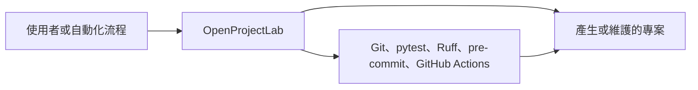
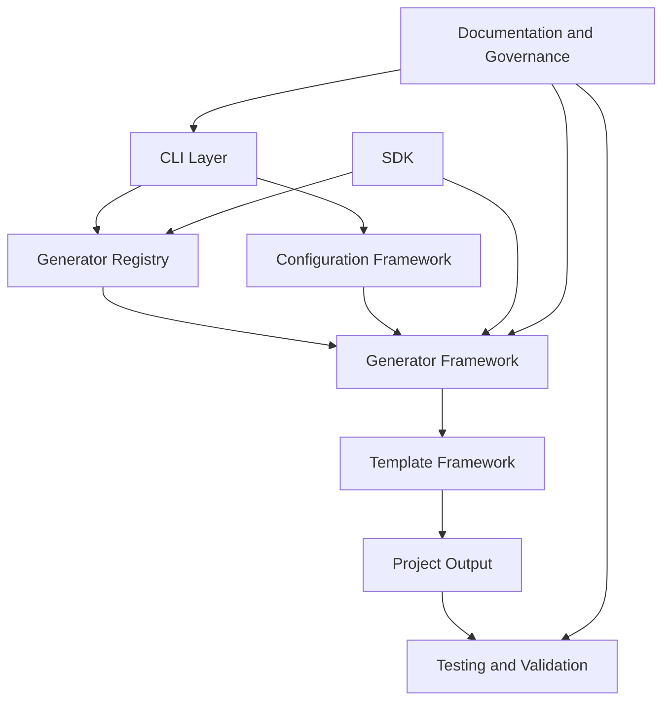
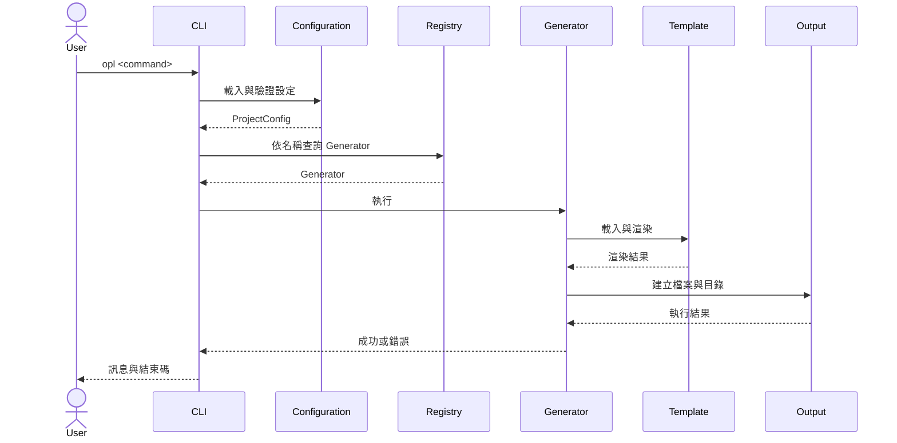

# OpenProjectLab Architecture Overview

> Status: Active
> Scope: High-level system architecture
> Audience: Maintainers, contributors, plugin developers

OpenProjectLab（OPL）是一套以軟體工程流程為核心的 **Project Engineering Platform**。

它不只產生初始專案內容，也負責整合：

* 專案結構
* 設定管理
* Generator 執行
* Template 渲染
* 測試與品質驗證
* 文件與治理
* 未來的 Plugin 擴充能力

本文件定義 OPL 的系統邊界、核心元件、資料流程與架構原則。

---

## 1. Architecture Goals

OpenProjectLab 的架構目標如下：

### 1.1 Consistency

所有 Generator 應遵循一致的註冊、設定、執行與錯誤處理方式。

### 1.2 Modularity

CLI、設定、Generator、Template、SDK 與測試應保持清楚的責任邊界。

### 1.3 Extensibility

新增 Generator 或 Plugin 時，應優先透過公開介面擴充，而不是修改核心流程。

### 1.4 Testability

核心邏輯應可獨立測試，不應依賴手動操作或隱藏的全域狀態。

### 1.5 Documentation Alignment

架構文件、程式碼、測試與 Repository 結構必須同步演進。

### 1.6 Safe Evolution

系統應允許逐步增加功能，同時降低既有行為被破壞的風險。

---

## 2. System Context

OpenProjectLab 位於使用者與專案輸出之間。



使用者可以透過 CLI 呼叫 OPL。

OPL 讀取設定、解析 Generator、載入 Template，並將結果輸出至目標專案。

自動化工具則負責驗證輸出與 Repository 品質。

---

## 3. System Boundary

### OPL 負責

* 提供統一 CLI 入口。
* 載入並驗證專案設定。
* 註冊與解析 Generator。
* 執行 Generator 工作流程。
* 管理 Template 與輸出內容。
* 提供擴充所需的 SDK。
* 整合測試、品質檢查與文件規範。

### OPL 不直接負責

* 取代 Git 或 GitHub。
* 取代 Python 套件管理工具。
* 取代 IDE 或程式碼編輯器。
* 自動決定所有專案架構。
* 保證第三方 Plugin 的品質。
* 取代人工架構決策與 Code Review。

OPL 提供的是工程框架與自動化能力，而不是完全自動化的專案決策系統。

---

## 4. High-Level Architecture



---

## 5. Core Components

## 5.1 CLI Layer

位置：

```text
generator/cli/
```

CLI 是 OpenProjectLab 的主要使用者入口。

目前主要命令包括：

```text
opl list
opl bootstrap
opl course
opl week
```

CLI 的責任包括：

* 解析命令列參數。
* 載入指定設定檔。
* 查詢 Generator Registry。
* 呼叫對應 Generator。
* 將結果與錯誤轉換為適當的輸出與結束碼。

CLI 不應包含主要業務邏輯。

---

## 5.2 Configuration Framework

主要位置：

```text
generator/core/
config/
```

Configuration Framework 負責：

* 讀取 YAML 設定檔。
* 驗證必要結構。
* 處理預設值。
* 解析相對與絕對路徑。
* 將設定提供給 Generator。

目前設定主要分為：

* `project`
* `paths`
* `generator`
* `plugins`

設定物件應作為明確依賴傳入，不應讓元件自行從任意位置讀取設定。

---

## 5.3 Generator Registry

主要位置：

```text
generator/core/
```

Registry 負責維護可用 Generator 的名稱與實作之間的對應關係。

主要責任：

* 註冊 Generator。
* 防止名稱衝突。
* 列出可用 Generator。
* 依名稱解析 Generator。
* 為未來 Plugin Loader 提供整合點。

CLI 不應直接硬編碼所有 Generator 的執行邏輯。

---

## 5.4 Generator Framework

主要位置：

```text
generator/generators/
```

Generator Framework 是 OPL 的核心執行層。

目前內建 Generator：

* Bootstrap Generator
* Course Generator
* Week Generator

Generator 通常接收：

* 專案設定
* 路徑資訊
* Template 資源
* 使用者輸入或 CLI 參數

Generator 通常產生：

* 目錄
* 設定檔
* 文件
* 程式碼
* 教材內容
* 執行結果或錯誤

每個 Generator 應具有明確且可測試的責任。

---

## 5.5 Template Framework

主要位置：

```text
generator/templates/
templates/
```

Template Framework 負責將結構化輸入轉換成實際輸出內容。

兩個 Template 位置的角色必須保持清楚：

### `generator/templates/`

供 Python 套件內部使用的 Template、內建資源或渲染相關內容。

### `templates/`

供專案、課程、教材或其他 Generator 使用的頂層範本。

Template Framework 的責任包括：

* 定位 Template。
* 載入 Template。
* 驗證必要輸入。
* 渲染內容。
* 將結果寫入目標路徑。
* 回報缺少 Template 或渲染錯誤。

Template 不應包含複雜業務邏輯。

---

## 5.6 SDK

主要位置：

```text
generator/sdk/
```

SDK 提供 Generator 或未來 Plugin 開發時可依賴的公開介面。

SDK 的目標包括：

* 降低擴充功能對內部實作的依賴。
* 提供穩定的抽象介面。
* 定義 Generator 或 Plugin 的整合契約。
* 協助第三方功能使用一致的錯誤與生命週期模型。

SDK 的公開介面必須謹慎設計，避免不必要地暴露內部細節。

---

## 5.7 Testing and Validation

主要位置：

```text
tests/
```

測試系統負責保護 OPL 的外部行為與核心規則。

目前測試類型包括：

* Core unit tests
* Generator tests
* Template tests
* CLI tests
* Integration tests

品質工具包括：

* pytest
* pytest-cov
* Ruff
* pre-commit
* GitHub Actions

每項新功能至少應新增對應測試，並確認既有測試仍然通過。

---

## 5.8 Documentation and Governance

主要位置：

```text
docs/
.github/
```

治理文件包括：

* README
* Architecture
* Development Guide
* Reference
* ADR
* Changelog
* Roadmap
* Contributing Guide
* Security Policy
* Code of Conduct

文件與治理不是外部附加層，而是 OPL 架構的一部分。

---

## 6. Primary Execution Flow

目前 CLI 呼叫 Generator 的高階流程如下：



---

## 7. Dependency Direction

OPL 應維持由外向內的依賴方向。

```text
CLI
  ↓
Core abstractions and services
  ↓
Generator Framework
  ↓
Template and output services
```

建議規則：

* `core` 不應依賴 CLI。
* Generator 不應解析命令列參數。
* Template 不應呼叫 CLI。
* 測試可以依賴公開元件，但正式程式不應依賴測試。
* SDK 不應暴露不穩定的內部實作。
* 高階流程應依賴抽象契約，而不是特定 Generator。

---

## 8. Error Handling

錯誤應在最接近問題來源的元件產生，並在系統邊界轉換為使用者可理解的訊息。

例如：

```text
Configuration file error
        ↓
ConfigurationError
        ↓
CLI error handling
        ↓
User-facing message and exit code
```

建議將錯誤分為：

* Configuration errors
* Registry errors
* Generator errors
* Template errors
* File system errors
* Validation errors

CLI 應避免直接輸出完整 traceback，除非使用者明確啟用除錯模式。

---

## 9. Extension Model

目前 OPL 主要透過內建 Generator 擴充。

```text
Generator implementation
        ↓
Registry registration
        ↓
CLI discovery
        ↓
Execution
```

未來 Plugin Framework 預計增加：

* Plugin metadata
* Plugin discovery
* Plugin loading
* Compatibility validation
* Registration hooks
* Lifecycle management
* Plugin isolation
* Plugin testing contract

Plugin Framework 尚未正式完成，因此現階段不得將其描述為穩定功能。

---

## 10. Architecture Principles

所有新功能應遵循以下原則。

### Design First

在修改程式前，先定義問題、責任邊界、輸入、輸出與失敗行為。

### Documentation First

新增或修改功能時，同步更新 Architecture、Reference 或 ADR。

### Automation First

可重複驗證的流程應交由測試、pre-commit 或 CI 執行。

### Testing First

重要行為必須由測試保護。

### Explicit Dependencies

設定、路徑與服務應明確傳入，不依賴隱藏的全域狀態。

### Stable Public Interfaces

對外介面應保持最小、清楚並可測試。

### Backward-Compatible Evolution

v0.x 階段仍可能調整 API，但所有破壞性變更都應記錄於 Changelog 與相關文件。

---

## 11. Adding a New Feature

新增功能時，建議依照以下順序：

```text
需求
  ↓
Architecture Design
  ↓
Documentation
  ↓
Implementation
  ↓
Tests
  ↓
Automation
  ↓
Code Review
  ↓
Merge
```

至少應回答：

* 功能解決什麼問題？
* 屬於哪一個架構元件？
* 是否需要新公開介面？
* 是否會修改設定格式？
* 是否會修改 CLI？
* 是否會影響 Template？
* 需要哪些測試？
* 需要更新哪些文件？
* 是否需要 ADR？

---

## 12. Current Limitations

目前架構仍處於 v0.x Foundation 階段。

已知限制包括：

* Plugin Framework 尚未正式完成。
* SDK 公開介面仍可能調整。
* Generator 的共同生命週期仍需進一步標準化。
* Template 分層與搜尋規則仍需完整文件化。
* Upgrade Framework 的實際邊界仍需依目前程式碼確認。
* CLI 錯誤碼與輸出格式尚未完全標準化。
* 部分 Repository 目錄仍包含實驗性或未來功能。

這些限制應透過 Roadmap、Issue 與 ADR 持續追蹤。

---

## 13. Related Documents

* [Generator Framework](generator-framework.md)
* [Configuration Framework](configuration-framework.md)
* [Template Framework](template-framework.md)
* [Generator Registry](registry.md)
* [SDK](sdk.md)
* [Development Workflow](../development/development-workflow.md)
* [CLI Reference](../reference/cli.md)
* [Configuration Reference](../reference/configuration.md)
* [ADR Index](../adr/README.md)

---

## 14. Architecture Review Checklist

修改架構或新增功能時，請確認：

* [ ] 功能責任屬於正確的元件。
* [ ] CLI 沒有包含主要業務邏輯。
* [ ] Core 沒有反向依賴 CLI。
* [ ] Generator 可在不啟動 CLI 的情況下測試。
* [ ] 設定與路徑以明確依賴傳入。
* [ ] Template 沒有承擔複雜業務邏輯。
* [ ] 公開 SDK 沒有暴露不必要的內部細節。
* [ ] 新功能具有對應測試。
* [ ] Architecture 與 Reference 文件已更新。
* [ ] 必要時已新增或更新 ADR。
* [ ] `pre-commit run --all-files` 通過。
* [ ] `python -m pytest` 通過。

---

> **OpenProjectLab 的架構目標，不是追求最多的抽象層，而是建立清楚、可測試且能安全演進的工程邊界。**
