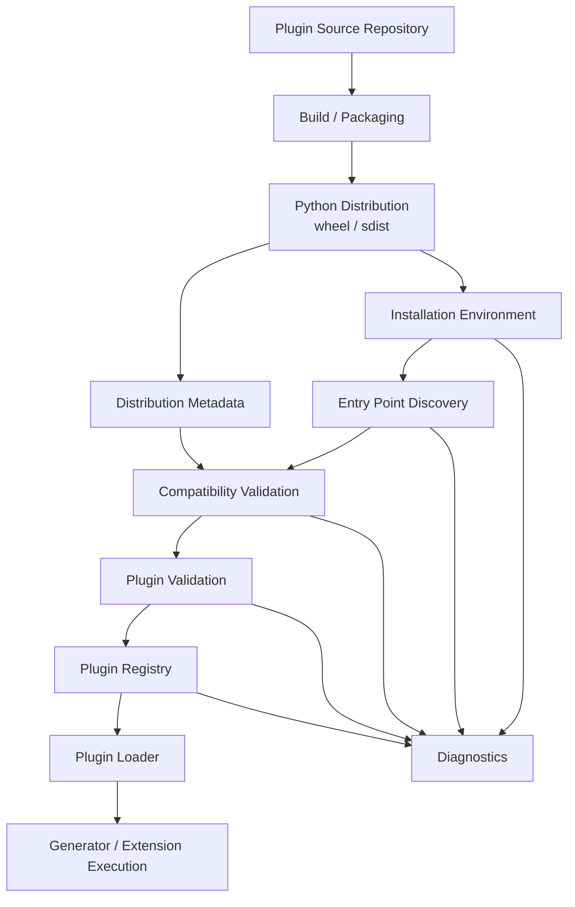

# OpenProjectLab Plugin Ecosystem Architecture

> Status: Proposed
> Track: Future Plugin Evolution
> Milestone: Not assigned (Milestone 5 is Open Courseware Platform)
> Scope: Third-party plugin packaging, distribution metadata, installation assumptions, compatibility, discovery diagnostics, and ecosystem boundaries
> Audience: Maintainers, contributors, plugin authors, SDK developers, and tooling developers

OpenProjectLab（OPL）Milestone 4 已建立可運作的 Plugin SDK 與 runtime plugin loading pipeline，包括 public SDK、entry point discovery、plugin validation、registry preflight、loading，以及範例第三方 plugin 與 installed entry-point validation。

本文件不屬於 Milestone 5。Milestone 5 已保留給 Open Courseware Platform。本文件描述 Milestone 4 之後的 Future Plugin Evolution：建立 Plugin Ecosystem 的外層工程邊界，使第三方 plugin 能被可靠地封裝、安裝、辨識、驗證相容性、診斷與分發。

本文件定義 Plugin Ecosystem 的架構責任、資料流、相容性邊界、失敗模型、測試策略、文件要求與 Code Review Checklist。

任何尚未由程式碼與測試支援的能力，都應視為 Proposed，而不是既有功能。

---

## 1. Goals

Plugin Ecosystem Architecture 的核心目標如下：

- 保留 Milestone 4 已接受的 Plugin SDK 與 runtime loading contracts。
- 定義第三方 plugin 作為 Python distribution 的封裝模型。
- 定義 plugin metadata 與 runtime entry point 的責任邊界。
- 定義 OPL、Plugin SDK 與 plugin 版本之間的 compatibility contract。
- 定義 installation 與 discovery 的明確假設。
- 定義可診斷的 plugin state，而不是只在 loading 失敗時回報錯誤。
- 支援未來 package manager、plugin registry 與 marketplace，而不將其耦合進 runtime loader。
- 讓 plugin authoring、CI、release 與 installation 流程可被自動化驗證。
- 讓失敗可以被分類、測試、文件化並提供可操作的 recovery guidance。

---

## 2. Non-Goals

Future Plugin Evolution 的 Plugin Ecosystem Layer 不應：

- 重新定義 `generator.sdk` 的既有 public symbols。
- 重新定義 Milestone 4 的 entry point loading semantics。
- 讓 package installation 取代 plugin validation。
- 讓 registry 負責 pip、wheel 或 virtual environment 管理。
- 讓 runtime loader 自動安裝缺少的 dependency。
- 將 PyPI、GitHub Releases 或未來 Marketplace 寫死為唯一 distribution backend。
- 在 import 或 discovery 階段執行未經驗證的任意安裝腳本。
- 自動升級第三方 plugin。
- 靜默接受 incompatible plugin。
- 將所有 packaging error 轉成單一泛化的 plugin loading error。

---

## 3. Evolution Boundary

Milestone 4 已接受的 runtime responsibility 與未來 Plugin Ecosystem evolution 的責任必須明確分離。

### Milestone 4 owns

Milestone 4 已負責：

- Plugin SDK public contract
- Plugin discovery through supported entry points
- Plugin entry-point loading
- Plugin validation
- Registry preflight and registration behavior
- Runtime plugin loading pipeline
- Example third-party plugin
- Installed example plugin entry-point validation

Milestone 5 不應破壞上述契約。

### Future Plugin Evolution owns

Future Plugin Evolution proposes:

- Plugin package metadata contract
- Distribution metadata contract
- OPL / SDK / plugin compatibility contract
- Installation environment assumptions
- Plugin package diagnostics
- Installed plugin inspection
- Distribution acceptance workflow
- Future package manager and registry integration boundaries

---

## 4. High-Level Architecture



---

## 5. Dependency Direction

建議依賴方向：

```text
Plugin Source
    ↓
Python Packaging Metadata
    ↓
Installation Environment
    ↓
Discovery Adapter
    ↓
Compatibility Validator
    ↓
Milestone 4 Validation + Registry + Loader
    ↓
Runtime Execution
```

重要規則：

- Runtime loader 不依賴 package installer。
- Registry 不依賴 PyPI 或任何 distribution service。
- Compatibility validation 不應 import plugin implementation 才能取得所有必要版本資訊。
- Package diagnostics 可以讀取 distribution metadata，但不應改變安裝狀態。
- Installation tooling 可以呼叫既有 runtime validation，但不能繞過它。

---

## 6. Plugin Package Model

OPL 第三方 plugin 應以標準 Python distribution 為主要封裝單位。

概念結構：

```text
example-opl-plugin/
├── pyproject.toml
├── README.md
├── LICENSE
├── src/
│   └── example_opl_plugin/
│       ├── __init__.py
│       └── plugin.py
└── tests/
    ├── test_package_metadata.py
    ├── test_entry_point.py
    └── test_plugin_contract.py
```

建議原則：

- 使用標準 `pyproject.toml`。
- distribution name 與 Python import package name 可以不同。
- plugin 的 runtime identity 不應只依賴 import package 名稱。
- plugin entry point 必須透過 Milestone 4 已接受的 discovery contract 暴露。
- build artifact 應可在乾淨環境安裝並通過 acceptance test。

---

## 7. Distribution Identity vs Plugin Identity

應區分兩種 identity。

### Distribution identity

由 Python packaging metadata 定義，例如：

```text
example-opl-plugin
```

用途：

- install / uninstall
- dependency resolution
- package version
- build artifact
- PyPI 或其他 index identity

### Plugin runtime identity

由 OPL plugin contract 定義，例如：

```text
example
```

用途：

- registry lookup
- diagnostics
- runtime selection
- conflict detection

兩者不應被視為同一欄位。

---

## 8. Package Metadata Contract

Future Plugin Evolution 應定義 plugin distribution 至少需要哪些 metadata。

建議必要資訊：

- distribution name
- distribution version
- supported Python version
- OPL compatibility requirement
- entry point group
- entry point name
- entry point target

可選資訊：

- homepage
- source repository
- documentation URL
- issue tracker
- license
- author / maintainer
- plugin capabilities

若 metadata 未形成正式 contract，不應讓 runtime 依賴非標準欄位。

---

## 9. Entry Point Contract Boundary

Entry point 仍由 Milestone 4 loading contract 擁有。

Future Plugin Evolution 只定義 packaging 如何宣告它。

概念：

```toml
[project.entry-points."openprojectlab.generators"]
example = "example_opl_plugin.generator:ExampleGenerator"
```

正式 group name、target shape 與 callable/object semantics 必須以 Milestone 4 已接受的 entry-point contract 為準。

Milestone 5 不應建立第二套 discovery channel。

---

## 10. Installation Environment

OPL 應明確定義「installed plugin」的環境語意。

建議：

> Plugin 必須安裝在執行 OPL 的同一 Python environment 中，才會被標準 Python distribution metadata 與 entry-point discovery 看見。

典型環境：

```text
.venv/
├── OpenProjectLab
├── example-opl-plugin
└── dependency packages
```

Future Plugin Evolution 不應假設 system Python。

也不應在 runtime loading 時隱式建立 virtual environment。

---

## 11. Installation Responsibility

第一階段建議 OPL 不實作自有 package installer，而是建立明確邊界：

```text
External Installer / pip / uv / other tool
            ↓
Python Environment
            ↓
OPL Discovery
```

未來如果新增：

```text
opl plugin install ...
```

它應屬於 Application / Package Management Layer，而不是 Milestone 4 loader。

---

## 12. Compatibility Model

Plugin 是否可被 OPL 使用，至少涉及三種版本：

```text
Python Version
OPL Version
Plugin Version
```

可進一步加入：

```text
Plugin SDK Contract Version
```

建議 Compatibility Validator 在 runtime import 前盡可能利用 distribution metadata 完成 preflight。

---

## 13. Compatibility Contract

概念上 plugin 可以宣告：

```text
Requires-Python: >=3.12
Requires-Dist: openprojectlab>=X.Y,<X+1.0
```

或未來提供專屬 metadata。

OPL 應避免只比較 raw string：

```python
if plugin_version >= "0.3":
    ...
```

正式實作應使用 Python packaging standard 的 version/specifier semantics。

---

## 14. Compatibility States

建議 compatibility 不只是 Boolean。

可區分：

```text
COMPATIBLE
INCOMPATIBLE
UNKNOWN
INVALID_METADATA
```

例如：

- `COMPATIBLE`：版本要求明確且目前環境滿足。
- `INCOMPATIBLE`：版本範圍明確但目前環境不符合。
- `UNKNOWN`：舊 plugin 沒有宣告足夠 metadata。
- `INVALID_METADATA`：metadata 無法解析。

是否允許 `UNKNOWN` plugin 被載入，必須由正式 policy 決定。

---

## 15. Compatibility Failure

Compatibility failure 應在 plugin implementation import 前盡早發生。

建議流程：

```text
Discover distribution
    ↓
Read metadata
    ↓
Evaluate compatibility
    ↓
Only then resolve/load runtime entry point
```

如果 discovery API 本身已 materialize entry point object，仍應避免不必要地呼叫 `load()`。

---

## 16. Discovery vs Compatibility

Discovery 回答：

> 有哪些 candidate plugin entry points？

Compatibility 回答：

> 這個 candidate 是否適用於目前 OPL runtime？

Validation 回答：

> 載入後的 plugin object 是否符合 OPL contract？

三者不可混合。

---

## 17. Validation Boundary

Milestone 5 compatibility validation 不取代 Milestone 4 plugin validation。

完整流程：

```text
Distribution discovered
    ↓
Distribution metadata valid
    ↓
Compatibility valid
    ↓
Entry point loaded
    ↓
Plugin object validation
    ↓
Registry preflight
    ↓
Registration
```

即使 package metadata 完全合法，plugin runtime object 仍可能不符合 SDK contract。

---

## 18. Registry Boundary

Registry 應只處理 runtime identity 與 registration contract。

Registry 不應：

- 安裝 package
- 解讀 wheel
- 查詢 package index
- 決定 dependency solver 結果
- 下載 plugin
- 自動更新 plugin

Registry 可以接收已通過 compatibility 與 validation 的 plugin candidate。

---

## 19. Loader Boundary

Loader 應保持 focused：

- resolve supported entry point
- load plugin entry point
- integrate existing validation contract
- return or register valid runtime plugin

Loader 不應增加：

- package download
- dependency installation
- version solving
- network access
- marketplace lookup

---

## 20. Plugin Diagnostics

Future Plugin Evolution 應建立「不執行 plugin，也能解釋 plugin 狀態」的 diagnostics 能力。

建議 diagnostics 至少能回答：

- distribution 是否已安裝
- distribution version
- entry point 是否存在
- entry point target
- compatibility 是否通過
- plugin validation 是否通過
- registry 是否存在 naming conflict
- failure 發生在哪一階段

---

## 21. Proposed Diagnostic States

可考慮：

```text
INSTALLED
DISCOVERABLE
COMPATIBLE
LOADABLE
VALID
REGISTERABLE
READY
```

這些狀態代表 pipeline progression，而不是互斥 enum。

例如某 plugin 可能：

```text
installed:      yes
discoverable:   yes
compatible:     no
loadable:       not attempted
valid:          not attempted
registerable:   not attempted
ready:          no
```

---

## 22. Diagnostics Must Be Side-Effect Safe

純 diagnostics 命令原則上不應：

- install package
- uninstall package
- update package
- modify registry persistent state
- generate project files
- execute plugin business behavior

若 diagnostics 需要呼叫 `entry_point.load()` 才能驗證 runtime contract，應清楚區分：

```text
metadata diagnostics
runtime diagnostics
```

避免使用者誤以為所有檢查都是無副作用的。

---

## 23. Proposed CLI Surface

未來可考慮：

```text
opl plugin list
opl plugin info <name>
opl plugin check <name>
```

第一階段不建議立即加入：

```text
opl plugin install
opl plugin update
opl plugin remove
```

除非 package-management contract 已完成獨立 ADR 與測試。

---

## 24. Plugin List

`plugin list` 應偏向 inventory，而不是執行 plugin。

概念輸出：

```text
NAME      VERSION   STATUS
example   0.1.0     ready
legacy    0.2.0     compatibility-unknown
broken    1.0.0     invalid
```

正式輸出格式屬於 CLI contract，應另外設計與測試。

---

## 25. Plugin Info

`plugin info` 可以顯示：

- plugin runtime name
- distribution name
- distribution version
- entry point
- compatibility requirement
- current compatibility result
- validation result
- source metadata

不應依賴解析任意 plugin README 才能提供核心資訊。

---

## 26. Plugin Check

`plugin check` 可執行完整 preflight：

```text
Distribution metadata
    ↓
Entry point discovery
    ↓
Compatibility
    ↓
Runtime load
    ↓
Plugin validation
    ↓
Registry preflight
```

它應清楚標示失敗 stage。

---

## 27. Error Model

Future Plugin Evolution 應避免把所有問題壓成：

```text
Plugin failed to load.
```

建議分類：

```text
PluginEcosystemError
├── PluginMetadataError
├── PluginCompatibilityError
├── PluginDistributionError
└── PluginDiagnosticError
```

正式 hierarchy 是否公開到 SDK，需由 ADR 決定。

Milestone 4 既有 validation / loading errors 不應被任意改名或重新分類。

---

## 28. Metadata Errors

常見情境：

- required metadata missing
- malformed version specifier
- unsupported metadata value
- entry point declaration malformed
- distribution identity inconsistent

應保留原始 packaging/library exception 作為 `__cause__`，若底層 library 會拋出具體錯誤。

---

## 29. Compatibility Errors

Compatibility error 應至少提供：

- plugin identity
- installed plugin version
- current OPL version
- required OPL range
- current Python version（若相關）
- recovery guidance

範例概念：

```text
Plugin `example` is not compatible with this OpenProjectLab version.

Installed plugin: 0.4.0
Requires OPL: >=0.4,<0.5
Current OPL: 0.3.0
```

---

## 30. Distribution Errors

Distribution error 應聚焦於 Python packaging state，例如：

- distribution metadata unavailable
- duplicate distributions expose conflicting plugin identities
- installed distribution cannot be inspected
- entry point metadata references invalid target

不應把 plugin runtime contract failure 歸類成 distribution error。

---

## 31. Unknown Compatibility Policy

舊 plugin 可能沒有足夠 compatibility metadata。

OPL 應明確決定 policy，例如：

```text
STRICT
WARN
ALLOW
```

第一階段較安全的方向是：

- built-in / officially tested plugin 可以有明確 contract；
- third-party plugin 若 compatibility unknown，至少顯示 warning；
- production default 是否拒絕，應由 ADR 決定。

本文件不先固定最終 policy。

---

## 32. Versioning Strategy

Plugin ecosystem 需要區分：

- OPL application version
- Plugin SDK contract version
- Plugin distribution version
- Plugin implementation metadata version（若未來存在）

不要假設四者永遠同步。

---

## 33. SDK Compatibility

如果 `generator.sdk` 未來形成獨立且穩定的 compatibility surface，可以考慮：

```text
SDK Contract v1
SDK Contract v2
```

但在尚未需要前，不應建立第二套 version system。

優先使用標準 package dependency range 表達 compatibility。

只有當 OPL application version 與 SDK compatibility lifecycle 明顯分離時，再新增 SDK contract version。

---

## 34. Semantic Versioning

若 OPL 採用 Semantic Versioning，plugin compatibility 應以實際 public contract 的穩定程度為基礎。

不能因為版本號看似 SemVer，就假設所有 private/internal API 對 plugin 穩定。

Plugin author 應只依賴 documented public SDK。

---

## 35. Public vs Internal APIs

Plugin 只應依賴：

```text
generator.sdk
```

或未來正式指定的 public package。

不應依賴：

```text
generator.plugins.loader
generator.plugins.registry
generator.core.*
```

除非這些 module 被正式升級為 public contract。

Milestone 5 diagnostics 也不能鼓勵第三方 plugin 使用 internal API。

---

## 36. Distribution Build

第三方 plugin release pipeline 應至少驗證：

```text
source
  ↓
unit tests
  ↓
build wheel/sdist
  ↓
install into clean environment
  ↓
entry-point discovery
  ↓
compatibility validation
  ↓
plugin validation
  ↓
acceptance test
```

只在 source tree 中 `pytest` 通過，不代表 distribution artifact 可用。

---

## 37. Clean Environment Acceptance

Milestone 5 最重要的 acceptance test 應是：

```text
Build actual third-party plugin distribution
    ↓
Install artifact into clean environment
    ↓
Run OPL discovery
    ↓
Check compatibility
    ↓
Load entry point
    ↓
Validate plugin
    ↓
Register plugin
    ↓
Execute supported behavior
```

這是從 Milestone 4 的 installed-example test 向完整 distribution acceptance 的延伸。

---

## 38. Editable Install vs Built Artifact

測試應區分：

```text
pip install -e .
```

與：

```text
pip install dist/example_opl_plugin-*.whl
```

Editable install 適合開發，但不能替代 wheel acceptance。

正式 release acceptance 應至少驗證 built artifact。

---

## 39. Dependency Isolation

第三方 plugin 可以宣告自己的 dependencies，但依賴衝突是 ecosystem 的重要風險。

第一階段應遵循標準 Python environment resolution。

OPL runtime 不應自行 shadow、vendor 或動態替換 plugin dependencies。

未來若需要 per-plugin isolation，應建立獨立架構與 ADR。

---

## 40. Plugin Isolation

Plugin isolation 可能包含：

- separate virtual environments
- subprocess execution
- RPC boundary
- sandboxing

這些都不是 Milestone 5 初始 scope。

目前 plugin 仍應被視為與 OPL process 同一 trust boundary 的 Python code。

文件必須清楚說明：

> 安裝第三方 plugin 等同於允許第三方 Python code 在 OPL runtime environment 中執行。

---

## 41. Security Boundary

OPL plugin system 不應聲稱 sandbox 第三方 plugin，除非真的有 isolation mechanism。

安全原則：

- 不自動安裝未知 plugin。
- 不因 discovery 而執行 package installer。
- 不把 metadata validation 描述成 security validation。
- 不將 signature verification 宣稱為已存在能力，除非正式實作。
- 不在 diagnostics 中顯示 secret environment variables。

---

## 42. Supply Chain Considerations

未來 distribution 可能需要：

- hash verification
- signed artifacts
- trusted indexes
- provenance
- SBOM
- dependency audit

這些屬於後續 supply-chain hardening。

Future Plugin Evolution 的初始設計應保留介面邊界，但不應假裝已有完整 supply-chain security。

---

## 43. Package Index Boundary

未來可能支援：

```text
PyPI
Private Python Index
GitHub Releases
Internal Registry
OPL Marketplace
```

Runtime plugin architecture 不應直接依賴其中任何一個。

應抽象成：

```text
Distribution Source
    ↓
Installer / Package Manager
    ↓
Installed Python Environment
```

Runtime 只從 installed environment 開始工作。

---

## 44. Future Plugin Registry Service

未來的遠端 plugin registry 可以提供：

- searchable metadata
- compatibility information
- documentation links
- release versions
- trust / verification metadata

它不應等同於 runtime `PluginRegistry`。

兩者名稱容易混淆，因此建議文件上區分：

```text
Runtime Plugin Registry
Distribution Catalog / Plugin Catalog
```

避免同一個 `Registry` 名詞承擔兩種責任。

---

## 45. Future Package Manager

未來 Package Manager 可負責：

- resolve requested distribution
- install
- uninstall
- update
- inspect installed versions
- invoke compatibility checks

但不得直接取代：

- plugin validation
- runtime registry
- plugin loader

Package Manager 與 Runtime Plugin System 應是相鄰但不同的 layers。

---

## 46. Proposed Component Boundaries

概念模組：

```text
generator/
├── sdk/
├── plugins/
│   ├── discovery.py
│   ├── validation.py
│   ├── registry.py
│   └── loader.py
└── ecosystem/
    ├── metadata.py
    ├── compatibility.py
    ├── diagnostics.py
    └── models.py
```

此目錄只是可能的 future shape。

是否新增 `generator/ecosystem/`，必須在實作前由 ADR 決定；不要因本文件示意就直接建立。

---

## 47. Proposed Data Models

概念：

```python
@dataclass(frozen=True, slots=True)
class PluginDistributionInfo:
    distribution_name: str
    distribution_version: str
    entry_point_name: str
    entry_point_value: str
```

Compatibility：

```python
@dataclass(frozen=True, slots=True)
class PluginCompatibilityResult:
    compatible: bool | None
    reason: str | None = None
```

正式欄位應先由 tests 與 ADR 固化。

---

## 48. Avoid Runtime String Parsing

不應讓其他 layer 透過解析 human-readable text 取得 metadata：

```python
version = str(info).split("version=")[1]
```

應使用 typed models / structured metadata。

人類輸出由 formatter 產生。

---

## 49. Determinism

Plugin inventory 與 diagnostics 應具有穩定排序。

建議依：

- runtime plugin name
- distribution name
- entry point name

選擇其中一個 documented key。

同一 environment 應得到相同排序，避免測試與 CLI output 不穩定。

---

## 50. Duplicate Plugin Identity

兩個不同 distributions 可能宣告相同 plugin runtime identity。

例如：

```text
Distribution A → plugin `course-x`
Distribution B → plugin `course-x`
```

這必須是明確 conflict。

不應以 installation order 決定誰覆蓋誰。

正式 conflict semantics 應與 Milestone 4 registry preflight 對齊。

---

## 51. Duplicate Entry Point Names

不同 distributions 也可能宣告相同 entry point name。

需要區分：

- distribution-level duplicate entry point
- runtime plugin identity duplicate
- registry duplicate

這三者可能相關，但不必然相同。

Diagnostics 應能指出 conflict 發生在哪個 stage。

---

## 52. Broken Entry Point

Entry point metadata 可以存在，但 target module 不存在或 import 失敗。

這表示：

```text
discoverable = yes
compatible = maybe
loadable = no
```

錯誤不應被誤報成「plugin not installed」。

---

## 53. Import-Time Failure

Plugin module import 可能因 dependency 缺失或 bug 失敗。

Diagnostics 應保留：

- distribution identity
- entry point target
- original exception chain

一般 CLI 顯示簡潔原因；debug mode 才顯示 traceback。

---

## 54. Plugin Lifecycle

Plugin ecosystem lifecycle 可描述為：

```text
Author
  ↓
Package
  ↓
Build
  ↓
Publish
  ↓
Install
  ↓
Discover
  ↓
Compatibility Check
  ↓
Load
  ↓
Validate
  ↓
Register
  ↓
Execute
  ↓
Diagnose / Upgrade / Remove
```

Future Plugin Evolution 的初始實作主要聚焦中段：

```text
Installed Distribution
    ↓
Metadata
    ↓
Compatibility
    ↓
Diagnostics
    ↓
Existing Milestone 4 Runtime
```

---

## 55. Authoring Contract

Plugin authoring guide 應同步要求：

- only import documented SDK symbols
- declare supported Python version
- declare compatible OPL range
- declare supported entry point
- include tests
- build real artifact
- test installed artifact
- document plugin versioning policy

Milestone 4 的 authoring alignment 應成為 Future Plugin Evolution 的基礎，而不是被取代。

---

## 56. Testing Strategy

Future Plugin Evolution 測試應分層。

### Unit tests

測試：

- metadata extraction
- version parsing
- compatibility evaluation
- diagnostic state construction
- sorting
- error classification

### Contract tests

測試：

- required metadata
- compatibility semantics
- duplicate identity behavior
- no runtime import during metadata-only checks

### Integration tests

測試：

- installed distribution discovery
- compatibility → existing validation pipeline
- incompatible plugin stops before runtime registration
- broken entry point reports correct stage

### Distribution acceptance tests

測試：

- build wheel
- install wheel in isolated environment
- discover
- validate compatibility
- load
- register
- execute

---

## 57. Compatibility Unit Test Example

概念：

```python
def test_plugin_is_compatible_with_supported_opl_version():
    result = evaluate_compatibility(
        current_opl_version="X.Y.Z",
        required_opl="~=X.Y",
    )

    assert result.compatible is True
```

實際 API 需由 ADR 與 tests 先決定。

---

## 58. Incompatible Plugin Test

概念：

```python
def test_incompatible_plugin_is_rejected_before_loading():
    ...
```

測試重點：

- entry point candidate 可被 discovery 看見。
- compatibility 明確失敗。
- `entry_point.load()` 未被呼叫。
- registry 未被修改。
- error 保留 plugin/distribution identity。

---

## 59. Unknown Compatibility Test

必須測試 legacy plugin 沒有 compatibility metadata 的行為。

在正式 policy 決定前，test 應先固化預期：

- warning and continue，或
- reject，或
- return UNKNOWN diagnostics state。

不要讓實作依偶然分支決定。

---

## 60. Metadata-Only Diagnostics Test

概念：

```python
def test_metadata_diagnostics_does_not_load_entry_point():
    ...
```

這個測試保護 side-effect boundary。

---

## 61. Duplicate Identity Test

概念：

```python
def test_duplicate_plugin_identity_is_reported_as_conflict():
    ...
```

確認：

- 不依賴 discovery order。
- 不靜默覆寫。
- diagnostics 顯示兩個 distribution sources。

---

## 62. Broken Entry Point Test

測試：

- metadata valid
- compatibility valid
- target import failure
- loading error retains cause
- registration not attempted

這可確保 stage boundary 清楚。

---

## 63. Distribution Artifact Test

Acceptance test 不應只 import source checkout。

應實際：

```text
python -m build
pip install <wheel>
```

或採用專案正式選定的 build/install tool。

測試應在 isolated environment 執行，避免本機 editable install 掩蓋 packaging 問題。

---

## 64. CI Strategy (Future Evolution)

建議 Future Plugin Evolution CI 演進：

```text
Quality Checks
    ↓
Unit / Contract Tests
    ↓
Build Example Plugin
    ↓
Install Built Artifact
    ↓
Distribution Acceptance
```

若成本過高，可將完整 acceptance 放在獨立 job。

但至少 PR 應能保護核心 compatibility contract。

---

## 65. Test Fixtures

避免所有 tests 都依賴真正 PyPI。

建議使用：

- local example plugin package
- local wheel artifact
- fake `importlib.metadata.EntryPoint`
- fake distribution metadata

網路不應成為 unit / integration test 必要條件。

---

## 66. Documentation Requirements

Future Plugin Evolution 每新增一個 ecosystem contract，至少同步評估：

- `docs/architecture/plugin-ecosystem.md`
- plugin authoring documentation
- plugin SDK documentation
- CLI reference（若新增 command）
- errors reference（若新增 exception）
- ADR index
- roadmap
- history
- changelog
- milestone acceptance document

Documentation First 不代表文件先於所有設計討論，而是 contract 與實作不能脫離可維護文件。

---

## 67. ADR Requirements

重大決策應建立 ADR，例如：

- plugin distribution contract
- compatibility contract
- unknown compatibility policy
- package-management ownership
- remote catalog / marketplace model
- plugin isolation model

第一個建議 ADR：

```text
docs/adr/0013-plugin-distribution-contract.md
```

---

## 68. Automation Requirements

Ecosystem 新功能不能只靠人工驗證。

至少應能自動檢查：

- package metadata
- entry point presence
- compatibility evaluation
- installed artifact discovery
- plugin validation
- regression behavior

正式 release 前應能自動重現完整 acceptance path。

---

## 69. Design-First Implementation Sequence

建議 Future Plugin Evolution 使用：

```text
Architecture
    ↓
ADR
    ↓
Contract tests
    ↓
Minimal implementation
    ↓
Integration tests
    ↓
Distribution acceptance
    ↓
Documentation alignment
    ↓
Milestone acceptance
```

禁止先加入大型 package manager，再回頭定義 contract。

---

## 70. Proposed Future Plugin Evolution Steps

### Evolution Step P1 — Ecosystem Architecture

完成：

- architecture boundary
- terminology
- responsibility ownership
- future component model

### Evolution Step P2 — Plugin Distribution Metadata Contract

完成：

- ADR 0013
- metadata models
- contract tests

### Evolution Step P3 — Compatibility Contract

完成：

- version semantics
- compatibility states
- policy tests

### Evolution Step P4 — Installed Plugin Diagnostics

完成：

- inventory
- metadata diagnostics
- runtime diagnostics

### Evolution Step P5 — Distribution Integration

完成：

- built artifact install
- discovery
- compatibility
- existing loader integration

### Evolution Step P6 — Evolution Acceptance

完成：

- end-to-end distribution acceptance
- roadmap/history/changelog
- milestone acceptance document

---

## 71. Current Limitations

在 Future Plugin Evolution 的 architecture-design 階段，下列能力若尚未由 code/tests 支援，應視為 Proposed：

- formal plugin package metadata contract
- compatibility validator
- compatibility states
- installed plugin diagnostics
- `opl plugin list`
- `opl plugin info`
- `opl plugin check`
- custom package installer
- package manager
- remote plugin catalog
- marketplace
- artifact signing
- provenance verification
- plugin isolation
- sandboxing
- per-plugin virtual environments
- automatic update
- dependency conflict mediation

文件與 README 不得將上述 Proposed 能力描述成已完成。

---

## 72. Architecture Invariants

Future Plugin Evolution 的核心 invariants：

1. Milestone 4 runtime contracts 不因 distribution layer 而被重新定義。
2. Discovery、compatibility、validation、registration 是不同 stages。
3. Incompatible plugin 不應進入 runtime registration。
4. Metadata-only diagnostics 不應載入 plugin implementation。
5. Runtime loader 不負責安裝 package。
6. Registry 不負責 distribution resolution。
7. 安裝第三方 plugin 不等於 plugin 被信任或被 sandbox。
8. Duplicate runtime identity 不得依 discovery order 靜默解決。
9. Compatibility policy 必須可測試且文件化。
10. Built distribution artifact 必須成為正式 acceptance path。

---

## 73. Code Review Checklist

### Architecture

- [ ] Milestone 4 與 Future Plugin Evolution responsibility boundary 清楚。
- [ ] 沒有重新定義既有 Plugin SDK public contract。
- [ ] 沒有重新定義既有 entry-point loading semantics。
- [ ] Discovery、compatibility、validation、registry、loading responsibilities 分離。
- [ ] Runtime loader 沒有承擔 package installation。
- [ ] Runtime registry 沒有承擔 remote catalog responsibility。
- [ ] Proposed package manager 與 runtime plugin system 保持分層。
- [ ] 新 abstraction 有實際 contract 需求，不是預先過度設計。

### Packaging

- [ ] 使用標準 Python distribution metadata 優先。
- [ ] Distribution identity 與 runtime plugin identity 已區分。
- [ ] Entry point declaration 與 Milestone 4 contract 一致。
- [ ] Editable install 不被當作唯一 acceptance path。
- [ ] Built wheel / distribution artifact 有測試策略。
- [ ] 不依賴公開 package index 才能跑核心測試。

### Compatibility

- [ ] Python / OPL / plugin version responsibilities 清楚。
- [ ] Compatibility 使用標準 version/specifier semantics。
- [ ] Unknown compatibility policy 已明確定義或標示尚待 ADR 決定。
- [ ] Incompatible plugin 在 runtime registration 前停止。
- [ ] Compatibility result 不依賴 human-readable string parsing。
- [ ] SDK compatibility 沒有過早建立第二套 version system。

### Diagnostics

- [ ] Diagnostics 能指出失敗 stage。
- [ ] Metadata-only diagnostics 不 load plugin implementation。
- [ ] Runtime diagnostics 的 side effects 有文件。
- [ ] Duplicate identity 可被診斷。
- [ ] Broken entry point 與 missing distribution 可區分。
- [ ] Output ordering deterministic。

### Security

- [ ] 沒有宣稱 plugin sandboxing，除非真的實作。
- [ ] Discovery 不會觸發 package installation。
- [ ] Metadata validation 不被描述成 security validation。
- [ ] 錯誤與 diagnostics 不暴露 secrets。
- [ ] 第三方 plugin 的 trust boundary 有文件。
- [ ] 未來 supply-chain features 清楚標示為 future/proposed。

### Tests

- [ ] Metadata extraction 有 unit tests。
- [ ] Compatibility evaluation 有 contract tests。
- [ ] Incompatible plugin 不會被 load/register。
- [ ] Unknown compatibility 有明確測試。
- [ ] Duplicate plugin identity 有測試。
- [ ] Broken entry point 有測試。
- [ ] Exception chaining 有測試。
- [ ] Installed distribution discovery 有 integration test。
- [ ] Built artifact 有 acceptance test。
- [ ] Tests 不依賴外部網路。

### Documentation

- [ ] Architecture 文件已更新。
- [ ] ADR 已新增或更新。
- [ ] Plugin authoring 文件已同步。
- [ ] SDK 文件已同步（如 public contract 受影響）。
- [ ] Errors Reference 已同步（如新增 error contract）。
- [ ] CLI Reference 已同步（如新增 commands）。
- [ ] Roadmap 已同步。
- [ ] HISTORY 已同步。
- [ ] CHANGELOG 已同步。
- [ ] Milestone acceptance criteria 已同步。

### Automation

- [ ] `git diff --check` 通過。
- [ ] Ruff checks 通過（若有 Python 變更）。
- [ ] Ruff format check 通過（若有 Python 變更）。
- [ ] Targeted contract tests 通過。
- [ ] Integration tests 通過。
- [ ] `pre-commit run --all-files` 通過。
- [ ] `python -m pytest` 通過。
- [ ] Distribution acceptance 可在 CI 重現。

---

## 74. Acceptance Criteria for Architecture Design

Architecture-design step 完成時應滿足：

- Plugin Ecosystem responsibility boundary 已正式文件化。
- Milestone 4 contracts 被明確標示為 preserved。
- Distribution、installation、compatibility、diagnostics 的 ownership 清楚。
- Future package manager / catalog 不侵入 runtime loader/registry。
- 重要 security 與 trust boundary 已文件化。
- Test strategy 已定義。
- Documentation requirements 已定義。
- Code Review Checklist 已建立。
- 尚未實作能力皆標示 Proposed/Future。
- 沒有 runtime code change。

---

## 75. Related Documents

建議與下列文件保持一致：

- `docs/architecture/plugin-sdk-contract-inventory.md`
- Plugin SDK architecture / authoring documentation
- `docs/adr/0010-plugin-sdk-public-contract.md`
- `docs/adr/0011-plugin-validation-contract.md`
- `docs/adr/0012-plugin-entry-point-contract.md`
- `docs/roadmap.md`
- `docs/HISTORY.md`
- `CHANGELOG.md`
- Milestone 4 acceptance documentation

下一個建議設計文件：

```text
docs/adr/0013-plugin-distribution-contract.md
```

---

> **Milestone 4 證明 OPL 可以載入第三方 plugin；Future Plugin Evolution 將進一步證明第三方 plugin 可以被可靠地封裝、安裝、辨識、相容性檢查、診斷與分發，而不破壞既有 runtime contract。Milestone 5 則維持 Open Courseware Platform 的既定範圍。**
