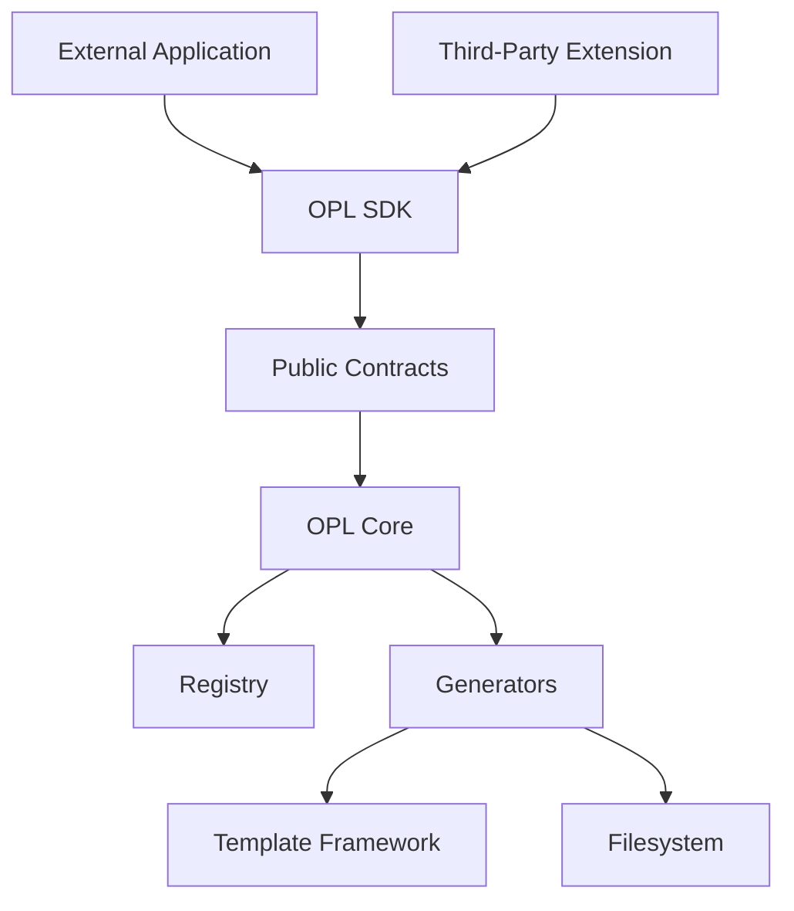

# OpenProjectLab SDK Architecture

> Status: Proposed
> Scope: Public extension contracts for generators, templates, configuration, results, exceptions, and future plugins
> Audience: Maintainers, contributors, third-party extension developers

OpenProjectLab（OPL）的 SDK 定義外部程式與第三方擴充可以安全依賴的公開介面。

SDK 的目標不是重新包裝整個內部實作，而是提供一組：

* 穩定
* 最小
* 可測試
* 有版本
* 可文件化
* 不暴露內部細節

的擴充契約。

目前 OPL 尚處於架構演進階段，因此本文件主要定義 SDK 的設計原則、公開邊界、相容性策略、測試方式與未來演進方向。

任何尚未在程式碼與測試中完成的能力，都應視為提案，而不是現有功能。

---

## 1. SDK Goals

OPL SDK 的核心目標包括：

* 讓第三方程式可呼叫 Generator，而不依賴 CLI。
* 讓第三方開發者可建立自訂 Generator。
* 提供穩定的 Request 與 Result Model。
* 提供一致的 Framework 例外。
* 隱藏 Registry、Template Engine 與 CLI 的內部實作。
* 支援未來 Plugin Framework。
* 支援 IDE 自動完成與靜態型別檢查。
* 建立清楚的版本與相容性政策。
* 降低內部重構對外部使用者的影響。

---

## 2. SDK Non-Goals

SDK 不應：

* 暴露所有內部 Class。
* 讓外部程式直接修改 Registry 內部狀態。
* 暴露 CLI Parser。
* 暴露 Template Engine 私有 API。
* 暴露 Repository 專屬絕對路徑。
* 保證所有 `generator.*` 模組都是穩定 API。
* 允許外部擴充跳過安全驗證。
* 將實驗性功能默認視為穩定。
* 讓第三方依賴私有函式與內部資料結構。

---

## 3. Public vs Internal API

OPL 必須區分：

```text
Public API
Internal API
Experimental API
```

### Public API

具有相容性承諾。

例如未來可能提供：

```python
from generator.sdk import (
    BaseGenerator,
    GenerationRequest,
    GenerationResult,
    GeneratorError,
)
```

### Internal API

僅供 OPL 內部使用。

例如：

```python
from generator.core.registry import GeneratorRegistry
```

若未正式列入 SDK，第三方不應依賴。

### Experimental API

可供早期測試，但不保證相容。

例如：

```python
from generator.experimental import ...
```

Experimental API 必須清楚標示。

---

## 4. High-Level Architecture



SDK 位於外部使用者與 OPL Core 之間。

外部程式應依賴 SDK，而不是直接依賴內部模組。

---

## 5. Dependency Direction

建議依賴方向：

```text
External Application / Plugin
  ↓
OPL SDK
  ↓
Stable Contracts
  ↓
Internal Adapters
  ↓
OPL Core
```

規則：

* SDK 可以依賴 Core 的穩定抽象。
* Core 不應依賴第三方 Plugin。
* Concrete Generator 不應依賴外部應用程式。
* SDK 不應 Import CLI。
* SDK 不應暴露 Internal Registry Dictionary。
* Plugin 應依賴 SDK，而不是 `generator.core.*`。
* SDK Public Type 不應引用私有實作型別。

---

## 6. Proposed SDK Package

建議目錄：

```text
generator/
├── sdk/
│   ├── __init__.py
│   ├── generator.py
│   ├── request.py
│   ├── result.py
│   ├── context.py
│   ├── exceptions.py
│   ├── protocols.py
│   └── version.py
├── core/
├── generators/
├── templates/
└── cli/
```

`generator.sdk.__init__` 應只重新匯出正式 Public API。

例如：

```python
from .exceptions import GeneratorError
from .generator import BaseGenerator
from .request import GenerationRequest
from .result import GenerationResult

__all__ = [
    "BaseGenerator",
    "GenerationRequest",
    "GenerationResult",
    "GeneratorError",
]
```

---

## 7. Minimal Public Surface

SDK 應採取最小公開面原則。

第一階段建議只公開：

* Generator Contract
* Generation Request
* Generation Result
* Stable Exceptions
* SDK Version
* 必要 Protocol

不建議第一階段公開：

* Registry 實作
* CLI Parser
* Template Resolver
* File Writer
* Dependency Injection Container
* Plugin Loader
* Internal Configuration Loader
* 私有 Helper

公開 API 越大，相容性維護成本越高。

---

## 8. Generator Contract

SDK 應提供清楚的 Generator 契約。

概念設計：

```python
from abc import ABC, abstractmethod

class BaseGenerator(ABC):
    name: str

    @abstractmethod
    def generate(
        self,
        request: GenerationRequest,
        context: GenerationContext,
    ) -> GenerationResult:
        ...
```

也可採用 Protocol：

```python
from typing import Protocol

class GeneratorProtocol(Protocol):
    name: str

    def generate(
        self,
        request: GenerationRequest,
        context: GenerationContext,
    ) -> GenerationResult:
        ...
```

兩種方式差異：

* ABC 提供名義型別與共享行為。
* Protocol 提供結構型別與較低耦合。
* ABC 適合需要共同實作。
* Protocol 適合最小契約與第三方擴充。

正式選擇前應建立 ADR。

---

## 9. Base Class vs Protocol

### Base Class

優點：

* 可提供共用驗證。
* 可提供預設方法。
* 容易建立明確繼承層級。
* 第三方實作方式一致。

缺點：

* 增加繼承耦合。
* 多重繼承可能複雜。
* 內部變更可能影響子類別。

### Protocol

優點：

* 不要求繼承。
* 第三方可使用自己的類別結構。
* 適合 Dependency Injection。
* 公開面較小。

缺點：

* Runtime 驗證較少。
* 共用實作需放在其他 Helper。
* 初學者可能較不熟悉。

現階段建議優先考慮 Protocol，加上可選的 Convenience Base Class。

---

## 10. Generator Name

SDK Generator 必須提供穩定名稱：

```python
class MyGenerator:
    name = "my-generator"
```

名稱應符合 Registry 契約：

* 唯一
* 小寫
* 不包含空白
* 不包含路徑字元
* 不與核心名稱衝突
* 公開後避免任意更名

第三方 Namespace 規則應由未來 Plugin Framework 定義。

---

## 11. Generation Request

SDK 應提供不可變且可驗證的 Request Model。

概念：

```python
from dataclasses import dataclass
from pathlib import Path

@dataclass(frozen=True, slots=True)
class GenerationRequest:
    target: Path
    overwrite: bool = False
    dry_run: bool = False
```

不同 Generator 可以建立專屬 Request：

```python
@dataclass(frozen=True, slots=True)
class WeekGenerationRequest(GenerationRequest):
    course_id: str = ""
    week_number: int = 1
    title: str = ""
```

需評估 Dataclass Inheritance 是否適合長期公開 API。

替代方式是 Composition。

---

## 12. Request Design Rules

Request 應：

* 使用明確型別。
* 儘可能不可變。
* 不直接包含 CLI Namespace。
* 不依賴目前工作目錄。
* 路徑使用 `pathlib.Path`。
* 不包含 Secret，除非有明確安全需求。
* 不包含可變全域物件。
* 不包含 Template Engine 實例。
* 可直接用於單元測試。
* 可被 API、GUI、CLI 與 Automation 共用。

---

## 13. Generation Context

Request 描述「使用者要求做什麼」。

Context 描述「執行所需的 Framework 依賴與環境」。

概念：

```python
@dataclass(frozen=True, slots=True)
class GenerationContext:
    project_config: ProjectConfig
    template_renderer: TemplateRendererProtocol
    file_writer: FileWriterProtocol
```

但 SDK 不應過早公開過多內部服務。

第一階段可只公開最小 Context：

```python
@dataclass(frozen=True, slots=True)
class GenerationContext:
    project_root: Path
    template_root: Path
    output_root: Path
```

具體設計應依目前 Generator 實作與擴充需求決定。

---

## 14. Avoid Service Locator

不建議：

```python
context.services.get("renderer")
```

或：

```python
context.container.resolve(...)
```

這類 Service Locator：

* 隱藏依賴。
* 降低型別安全。
* 測試較難理解。
* 讓第三方 Generator 依賴任意內部服務。
* 擴大 SDK 相容性負擔。

建議使用明確 Constructor Injection 或具型別的 Context。

---

## 15. Generation Result

SDK 應提供結構化且不可變的 Result Model。

概念：

```python
from dataclasses import dataclass
from pathlib import Path

@dataclass(frozen=True, slots=True)
class GenerationResult:
    generator: str
    target: Path
    created_files: tuple[Path, ...] = ()
    updated_files: tuple[Path, ...] = ()
    skipped_files: tuple[Path, ...] = ()
    warnings: tuple[str, ...] = ()
```

使用 Tuple 而非 List 可以降低外部修改風險。

---

## 16. Result Design Rules

Result 應：

* 不直接輸出文字到 Console。
* 不包含無法序列化的資源。
* 使用穩定欄位。
* 可被 CLI 轉成人類可讀輸出。
* 可被 API 轉成 JSON。
* 可被測試直接驗證。
* 不暴露內部執行物件。
* 明確區分 Created、Updated、Skipped。
* 保留 Warning。
* 成功與失敗語意清楚。

---

## 17. Result Status

未來可加入：

```python
from enum import Enum

class GenerationStatus(str, Enum):
    SUCCESS = "success"
    PARTIAL = "partial"
    DRY_RUN = "dry-run"
```

但失敗是否應回傳 `FAILED` Result，或直接拋出例外，需要明確定義。

建議：

* 可預期的執行結果使用 Result。
* 無法完成契約的情況使用 Exception。
* 不要同時回傳 `failed=True` 又拋出例外。
* Partial Success 必須有明確語意與文件。

---

## 18. Exception Model

SDK 應公開穩定的例外基底。

建議：

```text
OpenProjectLabError
├── ConfigurationError
├── RegistryError
├── GeneratorError
├── TemplateError
└── OutputError
```

第三方應能捕捉穩定例外：

```python
try:
    result = generator.generate(request, context)
except GeneratorError as exc:
    ...
```

不應要求第三方捕捉：

```python
KeyError
AttributeError
Jinja2Error
OSError
```

除非底層錯誤未被 Framework 處理。

---

## 19. Exception Stability

Public Exception 應視為 SDK 契約。

可以新增更具體的子類別，但移除或重新分類可能造成相容性問題。

例如：

```python
class GeneratorValidationError(GeneratorError):
    pass
```

使用者捕捉 `GeneratorError` 仍能正常工作。

因此例外階層設計應：

* 上層穩定
* 下層可擴充
* 保留 Exception Chaining
* 錯誤訊息可操作
* 不將敏感資料暴露給外部程式

---

## 20. Configuration Exposure

是否將 `ProjectConfig` 公開到 SDK，需要謹慎評估。

目前若其欄位是：

```python
dict[str, Any]
```

直接公開會形成寬鬆且難以演進的契約。

選項一：公開現有 `ProjectConfig`

優點：

* 簡單
* 與核心一致

缺點：

* Dictionary 結構不穩定
* 第三方可能修改設定
* 型別不清楚
* 未來 Migration 困難

選項二：公開 Read-only SDK Config View

```python
class ProjectConfigView(Protocol):
    ...
```

選項三：只透過 Generation Context 提供必要路徑與值。

現階段建議避免過早將完整 `ProjectConfig` 設為穩定 SDK API。

---

## 21. Template API Exposure

SDK 是否公開 Renderer，取決於第三方 Generator 是否需要使用 OPL Template Framework。

可能公開：

```python
class TemplateRendererProtocol(Protocol):
    def render(
        self,
        template_name: str,
        context: Mapping[str, object],
    ) -> str:
        ...
```

應避免公開：

* Jinja Environment
* Loader
* Undefined Strategy
* Cache
* 內部 Resolver
* Template Engine 私有例外

SDK 應公開抽象契約，而不是綁定 Jinja2。

---

## 22. Filesystem API Exposure

第三方 Generator 若直接使用 `Path.write_text()`，可能產生不一致行為。

未來可公開：

```python
class FileWriterProtocol(Protocol):
    def write_text(
        self,
        path: Path,
        content: str,
        *,
        overwrite: bool = False,
    ) -> None:
        ...
```

這可統一：

* UTF-8
* 換行
* 覆寫
* Path Containment
* Atomic Write
* 錯誤轉換

但 Public Writer Contract 一旦公開，後續修改成本較高。

初期可以先提供 Internal Adapter，等第三方需求成熟後再公開。

---

## 23. Registry Exposure

SDK 不應直接公開可變 Registry 實作。

不建議：

```python
from generator.core.registry import GeneratorRegistry
```

可考慮公開註冊 Protocol：

```python
class GeneratorRegistrar(Protocol):
    def register(
        self,
        generator: GeneratorProtocol,
    ) -> None:
        ...
```

Plugin Entry Point 只需要取得有限 Registrar，而不是完整 Registry。

這樣可以防止 Plugin：

* 清空 Registry
* 讀取或修改其他 Generator
* 覆寫核心項目
* 依賴內部 Dictionary
* 執行未授權操作

---

## 24. Plugin Entry Contract

未來 Plugin 可提供明確入口：

```python
def register(
    registrar: GeneratorRegistrar,
) -> None:
    registrar.register(MyGenerator())
```

或 Manifest 驅動：

```toml
[project.entry-points."openprojectlab.plugins"]
my_plugin = "my_plugin:plugin"
```

Plugin Object：

```python
class PluginProtocol(Protocol):
    name: str
    version: str

    def register(
        self,
        registrar: GeneratorRegistrar,
    ) -> None:
        ...
```

正式 Plugin Framework 尚未完成前，不應將此視為現有功能。

---

## 25. Public Import Paths

穩定 API 應使用單一且短的 Import Path。

建議：

```python
from generator.sdk import GenerationRequest
```

不建議第三方依賴：

```python
from generator.sdk.request.models.base import GenerationRequest
```

內部模組可以重構，但頂層 Re-export 應保持穩定。

---

## 26. `__all__`

SDK 應使用 `__all__` 明確定義 Public API。

例如：

```python
__all__ = [
    "BaseGenerator",
    "GenerationContext",
    "GenerationRequest",
    "GenerationResult",
    "GeneratorError",
    "GeneratorProtocol",
]
```

沒有列在 `__all__` 中不代表一定是 Private，但可作為文件與 Tooling 的清楚訊號。

正式穩定 API 應同時出現在：

* `__all__`
* API Reference
* Type Hints
* Contract Tests
* Changelog

---

## 27. Naming Rules

SDK 名稱應：

* 使用清楚的完整名稱。
* 避免模糊縮寫。
* 避免與 Python 標準函式衝突。
* 避免暴露內部階層。
* 保持 Request、Result、Context 命名一致。
* 例外以 `Error` 結尾。
* Protocol 可使用 `Protocol` 後綴，但不是必要。

例如：

```text
GenerationRequest
GenerationResult
GenerationContext
GeneratorError
TemplateRendererProtocol
```

---

## 28. Type Hints

所有 Public API 必須具有完整 Type Hints。

包括：

* 參數
* 回傳值
* Attributes
* Generic
* Callback
* Exceptions 文件
* Optional 行為

不應公開：

```python
def generate(request):
    ...
```

建議：

```python
def generate(
    request: GenerationRequest,
    context: GenerationContext,
) -> GenerationResult:
    ...
```

---

## 29. Runtime Type Validation

Type Hints 不會自動在 Runtime 驗證。

SDK 必須決定：

* 只依賴靜態型別檢查
* 加入基本 Runtime Validation
* 使用 Dataclass `__post_init__`
* 使用專用 Validation Library

例如：

```python
def __post_init__(self) -> None:
    if not self.target:
        raise ValueError("target 不可為空")
```

但 Public Request 拋出 `ValueError` 或 SDK 專用例外，需要一致策略。

---

## 30. Immutability

Public Request、Result 與 Descriptor 建議使用：

```python
@dataclass(frozen=True, slots=True)
```

好處：

* 避免隱藏狀態變更
* 容易測試
* 更適合並行執行
* 契約更清楚
* 可安全共享

但若欄位內部仍使用 List 或 Dict，Frozen Dataclass 並不能提供深層不可變。

建議使用：

* Tuple
* Mapping
* Read-only View
* Frozen Nested Model

---

## 31. Serialization

SDK Model 未來可能需要 JSON Serialization。

例如：

```python
result.to_dict()
```

輸出：

```python
{
    "generator": "week",
    "target": "courses/java/week-01",
    "created_files": [
        "courses/java/week-01/README.md",
    ],
    "warnings": [],
}
```

路徑序列化應使用 String。

日期使用 ISO 8601。

Enum 使用穩定 String Value。

不要直接依賴：

```python
dataclasses.asdict()
```

作為永久公開格式，因為內部欄位新增可能意外改變 API。

---

## 32. Sync vs Async

目前檔案生成通常是同步操作。

建議第一階段使用：

```python
def generate(...) -> GenerationResult:
    ...
```

不要過早加入：

```python
async def generate(...)
```

除非有明確需求，例如：

* 網路內容取得
* 遠端儲存
* 大量平行任務
* Web Server

若未來需要 Async，應新增獨立契約，而不是直接破壞同步 API。

---

## 33. Thread Safety

SDK 應清楚描述是否可跨執行緒共用。

建議：

* Request 與 Result 不可變。
* Generator 儘可能無狀態。
* Renderer 共用時需保證安全。
* Registry 啟動後只讀。
* Context 不包含可變全域狀態。
* 第三方 Generator 自行負責其內部狀態安全。

第一階段可以不保證並行執行，但不應設計成必然不安全。

---

## 34. Determinism

SDK Generator 應盡量具有決定性。

相同：

* Request
* Context
* Template
* OPL Version

應產生相同 Result 與輸出。

不應隱含依賴：

* 現在時間
* 隨機值
* 目前工作目錄
* 本機環境變數
* 網路
* 使用者 Home
* 未排序檔案掃描

必要資料應明確放入 Request 或 Context。

---

## 35. Cancellation

未來長時間 Generator 可能需要取消支援。

可考慮：

```python
class CancellationToken(Protocol):
    @property
    def is_cancelled(self) -> bool:
        ...
```

但 Cancellation Contract 會影響：

* Generator Lifecycle
* Partial Output
* Rollback
* Result Status
* CLI Signal Handling
* GUI

目前不應過早加入，除非已有長時間工作流程需求。

---

## 36. Progress Reporting

未來 SDK 可支援 Progress Callback：

```python
class ProgressReporter(Protocol):
    def report(
        self,
        event: GenerationEvent,
    ) -> None:
        ...
```

事件可能包括：

```text
generation-started
file-created
file-skipped
generation-completed
```

進度事件必須：

* 不改變核心結果。
* 不包含敏感資料。
* 不要求 CLI 專屬輸出。
* 可被忽略。
* 具穩定版本。

目前可先使用 Logging 與 Generation Result。

---

## 37. Logging

SDK 不應強迫第三方使用特定 Logging Framework。

建議：

* 內部使用標準 `logging`。
* Library 不自行設定 Root Logger。
* 不在 Import 時加入 Handler。
* 不直接 `print()`。
* 由 Host Application 決定 Logging 設定。
* 技術細節進入 Logger。
* 使用者結果透過 Result 回傳。

---

## 38. Versioning

SDK 應具有可查詢版本：

```python
from generator.sdk import SDK_VERSION
```

可能形式：

```python
SDK_VERSION = "0.1"
```

SDK Version 不一定等於 Package Version。

選項：

* SDK 與 OPL Package 共用 SemVer。
* SDK 使用獨立 Compatibility Version。
* Plugin Manifest 宣告支援範圍。

正式策略應由 ADR 定義。

---

## 39. Semantic Versioning

若採用 Semantic Versioning：

```text
MAJOR.MINOR.PATCH
```

則：

### Major

* 移除 Public API
* 更改方法簽章
* 改變欄位型別
* 改變 Result 語意
* 重新分類例外
* 更改 Plugin Contract

### Minor

* 新增向後相容 API
* 新增選填欄位
* 新增例外子類別
* 新增 Generator 能力

### Patch

* 修正錯誤
* 改善文件
* 修正不影響契約的行為
* 安全修補

在 `0.x` 階段仍可快速演進，但破壞性變更必須清楚記錄。

---

## 40. Compatibility Policy

正式 SDK 應明確承諾：

* 哪些 Import Path 穩定。
* 哪些 Class 穩定。
* 哪些欄位可新增。
* Deprecated API 支援多久。
* Python 最低版本。
* OPL Plugin 相容版本。
* 是否保證 Binary Compatibility。
* 是否保證序列化格式相容。

對 Python SDK，通常主要承諾 Source Compatibility。

---

## 41. Deprecation

不應直接移除 Public API。

建議流程：

```text
Introduce Replacement
  ↓
Mark Old API Deprecated
  ↓
Emit DeprecationWarning
  ↓
Update Documentation
  ↓
Provide Migration Guide
  ↓
Remove in Next Major Version
```

例如：

```python
import warnings

warnings.warn(
    "OldRequest 已棄用，請改用 GenerationRequest。",
    DeprecationWarning,
    stacklevel=2,
)
```

Deprecation Warning 預設可能不顯示，因此文件與 Changelog 同樣重要。

---

## 42. Experimental API

實驗性 API 必須明確隔離。

建議路徑：

```python
from generator.experimental import ...
```

或：

```python
from generator.sdk.experimental import ...
```

規則：

* 不保證相容性。
* 文件需標示 Experimental。
* 不應由核心 Stable API 回傳 Experimental Type。
* Plugin 不應依賴 Experimental API 作為正式發布條件。
* 升級時可能移除或更名。

---

## 43. Feature Detection

第三方 Plugin 不應只比較版本字串。

未來可提供 Capability：

```python
sdk.capabilities()
```

或：

```python
supports("generation-plan")
```

但 Capability System 也會形成新契約。

初期使用明確版本範圍通常較簡單。

---

## 44. Security Boundary

SDK 是第三方程式進入 OPL 的邊界。

必須防止：

* 任意檔案寫入
* 路徑遍歷
* Secret 洩漏
* 未授權 Registry 修改
* Plugin 覆寫核心 Generator
* Template 任意程式碼執行
* Import-Time Side Effects
* 不受信任 Module 自動載入
* 不安全序列化
* Shell Injection

Public API 不應提供超出必要範圍的高權限物件。

---

## 45. Capability-Based Design

與其將完整 Application 物件交給 Plugin，不如提供有限 Capability。

不建議：

```python
plugin.initialize(application)
```

因為 Plugin 可能取得所有內部服務。

建議：

```python
plugin.register(registrar)
```

或：

```python
generator.generate(
    request,
    context,
)
```

其中 Context 只包含必要能力。

這符合最小權限原則。

---

## 46. Plugin Trust Levels

未來可能區分：

* Core
* Trusted Plugin
* Local Plugin
* Third-party Plugin
* Untrusted Template Pack

不同來源可具有不同能力。

例如：

| 能力 | Core | Trusted Plugin | Third-party Plugin |
| -------------- | ---: | -------------: | -----------------: |
| 註冊 Generator | 是 | 是 | 受限制 |
| 覆寫核心 Generator | 否 | 明確允許 | 否 |
| 使用 File Writer | 是 | 是 | 受限制 |
| 執行 Shell | 否 | 否 | 否 |
| 存取網路 | 非預設 | 非預設 | 否 |

正式權限模型應由 Plugin Architecture 定義。

---

## 47. SDK Documentation

SDK 發布前應提供：

* Getting Started
* API Reference
* Generator Tutorial
* Request Reference
* Result Reference
* Exceptions Reference
* Plugin Author Guide
* Compatibility Policy
* Migration Guide
* Example Project
* Code Review Checklist

每個 Public Class 應有：

* 用途
* 建構參數
* Attributes
* 回傳型別
* 例外
* 範例
* 版本資訊

---

## 48. Docstrings

Public API 必須有完整 Docstring。

範例：

```python
def generate(
    self,
    request: GenerationRequest,
    context: GenerationContext,
) -> GenerationResult:
    """Generate files for one request.

    Args:
        request:
            Structured generation input.
        context:
            Framework-provided execution context.

    Returns:
        Structured generation result.

    Raises:
        GeneratorValidationError:
            If the request is invalid.
        GeneratorError:
            If generation cannot be completed.
    """
```

Docstring 風格應由專案統一。

---

## 49. Example SDK Usage

概念使用方式：

```python
from pathlib import Path

from generator.sdk import (
    GenerationRequest,
    OpenProjectLab,
)

application = OpenProjectLab.load(
    config_path=Path("config/default.yaml"),
)

request = GenerationRequest(
    generator="week",
    target=Path("courses/java/week-01"),
)

result = application.generate(request)

for path in result.created_files:
    print(path)
```

這只是未來高階 API 的概念。

目前若尚未實作 `OpenProjectLab` Application Facade，不應在正式 Reference 中宣稱可用。

---

## 50. Application Facade

未來可提供高階入口：

```python
class OpenProjectLab:
    @classmethod
    def load(
        cls,
        config_path: Path,
    ) -> "OpenProjectLab":
        ...

    def generators(self) -> tuple[str, ...]:
        ...

    def generate(
        self,
        request: GenerationRequest,
    ) -> GenerationResult:
        ...
```

Facade 可隱藏：

* Configuration Loader
* Registry Construction
* Renderer
* File Writer
* Dependency Wiring

優點：

* 第三方使用簡單。
* 內部可重構。
* SDK 公開面集中。
* 適合 CLI、GUI 與 Web API。

缺點：

* Facade 容易膨脹。
* 必須清楚處理生命週期。
* 所有功能可能被塞入單一物件。

應保持最小且以 Use Case 為中心。

---

## 51. Low-Level and High-Level API

SDK 可分成兩層。

### High-Level API

```python
application.generate(...)
```

適合：

* 一般外部程式
* GUI
* Automation
* Script

### Low-Level Contracts

```python
GeneratorProtocol
GenerationRequest
GenerationResult
```

適合：

* Plugin 作者
* 自訂 Host
* 測試
* Framework 擴充

兩層 API 必須避免重複或矛盾語意。

---

## 52. Testing Strategy

SDK 測試應包含：

* Public Import Tests
* Contract Tests
* Type Tests
* Compatibility Tests
* Documentation Examples
* Exception Tests
* Serialization Tests
* Third-party Simulation Tests

---

## 53. Public Import Tests

確認正式 Import Path 可用：

```python
def test_public_sdk_imports():
    from generator.sdk import (
        GenerationRequest,
        GenerationResult,
        GeneratorError,
    )

    assert GenerationRequest is not None
    assert GenerationResult is not None
    assert GeneratorError is not None
```

這能防止內部重構意外破壞 Public Re-export。

---

## 54. `__all__` Tests

```python
def test_sdk_all_contains_public_symbols():
    import generator.sdk as sdk

    assert set(sdk.__all__) == {
        "GenerationRequest",
        "GenerationResult",
        "GeneratorError",
    }
```

若 Public API 很大，應使用明確預期值或 Snapshot，但更新時必須 Review。

---

## 55. Contract Tests

所有第三方 Generator 應通過共同契約。

例如：

* Name 合法。
* Generate 接收 Request 與 Context。
* 成功時回傳 GenerationResult。
* 失敗時使用 SDK Exception。
* 不修改 Request。
* 不修改 Context。
* 不依賴目前工作目錄。
* 不未經允許覆寫檔案。
* Result 可序列化。

---

## 56. Fake Third-Party Generator

測試可建立：

```python
class ExampleGenerator:
    name = "example"

    def generate(
        self,
        request: GenerationRequest,
        context: GenerationContext,
    ) -> GenerationResult:
        return GenerationResult(
            generator=self.name,
            target=request.target,
        )
```

再驗證：

* Registry 可接受。
* Host 可執行。
* Result 可顯示。
* 例外可捕捉。
* 不需要 Import Internal API。

---

## 57. Import Boundary Tests

可加入測試，防止 SDK Public Module Import CLI。

概念：

```python
def test_sdk_does_not_import_cli():
    import sys
    import generator.sdk

    assert "generator.cli.main" not in sys.modules
```

更完整方式可以使用 Dependency Rule Tool。

目標是防止：

```text
SDK → CLI
```

反向依賴。

---

## 58. Type Checking

Public API 應納入靜態型別檢查。

可評估：

* mypy
* pyright
* basedpyright

第三方 Example Project 應能通過型別檢查。

例如：

```powershell
python -m mypy examples\sdk
```

若目前專案尚未導入 Type Checker，應先以 ADR 與逐步導入計畫處理。

---

## 59. Signature Compatibility Tests

可以使用：

* `inspect.signature`
* API Snapshot
* Dedicated API Compatibility Tool

例如保存 Public API Snapshot：

```text
GenerationRequest(target: Path, overwrite: bool = False)
GenerationResult(generator: str, target: Path, ...)
```

CI 比較差異並要求人工 Review。

這適合 SDK 開始對外發布後導入。

---

## 60. Documentation Tests

SDK 文件中的程式碼範例應可執行。

可以使用：

* doctest
* pytest
* Markdown Code Extraction
* Example Project Tests

不得讓文件範例長期失效。

---

## 61. Serialization Tests

若 Result 支援 `to_dict()`：

```python
def test_result_serialization():
    result = GenerationResult(
        generator="week",
        target=Path("course/week-01"),
    )

    assert result.to_dict() == {
        "generator": "week",
        "target": "course/week-01",
        "created_files": [],
        "updated_files": [],
        "skipped_files": [],
        "warnings": [],
    }
```

序列化格式一旦對外使用，必須視為版本化契約。

---

## 62. Exception Compatibility Tests

```python
def test_validation_error_is_generator_error():
    assert issubclass(
        GeneratorValidationError,
        GeneratorError,
    )
```

這可以避免重構時破壞使用者捕捉上層例外的行為。

---

## 63. Packaging Tests

SDK 必須在安裝後可使用，而不只是 Repository 內可 Import。

建議 CI：

```powershell
python -m build
python -m venv .package-test
.package-test\Scripts\python -m pip install dist\*.whl
.package-test\Scripts\python -c "import generator.sdk"
```

這可發現：

* Package Discovery 錯誤
* 缺少 Template Resource
* `__init__.py` 缺失
* Wheel 未包含 SDK 檔案
* Import 使用 Repository 相對路徑

---

## 64. Python Version Support

SDK 必須明確定義支援的 Python 版本。

例如：

```toml
requires-python = ">=3.12"
```

目前 OPL 使用環境可能是 Python 3.14，但公開 SDK 不一定必須只支援該版本。

選擇最低版本時應考慮：

* 使用的語法
* `pathlib.Path.is_relative_to`
* Dataclass Features
* Typing Features
* 第三方依賴
* CI Matrix
* 使用者環境

正式版本支援應記錄於 `pyproject.toml` 與文件。

---

## 65. Packaging Public Types

SDK Public Type 必須包含在：

* Source Distribution
* Wheel
* Type Information
* Documentation

若提供型別資訊，Package 應考慮加入：

```text
py.typed
```

這讓 Type Checker 知道套件包含 Inline Type Hints。

---

## 66. Plugin Compatibility

未來 Plugin Manifest 可宣告：

```yaml
plugin:
  name: example
  version: 1.2.0
  requires_opl: ">=0.5,<1.0"
  requires_sdk: ">=1,<2"
```

Plugin Loader 應在 Import Plugin Code 前盡可能完成相容性驗證。

這可降低：

* Import-Time Failure
* 難以理解的 AttributeError
* 不相容 API 執行
* 核心狀態污染

---

## 67. SDK Upgrade Workflow

SDK 變更應遵循：

```text
Requirement
  ↓
Public Contract Design
  ↓
Architecture Review
  ↓
ADR
  ↓
Implementation
  ↓
Contract Tests
  ↓
API Reference
  ↓
Migration Review
  ↓
Compatibility Check
  ↓
Release Notes
```

任何公開 API 變更都不應只修改程式碼。

---

## 68. Adding a Public API

新增 Public API 前確認：

* 是否真的需要對外公開？
* 是否可透過既有 API 完成？
* 名稱是否穩定？
* 型別是否清楚？
* 是否會暴露內部實作？
* 如何測試？
* 如何版本化？
* 如何棄用？
* 是否需要序列化？
* 是否有安全風險？
* 是否需要 ADR？

預設應保持 Private，直到有明確對外需求。

---

## 69. Removing a Public API

移除前必須：

* 提供替代 API。
* 標示 Deprecated。
* 加入 Warning。
* 更新文件。
* 提供 Migration Guide。
* 更新 Changelog。
* 等待約定的棄用週期。
* 在 Major Version 移除。

除非是嚴重安全問題，不應立即移除已發布 API。

---

## 70. Changing Public Models

對 Request 或 Result Model 進行變更時：

### 通常相容

* 新增具有預設值的選填欄位。
* 新增方法。
* 新增例外子類別。

### 可能不相容

* 更改欄位名稱。
* 更改欄位型別。
* 更改預設值。
* 更改 Path 正規化語意。
* 將 List 改為 Iterator。
* 改變序列化格式。
* 將同步方法改為 Async。
* 修改 Exception Base Class。

每個變更都需進行 Compatibility Review。

---

## 71. Current Limitations

目前 OPL SDK 可能仍有以下限制：

* `generator/sdk` 尚未建立。
* Public API 尚未固定。
* Generator Contract 尚未標準化。
* Request Model 尚未正式建立。
* Result Model 尚未正式建立。
* Generation Context 尚未定義。
* Public Exceptions 尚未穩定。
* Template Renderer Protocol 尚未公開。
* File Writer Protocol 尚未公開。
* Application Facade 尚未實作。
* Plugin Entry Contract 尚未實作。
* SDK Version Policy 尚未決定。
* Deprecation Policy 尚未實作。
* API Compatibility Automation 尚未建立。
* `py.typed` 尚未確認。
* 第三方範例專案尚未建立。

以上項目若尚未在程式與測試中出現，應視為提案。

---

## 72. Recommended Implementation Phases

### Phase 1：Internal Contracts

先在 OPL 內部建立：

* GenerationRequest
* GenerationResult
* Generator Protocol
* Stable Exception Base

目標：

* 不立即宣稱為 Public SDK。
* 先讓核心 Generator 使用一致契約。

### Phase 2：Internal SDK Package

建立：

```text
generator/sdk/
```

但標示為 Experimental。

加入：

* Public Re-export
* Contract Tests
* Type Hints
* Documentation

### Phase 3：Application Facade

建立高階呼叫介面。

驗證 CLI 能使用相同 Application Service。

### Phase 4：Third-Party Example

建立最小外部 Generator 範例。

確認不依賴 Internal Module。

### Phase 5：Plugin Integration

建立 Plugin Entry Contract 與相容性驗證。

### Phase 6：Stable SDK

宣告 SDK Version、Compatibility Policy 與 Deprecation Policy。

---

## 73. Proposed First SDK Contract

第一版可以保持非常小：

```python
from dataclasses import dataclass
from pathlib import Path
from typing import Protocol

class OpenProjectLabError(Exception):
    pass

class GeneratorError(OpenProjectLabError):
    pass

@dataclass(frozen=True, slots=True)
class GenerationRequest:
    target: Path
    overwrite: bool = False

@dataclass(frozen=True, slots=True)
class GenerationResult:
    generator: str
    target: Path
    created_files: tuple[Path, ...] = ()
    skipped_files: tuple[Path, ...] = ()

class GeneratorProtocol(Protocol):
    name: str

    def generate(
        self,
        request: GenerationRequest,
    ) -> GenerationResult:
        ...
```

這只是起始設計。

在正式實作前應與目前 Generator API、Registry 與 CLI 行為比對。

---

## 74. Proposed Tests

建議新增：

```text
tests/
└── sdk/
    ├── test_public_imports.py
    ├── test_request.py
    ├── test_result.py
    ├── test_generator_contract.py
    ├── test_exceptions.py
    └── test_package.py
```

Integration：

```text
tests/
└── integration/
    └── test_sdk_generation.py
```

Example：

```text
examples/
└── sdk/
    ├── custom_generator.py
    └── README.md
```

---

## 75. SDK Code Review Checklist

### Public Boundary

* [ ] 新增項目確實需要公開。
* [ ] Public Import Path 清楚且穩定。
* [ ] `__all__` 已更新。
* [ ] 沒有暴露 CLI 內部型別。
* [ ] 沒有暴露 Registry 內部 Dictionary。
* [ ] 沒有暴露 Template Engine 私有 API。
* [ ] 沒有暴露 Repository 絕對路徑。
* [ ] Experimental 與 Stable API 已清楚區分。

### Contracts

* [ ] Generator 契約最小且清楚。
* [ ] Request 型別完整。
* [ ] Result 型別完整。
* [ ] Context 只提供必要能力。
* [ ] Public Model 儘可能不可變。
* [ ] Public API 不依賴 `dict[str, Any]` 作為主要契約。
* [ ] 例外階層清楚且穩定。
* [ ] Public API 有完整 Docstring。

### Compatibility

* [ ] 已評估破壞性變更。
* [ ] Public Signature 未被意外修改。
* [ ] 新欄位具有合理預設值。
* [ ] Deprecated API 有替代方案。
* [ ] Changelog 已更新。
* [ ] Migration Guide 已更新。
* [ ] 必要時已提高版本。
* [ ] 必要時已新增 ADR。

### Security

* [ ] SDK 不提供不必要的高權限物件。
* [ ] 路徑受 Output Root 限制。
* [ ] Plugin 無法靜默覆寫核心功能。
* [ ] Template Renderer 不暴露危險物件。
* [ ] Secret 不會出現在 Context、Result 或錯誤。
* [ ] 未驗證 Plugin 不會自動 Import。
* [ ] Public Serialization 不使用不安全反序列化。

### Tests

* [ ] Public Import 有測試。
* [ ] `__all__` 有測試。
* [ ] Generator Contract 有測試。
* [ ] Request Validation 有測試。
* [ ] Result Immutability 有測試。
* [ ] Exception Hierarchy 有測試。
* [ ] Serialization 有測試（如適用）。
* [ ] 第三方 Fake Generator 有整合測試。
* [ ] Wheel 安裝測試通過。
* [ ] 文件範例可執行。
* [ ] Type Checking 通過（如已導入）。

### Documentation and Automation

* [ ] SDK Architecture 已更新。
* [ ] API Reference 已更新。
* [ ] Plugin Author Guide 已更新（如適用）。
* [ ] Compatibility Policy 已更新。
* [ ] Changelog 已更新。
* [ ] ADR 已新增或更新。
* [ ] `git diff --check` 通過。
* [ ] `pre-commit run --all-files` 通過。
* [ ] `python -m pytest` 通過。
* [ ] Package Build 測試通過。

---

## 76. Related Documents

* [Architecture Overview](overview.md)
* [Generator Framework](generator-framework.md)
* [Generator Registry](registry.md)
* [Configuration Framework](configuration-framework.md)
* [Template Framework](template-framework.md)
* [CLI Reference](../reference/cli.md)
* [Configuration Reference](../reference/configuration.md)
* [Template Reference](../reference/template.md)
* [Development Workflow](../development/development-workflow.md)
* [Code Review Checklist](../development/code-review-checklist.md)

---

> **SDK 的價值，不是讓所有內部功能都可以被 Import，而是提供一組足夠小、足夠穩定、足夠安全，且能讓外部開發者長期依賴的公開契約。**
