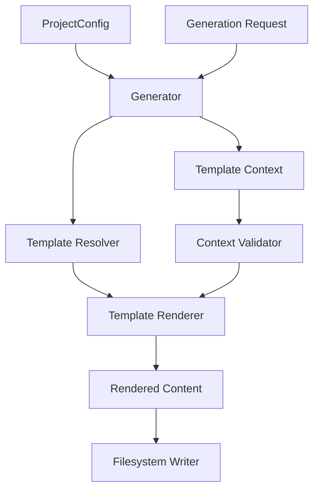
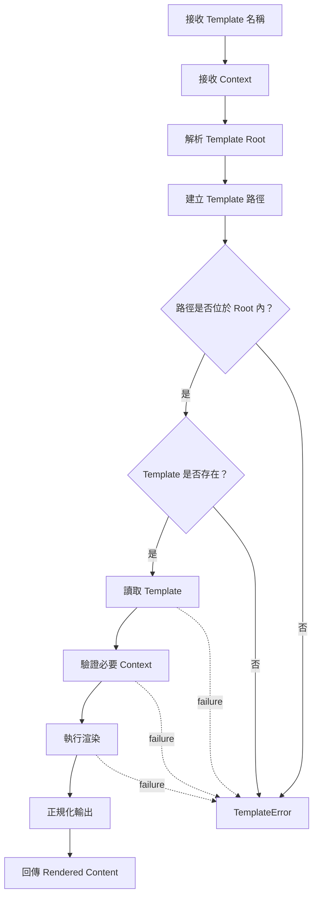

# OpenProjectLab Template Framework

> Status: Active
> Scope: Template discovery, context validation, rendering, naming, output mapping, and safety
> Audience: Maintainers, contributors, generator developers, template authors

OpenProjectLab（OPL）的 Template Framework 負責將 Template 與結構化 Context 轉換為可交由 Generator 寫入檔案系統的內容。

Template Framework 是 Generator Framework 與教材、文件、專案骨架之間的邊界。

其主要目的不是單純替換字串，而是建立一套：

* 可預期
* 可驗證
* 可測試
* 可擴充
* 跨平台
* 安全

的內容產生機制。

本文件定義 Template Framework 的責任、資料流程、Template 組織方式、Context 契約、錯誤模型、安全邊界、測試策略與演進方向。

---

## 1. Framework Goals

Template Framework 的核心目標包括：

* 將內容格式與 Python 業務邏輯分離
* 提供一致的 Template 尋找規則
* 提供明確的 Template Context 契約
* 在渲染前發現缺少變數
* 統一處理 UTF-8 與換行
* 防止 Template 路徑逃逸
* 讓 Template 可以獨立測試
* 支援 Generator 共用 Template
* 為未來 Theme、Plugin 與 Override 機制保留擴充空間

---

## 2. Framework Responsibilities

Template Framework 負責：

* 接收 Template Root
* 定位 Template
* 驗證 Template 路徑
* 讀取 Template 內容
* 驗證必要 Context
* 執行 Template 渲染
* 回傳渲染結果
* 將底層錯誤轉換為 Framework 例外
* 提供 Template 測試介面
* 保持渲染結果具決定性

Template Framework 不應負責：

* 解析 CLI 參數
* 載入 YAML 設定檔
* 決定要執行哪個 Generator
* 建立完整 Generation Plan
* 決定最終輸出目錄
* 未經 Generator 授權直接寫入檔案
* 執行 Shell Command
* 存取網路
* 載入不受信任的 Python 程式碼
* 將複雜業務流程塞入 Template

---

## 3. High-Level Architecture



---

## 4. Dependency Direction

建議依賴方向：

```text
CLI
  ↓
Generator
  ↓
Template Framework
  ↓
Template Engine
```

設定依賴：

```text
Configuration Framework
  ↓
Resolved Template Root
  ↓
Template Framework
```

規則：

* CLI 不應直接渲染 Template。
* Generator 決定使用哪一個 Template。
* Template Framework 不應反向依賴特定 Generator。
* Template 不應自行讀取 `ProjectConfig`。
* Template 不應知道 CLI Argument Namespace。
* Template Framework 不應決定完整業務流程。
* Template Engine 應被封裝在 Framework 內部。
* 下游元件不應依賴特定 Template Engine 的私有 API。

---

## 5. Template Rendering Flow

建議流程如下：



---

## 6. Template Root

Template Root 是所有 Template 搜尋的基準目錄。

範例：

```yaml
paths:
  template_root: ../templates
```

經 Configuration Framework 解析後，Template Framework 應取得明確的 `Path`：

```python
template_root = Path(...)
```

Template Framework 不應自行猜測：

* Repository 根目錄
* 目前工作目錄
* 執行檔位置
* 使用者 Home
* 硬編碼磁碟機

Template Root 的解析規則應由 Configuration Framework 統一定義。

---

## 7. Template Locations

OPL 必須清楚區分不同 Template 目錄的用途。

可能存在：

```text
generator/templates/
```

以及：

```text
templates/
```

兩者不應具有模糊或重疊的責任。

建議區分方式：

### `generator/templates/`

用於 Python Package 內建 Template。

特性：

* 隨套件發布
* 提供 Framework 預設內容
* 不應依賴 Repository 外部檔案
* 適合 Bootstrap 或內建 Generator

### Repository 根目錄 `templates/`

用於專案或課程層級 Template。

特性：

* 可由專案維護者修改
* 可受版本控制
* 可針對課程客製
* 可由設定檔指定

正式採用哪一種目錄作為主要來源，必須以目前實作與測試為準。

若兩者同時存在，必須定義清楚的搜尋優先順序。

---

## 8. Recommended Directory Structure

建議結構：

```text
templates/
├── bootstrap/
│   ├── README.md.j2
│   ├── pyproject.toml.j2
│   └── gitignore.j2
├── course/
│   ├── README.md.j2
│   ├── syllabus.md.j2
│   └── metadata.yaml.j2
├── week/
│   ├── README.md.j2
│   ├── lecture-notes.md.j2
│   ├── slides.md.j2
│   ├── lab.md.j2
│   ├── assignment.md.j2
│   └── quiz.md.j2
└── shared/
    ├── license-header.md.j2
    └── attribution.md.j2
```

原則：

* 每個 Generator 使用自己的子目錄。
* 共用片段放入 `shared/`。
* Template 檔名應能反映輸出用途。
* 不要將所有 Template 放在同一層。
* 不要以無意義編號作為主要命名方式。

---

## 9. Template Naming

建議 Template 使用：

```text
<output-name>.<output-extension>.j2
```

例如：

```text
README.md.j2
metadata.yaml.j2
pyproject.toml.j2
```

`.j2` 表示使用 Jinja 類 Template 語法。

若目前 Template Engine 不是 Jinja，應使用實際引擎對應的副檔名或建立明確的專案慣例。

命名規則：

* 使用穩定且容易理解的名稱。
* 保留最終輸出副檔名。
* 避免將版本號放入一般 Template 名稱。
* 避免包含使用者本機資訊。
* 大小寫應與輸出契約一致。
* 在 Linux 上必須能正確區分大小寫。

---

## 10. Output Mapping

Template Framework 負責渲染內容，但通常不應自行決定所有最終輸出位置。

輸出 Mapping 應由 Generator 或 Generation Plan 定義：

```python
PlannedFile(
    source_template=Path("week/README.md.j2"),
    destination=target / "README.md",
    context=context,
)
```

建議關係：

```text
Template
  ↓
Rendered Content
  ↓
Planned Destination
  ↓
Filesystem Writer
```

Template 名稱與輸出名稱不一定必須相同，但 Mapping 必須明確且可測試。

---

## 11. Template Context

Template Context 是由 Generator 建立並傳給 Renderer 的結構化資料。

例如：

```python
context = {
    "course_name": "Modern Java in Action",
    "week_number": 1,
    "week_title": "課程介紹與 Java 基礎",
}
```

Context 應只包含 Template 需要的資料。

不應直接傳入：

* 完整 CLI Namespace
* 完整執行環境
* 未限制的 `os.environ`
* 可任意執行方法的服務物件
* Database Connection
* Filesystem Handle
* Secret
* 不必要的完整 `ProjectConfig`

---

## 12. Context Contract

每一個正式 Template 都應具有可追蹤的 Context 契約。

範例：

```text
Template: week/README.md.j2

Required:
- course_name: str
- week_number: int
- week_title: str

Optional:
- learning_objectives: list[str]
- prerequisites: list[str]
```

這個契約可以記錄於：

* Template Reference
* Template 相鄰 Metadata
* Python 型別
* 測試 Fixture
* 未來 Template Schema

關鍵是不可只依賴作者記憶。

---

## 13. Required and Optional Variables

### Required Variables

缺少時應立即失敗。

例如：

```jinja2
# Week {{ week_number }}: {{ week_title }}
```

若 `week_title` 缺少，Renderer 不應靜默輸出空字串。

### Optional Variables

必須在 Template 中提供明確條件：

```jinja2

## 先備知識


- {{ item }}


```

Optional 不代表可以產生結構破損的文件。

---

## 14. Strict Undefined Behavior

若使用 Jinja2，建議採用 Strict Undefined 行為。

概念：

```python
Environment(
    undefined=StrictUndefined,
)
```

優點：

* 拼錯變數名稱會立即失敗
* 缺少 Context 容易發現
* Template 契約更清楚
* 測試更可靠

寬鬆 Undefined 可能造成：

```markdown
# Week 1:
```

而真正問題是 `week_title` 未提供。

正式設定應依目前 Template Engine 實作驗證。

---

## 15. Context Types

即使 Context 最終以 Dictionary 傳入，也應定義型別期待。

例如：

| 變數 | 型別 | 說明 |
| --------------------- | ------------------- | ----------- |
| `course_name` | `str` | 課程名稱 |
| `week_number` | `int` | 週次 |
| `week_title` | `str` | 單週標題 |
| `learning_objectives` | `list[str]` | 學習目標 |
| `metadata` | `dict[str, object]` | 額外 Metadata |

不應讓同一欄位在不同 Template 中交替使用：

* String
* List
* Dictionary

否則 Template 很難維護與測試。

---

## 16. Typed Context

未來可為不同 Template 定義 Typed Context。

例如：

```python
@dataclass(frozen=True, slots=True)
class WeekTemplateContext:
    course_name: str
    week_number: int
    week_title: str
    learning_objectives: tuple[str, ...] = ()
```

渲染前轉為 Mapping：

```python
context = asdict(week_context)
```

優點：

* 型別清楚
* IDE 支援
* 減少拼字錯誤
* 預設值集中
* 容易建立契約測試

缺點：

* Template 數量增加時型別數量也會增加
* Plugin Template 需要擴充機制
* 公開契約的演進成本提高

此能力屬於未來設計方向。

---

## 17. Template Logic Boundary

Template 可以包含：

* 變數輸出
* 簡單條件
* 簡單迴圈
* 基本格式控制
* 共用片段 Include
* 明確且有限的 Filter

Template 不應包含：

* 複雜業務運算
* 檔案系統存取
* 網路呼叫
* Database Query
* Shell Command
* Generator 選擇
* 路徑決策
* 大量資料轉換
* 隱藏副作用

不建議：

```jinja2
{% if week_number % 4 == 0 and course_type == "advanced" and ... %}
```

若規則具有業務意義，應由 Generator 先計算：

```python
context["include_project_review"] = True
```

Template 只負責呈現。

---

## 18. Template Includes and Inheritance

Template Engine 若支援 Include 或 Inheritance，可用於共用內容。

例如：

```jinja2

```

或：

```jinja2

```

使用時應注意：

* Include 路徑必須限制在 Template Root。
* 繼承層級不宜過深。
* 共用片段不能造成隱藏 Context 需求。
* 每個 Include 的必要變數要有文件。
* 避免跨 Generator 建立過度耦合。
* Template 缺失時錯誤要指出完整 Include Chain。

---

## 19. Filters and Helpers

可提供有限且純粹的 Filter，例如：

* Slugify
* Date Format
* Markdown Escape
* YAML Quote
* Identifier Normalize

Filter 必須：

* 沒有副作用
* 不存取網路
* 不修改外部狀態
* 相同輸入得到相同輸出
* 有單元測試
* 名稱清楚
* 不隱藏重大業務規則

不應讓 Template 直接呼叫任意 Python 函式。

---

## 20. Rendering Interface

概念介面：

```python
class TemplateRenderer:
    def render(
        self,
        template_name: str,
        context: Mapping[str, object],
    ) -> str:
        ...
```

可能的 Path-based 介面：

```python
class TemplateRenderer:
    def render(
        self,
        template_path: Path,
        context: Mapping[str, object],
    ) -> str:
        ...
```

建議對外使用相對於 Template Root 的 Template Name，避免呼叫者任意指定系統絕對路徑。

---

## 21. Template Resolver

Template Resolver 負責將邏輯名稱解析成實體 Template。

概念：

```python
resolver.resolve("week/README.md.j2")
```

回傳：

```python
Path(...)
```

Resolver 應驗證：

* 名稱不是空值
* 不是絕對路徑
* 不含非法上層跳脫
* 解析後位於 Template Root 內
* 檔案存在
* 檔案是一般檔案
* Symlink 不會逃出 Template Root

---

## 22. Path Traversal Protection

不得允許：

```text
../../secrets.txt
```

或：

```text
C:\Users\SomeUser\.ssh\id_ed25519
```

概念檢查：

```python
candidate = (template_root / template_name).resolve()
root = template_root.resolve()

if not candidate.is_relative_to(root):
    raise TemplatePathError(
        "Template 路徑超出允許範圍"
    )
```

還必須測試：

* `..`
* 絕對路徑
* Windows Drive
* UNC Path
* Symlink
* 混合斜線
* URL 編碼或特殊字元
* 大小寫差異

---

## 23. Template Search Order

若未來支援多個 Template Source，必須定義固定搜尋順序。

例如：

```text
Project override
  ↓
Course-specific templates
  ↓
Plugin templates
  ↓
Built-in templates
```

搜尋順序必須：

* 有文件
* 可預期
* 可除錯
* 不因目前工作目錄改變
* 不允許不受信任來源優先
* 在衝突時可顯示實際使用來源

目前若只支援單一 Template Root，應保持簡單，不要提前實作複雜搜尋。

---

## 24. Template Override

未來可能允許專案覆寫內建 Template。

範例：

```text
Built-in:
generator/templates/week/README.md.j2

Override:
templates/week/README.md.j2
```

Override 規則應回答：

* 哪個來源優先？
* 如何知道實際用了哪個 Template？
* Override 必須完整取代還是可局部繼承？
* 版本升級時如何處理舊 Override？
* Plugin 是否可以覆寫核心 Template？
* 安全與信任邊界為何？

Template Override 屬於公開契約，正式實作前應完成 Architecture Design 與 ADR。

---

## 25. Encoding

Template 與輸出文字預設應使用：

```text
UTF-8
```

讀取：

```python
template_path.read_text(encoding="utf-8")
```

輸出交由 Filesystem Writer：

```python
target.write_text(content, encoding="utf-8")
```

不得依賴作業系統預設編碼。

測試應涵蓋：

* 繁體中文
* 英文
* 標點符號
* Emoji
* 非 ASCII 檔名
* BOM 行為

---

## 26. Newline Policy

Template 檔案與渲染輸出應採用一致換行策略。

建議由以下工具共同管理：

* `.gitattributes`
* pre-commit
* Ruff 或其他 Formatter
* Filesystem Writer
* Git 設定

應避免：

* 同一 Template 中混合 CRLF 與 LF
* Renderer 無理由改寫所有換行
* 不同 Generator 採用不同換行策略
* Snapshot 因平台差異失敗

正式輸出策略應由測試固定。

---

## 27. End-of-File Newline

文字 Template 與渲染結果原則上應以單一換行結尾。

這可以避免：

* `end-of-file-fixer` 每次修改
* Git Diff 顯示不一致
* 合併衝突
* 部分 CLI 工具解析問題

測試可驗證：

```python
assert rendered.endswith("\n")
```

是否由 Renderer 或 Writer 保證，應選擇單一責任位置。

---

## 28. Whitespace Control

Template Engine 的空白控制可能造成：

* 多餘空行
* Markdown 結構異常
* YAML 縮排錯誤
* Python 或 TOML 格式錯誤

Template 作者應特別測試：

* 條件區塊前後空行
* 迴圈輸出
* 空 List
* Optional Section
* 巢狀項目
* 最後一行

對 YAML、TOML、Python 等結構化輸出，不能只靠目視檢查。

---

## 29. Structured Output Validation

對結構化格式，渲染後應進一步驗證。

例如：

### YAML

```python
yaml.safe_load(rendered)
```

### JSON

```python
json.loads(rendered)
```

### TOML

```python
tomllib.loads(rendered)
```

### Python

可使用：

```python
ast.parse(rendered)
```

### Markdown

可進行：

* 必要標題檢查
* Link 檢查
* Markdown Lint
* Snapshot 比對

Template 成功渲染不代表產生的格式一定有效。

---

## 30. Determinism

相同 Template 與 Context 應產生相同結果。

應避免 Template 直接取得：

* 目前時間
* 隨機值
* 作業系統環境
* 目前工作目錄
* 未排序的外部資料
* 網路內容

需要日期時，由 Generator 明確傳入：

```python
context["generated_date"] = request.generated_date
```

需要 ID 時，由 Request 或可注入服務提供。

---

## 31. Ordering

Context 中的集合若會影響輸出順序，應使用：

* `list`
* `tuple`
* 已排序資料

不要讓 Template 自行依賴不明確順序。

例如：

```python
context["learning_objectives"] = sorted(objectives)
```

只有在排序符合業務語意時才應排序。

有意義的教學順序應由 Generator 明確保留。

---

## 32. Error Model

建議例外階層：

```text
OpenProjectLabError
  └── TemplateError
      ├── TemplateRootError
      ├── TemplateNotFoundError
      ├── TemplatePathError
      ├── TemplateContextError
      ├── TemplateSyntaxError
      └── TemplateRenderError
```

目前實作未必已具備完整階層。

若只使用單一例外，錯誤訊息仍需指出：

* Template 名稱
* Template Root
* 發生階段
* 缺少或錯誤的變數
* 原始錯誤

---

## 33. Error Ownership

| 錯誤 | 負責元件 |
| ------------------ | ------------------------------ |
| Template Root 設定缺失 | Generator 或 Template Framework |
| Template Root 不存在 | Template Framework |
| Template 路徑逃逸 | Template Resolver |
| Template 不存在 | Template Resolver |
| Context 缺少欄位 | Context Validator 或 Renderer |
| Template 語法錯誤 | Template Engine Adapter |
| 渲染錯誤 | Template Engine Adapter |
| 寫入失敗 | Filesystem Writer |
| CLI 顯示與 Exit Code | CLI Layer |

---

## 34. Error Message Requirements

較佳：

```text
無法渲染 Template `week/README.md.j2`：
缺少必要 Context 變數 `week_title`。
```

路徑錯誤：

```text
Template 路徑超出允許範圍：
../../private.txt
Template Root：F:\OpenProjectLab\templates
```

較差：

```text
Template failed.
```

錯誤訊息應讓使用者知道如何修正，而不必先閱讀 traceback。

---

## 35. Exception Chaining

應保留底層 Template Engine 例外：

```python
try:
    return template.render(**context)
except TemplateEngineError as exc:
    raise TemplateRenderError(
        f"無法渲染 Template：{template_name}"
    ) from exc
```

這能同時支援：

* 使用者友善訊息
* 開發者除錯
* 日誌與測試
* CLI 錯誤轉換

---

## 36. Security Boundary

Template 應視為可能影響輸出內容的程式化資源。

安全要求：

* 不執行任意 Python 表達式。
* 不允許任意 Module Import。
* 不提供 `os`、`subprocess` 或 `pathlib` 等強大物件給 Template。
* 不提供完整 Application Container。
* 不允許 Template 讀取任意檔案。
* 不允許 Template 發出網路請求。
* 不允許 Template 直接修改檔案。
* 對不受信任 Template 使用更嚴格 Sandbox。
* Plugin Template 必須有清楚信任模型。

---

## 37. Trusted vs Untrusted Templates

目前 Repository 內受版本控制的核心 Template，可以視為受信任專案內容。

但以下來源風險較高：

* 使用者下載的 Template Pack
* Plugin 提供的 Template
* 網路取得的 Template
* 課程參與者上傳的 Template
* 未審核的第三方 Repository

未來若支援第三方 Template，必須定義：

* 安裝來源
* 版本
* Hash 或簽章
* Sandbox
* 權限
* 更新機制
* Review 流程

---

## 38. Template Engine Adapter

不應讓 Generator 直接依賴特定引擎。

建議封裝：

```python
class TemplateRenderer(Protocol):
    def render(
        self,
        template_name: str,
        context: Mapping[str, object],
    ) -> str:
        ...
```

實作：

```python
class JinjaTemplateRenderer:
    ...
```

優點：

* Generator 不依賴 Jinja 私有 API
* 容易替換或升級引擎
* 測試可使用 Fake Renderer
* 錯誤模型可統一
* 未來可支援不同格式

不要為了理論彈性過早支援多個引擎，但應保持依賴邊界清楚。

---

## 39. Renderer Lifecycle

Renderer 可以：

### 每次建立

優點：

* 狀態隔離
* 行為簡單

缺點：

* 重複初始化
* 大量 Template 時可能較慢

### 共用實例

優點：

* 可重用 Environment 與 Cache
* 效能較好

缺點：

* 必須保持執行緒安全
* 不可保留執行 Context
* 設定變更管理較複雜

Renderer 應保持無狀態或只保留不可變設定與安全 Cache。

---

## 40. Caching

Template Cache 可降低重複讀取與編譯成本。

但導入 Cache 前應先確認：

* Generator 實際效能瓶頸
* Template 修改後是否能正確失效
* 測試是否可關閉 Cache
* 開發模式是否需要自動重新載入
* 多個 Template Root 如何區分

現階段不應為少量檔案過早建立複雜 Cache。

---

## 41. Template Metadata

未來可為 Template 增加 Metadata。

例如：

```yaml
name: week-readme
version: 1
output: README.md
required_context:
  - course_name
  - week_number
  - week_title
optional_context:
  - learning_objectives
```

可能存放於：

```text
README.md.j2.meta.yaml
```

用途：

* 自動驗證 Context
* 文件產生
* Template Discovery
* Versioning
* Plugin 契約
* Compatibility Check

但 Metadata 也會增加維護成本，正式採用前應完成設計。

---

## 42. Template Versioning

Template 契約可能隨時間變更。

可能需要版本：

```text
week/README.v1.md.j2
```

或 Metadata：

```yaml
template_version: 1
```

版本可用於：

* Context 契約演進
* Plugin 相容性
* Migration
* Template Pack 更新
* Generator 版本配對

目前若尚未形成第三方 Template 生態，不需要過早建立複雜版本系統。

---

## 43. Template Package

未來可能將一組 Template 定義為 Template Package。

概念結構：

```text
template-pack/
├── manifest.yaml
├── templates/
│   ├── course/
│   └── week/
├── README.md
├── LICENSE
└── tests/
```

Manifest 可定義：

* 名稱
* 版本
* OPL 相容版本
* Generator 支援
* Template 清單
* Context 契約
* License
* 作者

這屬於後續 Plugin 或 Marketplace 能力，不是目前已完成行為。

---

## 44. Testing Strategy

Template Framework 測試應包含：

* Resolver Tests
* Context Validation Tests
* Renderer Tests
* Structured Output Tests
* Security Tests
* Generator Integration Tests
* Golden File Tests

---

## 45. Resolver Tests

至少測試：

* 有效 Template 名稱
* Template 不存在
* 空名稱
* `..` 路徑
* 絕對路徑
* Windows 路徑
* POSIX 路徑
* Symlink Escape
* Template Root 不存在
* 大小寫差異

---

## 46. Context Tests

至少測試：

* 所有必要欄位存在
* 缺少必要欄位
* Optional 欄位缺少
* 錯誤型別
* 空 List
* 空 String
* 繁體中文內容
* 特殊 Markdown 字元
* YAML 特殊字元

---

## 47. Renderer Tests

至少測試：

* 純文字替換
* 條件區塊
* 迴圈
* Include
* Template Inheritance
* Filter
* Template 語法錯誤
* Strict Undefined
* UTF-8
* 結尾換行
* 輸出決定性

---

## 48. Structured Output Tests

例如 YAML Template：

```python
rendered = renderer.render(
    "course/metadata.yaml.j2",
    context,
)

data = yaml.safe_load(rendered)

assert data["course"]["name"] == "Demo"
```

TOML：

```python
data = tomllib.loads(rendered)
```

Python：

```python
ast.parse(rendered)
```

不要只使用：

```python
assert "Demo" in rendered
```

這不足以證明結構有效。

---

## 49. Golden File Tests

建議 Fixture：

```text
tests/
└── fixtures/
    ├── templates/
    │   └── week/
    │       └── README.md.j2
    └── expected/
        └── week/
            └── README.md
```

測試：

```python
assert rendered == expected
```

注意：

* Fixture 必須容易 Review。
* 不包含本機絕對路徑。
* 固定日期與 ID。
* 不因作業系統換行而失敗。
* Snapshot 更新必須人工確認。

---

## 50. Test Isolation

測試應使用：

```python
tmp_path
```

例如：

```python
def test_template_renderer_uses_isolated_root(tmp_path):
    template_root = tmp_path / "templates"
    template_root.mkdir()

    template = template_root / "hello.txt.j2"
    template.write_text(
        "Hello {{ name }}\n",
        encoding="utf-8",
    )

    renderer = TemplateRenderer(template_root)

    assert renderer.render(
        "hello.txt.j2",
        {"name": "OPL"},
    ) == "Hello OPL\n"
```

不得依賴正式 Repository Template，除非測試目的就是驗證內建 Template Package。

---

## 51. Contract Tests

所有正式 Template 可共享以下契約：

* 可被 Resolver 找到
* 使用 UTF-8
* Context 契約有文件
* 必要欄位缺少時失敗
* 渲染結果有結尾換行
* 不含本機絕對路徑
* 不依賴目前日期
* 不包含未解析變數
* 結構化格式可解析
* 渲染結果具決定性

---

## 52. Template Linting

Automation 可逐步加入：

* Jinja Syntax Check
* Markdown Lint
* YAML Parse
* JSON Parse
* TOML Parse
* Link Check
* 未使用變數檢查
* 缺少 Context 檢查

理想流程：

```text
Template Changed
  ↓
Syntax Validation
  ↓
Context Fixture Rendering
  ↓
Structured Output Validation
  ↓
Golden File Comparison
```

---

## 53. Pre-commit Integration

未來可以在 pre-commit 中加入 Template 驗證腳本。

概念命令：

```powershell
python scripts\validate_templates.py
```

此腳本可以：

* 搜尋所有正式 Template
* 載入測試 Context
* 執行渲染
* 驗證輸出格式
* 檢查換行
* 回報缺少變數
* 檢查路徑命名

Automation 必須保持快速，避免讓每次 Commit 過度耗時。

---

## 54. CI Integration

GitHub Actions 應執行：

* Template Unit Tests
* Generator Integration Tests
* Structured Output Validation
* Golden File Tests
* Security Regression Tests

Template 變更不應只靠人工目視 Review。

---

## 55. Documentation Requirements

新增或修改 Template 時，至少應更新：

* Template Reference
* 對應 Generator 文件
* Context 契約
* 輸出範例
* 測試 Fixture
* Changelog（如影響公開輸出）

若修改 Template Search Order、Override 或版本契約，應更新：

* Architecture
* ADR
* Migration Guide

---

## 56. Adding a New Template

流程如下。

### Step 1：確認所屬 Generator

回答：

* 哪個 Generator 使用？
* 是否真的需要新 Template？
* 是否可重用現有 Template？
* 輸出檔案是什麼？

### Step 2：定義 Context

列出：

* 必要變數
* 選填變數
* 型別
* 預設值
* 範例

### Step 3：定義輸出契約

確認：

* 輸出檔名
* 輸出格式
* 目錄
* 覆寫策略
* 是否為必要產出

### Step 4：建立 Template

放入正確子目錄。

### Step 5：更新 Generator

將 Template 加入 Generation Plan。

### Step 6：建立測試

至少包含：

* 成功渲染
* 缺少 Context
* 輸出格式驗證
* Generator Integration
* Golden File

### Step 7：更新文件

更新 Template Reference 與相關 Architecture。

### Step 8：執行 Automation

```powershell
git diff --check
pre-commit run --all-files
python -m pytest
```

---

## 57. Changing an Existing Template

修改既有 Template 前應確認：

* 是否改變輸出格式？
* 是否增加必要 Context？
* 是否移除欄位？
* 是否改變檔名？
* 是否影響使用者自訂內容？
* 是否影響 Golden Files？
* 是否為破壞性變更？
* 是否需要 Migration？

新增必要 Context 通常是相容性風險。

變更公開產出結構時，應更新 Changelog。

---

## 58. Current Limitations

目前 Template Framework 可能仍有以下限制：

* Template Engine Adapter 尚未正式抽象
* Context 可能仍是無型別 Dictionary
* Strict Undefined 行為可能尚未啟用
* Template Metadata 尚未實作
* Template Versioning 尚未實作
* Override 規則尚未定義
* Search Order 尚未標準化
* Template Package 尚未實作
* 第三方 Template Sandbox 尚未建立
* Template Lint Automation 尚未完成
* Filesystem Writer 可能尚未抽離
* Structured Output Validation 可能只存在於部分測試

文件必須區分：

* 目前實作
* 建議設計
* 未來規劃

不得將提案描述為已完成能力。

---

## 59. Template Framework Review Checklist

### Architecture

* [ ] Template Framework 責任清楚。
* [ ] CLI 沒有直接渲染 Template。
* [ ] Generator 決定 Template 與輸出 Mapping。
* [ ] Template Framework 不載入 YAML 設定。
* [ ] Template 不包含複雜業務邏輯。
* [ ] Template Engine 被封裝於 Adapter 後方。
* [ ] 依賴方向符合 Architecture Overview。

### Paths and Security

* [ ] Template Root 來源明確。
* [ ] 不依賴目前工作目錄。
* [ ] 不允許絕對 Template 路徑。
* [ ] 已防止 `..` 路徑逃逸。
* [ ] 已考量 Symlink Escape。
* [ ] Template 只能讀取允許範圍內資源。
* [ ] 不提供危險 Python 物件給 Template。

### Context

* [ ] 必要 Context 有文件。
* [ ] 選填 Context 有預設或條件。
* [ ] Context 型別一致。
* [ ] 缺少必要欄位時會失敗。
* [ ] 沒有將完整 CLI Namespace 傳入。
* [ ] 沒有將 Secret 傳入 Template。
* [ ] Context 產生方式具決定性。

### Rendering

* [ ] Template 使用 UTF-8。
* [ ] 輸出換行一致。
* [ ] 結尾換行策略明確。
* [ ] Template 語法錯誤訊息清楚。
* [ ] Structured Output 可被解析。
* [ ] Include 與 Inheritance 不會產生隱藏依賴。
* [ ] Filter 為純函式且有測試。

### Errors

* [ ] Template 不存在時錯誤清楚。
* [ ] 路徑錯誤指出 Template Root。
* [ ] 缺少 Context 時指出變數名稱。
* [ ] 原始例外透過 Chaining 保留。
* [ ] CLI 可將錯誤轉成適當 Exit Code。
* [ ] 沒有靜默輸出未解析內容。

### Tests

* [ ] Resolver 有測試。
* [ ] Context 驗證有測試。
* [ ] 正常渲染有測試。
* [ ] 缺少變數有測試。
* [ ] UTF-8 有測試。
* [ ] Structured Output 有測試。
* [ ] Golden File 有測試（如適用）。
* [ ] Generator Integration 有測試。
* [ ] 路徑逃逸有安全測試。
* [ ] 測試使用 `tmp_path`。
* [ ] 測試不依賴網路或本機路徑。

### Documentation and Automation

* [ ] Template Reference 已更新。
* [ ] Generator Framework 已同步。
* [ ] Context 契約已記錄。
* [ ] 輸出範例已更新。
* [ ] Changelog 已更新（如適用）。
* [ ] 必要時已新增 ADR。
* [ ] `git diff --check` 通過。
* [ ] `pre-commit run --all-files` 通過。
* [ ] `python -m pytest` 通過。

---

## 60. Related Documents

* [Architecture Overview](overview.md)
* [Generator Framework](generator-framework.md)
* [Configuration Framework](configuration-framework.md)
* [Generator Registry](registry.md)
* [Template Reference](../reference/template.md)
* [Configuration Reference](../reference/configuration.md)
* [CLI Reference](../reference/cli.md)
* [Development Workflow](../development/development-workflow.md)
* [Code Review Checklist](../development/code-review-checklist.md)

---

> **Template Framework 的價值，不只是把變數放進文字，而是建立內容結構、Context 契約與安全渲染之間的穩定邊界。**
