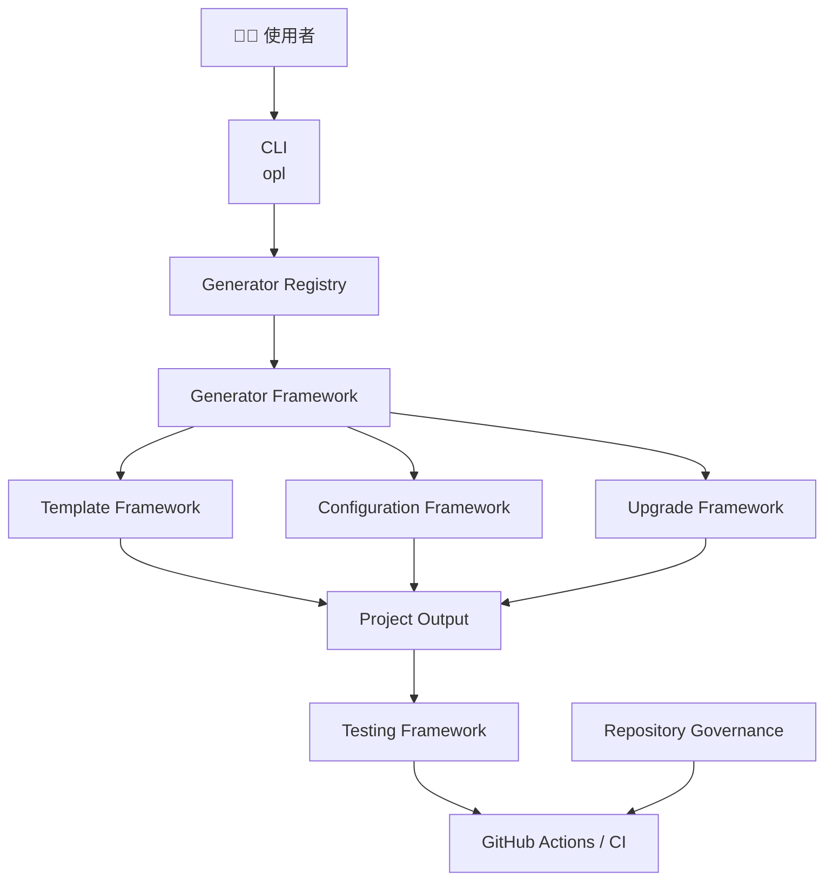

<!--
本文件保存 README v3.0 的完整章節草稿。

正式 GitHub 首頁位於 /README.md。
較深入的技術內容應逐步移至 docs/ 對應文件。
-->

<div align="center">

# OpenProjectLab

### 建構專案，而不只是產生程式碼

**Design First · Documentation First · Automation First · Testing First**

> 一套以 **Project Engineering** 為核心理念打造的開源框架，
> 協助開發者建立、維護、測試與持續演進高品質專案。

🌐 **語言**

**繁體中文** ｜ *English（Coming Soon）*

---

> **目前版本：v0.2.x Foundation**
> 🚀 下一個里程碑：**v0.3 Plugin & Ecosystem**

</div>

---

# OpenProjectLab 是什麼？

**OpenProjectLab（OPL）** 是一套專為現代軟體工程打造的 **Project Engineering Platform**。

它不是單純的「專案產生器（Project Generator）」，而是將**架構設計、文件治理、自動化流程、測試策略與專案生命週期管理**整合在一起，協助建立真正可長期維護的軟體專案。

我們相信，一個優秀的專案，不應只追求快速完成，更應具備：

* 清晰的架構設計
* 完整且持續更新的文件
* 自動化的品質檢查流程
* 可重複驗證的測試機制
* 可安全演進的升級能力

OpenProjectLab 的目標，就是將這些工程最佳實務內建於每一個新建立的專案中。

---

# 專案願景（Project Vision）

OpenProjectLab 致力於打造一個兼具**可維護性、可測試性、可擴充性與可持續演進**的開源工程平台。

目前已建立的核心能力包括：

* Generator Framework
* Configuration Framework
* Template Framework
* Upgrade Framework
* Repository Governance
* Automated Testing
* Continuous Integration

未來將逐步擴充：

* Plugin Framework
* AI Integration
* Open Courseware
* Template Marketplace

我們希望 OPL 能成為開發者、教育工作者與開源社群共同使用的工程平台，而不只是另一個程式碼產生工具。

---

# 核心理念

OpenProjectLab 建立於四項工程原則：

## 🏗 Design First

在撰寫程式之前，先完成架構設計與責任邊界，降低後續重構成本。

## 📖 Documentation First

文件不是附屬品，而是專案的重要組成。每一項功能都應同步提供設計說明、使用文件與維護資訊。

## ⚙️ Automation First

所有可重複執行的工作，都應優先交由工具完成，包括格式化、靜態分析、測試與持續整合。

## 🧪 Testing First

測試不只是驗證功能，更是保護架構與維持長期品質的重要機制。

---

# 我們相信

> **Build projects, not just code.**

真正的軟體工程，不只是寫出可以執行的程式，而是建立一個能夠被理解、被測試、被維護，並能持續演進的專案。

# 為什麼需要 OpenProjectLab？

軟體開發從來都不只是「寫程式」。

真正困難的地方，在於如何讓一個專案能夠在數個月、數年，甚至數十年後，依然容易理解、容易維護，並持續演進。

許多專案都曾經歷過類似的情況：

* 專案剛開始時，架構簡單、開發快速。
* 隨著功能增加，模組之間逐漸耦合。
* 文件沒有同步更新，新成員難以理解系統。
* 測試不足，使得每次修改都充滿風險。
* 品質檢查依賴人工，容易因疏忽而產生問題。
* 升級專案時，無法確定哪些檔案可以安全更新。

這些問題並不是因為程式設計能力不足，而是缺乏一套完整的**軟體工程方法**。

---

# 我們看到的問題

在許多專案中，真正耗費時間的往往不是開發新功能，而是：

* 理解既有程式碼。
* 修正回歸錯誤（Regression）。
* 維護過時的文件。
* 合併衝突。
* 重複建立相同的專案結構。
* 重複設定 CI、Lint、測試與開發環境。

當專案規模越來越大，這些成本也會快速增加。

如果沒有一致的工程流程，即使是優秀的程式碼，也可能逐漸失去可維護性。

---

# OpenProjectLab 的理念

OpenProjectLab 並不追求產生最多的程式碼，而是希望讓每一個新建立的專案，從第一天開始就具備良好的工程基礎。

因此，我們將工程最佳實務內建於框架之中，包括：

* 清晰的架構設計
* 完整的文件管理
* 自動化品質檢查
* 一致的測試流程
* 可安全演進的升級機制
* 可持續維護的專案治理

我們相信：

> **工程品質不是開發完成後再補強，而是專案建立時就應該存在。**

---

# 我們想解決的問題

OpenProjectLab 希望協助團隊回答以下問題：

### 如何建立一致的專案架構？

不同開發者建立的專案，應具有一致的目錄結構、設定方式與開發流程，而不是依賴個人習慣。

---

### 如何讓文件與程式同步演進？

文件應與程式碼一同維護，而不是等功能完成後才補寫。

每一次重要變更，都應留下設計、使用方式與維護資訊。

---

### 如何降低人為錯誤？

格式化、靜態分析、測試與持續整合，都應交由工具自動執行，而不是依靠開發者記憶。

---

### 如何保護專案品質？

測試的目的不只是驗證功能是否正常，更是保護系統架構、介面相容性與既有行為。

每一次修改，都應能透過自動化測試建立足夠的信心。

---

### 如何安全升級既有專案？

專案建立完成後，仍需要持續修正、優化與新增功能。

因此，框架除了建立新專案之外，也必須提供安全且可追蹤的升級能力。

---

# OPL 與一般 Project Generator 的不同

許多工具專注於「建立專案」。

OpenProjectLab 更重視「管理專案」。

除了產生初始程式碼之外，我們也希望協助開發者：

* 維護架構品質。
* 建立完整文件。
* 驗證程式品質。
* 管理專案生命週期。
* 持續演進既有專案。

因此，我們將 OPL 定位為：

> **Project Engineering Platform**

而不只是：

> **Project Generator**

---

# 我們相信

一個成功的專案，不只是因為程式碼寫得好。

更重要的是：

* 架構容易理解。
* 文件持續更新。
* 品質可以驗證。
* 專案能安全升級。
* 新成員能快速加入。
* 社群願意共同維護。

這些能力，正是 OpenProjectLab 希望提供給每一個專案的價值。

---

> **Build projects that are designed to last.**

# 核心能力（Key Features）

OpenProjectLab 的設計目標，不只是協助建立新專案，而是提供一套完整的 **Project Engineering Platform**。

每一項功能都圍繞著一個核心理念：

> **讓專案從建立的第一天起，就具備良好的工程品質。**

---

# 🏗 Generator Framework

Generator Framework 是 OPL 的核心。

所有 Generator 都遵循一致的生命週期（Lifecycle）與介面設計，使不同類型的 Generator 能共享相同的架構。

目前內建：

* Bootstrap Generator
* Course Generator
* Week Generator

未來新增 Generator 時，不需要修改既有核心程式，而是透過 Registry 進行註冊與管理。

這種設計降低了模組耦合，也提升了可擴充性。

---

# ⚙️ Configuration Framework

Configuration Framework 提供一致且可驗證的設定管理機制。

目前支援：

* YAML 設定檔
* 專案資訊
* 路徑管理
* Generator 設定
* Plugin 預留設定

設定檔集中管理，使不同 Generator 可以共用相同的設定來源，避免重複定義與不一致。

---

# 📄 Template Framework

Template Framework 將程式邏輯與文件內容完全分離。

主要能力包括：

* Template Rendering
* Unicode（UTF-8）支援
* Template Path Validation
* Safe File Output
* Dry Run

透過 Template，專案可以快速建立一致的文件與程式碼結構，同時保持高度可維護性。

---

# 🔄 Upgrade Framework

Upgrade Framework 是 OPL 最具代表性的能力之一。

不同於一般 Project Generator 僅負責建立專案，OPL 同時提供既有專案的升級能力。

目前提供：

* Upgrade Manifest
* Upgrade Plan
* Preview Mode
* SHA-256 驗證
* Backup
* Rollback
* Upgrade Report

預設採用 **Preview First** 策略，先檢視所有變更，再由使用者決定是否正式套用。

---

# 🧪 Testing Framework

測試是 OPL 的核心工程文化之一。

目前測試涵蓋：

* Unit Tests
* Integration Tests
* CLI Tests
* Template Tests
* Repository Structure Tests

測試不只是驗證功能是否正確，更是保護架構與降低回歸風險的重要機制。

---

# 🤖 Automation Framework

OpenProjectLab 將重複性的品質工作交由工具完成。

目前已整合：

* Ruff
* Ruff Formatter
* pre-commit
* pytest
* pytest-cov
* GitHub Actions

所有 Pull Request 都應通過自動化品質檢查，以維持 Repository 的一致性。

---

# 📚 Documentation Framework

在 OPL 中，文件不是附屬品，而是專案的重要組成。

目前已建立：

* README
* Architecture
* Configuration
* ADR（Architecture Decision Records）
* Development Guide
* CHANGELOG
* ROADMAP
* HISTORY（重建中）

所有新增功能都應同步提供：

* 設計說明
* 使用文件
* 測試
* Code Review Checklist

---

# 🏛 Repository Governance

一個成熟的專案，不只需要好的程式碼，也需要完善的治理機制。

目前 Repository 已逐步建立：

* License
* Contributing Guide
* Code of Conduct
* Security Policy
* Changelog
* Roadmap
* History

透過一致的治理流程，降低協作成本，提升社群參與品質。

---

# 🔌 可擴充架構（Future Ready）

OpenProjectLab 在設計時即預留了擴充能力。

下一個主要里程碑將聚焦於：

* Plugin API
* Plugin Registry
* Plugin Loader
* Plugin Metadata
* Plugin Version Compatibility

讓新的功能可以透過 Plugin 擴充，而不是修改核心程式。

---

# 核心能力總覽

| 能力                      | 目的             |
| ----------------------- | -------------- |
| Generator Framework     | 建立一致且可擴充的專案產生器 |
| Configuration Framework | 統一管理設定與路徑      |
| Template Framework      | 將內容與程式邏輯分離     |
| Upgrade Framework       | 安全升級既有專案       |
| Testing Framework       | 保護功能與架構品質      |
| Automation Framework    | 建立自動化品質流程      |
| Documentation Framework | 維持文件與程式同步演進    |
| Repository Governance   | 建立一致的開源治理模式    |

---

> **OpenProjectLab 不只是提供工具，而是提供一套可長期維護、可持續演進的工程方法。**

# 系統架構（Architecture）

OpenProjectLab 採用模組化（Modular）與分層（Layered）的設計理念，讓各個元件保持低耦合、高內聚，並能隨著專案成長持續擴充。

整體架構可分為四個主要層次：

* 使用者介面（CLI）
* 核心框架（Core Framework）
* 基礎服務（Infrastructure）
* 品質保證（Quality Engineering）

---

# 整體架構圖（Overall Architecture）



---

# 架構說明

## CLI（Command Line Interface）

CLI 是使用者與 OPL 的主要互動入口。

所有功能皆透過統一命令介面操作，例如：

* 建立新專案
* 建立課程
* 建立教材
* 執行升級
* 系統檢查

CLI 不直接處理商業邏輯，而是負責解析參數並委派給對應的 Generator。

---

## Generator Registry

Registry 負責管理所有 Generator。

它提供：

* Generator 註冊
* Generator 查詢
* Generator 建立
* Generator 擴充能力

新增 Generator 時，不需要修改 CLI 本身，只需完成註冊即可。

---

## Generator Framework

Generator Framework 是 OPL 的核心。

每一個 Generator 都遵循相同的生命週期與介面設計，使不同 Generator 能共享一致的執行流程。

目前已提供：

* Bootstrap Generator
* Course Generator
* Week Generator

未來將可透過 Plugin 擴充更多 Generator。

---

## Configuration Framework

所有 Generator 共用同一套 Configuration Framework。

主要負責：

* 載入設定檔
* 路徑管理
* 專案資訊
* Generator 設定
* Plugin 預留設定

集中式設定讓整個 Framework 保持一致性。

---

## Template Framework

Template Framework 專注於內容產生。

Generator 不需要自行組合文字內容，而是將資料交由 Template Rendering 處理。

這使得：

* 程式邏輯
* 文件內容
* 專案範本

三者能夠清楚分離。

---

## Upgrade Framework

Upgrade Framework 提供既有專案的生命週期管理能力。

主要包括：

* Manifest
* Upgrade Plan
* Preview
* Backup
* Rollback
* Report

讓既有專案也能安全升級，而不是只能重新建立。

---

# Generator 執行流程

當使用者執行一個 Generator 時，系統會依照固定流程運作。


---

# 設計原則

OpenProjectLab 的架構遵循以下原則：

## 單一職責（Single Responsibility）

每個 Framework 僅負責一項核心工作，例如：

* Configuration 專注於設定管理。
* Template 專注於內容產生。
* Upgrade 專注於專案演進。

避免不同模組之間相互依賴。

---

## 模組化（Modularity）

各個 Framework 可獨立維護與測試。

新增功能時，應盡量透過新增模組，而不是修改既有核心。

---

## 可擴充性（Extensibility）

所有主要元件皆預留擴充介面。

未來將逐步導入：

* Plugin Framework
* Plugin Registry
* Plugin Loader

降低未來功能擴充對核心架構的影響。

---

## 可測試性（Testability）

每個 Framework 都應能獨立測試。

所有重要功能皆應搭配：

* Unit Test
* Integration Test
* CLI Test
* Template Test

以確保架構演進時仍保持穩定。

---

## 長期演進（Evolution）

OpenProjectLab 並非一次性工具，而是一套持續演進的工程平台。

架構設計必須兼顧：

* 向後相容性
* 可維護性
* 可升級性
* 社群貢獻

---

> **良好的架構，不只是讓今天的程式更容易撰寫，更是讓未來的專案更容易理解、維護與持續演進。**

# 🚀 快速開始（Quick Start）

本章將帶您在幾分鐘內完成 OpenProjectLab（OPL）的基本安裝與第一個專案。

如果您希望了解更完整的安裝與開發流程，請參閱 **Getting Started** 文件。

---

# 系統需求

目前建議的開發環境：

| 項目     | 建議版本                |
| ------ | ------------------- |
| Python | 3.12 或以上            |
| Git    | 最新穩定版本              |
| 作業系統   | Windows、Linux、macOS |
| UTF-8  | 必須支援                |

---

# 取得原始碼

```bash
git clone https://github.com/<your-account>/OpenProjectLab.git

cd OpenProjectLab
```

---

# 建立虛擬環境

Windows：

```powershell
python -m venv .venv

.venv\Scripts\activate
```

Linux / macOS：

```bash
python3 -m venv .venv

source .venv/bin/activate
```

---

# 安裝開發環境

```bash
pip install -e .
```

安裝完成後，可以確認 CLI 是否正常：

```bash
opl list
```

若成功，將列出目前可用的 Generator。

例如：

```text
bootstrap
course
week
```

---

# 執行測試

OpenProjectLab 採用 **Testing First** 開發原則。

在開始開發之前，建議先確認所有測試皆能通過。

```bash
pytest
```

若希望查看 Coverage：

```bash
pytest --cov=generator
```

---

# 執行程式品質檢查

所有提交（Commit）前，都建議執行：

```bash
pre-commit run --all-files
```

此命令將自動執行：

* Ruff
* Ruff Format
* YAML 檢查
* EOF 修正
* Line Ending 檢查
* 其他 Repository 品質規則

---

# 建立第一個專案

建立 Bootstrap 專案：

```bash
opl bootstrap
```

建立課程：

```bash
opl course
```

建立教材：

```bash
opl week
```

> **提示：** 隨著 Framework 持續發展，CLI 參數將逐步擴充，詳細說明請參閱 CLI Reference。

---

# 建議的開發流程

我們建議每一次功能開發都遵循以下流程：

```text
建立分支
    │
    ▼
撰寫程式
    │
    ▼
新增 / 更新文件
    │
    ▼
新增測試
    │
    ▼
執行 pre-commit
    │
    ▼
執行 pytest
    │
    ▼
Commit
    │
    ▼
Push
    │
    ▼
Pull Request
```

這個流程反映了 OPL 的四項核心原則：

* Design First
* Documentation First
* Automation First
* Testing First

---

# 下一步

完成基本安裝後，建議依照以下順序閱讀文件：

1. **Architecture**：了解整體設計理念。
2. **Configuration**：認識設定檔結構。
3. **Template System**：了解 Template 如何產生專案內容。
4. **Development Guide**：了解開發流程與程式碼規範。
5. **Roadmap**：掌握未來發展方向。

透過這些文件，您可以快速理解 OPL 的設計哲學與工程文化，並開始建立自己的 Generator 或參與框架開發。

---

> **成功建立第一個專案，只是開始；真正重要的是建立一套能長期維護與持續演進的工程流程。**

# 💻 命令列介面（CLI Usage）

OpenProjectLab 提供一致且可擴充的命令列介面（CLI）。

所有操作都以 **`opl`** 為入口，並透過 Generator Framework 執行不同的工作。

CLI 的設計目標包括：

* 容易學習
* 一致的使用方式
* 可擴充
* 易於自動化
* 適合整合至 CI/CD 流程

---

# 查看可用命令

```bash
opl --help
```

查看目前已註冊的 Generator：

```bash
opl list
```

輸出範例：

```text
Available generators

• bootstrap
• course
• week
```

---

# Bootstrap Generator

建立新的 OpenProjectLab 專案。

```bash
opl bootstrap
```

Bootstrap Generator 將協助建立：

* 基本專案結構
* 設定檔
* Template
* Documentation
* Testing Environment

---

# Course Generator

建立新的課程專案。

```bash
opl course
```

可用於：

* 大學課程
* 教材專案
* Open Courseware
* Training Materials

---

# Week Generator

建立指定週次教材。

```bash
opl week
```

可自動建立：

* 投影片
* 講義
* Lab
* Demo
* Homework
* Quiz

未來也將支援 AI 自動產生教材內容。

---

# Configuration

所有 Generator 共用同一份設定檔。

例如：

```text
config/
└── default.yaml
```

CLI 啟動時會先：

1. 讀取設定檔
2. 驗證內容
3. 建立 Generator
4. 執行 Template
5. 產生結果

如此可確保所有 Generator 擁有一致的執行流程。

---

# Exit Code

CLI 使用標準 Exit Code。

| Code | 說明            |
| ---: | ------------- |
|    0 | 執行成功          |
|    1 | 執行失敗          |
|    2 | 參數錯誤          |
|   >2 | 內部錯誤（依未來版本定義） |

這使得 OPL CLI 可以方便整合至：

* GitHub Actions
* Azure DevOps
* GitLab CI
* Jenkins
* 其他自動化流程

---

# CLI 設計原則

OpenProjectLab 的 CLI 遵循以下原則：

## 一致性（Consistency）

所有命令都遵循相同的命名與操作方式。

降低學習成本。

---

## 可預測性（Predictability）

相同輸入應得到相同輸出。

避免隱藏副作用。

---

## 可腳本化（Script Friendly）

CLI 適合：

* PowerShell
* Bash
* CI/CD Pipeline
* Automation Script

所有重要功能皆可透過命令列操作。

---

## 可擴充性（Extensibility）

未來新增 Generator 或 Plugin 時，

不需要修改 CLI 核心架構。

僅需完成 Generator 註冊即可。

---

# 未來規劃

v0.3 Plugin Framework 完成後，CLI 將逐步增加：

```text
opl plugin list

opl plugin install

opl plugin remove

opl doctor

opl upgrade

opl template
```

所有新增命令都將遵循相同的 CLI 設計原則。

---

# CLI Philosophy

CLI 不只是執行命令的工具。

它代表 OpenProjectLab 與使用者之間最重要的互動介面。

因此，我們重視：

* 清楚的命令結構
* 一致的使用體驗
* 完整的錯誤訊息
* 穩定的向後相容性
* 易於自動化與整合

---

> **Good CLI design makes powerful tools feel simple.**

# 📂 Repository Structure

OpenProjectLab 採用模組化（Modular）且容易維護的專案結構。

每一個目錄都具有明確的責任（Responsibility），避免不同功能彼此混雜，提升可讀性與可維護性。

---

# 專案目錄

```text
OpenProjectLab/
│
├── generator/             # OPL 核心框架
│   ├── cli/               # Command Line Interface
│   ├── core/              # 核心元件
│   ├── generators/        # 各類 Generator
│   ├── template/          # Template Framework
│   └── upgrade/           # Upgrade Framework
│
├── config/                # 預設設定檔
│
├── templates/             # 專案範本
│
├── tests/                 # 自動化測試
│
├── docs/                  # 專案文件
│
├── plugins/               # Plugin（預留）
│
├── courses/               # 教材與課程（依專案需求）
│
├── .github/               # GitHub Actions 與工作流程
│
├── pyproject.toml         # Python 專案設定
├── README.md
├── CHANGELOG.md
├── CONTRIBUTING.md
├── CODE_OF_CONDUCT.md
├── SECURITY.md
└── LICENSE
```

> **說明：** 上述結構反映 OPL 的設計方向。實際 Repository 可能會隨版本演進而調整，README 應與目前版本保持同步。

---

# 核心目錄說明

## generator/

`generator/` 是 OpenProjectLab 的核心。

這裡包含：

* CLI
* Generator Framework
* Configuration Framework
* Template Framework
* Upgrade Framework

整個 OPL 的商業邏輯皆集中於此。

新增功能時，應優先考慮是否能在此框架內擴充，而不是建立新的核心流程。

---

## config/

集中管理所有預設設定。

例如：

* default.yaml
* Generator 設定
* Plugin 預留設定

透過統一設定來源，所有 Generator 都能遵循一致的行為。

---

## templates/

所有專案範本集中管理。

Template 不應包含複雜商業邏輯，而是專注於：

* 專案結構
* 文件內容
* 程式碼樣板

Generator 負責提供資料，Template 負責產生內容。

---

## tests/

測試是 OPL 的重要組成。

目前包含：

* Unit Tests
* Integration Tests
* CLI Tests
* Template Tests

新增功能時，應同步新增對應測試。

---

## docs/

`docs/` 是 OpenProjectLab 的知識中心（Knowledge Base）。

README 提供整體概覽，而更深入的設計與使用方式則集中於此。

建議文件分類包括：

```text
docs/
│
├── architecture/
├── development/
├── reference/
├── adr/
│
├── HISTORY.md
├── ROADMAP.md
└── configuration.md
```

未來將逐步擴充為完整的工程文件體系。

---

## plugins/

Plugin Framework 的預留位置。

未來將支援：

* Plugin Registry
* Plugin Loader
* Plugin Metadata
* Plugin Versioning

讓 OPL 能以外掛方式擴充功能，而不需修改核心程式。

---

## .github/

集中管理 GitHub 平台相關設定。

包括：

* GitHub Actions
* CI Workflow
* Pull Request Template
* Issue Template（未來規劃）

所有自動化工作流程皆由此管理。

---

# Repository 設計原則

OpenProjectLab 的 Repository 遵循以下原則：

## 單一責任（Single Responsibility）

每個目錄只負責一項主要工作。

例如：

* `tests/` 不放正式程式碼。
* `templates/` 不放商業邏輯。
* `docs/` 不放可執行程式。

清楚的責任分工，有助於長期維護。

---

## 模組化（Modularity）

每個 Framework 都應能獨立開發、測試與演進。

降低不同模組之間的耦合程度。

---

## 文件優先（Documentation First）

任何重要功能都應同步更新：

* README
* Architecture
* 使用文件
* 測試
* CHANGELOG（若適用）

程式碼與文件應共同演進。

---

## 可擴充性（Extensibility）

Repository 的結構應能支援：

* 新增 Generator
* 新增 Template
* 新增 Plugin
* 新增文件
* 新增測試

避免因專案成長而需要大幅調整目錄結構。

---

# Repository Philosophy

Repository 不只是存放原始碼的地方。

它同時承載：

* 專案架構
* 工程文化
* 文件知識
* 品質流程
* 社群協作

良好的 Repository 結構，能讓新的開發者更快理解專案，也讓團隊更容易維護與持續演進。

---

> **A well-organized repository is the foundation of sustainable software engineering.**

# 📚 Documentation

README 提供的是 OpenProjectLab 的整體概覽。

如果您希望深入了解設計理念、開發流程或各個 Framework 的實作方式，請參閱完整的文件。

我們希望建立的不只是文件，而是一套可以長期維護的 **Project Knowledge Base**。

---

# 文件導覽

## 🚀 Getting Started

第一次接觸 OpenProjectLab？

建議依照以下順序閱讀：

| 文件            | 說明           |
| ------------- | ------------ |
| Installation  | 安裝與環境準備      |
| Quick Start   | 五分鐘建立第一個專案   |
| First Project | 建立第一個 OPL 專案 |

這些文件將協助您快速完成環境設定並開始使用 OPL。

---

## 🏗 Architecture

想了解 OPL 的設計理念？

Architecture 文件介紹整個 Framework 的設計方式，包括：

* 系統整體架構
* Generator Framework
* Configuration Framework
* Template Framework
* Upgrade Framework
* Plugin Framework（規劃中）

Architecture 著重於 **Why** 與 **How**，而不是 API 細節。

---

## ⚙️ Configuration

Configuration 文件說明：

* YAML 設定格式
* Project Configuration
* Generator Configuration
* Path Management
* Configuration Validation

所有 Generator 都共用同一套設定機制。

---

## 📄 Template System

Template Framework 負責產生：

* 專案結構
* 文件
* 程式碼
* 教材

相關文件將說明：

* Template 結構
* Rendering 流程
* Template Best Practices
* UTF-8 與 Unicode 支援

---

## 🔄 Upgrade Framework

Upgrade Framework 是 OPL 的重要特色。

文件內容包括：

* Upgrade Manifest
* Upgrade Plan
* Preview Mode
* Backup
* Rollback
* SHA-256 Validation
* Upgrade Report

協助既有專案安全演進。

---

## 🧪 Development Guide

如果您想參與 OPL 開發，請先閱讀：

* Coding Standard
* Testing Guide
* Code Review Checklist
* Release Process
* Contributing Guide

這些文件將說明 OPL 的工程文化與開發流程。

---

## 📖 Reference

Reference 文件提供查詢用途。

例如：

* CLI Reference
* Configuration Schema
* Template Reference
* Upgrade Manifest Schema
* Plugin API（未來版本）

當您需要快速查詢參數或格式時，可直接參考此區。

---

## 📝 ADR（Architecture Decision Records）

OPL 採用 Architecture Decision Record（ADR）記錄重要設計決策。

ADR 內容包括：

* 問題背景
* 可行方案
* 最終決策
* 決策理由
* 對未來的影響

透過 ADR，新加入的開發者可以快速理解：

> 為什麼當初選擇這樣設計？

而不只是知道程式現在長什麼樣。

---

## 🛣 Project History

除了技術文件之外，我們也持續維護專案治理文件：

| 文件              | 目的       |
| --------------- | -------- |
| CHANGELOG       | 每次版本變更紀錄 |
| HISTORY         | 專案演進歷史   |
| ROADMAP         | 未來發展方向   |
| CONTRIBUTING    | 貢獻指南     |
| CODE_OF_CONDUCT | 社群行為準則   |
| SECURITY        | 安全性政策    |

這些文件共同記錄專案如何持續演進，而不只是記錄程式碼。

---

# Documentation Philosophy

OpenProjectLab 認為：

> **程式碼描述的是「系統如何運作」，文件描述的是「系統為什麼這樣設計」。**

兩者同樣重要。

因此，每一項重要功能都應同步提供：

* 設計說明
* 使用方式
* 測試
* 維護資訊
* 必要時的 ADR

Documentation 並不是開發完成後才補上的工作，而是軟體工程不可分割的一部分。

---

# Documentation First

Documentation First 是 OpenProjectLab 四大核心原則之一。

我們鼓勵所有貢獻者遵循以下流程：

```text
提出需求
    │
    ▼
完成設計
    │
    ▼
更新文件
    │
    ▼
實作程式
    │
    ▼
新增測試
    │
    ▼
Code Review
    │
    ▼
Merge
```

這個流程有助於：

* 降低溝通成本
* 提升設計品質
* 保持文件與程式同步
* 讓新成員更容易理解專案

---

> **好的文件不是程式碼的附錄，而是軟體工程的重要資產。**
