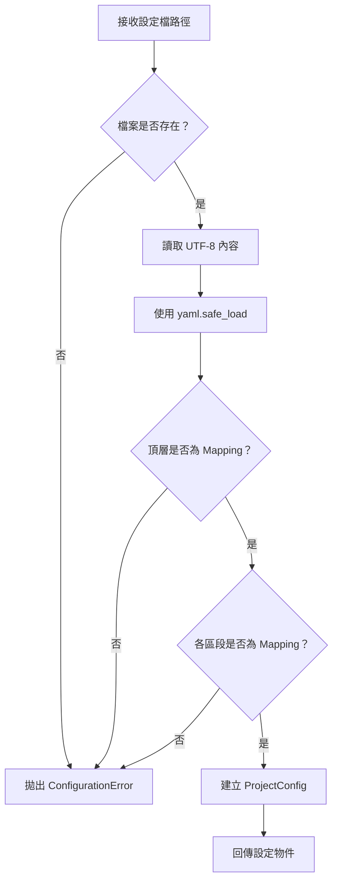

# OpenProjectLab Configuration Reference

> Status: Active
> Audience: Users, contributors, maintainers
> Default file: `config/default.yaml`

本文件定義 OpenProjectLab（OPL）目前使用的 YAML 設定格式、設定載入規則、路徑解析方式與錯誤行為。

目前設定由 `ProjectConfig` 載入，主要包含以下四個區段：

```yaml
project: {}
paths: {}
generator: {}
plugins: {}
```

每個區段都必須是 YAML Mapping。

---

## 1. 設定檔用途

OPL 使用設定檔集中管理：

* 專案基本資訊
* 輸入與輸出路徑
* Generator 行為
* Template 位置
* Plugin 相關設定
* 未來可擴充的 Framework 選項

設定檔的目的，是將環境與專案差異移出程式碼。

程式中不應硬編碼：

* 使用者本機專案位置
* 固定磁碟機代號
* Template 絕對路徑
* 課程輸出位置
* 個人環境設定

---

## 2. 預設設定檔

預設設定檔位於：

```text
config/default.yaml
```

CLI 未指定 `--config` 時，會使用專案定義的預設設定檔。

例如：

```powershell
opl list
```

等同於使用預設設定。

也可以明確指定：

```powershell
opl --config .\config\default.yaml list
```

實際預設路徑由 CLI Entry Point 定義，通常會以 Repository 根目錄為基準。

---

## 3. 基本設定結構

最小設定格式：

```yaml
project: {}
paths: {}
generator: {}
plugins: {}
```

完整範例：

```yaml
project:
  name: OpenProjectLab
  version: "0.1.0"
  description: Project Engineering Platform

paths:
  template_root: templates
  output_root: output
  course_root: courses

generator:
  overwrite: false
  encoding: utf-8

plugins:
  enabled: false
```

以上欄位中的部分可能仍屬於專案慣例或未來擴充方向。

正式支援欄位應以：

* `config/default.yaml`
* `ProjectConfig`
* Generator 實作
* 測試

為準。

---

## 4. `project` 區段

`project` 用於描述專案層級資訊。

基本格式：

```yaml
project:
  name: OpenProjectLab
  version: "0.1.0"
  description: Project Engineering Platform
```

可能包含：

| 欄位 | 型別 | 說明 |
| ------------- | ------ | ------- |
| `name` | String | 專案名稱 |
| `version` | String | 專案或設定版本 |
| `description` | String | 專案簡介 |

目前 `ProjectConfig` 將此區段保留為 Mapping，因此不同 Generator 可讀取自己需要的欄位。

不應假設所有欄位都是必填，除非對應 Generator 明確驗證。

---

## 5. `paths` 區段

`paths` 用於定義 Template、輸出與專案資源位置。

範例：

```yaml
paths:
  template_root: templates
  output_root: output
  course_root: courses
```

可能使用的路徑欄位包括：

| 欄位 | 型別 | 說明 |
| --------------- | ------------------------- | ------------ |
| `template_root` | String 或 Path-like String | Template 根目錄 |
| `output_root` | String 或 Path-like String | 一般輸出根目錄 |
| `course_root` | String 或 Path-like String | 課程輸出目錄 |

實際欄位應以目前程式碼為準。

---

## 6. 相對路徑

相對路徑範例：

```yaml
paths:
  template_root: templates
```

相對路徑必須有明確解析基準。

合理的解析基準可能是：

* 設定檔所在目錄
* Repository 根目錄
* CLI 目前工作目錄

OPL 應只採用一套一致規則，不能讓不同元件自行決定。

目前 `template_root` 的實際解析行為，應以 `ProjectConfig` 與相關測試為準。

例如，若規則是相對於設定檔所在目錄：

```text
F:\OpenProjectLab\config\default.yaml
```

設定：

```yaml
paths:
  template_root: ../templates
```

應解析為：

```text
F:\OpenProjectLab\templates
```

若目前實作使用 Repository 根目錄作為基準，則文件必須明確記錄該規則。

---

## 7. 絕對路徑

Windows 絕對路徑範例：

```yaml
paths:
  template_root: F:/OpenProjectLab/templates
```

建議在 YAML 中使用正斜線：

```yaml
F:/OpenProjectLab/templates
```

而不是：

```yaml
F:\OpenProjectLab\templates
```

因為反斜線在雙引號 YAML 字串中可能被當成跳脫字元。

也可以使用單引號：

```yaml
paths:
  template_root: 'F:\OpenProjectLab\templates'
```

跨平台專案應避免在正式預設設定中加入本機絕對路徑。

---

## 8. 建議的跨平台寫法

推薦：

```yaml
paths:
  template_root: templates
  course_root: courses
```

不推薦：

```yaml
paths:
  template_root: F:\OpenProjectLab\templates
  course_root: C:\Users\SomeUser\Desktop\courses
```

相對路徑較適合：

* Git Repository
* GitHub Actions
* 多人開發
* Windows、Linux 與 macOS
* 測試環境
* Editable Install

---

## 9. `generator` 區段

`generator` 用於控制 Generator 共用或個別行為。

範例：

```yaml
generator:
  overwrite: false
  encoding: utf-8
```

可能使用的欄位：

| 欄位 | 型別 | 說明 |
| ----------- | ------- | ----------- |
| `overwrite` | Boolean | 是否允許覆寫既有檔案 |
| `encoding` | String | 輸出檔案編碼 |
| `dry_run` | Boolean | 是否只預覽、不實際寫入 |

只有實際被 Generator 支援的欄位才具有正式效果。

未被程式讀取的欄位，即使 YAML 格式合法，也可能不會產生任何作用。

---

## 10. Generator 個別設定

未來或現有版本可能採用子區段：

```yaml
generator:
  bootstrap:
    overwrite: false

  course:
    create_readme: true

  week:
    include_lab: true
    include_quiz: true
```

這種結構可以避免不同 Generator 的欄位名稱互相衝突。

但正式 Schema 應以目前程式碼為準，不能只因為 YAML 可接受就視為已支援。

---

## 11. `plugins` 區段

`plugins` 保留給 Plugin Framework 使用。

最小格式：

```yaml
plugins: {}
```

未來可能包含：

```yaml
plugins:
  enabled: true
  search_paths:
    - plugins
```

目前 Plugin Framework 尚未被視為穩定公開功能，因此：

* 不應依賴尚未實作的欄位。
* 不應在正式文件中承諾完整 Plugin 載入行為。
* 新增 Plugin Schema 前應先設計 Architecture。
* 若形成長期契約，應新增 ADR。

---

## 12. YAML Mapping 規則

以下四個頂層區段都必須是 Mapping：

```yaml
project: {}
paths: {}
generator: {}
plugins: {}
```

有效：

```yaml
project:
  name: OpenProjectLab
```

無效：

```yaml
project: OpenProjectLab
```

無效：

```yaml
paths:
  - templates
  - courses
```

如果區段不是 Mapping，應產生 `ConfigurationError`。

---

## 13. 空設定檔

空檔案或內容只有空白時，YAML Loader 通常會得到 `None`。

目前載入器可將其正規化為空 Mapping：

```python
data = yaml.safe_load(...) or {}
```

但是空設定檔是否能讓所有 CLI 命令正常執行，仍取決於：

* 預設值
* Generator 必要欄位
* 路徑需求

空 YAML 語法可能有效，但不代表業務設定完整。

---

## 14. 缺少區段

若某些區段不存在，`ProjectConfig` 可使用空 Mapping 作為預設值。

例如：

```yaml
project:
  name: Demo
```

載入後概念上可能等同於：

```yaml
project:
  name: Demo

paths: {}
generator: {}
plugins: {}
```

但各 Generator 仍應自行驗證需要的設定。

---

## 15. 頂層型別

設定檔最上層必須是 Mapping。

有效：

```yaml
project: {}
paths: {}
```

無效：

```yaml
- project
- paths
```

無效：

```yaml
OpenProjectLab
```

若 YAML 頂層不是 Mapping，應產生清楚的設定錯誤，而不是在後續程式碼中出現模糊例外。

---

## 16. 設定載入流程

高階流程如下：



---

## 17. `ProjectConfig`

目前設定物件概念結構：

```python
@dataclass(slots=True)
class ProjectConfig:
    project: dict[str, Any]
    paths: dict[str, Any]
    generator: dict[str, Any]
    plugins: dict[str, Any]
```

典型載入方式：

```python
from pathlib import Path

from generator.core.config import ProjectConfig

config = ProjectConfig.load(
    Path("config/default.yaml")
)
```

使用範例：

```python
project_name = config.project.get("name")
template_root = config.paths.get("template_root")
```

目前各區段為 Dictionary，因此使用者需注意：

* Key 可能不存在。
* Value 型別需由使用方驗證。
* 拼錯欄位名稱可能不會立即報錯。
* 未使用的欄位可能被靜默保留。

未來可考慮導入更嚴格的 Schema 或 Typed Configuration，但需要先評估相容性。

---

## 18. 錯誤行為

### 18.1 找不到設定檔

範例：

```powershell
opl --config .\config\missing.yaml list
```

應產生類似訊息：

```text
找不到設定檔：config\missing.yaml
```

程式層應拋出：

```text
ConfigurationError
```

---

### 18.2 YAML 格式錯誤

錯誤範例：

```yaml
project:
  name: OpenProjectLab
    version: 0.1.0
```

應產生類似訊息：

```text
YAML 格式錯誤：<path>
```

底層 `yaml.YAMLError` 應保留為原始原因：

```python
raise ConfigurationError(...) from exc
```

---

### 18.3 頂層不是 Mapping

錯誤範例：

```yaml
- project
- paths
```

應產生明確的 `ConfigurationError`。

---

### 18.4 區段不是 Mapping

錯誤範例：

```yaml
project: OpenProjectLab
```

應產生明確錯誤，指出：

* 區段名稱
* 預期型別
* 實際型別或無效內容

---

### 18.5 路徑不存在

設定載入成功不代表路徑一定存在。

例如：

```yaml
paths:
  template_root: templates-does-not-exist
```

應由最接近使用位置的 Framework 驗證：

* Configuration Framework 可驗證基本路徑格式。
* Template Framework 可驗證 Template 目錄是否存在。
* Generator 可驗證輸出目標是否可寫入。

應避免在設定載入階段驗證所有可能未被使用的路徑。

---

## 19. 安全性

YAML 必須使用：

```python
yaml.safe_load(...)
```

不應使用允許任意 Python 物件建立的非安全 Loader。

另外應注意：

* 不要在設定檔存放密碼。
* 不要提交 API Token。
* 不要存放私鑰。
* 不要將個人絕對路徑寫入共用設定。
* 使用者提供的路徑必須防止路徑遍歷。
* 讀寫目標必須限制在預期範圍。

敏感資料應透過：

* 環境變數
* Secret Manager
* GitHub Actions Secrets
* 未追蹤的本機設定

管理。

---

## 20. 環境專用設定

未來可採用多份設定：

```text
config/
├── default.yaml
├── development.yaml
├── test.yaml
└── production.yaml
```

使用方式：

```powershell
opl --config .\config\development.yaml list
```

但若尚未實作設定繼承或合併，則每份設定都應是獨立完整檔案。

不能假設：

```yaml
extends: default.yaml
```

會自動運作，除非 Configuration Framework 明確支援。

---

## 21. 測試專用設定

測試應使用暫存目錄與測試 Fixture，而不是修改正式設定。

建議：

```python
def test_load_config(tmp_path):
    config_file = tmp_path / "config.yaml"
    config_file.write_text(
        """
project:
  name: Demo
paths:
  template_root: templates
""",
        encoding="utf-8",
    )

    config = ProjectConfig.load(config_file)

    assert config.project["name"] == "Demo"
```

測試不得依賴：

```text
F:\OpenProjectLab
```

或任何特定使用者目錄。

---

## 22. 建議測試案例

Configuration Framework 至少應涵蓋：

### 檔案載入

* 有效設定檔
* 找不到設定檔
* 空設定檔
* UTF-8 設定檔

### YAML 驗證

* YAML 語法錯誤
* 頂層不是 Mapping
* 區段不是 Mapping
* 區段缺少

### 路徑

* 相對 `template_root`
* 絕對 `template_root`
* Windows 路徑
* POSIX 路徑
* 包含空白的路徑

### 預設值

* 缺少 `project`
* 缺少 `paths`
* 缺少 `generator`
* 缺少 `plugins`

---

## 23. 設定變更規則

修改設定 Schema 時，必須同步完成：

1. Architecture Design
2. Configuration Framework 文件
3. Configuration Reference
4. `config/default.yaml`
5. Loader 或 Validator
6. 單元測試
7. CLI 或 Generator 測試
8. Changelog
9. Migration 說明
10. Code Review

以下變更可能是破壞性變更：

* 更名既有欄位
* 改變欄位型別
* 改變預設值
* 改變相對路徑解析基準
* 將選填欄位改成必填
* 移除區段
* 改變未知欄位處理方式

這類變更應評估 ADR。

---

## 24. 未知欄位

目前 Dictionary 型設定可能接受未知欄位：

```yaml
project:
  unknown_field: value
```

未知欄位的策略應明確選擇：

### 寬鬆模式

保留未知欄位，交由使用者或 Generator 處理。

優點：

* 擴充彈性高
* 向前相容較容易

缺點：

* 拼字錯誤不易被發現
* Schema 不明確

### 嚴格模式

遇到未知欄位立即報錯。

優點：

* 容易發現錯誤
* Schema 清楚

缺點：

* 擴充與相容性成本較高

目前實際策略應以程式碼與測試為準。

---

## 25. 設定版本

隨著 Schema 演進，建議未來加入：

```yaml
config_version: 1
```

用途：

* 判斷設定格式版本
* 支援 Migration
* 提供清楚相容性錯誤
* 協助 Upgrade Framework

在正式實作前，`config_version` 只能視為規劃功能。

---

## 26. 實際設定檔檢查

檢視目前預設設定：

```powershell
Get-Content config\default.yaml
```

確認 YAML 可解析：

```powershell
python -c "from pathlib import Path; import yaml; print(yaml.safe_load(Path('config/default.yaml').read_text(encoding='utf-8')))"
```

使用 OPL Loader 驗證：

```powershell
python -c "from pathlib import Path; from generator.core.config import ProjectConfig; print(ProjectConfig.load(Path('config/default.yaml')))"
```

---

## 27. 路徑解析驗證

檢查相對 Template Root：

```powershell
python -c "from pathlib import Path; from generator.core.config import ProjectConfig; c=ProjectConfig.load(Path('config/default.yaml')); print(c.paths.get('template_root'))"
```

若 `ProjectConfig` 提供解析後屬性，應改用正式 API。

不要只根據原始 YAML 字串判斷實際路徑行為。

---

## 28. Configuration Review Checklist

修改設定時，請確認：

* [ ] YAML 頂層為 Mapping。
* [ ] 四個主要區段都是 Mapping。
* [ ] 新欄位名稱清楚。
* [ ] 型別與預設值明確。
* [ ] 相對路徑解析基準明確。
* [ ] 絕對路徑行為明確。
* [ ] Windows 與 POSIX 路徑已考量。
* [ ] 找不到檔案時錯誤清楚。
* [ ] YAML 錯誤會轉換為 `ConfigurationError`。
* [ ] 未知欄位策略明確。
* [ ] `config/default.yaml` 已更新。
* [ ] Configuration Reference 已更新。
* [ ] Configuration Framework 文件已更新。
* [ ] 測試已新增或更新。
* [ ] 破壞性變更已記錄。
* [ ] `pre-commit run --all-files` 通過。
* [ ] `python -m pytest` 通過。

---

## 29. Related Documents

* [Documentation Hub](../README.md)
* [Architecture Overview](../architecture/overview.md)
* [Configuration Framework](../architecture/configuration-framework.md)
* [CLI Reference](cli.md)
* [Generator Framework](../architecture/generator-framework.md)
* [Template Reference](template.md)
* [Development Workflow](../development/development-workflow.md)
* [Code Review Checklist](../development/code-review-checklist.md)

---

> **好的設定系統，應讓環境差異可以被表達，讓錯誤能被提早發現，並讓程式行為保持可預期。**
